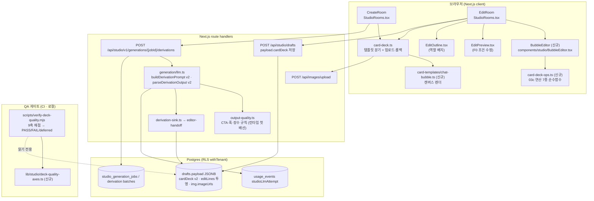
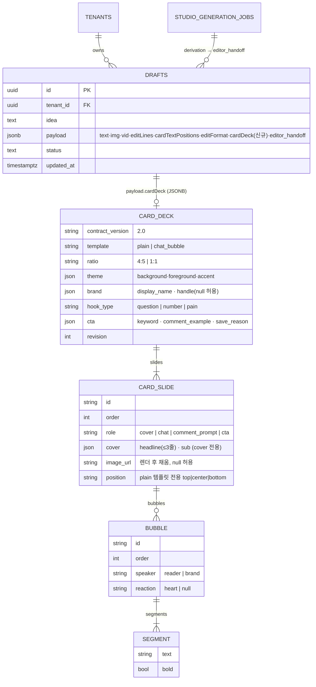
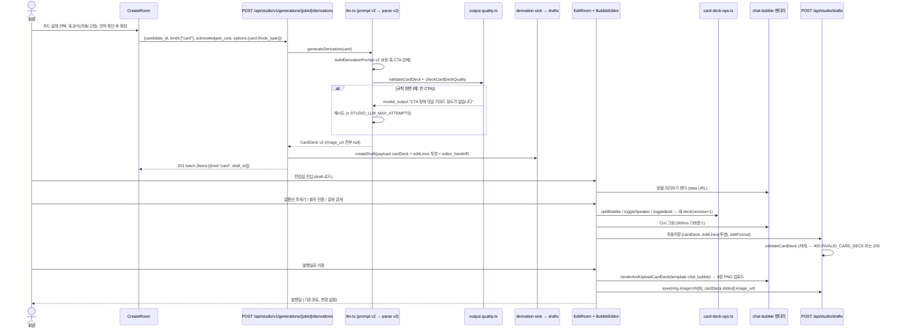

# FDD — OSMU 콘텐츠 품질 1단계(2주) 기술설계 v1.0.0

> **STAMP**
> - 버전: v1.0.0 (semver) · 작성일: 2026-09-21 19:40 KST · 작성자/모델: tech-architect / claude-opus-5[1m]
> - 라인: osmu · 파일: `docs/eng-design/osmu-quality-stage1-v1-claude-opus.md` (렌더: 동일 경로 `.html`)
> - 상류 산출물(버전 핀):
>   - **정본** 벤치마크 v1: `docs/design/osmu-content-quality-benchmark-v1-claude-opus.html` (product-designer, 2026-09-21 15:12, Design Score B+, 회장 "승인하니까 너가 다해") — §4 로드맵 1단계 6항목이 이 문서의 요구 원문이다. 임의 재해석 금지.
>   - 디자인 시스템: `DESIGN.md` v37 §4 편집실 3영역 골격(v65)·v67 셸 계약
>   - pipeline-state.osmu.md `approved_artifacts`: design_hub v68 · DESIGN.md v37 · clean_frames v68
>   - 거버넌스: `wiki/거버넌스/결정.md` D-2026-09-09-1(손 편집 + AI 일괄), ADR-007(조용한 실패 금지), D-014(생성은 비용 승인 관문), 2026-08-31 "실제 LLM 붙인다" 제약 5개 · `wiki/거버넌스/실수.md` 2026-09-11(눈이 아니라 자로), 2026-09-09(실패는 이유를 데리고 나온다), 2026-09-10(끝에서부터 확인)
>   - 이식 원본: `d-edu/prototypes/brand-dedu-product/카드컨셉13-채팅말풍선/03c-편집도구-통합.html`(697행) + `02-컨셉13-카드덱.md`
>   - 코드 진실원: `dashboard/src/**` (아래 §2.2 파일별 행 번호) · 스키마 `dashboard/db/schema.sql` 87~98행 `drafts`
> - 기반 포맷: `docs/eng-design/fdd-legacy-20260912/fdd/fdd-r02-journey-fix-v1.0.0-opus.md` v1.0.0 + `~/.claude/standards/templates/doc-template-fdd.md`(arc42) 골격 상속
> - 성격: **확장 설계.** 카드뉴스 생성·편집·발행 경로는 이미 배포돼 돈다. 새 방·새 라우트 체계를 짓지 않고 기존 `drafts.payload`·`/api/studio/*`·`EditRoom` 위에 얹는다. 되돌리기 비싼 결정 4건은 §8 에 선택지로 두고 **확정하지 않았다** (헌법 §4.4).
> - 다이어그램: mermaid 3종(§2 아키텍처·§3 ERD·§6 시퀀스). 렌더 검증 결과는 STAMP 푸터에 적었다.

---

## 목차 (바로가기)

- [0. TL;DR](#tldr)
- [1. 범위·용어·기존 구현 대비 신규/변경](#scope)
- [2. 시스템 아키텍처 (as-is → to-be)](#arch)
- [3. 데이터 모델 (ERD · 카드 덱 계약 v2)](#erd)
- [4. 기능 요구(FRD) + 9축 추적 + 인수기준(AC)](#frd)
- [5. 기능별 기술설계](#design)
  - [F0. 영상 미리보기 자리표시 레이어 제거·재생](#f0)
  - [F1. 카드 덱 계약 v2 + 편집 연산 라이브러리(03c 이식)](#f1)
  - [F2. "채팅 말풍선형" 캔버스 렌더러](#f2)
  - [F3. 생성 프롬프트 계약(훅 3공식·CTA 강제) + output-quality 반려](#f3)
  - [F4. 편집실 말풍선 편집 UI](#f4)
  - [F5. 9축 QA 게이트 자동 채점](#f5)
- [6. 핵심 플로우 (sequenceDiagram) + 유저플로우 1:1 매핑](#flows)
- [7. API 계약 (변경분 전량)](#api)
- [8. ⛔ 회수 필요: 되돌리기 비싼 결정 4건 (선택지·추천·미확정)](#db)
- [9. 폴더 구조 · 변경 파일 목록](#folders)
- [10. 테스트 계획 + 요구↔설계↔테스트 추적표(RTM)](#rtm)
- [11. 2주 일정 (PR 단위)](#schedule)
- [12. 리스크·기술부채·오픈이슈](#risk)
- [13. 벤치마크·셀프심문·레드팀](#bench)
- [14. 개정이력](#hist)

---

## 0. TL;DR <a id="tldr"></a>

벤치마크 v1 이 1단계에서 닫기로 한 축은 ⑥장수 ③말풍선 ①훅 ⑦CTA ⑨재생 다섯이다. 이 다섯은 전부 **데이터 모양이 없어서** 못 하고 있던 것이다. 지금 카드뉴스는 `editLines: string[]`(장당 문장 하나)이고, 렌더러 `renderTextCard()` 는 단색 배경에 글자 한 덩이만 그린다. 그래서 화자도, 볼드도, 표지·CTA 역할도, 훅 유형도 실을 자리가 없다.

이 설계는 **카드 덱 계약 v2** 를 `drafts.payload.cardDeck` 한 자리에 두고(신규 테이블 없음, DDL 0건 · §8 OD-A 추천안), 03c 편집도구의 말풍선 연산 7종을 **순수 함수 라이브러리**로 옮긴 뒤, 그 위에 캔버스 렌더러 1벌과 편집 UI 를 얹는다. 생성 쪽은 `buildDerivationPrompt(card)` 의 JSON 계약을 v2 로 올려 훅 유형·댓글 키워드 CTA 를 **모델에게 강제**하고, 지금 테스트에서만 쓰이는 `output-quality.ts` 를 **런타임 파서에 처음으로 연결**해 빈 CTA 를 반려한다. 영상 미리보기는 `EditPreview.tsx` 245행의 자리표시 div 를 미디어가 없을 때만 그리게 고치는 조건 하나가 핵심이다(가장 싸고 가장 먼저).

9축 채점은 `scripts/verify-deck-quality.mjs` 가 저장된 덱을 자로 재서 1단계 범위 7축(①③④⑤⑥⑦⑨) 전부 PASS 여야 QA 게이트를 연다. ②배경 ⑧댓글 반응은 "이번 단계 아님"으로 **보고하되 숨기지 않는다**(헌법 §9 결손 은폐 금지).

유저플로우 매핑 갭: **0건** (§6.2 표). 종료 조건 충족.

---

## 1. 범위·용어·기존 구현 대비 신규/변경 <a id="scope"></a>

### 1.1 범위 (In) — 벤치마크 v1 §4 1단계 원문 6항목 그대로

| # | 벤치마크 원문 | 이 문서의 기능 ID |
|---|---|---|
| ① | 카드 템플릿 "채팅 말풍선형" 1벌 (03c 이식) | F1 + F2 |
| ② | 생성실 카드 갈래 기본 장수 9장: 표지 1 + 대화 6 + 댓글유도 1 + CTA 1 | F1(계약) + F3(프롬프트) |
| ③ | 생성 프롬프트에 훅 3공식 중 1 선택 + 댓글 키워드 CTA 강제. 빈 CTA 는 output-quality.ts 가 반려 | F3 |
| ④ | 편집실: 말풍선 추가·쪼개기·합치기·화자 전환·이동 + 부분 볼드 | F1(연산) + F4(UI) |
| ⑤ | 영상 미리보기 자리표시 레이어 제거 조건 수정, 재생 가능 | F0 |
| ⑥ | 9축 갭표를 QA 게이트로 | F5 |

### 1.2 범위 밖 (Out)

- 표지 실사 배경·스크림·업로드·생성(2단계 · 벤치마크 §6 회수 항목, 기본값 "브랜드 사진 → 업로드 → 생성(비용 승인)" 은 세션맥락으로 확정됐으나 구현은 2단계).
- 템플릿 칩 3개 전환·@핸들 워터마크 고정·페이지 번호 정밀 규격(2단계 ④⑤). 단, 이 문서의 계약 v2 는 그때 필드를 **추가만** 하면 되게 자리를 비워 둔다.
- 숏폼 댓글 반응 오버레이·타임라인(3단계 ⑧).
- 힉스필드 자격증명 갱신(별도 진행 중). 이 설계의 카드 렌더는 브라우저 캔버스라 그 생성기와 무관하다.
- 발행실·성과실 변경. 발행실은 `img.imageUrls` 를 지금처럼 받는다(§6.2 스텝 E1 참조).

### 1.3 용어 (고정)

| 용어 | 정의 |
|---|---|
| **덱(deck)** | 카드뉴스 한 벌. `drafts.payload.cardDeck` 한 객체. 장(slide) 목록 + 템플릿 + 브랜드 시그니처 + CTA 정보. |
| **장 역할(role)** | `cover`(표지) · `chat`(대화) · `comment_prompt`(댓글유도) · `cta`(마무리 CTA). 표지는 항상 0번, CTA 는 항상 마지막. 03c 의 `type: cover/chat/cta` 를 잇고 `aspiration`(열망 실사 장)은 2단계 예약. |
| **말풍선(bubble)** | 대화 장 안의 발화 단위. `speaker`(`reader`=우측 노랑 · `brand`=좌측 흰색) + `segments`. 03c 의 `{who:'student'|'mentor', b:[...]}` 를 잇되 화자 이름을 도메인 중립으로 바꿨다(02-컨셉13 "실제 카톡 규칙: 우=독자, 좌=브랜드"). |
| **세그먼트(segment)** | 말풍선 본문 조각 `{text, bold}`. 부분 볼드의 최소 단위. 03c 는 `<strong>` HTML 문자열이었으나(256행 `rich()`) 캔버스는 HTML 을 못 그리고 편집 계약(`editor-handoff.ts` 87~93행)이 스킴·HTML 을 금지하므로 **구조화된 조각**으로 바꾼다(§8 OD-C). |
| **훅 유형(hook_type)** | 표지 헤드라인 공식. `question`(질문형) · `number`(숫자형) · `pain`(고통 인식형). 벤치마크 REF A-3. |
| **댓글 키워드(cta.keyword)** | CTA 장이 독자에게 남기라고 요구하는 낱말. 2~8자 명사. 예 `'순서'`. |
| **투영(projection)** | 덱 → `editLines: string[]` 로 납작하게 편 목록. 기존 소비자(발행실 캡션 후보·`/api/studio/edit-bulk`)가 계약 변경 없이 그대로 돌게 하는 하위호환 층. |

### 1.4 기존 구현 대비 신규/변경 (⛔ 재창조 금지 실측)

| 영역 | 이미 있는 것 (진실원) | 이번에 하는 것 |
|---|---|---|
| 카드 그리기 | `lib/studio/text-card-image.ts` `renderTextCard()` 캔버스 단색+글자 1덩이 (110~180행) | **유지**(템플릿 `plain`). 새 렌더러 `chat-bubble` 을 옆에 추가하고 `card-deck.ts` 가 템플릿으로 분기 |
| 덱 저장·업로드 | `lib/studio/card-deck.ts` `renderAndUploadCardDeck()` 롤백 포함 (70~103행) | **유지**. `CardDeckSpec` 에 `template`·`deck` 추가 |
| 초안 저장 | `drafts.payload` JSONB, `POST /api/studio/drafts` (`editLines`·`cardTextPositions`·`editFormat`·`img.imageUrls`) | **필드 추가** `cardDeck`. DDL 없음 |
| 파생 생성 | `generation/llm.ts` `buildDerivationPrompt()` 265~290행, `parseDerivationOutput()` 370~382행: `slides:[{text}]` 4~10장 | **계약 v2**: 역할·말풍선·훅·CTA 를 요구·검증. 기존 `slides[].text` 는 투영으로 유지 |
| 품질 검사 | `lib/studio/output-quality.ts` 4규칙. **런타임 호출처 0** (grep 실측: `tests/studio/output-quality.test.ts` 만) | 규칙 6개 추가 + **파서에 연결**(첫 런타임 배선) |
| 편집실 | `EditRoom`(StudioRooms.tsx 1300~) `lines`/`cardTextPositions` 상태, `EditOutline` 드래그 순서·추가·삭제, `EditPreview` 카드 textarea+위치 9칸 | 카드 템플릿이 `chat_bubble` 일 때 캔버스 자리에 `BubbleEditor` 를 얹는다. 목차·자동저장·`발행실로 이동`·담당 대화창은 그대로 |
| 일괄 AI 편집 | `/api/studio/edit-bulk` 줄 수·순서 고정 계약 | **무변경**. 투영 `lines` 로 호출하고 결과를 역투영 |
| 영상 미리보기 | `EditPreview.tsx` 208~216행 `DeliveredMedia` video(controls 있음) + 245행 자리표시 div `absolute inset-0` 가 DOM 뒤에 와서 덮음 | 조건 렌더 1곳 수정 |
| QA 스크립트 관습 | `dashboard/scripts/verify-*.mjs` 30여 종, 디자인 lint | 같은 관습으로 `verify-deck-quality.mjs` 추가 |

---

## 2. 시스템 아키텍처 (as-is → to-be) <a id="arch"></a>

### 2.1 컨테이너·컴포넌트 뷰



### 2.2 문제 지점 (as-is, 행 번호)

| 결손 축 | 파일:행 | 지금 무엇이 있나 | 왜 못 하나 |
|---|---|---|---|
| ③ 말풍선 | `text-card-image.ts:112~121` `TextCardInput{text,ratio,theme,position}` | 글자 한 덩이 | 화자·조각 필드 없음 |
| ④ 부분 볼드 | `text-card-image.ts:149~160` `ctx.font = 700 ...` 한 굵기 | 전체 볼드 | 세그먼트 없음 |
| ⑥ 장수 | `llm.ts:280` "슬라이드는 4장 이상 10장 이하" · `derivation.ts:187~202` 템플릿 폴백 | 4~10 범위만 | 역할 구조 없음 |
| ① 훅 | `llm.ts:279` `{"slides":[{"text":"표지 문구"},…]}` | 표지 = 임의 첫 문장 | 훅 유형 요구·검증 없음 |
| ⑦ CTA | `llm.ts:370~382` `parseDerivationOutput` · `output-quality.ts` 런타임 미배선 | 마지막 장 임의 문구 | CTA 검사 0 |
| ⑨ 재생 | `EditPreview.tsx:245` `<div className="absolute inset-0 grid …">` | video 뒤에 자리표시 div | 미디어 유무와 무관하게 렌더 |

---

## 3. 데이터 모델 (ERD · 카드 덱 계약 v2) <a id="erd"></a>

### 3.1 ERD (관련 테이블 · JSONB 내부 구조를 엔티티로 표기)



### 3.2 계약 v2 (TypeScript · `lib/studio/card-deck-contract.ts` 신규)

```ts
export const CARD_DECK_CONTRACT_VERSION = "2.0" as const;
export type CardTemplate = "plain" | "chat_bubble";          // 2단계에 "photo_cover" 추가 예약
export type SlideRole = "cover" | "chat" | "comment_prompt" | "cta";
export type Speaker = "reader" | "brand";
export type HookType = "question" | "number" | "pain";

export type Segment = { text: string; bold: boolean };       // text ≥1자, 합산 ≤ 120자/말풍선
export type Bubble = { id: string; order: number; speaker: Speaker; segments: Segment[]; reaction: "heart" | null };
export type CardSlide = {
  id: string; order: number; role: SlideRole;
  cover?: { headline: string; sub: string | null };          // role=cover 필수. headline 줄바꿈 ≤2(3줄), 줄당 ≤ 10자
  bubbles?: Bubble[];                                         // role∈{chat,comment_prompt,cta} 필수 1~8개
  image_url: string | null;                                   // 렌더·업로드 뒤 채움. data:/javascript: 금지
  position?: "top" | "center" | "bottom";                     // template=plain 전용
};
export type CardDeck = {
  contract_version: typeof CARD_DECK_CONTRACT_VERSION;
  template: CardTemplate;
  ratio: "4:5" | "1:1";
  theme: CardTheme;                                           // 기존 text-card-image-theme.ts
  brand: { display_name: string; handle: string | null };     // 워크스페이스 이름 · 핸들(2단계 워터마크 자리)
  hook_type: HookType;
  cta: { keyword: string; comment_example: string; save_reason: string };
  slides: CardSlide[];                                        // 7 ≤ n ≤ 11 · slides[0].role==="cover" · slides[last].role==="cta" · comment_prompt 정확히 1
  revision: number;                                           // 편집 연산마다 +1 (editor-handoff 관습)
};
```

**불변식(validator `validateCardDeck()` 가 전부 검사, 하나라도 깨지면 저장 거부 400 `INVALID_CARD_DECK` + 어느 규칙인지 한 줄):**

1. `slides.order` 0부터 연속(`editor-handoff.ts ordered()` 재사용).
2. 역할 배치: `[0]=cover`, `[n-1]=cta`, `comment_prompt` 1개, 나머지 `chat` ≥ 4.
3. 장수 7~11 (기본 생성 9). 외부 가이드 7~10 과 D-100 실물 11 의 합집합(CONFLICTS 참조).
4. 각 `chat` 장: 말풍선 1~8, 화자 두 종류 **모두** 등장(질문→답 리듬. 벤치마크 REF A-1 "장마다 질문→답").
5. 볼드 덩이: 장당 `bold=true` 세그먼트 연속 묶음 ≤ 1 (REF A-1 "굵은 글씨는 한 장에 한 덩이").
6. CTA 장: 말풍선 본문 합산에 `댓글` 포함 + `'${cta.keyword}'` 정확 포함. `cta.save_reason` ≥ 6자.
7. `cover.headline`: 줄 ≤ 3, 줄당 ≤ 10자, 표면 링크(`http`, `.com`, `링크`) 금지.
8. 어디에도 줄표(`—`, `–`) 없음(기존 dash 규칙).

### 3.3 하위호환 투영 (`deckProjection(deck)`)

```ts
// 덱 → 기존 소비자용 납작한 줄 목록. 같은 순서로 역투영해 edit-bulk 결과를 되돌린다.
export function deckProjection(deck: CardDeck): { lines: string[]; refs: Array<{ slideId: string; bubbleId: string | null }> }
// cover → headline 1줄 / chat·comment_prompt·cta → 말풍선마다 1줄(세그먼트 text 이어붙임, 볼드는 잃지 않고 refs 로 복원)
export function applyProjection(deck: CardDeck, lines: string[], refs): CardDeck   // 길이 불일치면 throw (edit-bulk 계약과 동일)
```

`editLines` 는 계속 저장한다(발행실 캡션 후보·`resolvedEditLines` 가 읽는다). 진실원은 `cardDeck`, `editLines` 는 파생값이다. 둘이 어긋나면 `cardDeck` 이 이긴다.

### 3.4 데이터 안전 (표준 합격선 4)

| 항목 | 내용 |
|---|---|
| DDL | **0건**(OD-A 추천안). `drafts.payload` JSONB 필드 추가만. `migration-manifest.tsv` 변경 없음 |
| 되돌리기 | 코드 롤백만으로 충분. 구버전 코드는 `payload.cardDeck` 을 모르는 채 무시하고 `editLines` 로 돈다(투영이 항상 같이 저장되므로) |
| 인덱스 | 불필요. 덱은 draft 단건 조회 경로로만 읽는다. `verify-deck-quality.mjs` 의 목록 조회는 기존 `idx_drafts_tenant` 로 충분(최근 50건) |
| 크기 | 9장 × 6말풍선 × 120자 ≈ 8KB. JSONB 한 행 상한과 무관 |
| 손실 지점 | (a) 투영 역적용 시 길이 불일치 → 적용 거부(덮어쓰지 않음). (b) 렌더 실패 → 기존 `renderAndUploadCardDeck` 롤백 유지. (c) 구 초안(`cardDeck` 없음)을 편집실이 열면 `template: plain` 덱으로 **읽기 전용 승격**(저장 시점에만 v2 로 쓴다) |
| 무결성 | 서버 `validateCardDeck()` 가 저장·파생 두 입구 모두에서 돈다. 클라이언트만 믿지 않는다 |

---

## 4. 기능 요구(FRD) + 9축 추적 + 인수기준(AC) <a id="frd"></a>

> 요구 ID = `FR-1단계-NN`. 9축은 벤치마크 v1 §2 갭표 번호. AC 는 Given/When/Then. 1단계 범위 밖 축(②⑧)은 `deferred` 로 표기하고 F5 가 그대로 보고한다.

| FR | 9축 | 요구(정량) | 기능 | 엔드포인트 | 컴포넌트 | 테이블/필드 | AC (Given/When/Then) |
|---|---|---|---|---|---|---|---|
| FR-01 | ⑥ | 카드 파생 기본 9장 = 표지1+대화6+댓글유도1+CTA1. 허용 7~11 | F1·F3 | `POST …/derivations` | CreateRoom | `drafts.payload.cardDeck.slides` | **G** 카드 갈래를 고르고 확정 **W** 파생 완료 **T** `slides.length===9`, `[0].role==="cover"`, `[8].role==="cta"`, `comment_prompt` 1건 |
| FR-02 | ③ | 대화 장은 말풍선 목록, 화자 2종(reader 우측 노랑 `#FEE500`, brand 좌측 흰색+이름) | F1·F2 | 없음(렌더) | chat-bubble 렌더러 | `slides[].bubbles[]` | **G** chat 장 **W** 캔버스 렌더 **T** reader 말풍선 x≥ 폭 45%, brand 말풍선 x≤ 폭 55%, brand 첫 말풍선 위에 `brand.display_name` 텍스트 존재(픽셀 검사는 TC-F2-03 픽셀 샘플링) |
| FR-03 | ① | 표지 헤드라인은 훅 3공식 중 하나. `hook_type` 필수. 3줄 이내, 줄당 10자 | F3 | `POST …/derivations` | 생성 담당(StudioCommandPanel) 선택 칩 | `cardDeck.hook_type`, `slides[0].cover.headline` | **G** `hook_type=auto` 요청 **W** 모델 응답 **T** 응답 `hook_type∈{question,number,pain}` 아니면 `invalid_output`(재시도) · 사용자가 `pain` 고정 시 모델이 다른 값을 내면 반려 |
| FR-04 | ⑦ | CTA 장 = 댓글 키워드 유도 + 댓글 예시 + 저장 명분. 표면 링크 금지. 빈 CTA 반려 | F3 | `POST …/derivations` | 없음 | `cardDeck.cta.*`, `slides[last]` | **G** 모델 응답의 CTA 장에 `댓글`·`'키워드'` 가 없음 **W** 파싱 **T** `StudioLlmExecutionError("invalid_output", retryable, "CTA 장에 댓글 키워드 유도가 없습니다: …")` 로 반려, 재시도 상한 후 사용자 화면에 이유 표시(ADR-007) |
| FR-05 | ④ | 말풍선 안 부분 볼드. 장당 볼드 덩이 ≤1 | F1·F2·F4 | `POST /api/studio/drafts` | BubbleEditor | `segments[].bold` | **G** 말풍선 글 일부 선택 **W** `굵게` 토글 **T** 선택 범위만 `bold:true` 세그먼트로 분리·병합, 렌더에 700 굵기 반영, 두 번째 덩이 시도 시 경고 "한 장에 굵은 덩이는 하나입니다" 후 거부 |
| FR-06 | ③ | 편집실 말풍선 추가·쪼개기·합치기·삭제·화자 전환·위/아래 이동 | F1·F4 | `POST /api/studio/drafts` | BubbleEditor · EditOutline | `slides[].bubbles[]`, `revision` | **G** chat 장에서 말풍선 선택 **W** 각 버튼 **T** 03c 와 동일 결과(§5 F1 표) · `revision+1` · 2초 내 자동저장 상태 "저장됨 HH:MM" |
| FR-07 | ⑥ | 장 추가·삭제·이동에서 표지·CTA 는 고정(03c 464~488행 규칙) | F1·F4 | 동상 | EditOutline | `slides[]` | **G** 표지 또는 CTA 선택 **W** 삭제·이동 **T** 버튼 비활성 + 이유 문구(조용히 비활성 금지 → 점선 칩 "표지는 지울 수 없습니다") |
| FR-08 | ⑤(부분) | 표지·CTA 에 `brand.display_name` 과 페이지 번호 `NN/총` 표기 | F2 | 없음 | 렌더러 | `cardDeck.brand` | **G** 렌더 **W** 완료 **T** 좌하단 표시명, 우하단 `02/09` 형식. (@핸들 워터마크 정밀 위치는 2단계) |
| FR-09 | ⑨ | 영상 미리보기: 파일이 있으면 자리표시 없이 controls 로 재생 가능 | F0 | 없음 | EditPreview | 없음 | **G** `previewVideoUrl` 존재 **W** 편집실 영상 형식 **T** `[data-edit-preview-media="video"]` 위에 `absolute inset-0` 자리표시 없음, 재생 버튼 클릭 → `video.paused===false`(Playwright) |
| FR-10 | ⑨ | 파일이 없으면 자리표시는 남고 이유를 말한다 | F0 | 없음 | EditPreview | 없음 | **G** `asset_url==="pending:render"` **W** 렌더 **T** "아직 영상 파일이 없습니다. 생성실에서 만들어 주세요" 문구 + 생성실 링크 |
| FR-11 | 전체 | 9축 채점 스크립트가 덱을 자로 재고 1단계 7축 전부 PASS 여야 게이트 통과. ②⑧ 은 `deferred` 로 출력 | F5 | 없음(스크립트) | 없음 | `drafts` 읽기 | **G** 저장된 덱 N건 **W** `node scripts/verify-deck-quality.mjs --tenant …` **T** JSON 리포트 `{axes:{1..9}, pass, deferred:[2,8]}` · 한 축이라도 FAIL 이면 exit 1 |
| FR-12 | 횡단 | 구 초안(cardDeck 없음)도 편집실이 열린다 | F1 | `GET /api/studio/drafts` | EditRoom | `editLines` | **G** 2026-09-20 이전 초안 **W** 편집실 진입 **T** `template:plain` 덱으로 승격, 기존 글자 위치 유지, 첫 저장부터 v2 |
| FR-13 | 횡단 | 담당 대화창 일괄 편집(edit-bulk)이 말풍선에도 먹는다 | F1 | `POST /api/studio/edit-bulk` (무변경) | EditRoom | 투영 | **G** 말풍선 12개 **W** "말끝을 높임말로" **T** 서버 12줄 반환 → 역투영, 볼드 유지, 길이 불일치면 "적용하지 않았습니다" |

글 형식 갭(첫 문장 훅·구체물 밀도)은 벤치마크 3단계 항목이라 이 문서 범위 밖이다. 단 F3 가 `output-quality.ts` 를 런타임에 처음 배선하므로 글 파생의 기존 4규칙(빈 결과·금지어·누출·줄표)도 같은 자리에서 함께 돌게 된다(공짜 이득, TC-F3-08).

---

## 5. 기능별 기술설계 <a id="design"></a>

### F0. 영상 미리보기 자리표시 레이어 제거·재생 <a id="f0"></a>

**진단.** `EditPreview.tsx` 207~216행이 `DeliveredMedia type="video"` 를 `absolute inset-0` 으로 깔고, 245행이 `kind !== "card"` 이면 무조건 `<div className="absolute inset-0 grid place-items-center …">` 를 **DOM 뒤에** 그린다. z-index 없음 + 뒤 요소가 위에 쌓이므로 `<video controls>`(DeliveredMedia 168~176행) 의 조작면이 가려진다. 벤치마크 §2 ⑨ 의 코드 독해와 일치한다. 클릭 재현은 TC-F0-01 이 Playwright 로 한다(벤치마크가 "미검증" 으로 남긴 부분을 이 설계의 테스트가 닫는다).

**수정 (줄 단위).**

```tsx
// EditPreview.tsx 245행 분기 교체
{kind === "card" ? ( …기존… )
 : activeMediaUrl ? null                                   // 미디어가 있으면 자리표시를 그리지 않는다
 : <div className="absolute inset-0 grid place-items-center p-pad-inset text-center" data-edit-preview-placeholder>
     <div className="min-w-0">
       <span className="text-caption font-semibold text-accent">{unit} {activeLine + 1}</span>
       <p className="mt-stack break-keep text-body font-bold text-text">
         {kind === "video" ? "아직 영상 파일이 없습니다" : line ? `여기에 ${unit} 화면이 놓입니다` : `이 ${unit}은 비어 있습니다`}
       </p>
       {kind === "video" ? <Button size="sm" variant="secondary" onClick={onOpenCreate}>생성실에서 만들기</Button> : null}
     </div>
   </div>}
```

- 자막 `<p>`(248~254행)는 미디어 위에 남아야 하므로 `pointer-events-none` 클래스를 추가한다. 자막이 controls 위에 얹히면 같은 문제가 재발한다.
- `EditPreview` props 에 `onOpenCreate?: () => void` 추가(EditRoom 이 이미 받고 있음).
- `asset_url === "pending:render"` 는 `mediaUrl` 로 넘기지 않는다: `page.tsx 2049행` `previewVideoUrl={vid?.file || vid?.url || null}` 앞에 `isRenderable(url)` 가드(`pending:` 접두 제외). 벤치마크 셀프심문 ② "previewVideoUrl 이 null 일 수도" 를 이 가드가 정확히 구분한다.

### F1. 카드 덱 계약 v2 + 편집 연산 라이브러리 (03c 이식) <a id="f1"></a>

**파일.** `lib/studio/card-deck-contract.ts`(타입·validator·투영) · `lib/studio/card-deck-ops.ts`(연산). 전부 **순수 함수, DOM 무관**. 03c 는 DOM(`contenteditable`, `document.createRange`)에 묶여 있어 그대로 못 옮긴다. 아래 표가 "03c 의 어느 함수를 어디로" 이다.

| 03c 함수 (행) | 03c 동작 | 이식 대상 (`card-deck-ops.ts`) | 바뀐 것 |
|---|---|---|---|
| `runBubbleAction('add')` 402 | 뒤에 같은 화자 빈 말풍선 | `addBubble(deck, slideId, afterBubbleId): CardDeck` | 빈 `segments:[{text:"",bold:false}]` 는 저장 시 validator 가 거부하므로 UI 가 placeholder "내용을 입력하세요" 를 넣고 저장 전 빈 말풍선을 자동 제거(`pruneEmptyBubbles`) |
| `'split'` 403~408 + `splitRichValue` 306~316 | `<br>` 기준 둘로 | `splitBubble(deck, slideId, bubbleId, at: {segmentIndex, offset})` | 줄바꿈이 없어도 **캐럿 위치**로 쪼갠다. 세그먼트 경계가 아니면 그 세그먼트를 둘로 나누고 `bold` 를 양쪽에 복사 |
| `'merge'` 409~414 | 다음과 합치기(`<br>` 삽입) | `mergeBubble(deck, slideId, bubbleId)` | 다음 말풍선의 세그먼트를 이어붙이되 첫 조각 앞에 `"\n"` 텍스트 세그먼트를 넣는다. 화자가 다르면 거부(`OPS_SPEAKER_MISMATCH`) |
| `'delete'` 415 | 삭제 | `deleteBubble(...)` | 장에 말풍선 1개면 거부(장이 비면 validator 위반) |
| `'toggle'` 416 | student↔mentor | `toggleSpeaker(...)` | `reader↔brand` |
| `'up'/'down'` 417~418 | 자리 맞바꿈 | `moveBubble(deck, slideId, bubbleId, -1|+1)` | 동일 |
| `rowsFromItems` 286~293 | 같은 화자 연속을 한 turn 으로 묶음 | `groupTurns(bubbles)` (렌더러 전용) | 저장 구조가 아니라 **그리기 직전**에만 묶는다. 저장은 항상 평평한 말풍선 목록 |
| `rich`/`cleanRich`/`saveEditor` 254~275 | `<strong>` HTML 왕복 | `toggleBold(deck, slideId, bubbleId, range:{from,to})` + `normalizeSegments()` | HTML 없음. 인접 동일 `bold` 세그먼트 병합, 빈 세그먼트 제거. 장당 볼드 덩이 2개째면 `OPS_BOLD_LIMIT` |
| `moveSlide` 436~454 | 표지·마지막 고정 채 교환 | 기존 `EditOutline onMoveTo` → `moveSlide(deck, from, to)` | `from/to ∈ (0, n-1)` 아니면 거부 |
| `addSlide` 464~476 | 새 chat 장 삽입(질문·답 견본) | `addSlide(deck, afterIndex)` | 견본 말풍선: reader "질문을 입력하세요" / brand "답변을 입력하세요". 11장 초과면 거부 |
| `deleteSlide` 477~488 | 표지·마지막 제외 삭제 | `deleteSlide(deck, index)` | 7장 미만이 되면 거부. `comment_prompt` 삭제는 허용하되 저장 시 validator 가 "댓글유도 장이 없습니다" 로 막으므로 UI 가 삭제 전 경고 |
| `persistDeck`/`saveEdits` 276~280 localStorage | 브라우저 저장 | 없음 | 서버 자동저장(`POST /api/studio/drafts`)이 대체. 기존 `studioWorkStorageKey` 로컬 백업은 그대로 |
| `buildMarkdown` 498~512 | 편집 결과 마크다운 | `deckProjection()` | 발행실·edit-bulk 용 투영으로 대체 |
| PNG 내보내기 514~600 | SVG→canvas | 없음 | 기존 `renderAndUploadCardDeck` 이 담당 |

모든 연산은 `revision` 을 +1 하고 `history[]`(최근 50, editor-handoff 관습)를 남긴다. 반환은 새 객체(불변). 실패는 `CardDeckOpsError(code, message)` 로 **이유를 데리고** 나온다(실수.md 2026-09-09).

### F2. "채팅 말풍선형" 캔버스 렌더러 <a id="f2"></a>

**파일.** `lib/studio/card-templates/chat-bubble.ts` · `lib/studio/card-templates/index.ts`(템플릿 레지스트리) · `card-deck.ts` 변경.

- 시그니처: `renderChatBubbleSlide(input: { deck: CardDeck; slide: CardSlide; index: number; total: number }): string | null` (PNG data URL, 서버면 null. `renderTextCard` 와 같은 계약).
- `card-deck.ts` `CardDeckSpec` 에 `template: CardTemplate; deck?: CardDeck` 추가. `cardDeckRenderInputs()` 는 `template==="plain"` 이면 지금 경로, `chat_bubble` 이면 덱 장별 입력을 만든다. `renderAndUploadCardDeck` 의 업로드·롤백 로직은 손대지 않는다.
- 레이아웃 상수(1080 기준, 4:5·1:1 공통 · 세이프존 40px · 폰트 2종 이내 · 색 3색 이내 = REF A-3 수치를 상수로 박고 F5 ④축이 이 상수를 읽는다):

| 요소 | 값 |
|---|---|
| 배경 | `theme.background`(1단계 단색. 2단계 배경 레이어 자리) |
| 채팅 헤더 | 높이 폭 8%, `brand.display_name` 폭 3.2% 굵기 700 |
| brand 말풍선 | 좌측, x = 폭 6%, 최대 폭 66%, 흰색 `#FFFFFF`, 글자 `#12100E`, radius 폭 2.2%, 위에 이름 라벨 폭 2.4% |
| reader 말풍선 | 우측 정렬, 최대 폭 66%, `#FEE500`, 글자 `#12100E` |
| 본문 글자 | 폭 3.6% 굵기 500 · `bold` 세그먼트 굵기 700 같은 크기 · 행간 1.4 |
| 표지 헤드라인 | 폭 7.5% 굵기 800 좌하단 3줄, 보조 3.2%, 표시명 2.6% (DESIGN.md 편집실 표 "표지 슬롯 3단" 수치 그대로) |
| 페이지 번호 | 우하단 폭 2.6% `accent`, `02/09` |
| 타임스탬프 | 각 turn 마지막 말풍선 옆 폭 2.2% muted (`오후 9:20` 고정 문자열, 03c 관습) |
| CTA 장 | 채팅 본문 + 하단 "댓글 예시" 칩(`cta.comment_example`) + 각주 `cta.save_reason` |
| 넘침 | 말풍선이 세이프존을 넘으면 글자를 줄이지 않고 **렌더 실패**로 이유 반환("3번 장 말풍선이 카드보다 깁니다. 쪼개세요"). DESIGN.md "장이 안 담기면 나눈다" |

세그먼트 렌더: 한 줄 안에서 조각마다 `ctx.font` 를 바꿔 `measureText` 로 x 를 전진시킨다. 줄바꿈은 기존 `wrapLines()` 를 조각 단위로 재사용(굵기 차이는 측정에 반영).

### F3. 생성 프롬프트 계약(훅 3공식·CTA 강제) + output-quality 반려 <a id="f3"></a>

**프롬프트 (`llm.ts buildDerivationPrompt` card 분기 교체).** 공통부(주 갈래·학습 정보·NO_DASH_RULE)는 유지하고 아래를 붙인다. 회장 확정 규칙 "모델명 코드에 박지 않는다·조용한 템플릿 대체 금지·호출 기록" 은 기존 `StudioLlmContentGenerator` 가 이미 지키므로 손대지 않는다.

```
카드뉴스는 카카오톡 대화 형식입니다. 독자(reader)가 묻고 브랜드(brand)가 답합니다.
장 구성은 정확히: cover 1장 → chat 6장 → comment_prompt 1장 → cta 1장 (총 9장).
표지 headline 은 아래 셋 중 {hook_type 지시} 공식으로 3줄 이내, 줄당 10자 이내:
  question(질문형) · number(숫자형, 숫자에는 학습 정보의 실적만) · pain(고통 인식형, 자책을 멈추게 하는 단정)
각 chat 장은 reader 말풍선 1개 이상과 brand 말풍선 1개 이상을 포함하고, 한 장에 주장 하나만 둡니다.
굵게 강조할 조각은 "bold": true 로 표시하되 한 장에 한 덩이만.
comment_prompt 장은 독자가 댓글에 남길 키워드 하나를 제안합니다(2~8자 명사).
cta 장 brand 말풍선에 반드시 "댓글에 '키워드' 남겨 주세요" 와 저장할 이유 한 문장을 넣습니다. 링크·URL·"프로필 링크" 금지.
숫자와 실적은 학습 정보에 있는 것만 씁니다. 없으면 숫자를 만들지 마세요.
형식: {"hook_type":"question|number|pain","cta":{"keyword":"순서","comment_example":"순서","save_reason":"저장해 두고 다음 주에 다시 펴 보세요"},
 "slides":[{"role":"cover","headline":"줄1\n줄2","sub":null},
           {"role":"chat","bubbles":[{"speaker":"reader","segments":[{"text":"...","bold":false}]},{"speaker":"brand","segments":[...]}]},
           …, {"role":"comment_prompt","bubbles":[...]}, {"role":"cta","bubbles":[...]}]}
```

- `hook_type` 요청 입력: `POST …/derivations` body `options.card.hook_type ∈ {auto, question, number, pain}` (기본 `auto`). `auto` 면 모델이 고르고 값을 선언한다. 고정이면 프롬프트에 그 공식만 쓴다.
- **파서 (`parseDerivationOutput` card 분기).** JSON → `CardDeck` 조립(id·order 부여, `template:"chat_bubble"`, `theme`·`brand` 는 서버가 워크스페이스에서 채움) → `validateCardDeck()` → `checkCardDeckQuality()`. 실패는 `StudioLlmExecutionError("invalid_output", true, <규칙 한 줄>)` 로 던져 기존 재시도 체인(`STUDIO_LLM_MAX_ATTEMPTS` ≤3)을 탄다. 상한 후에는 기존 `failure_reason` 경로로 화면에 이유가 뜬다(ADR-007).
- **output-quality.ts 확장 (규칙 6개 추가, 기존 4개 유지):**

| rule | 판정 | detail 예 |
|---|---|---|
| `cta_keyword` | CTA 장 본문에 `댓글` 과 `'${keyword}'` 둘 다 없음 | "CTA 장에 댓글 키워드 유도가 없습니다: '순서'" |
| `cta_link` | CTA·표지에 `http`, `www.`, `.com`, `링크`, `프로필` | "CTA 에 표면 링크 표현이 있습니다: 링크" |
| `cta_save_reason` | `save_reason` < 6자 또는 없음 | "저장 명분이 비었습니다" |
| `hook_type` | 값 없음/허용 외/고정값과 불일치 | "훅 공식이 pain 이어야 하는데 question 입니다" |
| `cover_lines` | headline 줄 > 3 또는 줄당 > 10자 | "표지 2번째 줄이 21자입니다(상한 10)" |
| `deck_shape` | 장수·역할 배치·화자 2종 미달 | "5번 장에 brand 말풍선이 없습니다" |

`checkCardDeckQuality(deck, expect)` 가 각 말풍선·표지 텍스트에 기존 `checkOutputQuality`(금지어·누출·줄표·빈 값)도 돌린다. 글 파생(`kind==="text"`)도 같은 자리에서 `checkOutputQuality(body, {forbiddenPhrases: u3.forbiddenPhrases})` 를 통과해야 한다(첫 런타임 배선).

- **비용.** 장수 9 + 말풍선 구조로 출력 토큰이 늘어난다. `maxOutputTokens` 기본값을 `studio-llm.defaults.json` 에서 카드 갈래만 1.6배로 올린다(실측 후 조정, 실수.md 2026-09-10 "상수는 실측 근거를 주석에"). 파생 단가 `STUDIO_DERIVATION_COST_CARD_MINOR` 는 건드리지 않는다(가격은 회장 항목).

### F4. 편집실 말풍선 편집 UI <a id="f4"></a>

**골격 불변.** DESIGN.md §4 v65 `176 | 1fr | 248` 과 v67 셸, 상태 6종, 주 행동 `발행실로 이동` 하나, 담당 대화창은 그대로. 새 칸을 만들지 않고 가운데 `.edit-canvas` 안에서 카드 템플릿이 `chat_bubble` 이면 기존 `EditPreview` 의 카드 textarea 자리에 `BubbleEditor` 를 그린다.

| 컴포넌트 | 위치 | 책임 | 상태 |
|---|---|---|---|
| `BubbleEditor.tsx` (신규) | `components/studio/` | 선택 장의 말풍선 목록(그리기 직전 `groupTurns`)·각 말풍선 `textarea`·컨트롤 7종(추가·쪼개기·합치기·삭제·화자 전환·▲·▼)·`굵게` 토글·표지 장이면 headline/sub 3단 슬롯 | 기본 · 선택 · 비활성(이유 칩) · 오류 |
| `EditPreview.tsx` | 변경 | `template==="chat_bubble"` 이면 캔버스 미리보기 ``(렌더러 data URL 즉시 반영, 디바운스 300ms) + `BubbleEditor` 를 옆에. 글자 위치 9칸 버튼은 `plain` 에서만 | 기존 |
| `EditOutline.tsx` | 변경 | 썸네일 옆 역할 배지 `표지·대화·댓글유도·CTA`(기존 표지/마무리 배지 확장). 표지·CTA 는 삭제·이동 버튼 비활성 + 점선 칩 | 기존 |
| `EditRoom` (StudioRooms.tsx) | 변경 | 상태 `deck: CardDeck` 추가. `lines` 는 `deckProjection(deck).lines` 로 파생. `askBulk` 결과는 `applyProjection` 으로 역적용. 도구 `자막`(카드 글자 크기)은 `chat_bubble` 에서 숨기지 않고 "이 템플릿은 글자 크기가 고정입니다(폭 3.6%)" 점선 칩 | 기존 |
| `page.tsx` | 변경 | `cardDeck` 상태·자동저장 payload·`recompositeCards` 가 `template` 분기·구 초안 승격 `upgradeLegacyDeck(editLines, cardTextPositions, ratio, theme)` | 기존 |

부분 볼드 조작: `textarea` 의 `selectionStart/End` 를 세그먼트 좌표로 변환(`caretToSegment`)해 `toggleBold` 호출. 리치 에디터 라이브러리는 넣지 않는다(§8 OD-C 근거: 한 종류 마크뿐이라 ProseMirror 급은 과함).

자동저장: 기존 `editSavedAt`·`editAutosaveError` 경로 그대로. 연산 후 800ms 디바운스로 `save("draft")`.

### F5. 9축 QA 게이트 자동 채점 <a id="f5"></a>

**파일.** `lib/studio/deck-quality-axes.ts`(순수 채점, 단위 테스트 대상) · `scripts/verify-deck-quality.mjs`(DB 또는 fixture JSON 읽어 채점·리포트) · CI `verify-e2e.sh` 에 한 줄 추가.

| 축 | 기계 판정 규칙 (1단계) | 근거 |
|---|---|---|
| ① 훅 | `hook_type` 유효 + `cover_lines` 통과 + headline 이 `?`(question) / 숫자 포함(number) / 부정·단정 어미(pain: `아닙니다·아니라·때문입니다`) 중 선언 유형과 일치 | F3 규칙 재사용 |
| ② 배경 | **deferred** (2단계). 리포트에 `"deferred": "stage2"` 로 출력 | 숨기지 않음 |
| ③ 말풍선 | 모든 chat 장 화자 2종, 말풍선 ≤8, 조각 합 ≤120자 | validator 4 |
| ④ 위계 | 렌더 상수 `COVER_HEADLINE_RATIO / BODY_RATIO ≥ 2.0`, 장당 볼드 덩이 ≤1 | 상수 import |
| ⑤ 시그니처 | `brand.display_name` 비어 있지 않음 + 렌더 입력에 페이지 번호 포함(렌더러 단위 테스트가 보증, 스크립트는 덱 필드만) | FR-08 |
| ⑥ 장수 | 7 ≤ n ≤ 11, 역할 배치 | validator 2·3 |
| ⑦ CTA | `cta_keyword`·`cta_link`·`cta_save_reason` 통과 | F3 규칙 |
| ⑧ 댓글 반응 | **deferred** (3단계) | 숨기지 않음 |
| ⑨ 재생 | 스크립트는 판정 불가 → `tests/studio/edit-preview-video-playback.regression-1.test.tsx` 통과 여부를 `--with-vitest` 옵션으로 합산 | FR-09 |

출력: `{"decks": N, "axes": {"1": {"pass": n, "fail": m, "samples": [...]}, …}, "deferred": [2, 8], "gate": "PASS|FAIL"}`. 게이트 = 1단계 7축 전부 fail 0. 로그는 `/tmp/osmu-deck-quality.log` 로 리다이렉트(§7 터미널 보호).

---

## 6. 핵심 플로우 + 유저플로우 1:1 매핑 <a id="flows"></a>

### 6.1 시퀀스: 카드 갈래 생성 → 편집 → 발행 준비



### 6.2 유저플로우 스텝 ↔ 엔드포인트 · 컴포넌트 · 테이블 (갭 0 확인)

`docs/design/user-flow.md` 는 방 단위(생성실→편집실→발행실→성과실)까지만 적었다. 이 표는 1단계 기능이 닿는 **세부 스텝**을 벤치마크 §4 "회장이 보게 될 것" 문장에서 뽑아 1:1 로 맨다.

| 스텝 | 사용자 행동 | 엔드포인트 | 컴포넌트 | 테이블/필드 | FR |
|---|---|---|---|---|---|
| C1 | 생성실에서 카드 갈래를 고른다 | (없음, 클라이언트 상태) | CreateRoom `alsoKinds` | 없음 | FR-01 |
| C2 | 훅 공식을 자동/고정으로 고른다 | (없음) | StudioCommandPanel 칩 4개 | 없음 | FR-03 |
| C3 | 견적을 보고 확정한다 | `GET …/derivations?kinds=card` → `POST …/derivations` | CreateRoom `confirmAlsoKinds` | `studio_generation_jobs`, derivation batch | FR-01·03·04 |
| C4 | 실패하면 이유를 본다 | `POST …/derivations` 207/4xx `failure_reason` | CreateRoom 오류 문구 | `usage_events` | FR-04 |
| E0 | 편집실에 9장 덱이 뜬다 | `GET /api/studio/drafts` | EditRoom · EditOutline(역할 배지) · EditPreview(캔버스) | `drafts.payload.cardDeck` | FR-01·08·12 |
| E1 | 말풍선 하나를 눌러 글을 고친다 | `POST /api/studio/drafts`(자동저장) | BubbleEditor | `cardDeck.slides[].bubbles[].segments` | FR-06 |
| E2 | 화자를 뒤집는다 | 동상 | BubbleEditor `toggleSpeaker` | `bubbles[].speaker` | FR-06 |
| E3 | 말풍선을 쪼개거나 합친다, 위아래로 옮긴다, 추가·삭제한다 | 동상 | BubbleEditor | `bubbles[]` | FR-06 |
| E4 | 글 일부를 굵게 한다 | 동상 | BubbleEditor `굵게` | `segments[].bold` | FR-05 |
| E5 | 장 순서를 끌어 옮기거나 장을 추가·삭제한다 | 동상 | EditOutline(기존 드래그) → `moveSlide/addSlide/deleteSlide` | `slides[]` | FR-07 |
| E6 | 담당 대화창에 "말끝 높임말로" 를 시킨다 | `POST /api/studio/edit-bulk` | EditRoom `askBulk` + 투영 | `editLines`↔`cardDeck` | FR-13 |
| E7 | 영상 형식에서 재생 버튼을 누른다 | (없음) | EditPreview · DeliveredMedia video | 없음 | FR-09·10 |
| E8 | `발행실로 이동` | `POST /api/images/upload` ×9 → `POST /api/studio/drafts` | page.tsx `recompositeCards` → card-deck.ts | `img.imageUrls`, `slides[].image_url` | FR-01·08 |
| P1 | 발행실이 9장을 캐러셀로 올린다 | 기존 발행 경로(무변경) | 기존 | 기존 | 범위 밖(계약 유지 확인만: TC-F2-05) |
| Q1 | QA 가 9축을 잰다 | (없음, 스크립트) | verify-deck-quality.mjs | `drafts` 읽기 | FR-11 |

**갭: 0.** 모든 스텝에 셋(엔드포인트·컴포넌트·테이블) 또는 "없음" 의 명시 사유가 있다.

---

## 7. API 계약 (변경분 전량) <a id="api"></a>

신규 라우트는 **0개**(OD-B 추천안). 기존 3 라우트의 본문·응답을 확장한다. 인증·멱등성·에러 규약은 각 라우트 기존 것을 그대로 잇는다.

### 7.1 `POST /api/studio/v1/generations/{jobId}/derivations` (확장)

- 인증: `resolveStudioPrincipal` (회원 JWT). 멱등: `Idempotency-Key` 헤더(기존).
- 요청 (추가 필드만):

```json
{
  "candidate_id": "uuid",
  "kinds": ["card"],
  "acknowledged_cost": { "currency": "KRW", "total_minor": 300 },
  "options": { "card": { "hook_type": "auto | question | number | pain" } }
}
```

- 응답 201/207 `items[].kind==="card"` 항목에 추가:

```json
{ "kind": "card", "status": "succeeded", "draft_id": "uuid", "handoff_id": "uuid",
  "deck_summary": { "slides": 9, "hook_type": "pain", "cta_keyword": "순서", "template": "chat_bubble" } }
```

- 에러 (추가): `422 DERIVATION_OPTION_INVALID` (`hook_type` 허용 외) · 실패 항목 `failure_reason` 에 output-quality 규칙 한 줄(`"invalid_output: CTA 장에 댓글 키워드 유도가 없습니다: '순서'"`). 기존 `409 DERIVATION_QUOTE_CHANGED`, `422 DERIVATION_COST_ACKNOWLEDGEMENT_REQUIRED` 유지.

### 7.2 `POST /api/studio/drafts` (확장)

- 인증: `effectiveTenantId`. 멱등: `id` 있으면 upsert(기존).
- 요청 추가 필드: `"cardDeck": CardDeck` (§3.2 전량). `editLines` 는 계속 보내되 서버가 `deckProjection(cardDeck).lines` 와 다르면 `cardDeck` 기준으로 덮어쓴다.
- 응답: 기존 `{ id }`. 
- 에러 추가: `400 INVALID_CARD_DECK { rule, detail }` (validator 불변식 1~8 중 어느 것인지). `413 CARD_DECK_TOO_LARGE` (직렬화 64KB 초과).

### 7.3 `GET /api/studio/drafts?tenant_id=` (확장)

- 응답 `drafts[].cardDeck: CardDeck | null` 추가. 나머지 필드 불변.

### 7.4 `POST /api/studio/edit-bulk` (무변경, 사용 계약만 명시)

- 클라이언트가 `deckProjection().lines` 를 보낸다(≤60줄 상한: 9장 최대 11×8=88 말풍선이 넘을 수 있음 → UI 는 선택 장 범위만 보내는 "이 장만" 옵션을 기본으로 두고 "전체" 는 60줄 이하일 때만 활성. 조용히 비활성 금지 → 이유 칩).

### 7.5 내부 계약 (라우트 아님)

- `parseDerivationOutput(text, "card"): DerivationPayload` 의 card 분기 반환형을 `{ kind:"card"; deck: CardDeck; slides: EditorSlide[] }` 로 확장. `slides` 는 투영(기존 `editor-handoff.ts` 계약 유지, `text` = 장 본문 이어붙임).
- `EditorHandoffPayload` card 분기에 `deck?: CardDeck` 선택 필드 추가(`parsePayload` 168~186행에서 있으면 `validateCardDeck`).

---

## 8. ⛔ 회수 필요: 되돌리기 비싼 결정 4건 (선택지·추천·**미확정**) <a id="db"></a>

> 헌법 §4.4. 아래 넷은 이 문서가 **추천안으로 서술**했지만 확정하지 않았다. 회장이 고르면 §3·§7 을 그 안으로 고정하고 v1.1 로 올린다. 넷 다 추천안을 고르면 문서 수정 없이 진행 가능하다.

### OD-A · 카드 덱을 어디에 저장하나

- 배경: 말풍선·화자·볼드·CTA 를 담을 구조가 지금 DB 에 없다. 초안은 `drafts.payload` JSONB 한 열에 전부 들어 있고(`editLines`·`img`·`editor_handoff` 등), 팀은 그 위에서 지금까지 확장해 왔다.
- 무엇을 정하나: 덱 v2 의 저장 위치.
- **옵션 A(추천): `drafts.payload.cardDeck` JSONB 필드.** 고르면: DDL 0, 마이그레이션 매니페스트 무변경, 코드 롤백만으로 복구, 기존 자동저장 경로 재사용. 안 고르면: 아래 B 의 비용을 진다.
- 옵션 B: 새 테이블 `studio_card_decks(id, tenant_id, draft_id, deck jsonb, revision, updated_at)` + RLS + 매니페스트 expand/contract. 고르면: 덱 단독 조회·버전 이력·인덱스가 깔끔. 트레이드오프: 마이그레이션 2단(expand→contract), RLS 정책, 롤백 스크립트, `drafts` 와 2원 진실원 위험(실수.md 2026-09-01 "물려받은 문장" 류 정합 사고 유발), 2주 일정 중 최소 2일.
- 추천 근거: 덱은 초안에 1:1 종속이고 단독으로 조회할 소비자가 없다. 기존 `editor_handoff` 도 같은 방식으로 payload 안에 산다(`drafts/route.ts` 21행). 크기 8KB. 버전 이력은 `revision`+`history[]`(editor-handoff 관습)로 충분.

### OD-B · API 는 기존 확장인가 신규인가

- 배경: 덱 저장·생성이 지금 `/api/studio/drafts` 와 `/api/studio/v1/generations/{jobId}/derivations` 로 이미 흐른다.
- 무엇을 정하나: 신규 `/api/studio/v1/card-decks/*` 를 낼지.
- **옵션 A(추천): 기존 3 라우트 확장(§7).** 고르면: 인증·멱등·오류 규약을 새로 짓지 않고, 클라이언트 변경이 상태 필드 추가로 끝난다. 안 고르면: 라우트 2벌이 같은 초안을 갱신하는 경합이 생긴다.
- 옵션 B: 신규 `PUT /api/studio/v1/drafts/{id}/card-deck` + `POST …/card-deck/operations`(서버 연산). 고르면: 연산이 서버에서 검증돼 클라이언트 위조를 막고, `expected_revision` 낙관적 잠금이 자연스럽다. 트레이드오프: 왕복마다 네트워크(말풍선 하나 고칠 때마다 요청), 오프라인 편집 불가, 연산 파서 13종을 서버에 새로 써야 함, 2주 안에 UI 까지 못 간다.
- 추천 근거: D-2026-09-09-1 "작고 정확한 변경은 손이 빠르다". 연산은 클라이언트 순수 함수, **검증은 서버 validator** 로 분리하면 위조 방어는 남고 왕복은 없다. 서버 연산 API 는 협업 편집이 필요해질 때(2단계 이후) OD-B 를 다시 연다.

### OD-C · 말풍선 본문 형식: 세그먼트 vs HTML 문자열

- 배경: 03c 는 `<strong>`·`<br>` 를 품은 HTML 문자열로 저장한다(256행). 캔버스는 HTML 을 못 그리고, `editor-handoff.ts` 87~93행은 `javascript:`/`data:` 스킴을 막을 만큼 문자열을 불신한다.
- 무엇을 정하나: `segments:[{text,bold}]` 냐 `body:"...<strong>..</strong>"` 냐.
- **옵션 A(추천): 세그먼트 배열.** 고르면: XSS 면 0, 캔버스 렌더 직결, 검증(볼드 덩이 ≤1)이 배열 순회 한 번. 안 고르면: HTML 파서·정화기가 서버·클라이언트 양쪽에 필요하다.
- 옵션 B: HTML 문자열(03c 그대로). 고르면: 03c 코드 이식이 더 직역에 가깝고 contenteditable 을 그대로 쓸 수 있다. 트레이드오프: sanitizer 의존, 캔버스 렌더 전 파싱, 계약 위반 표면.
- 추천 근거: 벤치마크(Portable Text 가 HTML 이 아니라 `spans + marks` 로 저장해 렌더러 독립성을 얻는 방식, sanity.io)와 같은 결. 마크가 `bold` 하나뿐이라 ProseMirror 급 프레임워크는 과하다.

### OD-D · 훅 공식 선택 주체: 사용자 고정 vs 모델 자동

- 배경: 벤치마크 원문은 "훅 3공식 중 1 선택". 누가 고르는지 미지정. 이 값은 프롬프트·검증·UI 셋에 걸린다.
- 무엇을 정하나: 기본값.
- **옵션 A(추천): 기본 `auto`(모델이 고르고 선언), 생성 담당에서 고정 가능.** 고르면: 사용자 클릭 0 으로 지금과 같은 흐름, 검증은 선언값 기준. 안 고르면: 사용자가 매번 공식을 골라야 하고 자영업자 타깃에겐 그것도 일이다(사업계획 §3.2 결).
- 옵션 B: 사용자 필수 선택. 고르면: 결과 편차가 줄고 A/B 학습이 명확. 트레이드오프: 질문 하나 추가(Hick), 모르는 사용자는 아무거나 고른다.
- 추천 근거: v68 생성 담당 "한 번에 질문 하나" 계약. 성과실 학습 규칙(`learned-rules-context.ts`)이 뒤에 어느 공식이 잘 먹혔는지 넣을 자리는 `hook_type` 저장으로 확보된다.

---

## 9. 폴더 구조 · 변경 파일 목록 <a id="folders"></a>

관습: 도메인 로직은 `src/lib/studio/*`(순수·테스트 가능), 화면은 `src/components/studio/*`, 라우트는 `src/app/api/studio/**/route.ts`, 검증 스크립트는 `dashboard/scripts/verify-*.mjs`, 테스트는 `tests/studio/*.{contract,regression-N,integration}.test.ts(x)`. 새 폴더는 `card-templates/` 하나뿐이다.

```
dashboard/
  src/lib/studio/
    card-deck-contract.ts        (신규) 타입·validateCardDeck·deckProjection·applyProjection·upgradeLegacyDeck
    card-deck-ops.ts             (신규) 03c 연산 13종 순수함수 + CardDeckOpsError
    card-templates/
      index.ts                   (신규) 템플릿 레지스트리 {plain, chat_bubble} → 렌더 함수
      chat-bubble.ts             (신규) 캔버스 렌더 + 레이아웃 상수(COVER_HEADLINE_RATIO 등 export)
    card-deck.ts                 (변경) CardDeckSpec.template/deck · cardDeckRenderInputs 분기
    text-card-image.ts           (무변경) plain 템플릿으로 존속
    output-quality.ts            (변경) 규칙 6개 + checkCardDeckQuality
    deck-quality-axes.ts         (신규) 9축 채점(②⑧ deferred)
    editor-handoff.ts            (변경) card payload deck? 선택 필드
    generation/
      llm.ts                     (변경) buildDerivationPrompt card v2 · parseDerivationOutput card v2 · text 품질 배선
      derivation.ts              (변경) DerivationPayload card 분기 deck 추가 · 템플릿 폴백 제거(2026-08-31 "조용한 템플릿 대체 금지")
      studio-llm.defaults.json   (변경) 카드 갈래 maxOutputTokens
  src/components/studio/
    BubbleEditor.tsx (+ .module.css)  (신규)
    EditPreview.tsx              (변경) F0 조건 렌더 · chat_bubble 캔버스 미리보기
    EditOutline.tsx              (변경) 역할 배지 · 표지/CTA 잠금 칩
    StudioRooms.tsx              (변경) EditRoom deck 상태·투영·edit-bulk 역투영 · CreateRoom 훅 칩 전달
    StudioCommandPanel.tsx       (변경) 훅 공식 칩 4개
  src/app/studio/page.tsx        (변경) cardDeck 상태·자동저장·recompositeCards 분기·pending:render 가드
  src/app/api/studio/drafts/route.ts                                   (변경) cardDeck 저장·검증·응답
  src/app/api/studio/v1/generations/[jobId]/derivations/route.ts       (변경) options.card.hook_type · deck_summary
  scripts/verify-deck-quality.mjs                                      (신규)
  scripts/verify-e2e.sh                                                (변경) 위 스크립트 호출 1줄
  tests/studio/                                                        (신규 테스트 §10)
docs/
  eng-design/osmu-quality-stage1-v1-claude-opus.md(.html)              (이 문서)
  구현현황.md                                                          (build 단계에서 갱신)
```

DB: `db/schema.sql`·`db/migrations/*`·`migration-manifest.tsv` **무변경**(OD-A 추천안 기준).

---

## 10. 테스트 계획 + RTM <a id="rtm"></a>

### 10.1 전략

- 단위(vitest): 계약·연산·채점·프롬프트 파서는 전부 순수 함수라 fixture JSON 으로 100% 경계 커버. 03c 의 `astra-evidence/D-100` 덱을 v2 로 옮긴 `tests/studio/fixtures/deck-d100.v2.json` 을 정본 fixture 로 둔다(벤치마크가 지목한 실물이 곧 테스트 데이터).
- 컴포넌트(vitest + testing-library): BubbleEditor·EditPreview·EditOutline 상태 6종.
- 통합: derivations 라우트에 가짜 LLM runner 주입(기존 `generation-fixture.ts` 관습)해 반려·재시도·207 경로.
- E2E(Playwright, 기존 `verify-four-room-ui-e2e.mjs` 관습): 카드 갈래 확정 → 편집실 말풍선 쪼개기 → 발행실 9장 → 영상 재생 클릭. 출력은 `/tmp/osmu-stage1-e2e.log`.
- 게이트: `verify-deck-quality.mjs` PASS + 위 전부 green + `tsc --noEmit` + 격리 build. 증거 등급은 standard-dev.md 4종으로 보고.

### 10.2 RTM (요구 ↔ 설계 ↔ 테스트, 빈칸 0)

| FR | 설계 | TC | 종류 | 케이스(해피 / 엣지) |
|---|---|---|---|---|
| FR-01 | F1 validator · F3 파서 | TC-F1-01 | unit | 9장 정상 통과 / 6장·12장·cover 가 1번·cta 가 중간·comment_prompt 2개 → 각각 규칙명 포함 거부 |
| FR-02 | F2 | TC-F2-01·03 | unit | reader/brand 좌우 배치 픽셀 샘플(노랑 `#FEE500` 이 우측 절반에만) / brand 라벨 텍스트 존재 / 말풍선 넘침 → 렌더 실패 이유 문구 |
| FR-03 | F3 | TC-F3-01·02 | unit·integration | `auto` 로 3유형 각각 통과 / 고정 `pain` 인데 `question` 응답 → invalid_output → 재시도 → 상한 후 failure_reason 노출 |
| FR-04 | F3·output-quality | TC-F3-03·04·05 | unit·integration | 정상 CTA 통과 / `댓글` 없음 · 키워드 따옴표 없음 · `링크` 포함 · save_reason 4자 → 규칙별 detail |
| FR-05 | F1 toggleBold · F2 | TC-F1-05·06, TC-F2-04 | unit | 세그먼트 중간 범위 볼드 → 3조각 분리 / 인접 병합 / 두 번째 덩이 → `OPS_BOLD_LIMIT` / 렌더 700 굵기 폭 측정 증가 |
| FR-06 | F1 ops · F4 | TC-F1-02~04·07~09, TC-F4-01 | unit·component | 추가·쪼개기(캐럿 중간·경계·줄바꿈)·합치기(화자 다름 거부)·삭제(마지막 1개 거부)·전환·이동(맨 위 ▲ 비활성) / revision 증가 / 자동저장 호출 1회(디바운스) |
| FR-07 | F1 moveSlide/addSlide/deleteSlide · EditOutline | TC-F1-10·11, TC-F4-02 | unit·component | 표지·CTA 이동/삭제 거부 + 칩 문구 / 11장 초과 추가 거부 / 7장 미만 삭제 거부 |
| FR-08 | F2 | TC-F2-02 | unit | 표지·CTA 렌더 입력에 `display_name`, `02/09` 포함 |
| FR-09 | F0 | TC-F0-01·02 | component·e2e | video URL 있으면 `[data-edit-preview-placeholder]` 부재 / Playwright 재생 클릭 후 `paused=false` |
| FR-10 | F0 | TC-F0-03 | component | `pending:render` → 자리표시 + "생성실에서 만들기" 버튼 |
| FR-11 | F5 | TC-F5-01~03 | unit·script | D-100 fixture 7축 PASS · deferred [2,8] / 빈 CTA fixture → ⑦ FAIL exit 1 / 리포트 JSON 스키마 |
| FR-12 | F1 upgradeLegacyDeck | TC-F1-12 | unit·integration | 구 초안(editLines 3, positions) → plain 덱, 위치 보존, 저장 후 v2 |
| FR-13 | F1 투영 · edit-bulk | TC-F1-13·14 | unit·contract | 왕복 후 볼드 보존 / 서버 줄 수 불일치 → 미적용 + 문구 / 60줄 초과 시 "이 장만" 기본 |
| 횡단 | F3 text 배선 | TC-F3-08 | unit | 글 파생 본문에 줄표 → invalid_output |
| 횡단 | 발행실 계약 | TC-F2-05 | contract | `handoffQueueInput` 의 `imageUrls` 9개 · 순서 = slides.order |
| 횡단 | 저장 검증 | TC-API-01·02 | integration | `POST /drafts` 불변식 위반 400 `INVALID_CARD_DECK{rule}` / 64KB 초과 413 |

---

## 11. 2주 일정 (PR 단위) <a id="schedule"></a>

가정: 개발 워커 1(Codex 불가 시 Claude code-builder), 영업일 10, 각 PR 은 `work/<이름>` 전용 브랜치(실수.md 2026-09-01), 머지 전 크로스모델 리뷰는 PR3(프롬프트·품질 반려 = 돈 나가는 경로)와 PR1(계약)에 필수.

| PR | 일 | 내용 | 완료 증거 |
|---|---|---|---|
| PR0 | D1 오전 | F0 영상 미리보기 조건 수정 + pending 가드 + TC-F0-01~03 | Playwright 재생 캡처 1장 + vitest 3건 green. **가장 싼 축을 첫날 닫는다** |
| PR1 | D1~D2 | F1 계약·validator·투영·연산 13종·legacy 승격 + fixture D-100 v2 + TC-F1-01~14 | vitest 전건 green, 크로스모델 리뷰 |
| PR2 | D3~D4 | F2 렌더러 + 레지스트리 + card-deck.ts 분기 + TC-F2-01~05 + Storybook 스토리(`Studio/Card/ChatBubbleSlide` 역할 4종·비율 2종) | 캔버스 PNG 4장(표지·대화·댓글유도·CTA) 첨부, `build-storybook` exit 0 |
| PR3 | D5~D6 | F3 프롬프트 v2·파서·output-quality 규칙 6개·text 배선·defaults 토큰·derivations 라우트 options + TC-F3-01~08, TC-API | 통합 테스트 green + **실 LLM 1회 실측**(카드 9장 생성 성공 로그, 토큰·시간 기록) · 크로스모델 리뷰 |
| PR4 | D7~D9 | F4 BubbleEditor·EditPreview·EditOutline·EditRoom·page.tsx·drafts 라우트 확장 + TC-F4 + Storybook(`Studio/Edit/BubbleEditor` 상태 4종) | 1024·390 캡처 각 3장(대화 편집·표지 편집·잠금 칩), 자동저장 관찰 로그 |
| PR5 | D10 | F5 채점 라이브러리·스크립트·CI 1줄 + TC-F5 + `docs/구현현황.md` 갱신 + 벤치마크 §2 갭표 "현재" 열 재실측 | `verify-deck-quality.mjs` PASS 리포트 JSON, 운영 회원 계정으로 생성→편집→발행실 관통 1회(헌법 §3-2) |
| 버퍼 | D10 오후 | 실측에서 나온 잔결함 | 없으면 백로그 다음 항목 |

의존: PR2·PR3·PR4 는 PR1 뒤. PR0·PR1 은 병렬 가능. PR5 는 전부 뒤.

---

## 12. 리스크·기술부채·오픈이슈 <a id="risk"></a>

| 리스크/부채 | 영향 | 완화 |
|---|---|---|
| 모델이 9장 구조 JSON 을 길이 상한에서 자름(실수.md 2026-09-09 재발형) | 카드 파생 실패율 상승 | PR3 에서 `maxOutputTokens` 실측 후 상수 근거 주석. 잘림은 기존 `jsonObject` 가 "길이 상한 의심" 으로 이유를 붙인다 |
| 재시도 3회가 전부 CTA 반려면 비용만 나감 | 회원 불만·원가 | 실패 항목은 과금하지 않는 기존 `chargedMinor` 규칙 유지 확인(TC-F3-02). 반려율을 `usage_events.meta.reason` 으로 집계해 프롬프트 튜닝 근거로 |
| 공유 Claude CLI 7일 한도 100%(v25·v26 QA NG 원인) | PR3 실측 불가 | 실측은 한도 리셋 후. 그 전엔 fixture 로 파서만 검증하고 **"실 LLM 미검증"** 으로 정직 표기 |
| 캔버스 폰트(`Apple SD Gothic Neo`/`Noto Sans KR`)가 회원 브라우저에 없으면 폭 계산이 달라 넘침 판정이 흔들림 | 렌더 실패 문구가 환경마다 다름 | 폰트 로드 대기(`document.fonts.ready`) 후 렌더. 실패 시 이유에 폰트명 포함 |
| 구 초안 승격 시 `cardTextPositions` 와 `editLines` 길이 불일치 데이터 | 승격 실패 | `upgradeLegacyDeck` 은 짧은 쪽에 맞추고 경고 로그. 덮어쓰지 않고 첫 저장 전까지 읽기 전용 |
| 담당 대화창 60줄 상한과 말풍선 수 충돌 | 일괄 편집 막힘 | §7.4 "이 장만" 기본 |
| 2단계 배경 레이어가 계약을 또 바꿀 위험 | 재작업 | `CardSlide` 에 `background?: {...}` 를 **예약 필드로 문서화만**(구현 0). `template` enum 에 `photo_cover` 예약 |
| 03c 의 `aspiration`(열망 장)·`ratio-bubble`(비율 막대 말풍선) 미이식 | D-100 완전 재현 불가(1단계) | 벤치마크 로드맵상 2단계. 여기서 명시해 잊지 않는다 |
| number 훅 숫자 출처는 이제 검사하지만(PR3 MAJOR2), 가짜 희소성 표현("오늘만"·"선착순"·"마감임박")은 1단계 규칙 6개 범위 밖이라 아직 안 막는다(윤리 1선·BRAIN 유저심리 6단계 "거짓·가짜 희소성 금지") | 회원이 거짓 긴급성을 만들 수 있음 | 2단계에서 `forbiddenPhrases` 기본 세트에 편입하거나 별도 `checkCardDeckQuality` 규칙 추가로 다룬다(회장 리뷰 2026-09-21 MAJOR2 후속) |

오픈이슈: §8 OD-A~D 4건(회장). 이 외 세션이 닫을 수 있는 미결은 없다.

---

## 13. 벤치마크·셀프심문·레드팀 <a id="bench"></a>

**벤치마크 (실조사 3건 + 자사 1건).**
1. **WebJSON 캐러셀 생성기(learnwithhasan.com)**: 슬라이드 JSON 계약 `{title, slides:[{headline, body, visual}]}` + intro/content/outro 유형. **차용**: 프롬프트가 곧 JSON 스키마이고 역할(intro/content/outro)을 계약에 박는 방식 → 우리 `role` 4종. **다르게**: 우리는 검증기가 계약 위반을 규칙명으로 반려하고 재시도한다(그쪽은 가져와 채우기만).
2. **Portable Text vs ProseMirror (sanity.io 용어집·비교 답변)**: 저장 형식은 `spans + marks` 로 렌더러 독립, 편집기 런타임 모델(ProseMirror)과 분리. **차용**: 세그먼트+bold 마크 저장(OD-C). **다르게**: 마크가 하나라 프레임워크 없이 배열로 끝냄.
3. **open-carrusel / Social-Media-Carousel-Generator (GitHub 검색 결과)**: HTML/CSS → 스크린샷 PNG 또는 Puppeteer 렌더. **버림**: 서버 렌더는 `text-card-image.ts` 머리말이 이미 기각한 방향("서버에 그림 라이브러리를 얹으면 배포가 무거워지고 미리보기와 결과가 달라질까 불안"). 브라우저 캔버스 유지.
4. **자사 03c(697행)**: 연산 의미론 전부 차용(§5 F1 표). DOM 결합·localStorage·HTML 문자열은 버림.

**셀프심문 (0번 게이트 포함).**
- 0번 게이트: `document-generate` 스킬을 실제 호출했다(전문에 프리앰블 실행 기록). `diagram` 은 별도 파일이 아니라 md 내 mermaid 3종이라 건너뛰었다(아래 SKILLS_SKIPPED).
- "가장 그럴듯한 반증": **JSONB 한 열에 덱을 넣으면 나중에 덱 단독 조회가 필요할 때 후회한다.** 대응: 그때 OD-B/OD-A 를 다시 열고 `payload.cardDeck` 을 새 테이블로 **복사**하면 된다(파괴적 변경 아님). 지금 필요 없는 테이블을 2주 일정에 넣는 것이 더 큰 리스크.
- "output-quality 를 런타임에 붙이면 기존 글 파생이 갑자기 반려되기 시작한다." 맞다. 의도된 것이고(실수.md 2026-09-11 "자로 잰다"), PR3 실측에서 반려율을 보고 규칙을 조정한다. 반려는 조용하지 않다(이유 노출).
- "03c 는 교육 도메인 화자(학생/선생)라 자영업자에겐 어색하다." 벤치마크 셀프심문 ① 과 같다. 대응: 화자명을 `reader/brand` 로 중립화했고 템플릿은 `plain` 과 나란히 남긴다.

**레드팀 (구현자 관점, 회의적 시니어).**
- "부분 볼드를 textarea + selection 으로 만들면 UX 가 후질 것이다." 인정. 1단계 목표는 *되는 것* 이고 조작 대상이 마크 하나라 충분히 쓸 만하다. contenteditable 로 가면 HTML 문자열 문제(OD-C)가 되돌아온다. 2단계에서 인라인 하이라이트 표시(세그먼트별 배경)로 보강.
- "프롬프트가 길어져 실패율이 오르면 1단계 자체가 안 돈다." 가장 무거운 리스크라 PR3 에 실 LLM 실측을 완료 조건으로 박았고, 실패 시 파서가 이유를 남기게 했다. 그래도 안 되면 장수 기본을 7 로 낮추는 것이 첫 조정 손잡이(계약 범위 7~11 안).
- "QA 게이트가 fixture 만 재고 실제 생성물은 못 잰다." 스크립트는 `--tenant` 로 운영 DB 최근 50건을 읽는다(읽기 전용, RLS). fixture 는 회귀용, 운영 실측이 게이트다.

---

## 14. 개정이력 <a id="hist"></a>

| 버전 | 일자 | 변경 |
|---|---|---|
| v1.0.0 | 2026-09-21 19:40 KST | 최초. 벤치마크 v1 §4 1단계 6항목 전량 설계. OD-A~D 미확정 회수. |
| v1.0.1 | 2026-09-21 | §5 F3 표지 줄당 글자수 상한 오기 정정: 18자 → 10자. PR68에서 이미 `COVER_HEADLINE_MAX_CHARS_PER_LINE=10`으로 확정 구현됐는데 본문이 18로 남아 있었다(회장 리뷰 MINOR7, 구현이 맞고 설계서가 낡은 경우). |

---

### STAMP 푸터

🏷 STAMP | line: osmu | 생성: 2026-09-21 19:40 KST | model: claude-opus-5[1m] | agent: tech-architect
skills: document-generate(FDD 골격·리서치 순서) | 근거: 결정.md D-2026-09-09-1·ADR-007·D-014·2026-08-31 LLM 제약 · 실수.md 09-09/09-10/09-11 · 벤치마크 v1 §2·§3·§4 · 03c 254~488행 · EditPreview.tsx 207~254행 · llm.ts 265~382행 · card-deck.ts · drafts/route.ts · schema.sql 87~98 · BRAIN 유저심리 6단계 · WebSearch 2건 + WebFetch 1건
고민: 덱을 새 테이블로 뺄지(OD-A)와 03c 의 HTML 본문을 그대로 옮길지(OD-C)에서 가장 오래 멈췄다. 둘 다 "2주 안에 회장이 화면에서 볼 것"을 기준으로 추천안을 골랐고 확정은 회장께 남겼다.
mermaid 렌더 검증: md-to-web.sh 로 HTML 생성 후 헤드리스 브라우저로 3종 SVG 렌더 확인(결과는 채팅 보고에 기록).
기반 포맷: docs/eng-design/fdd-legacy-20260912/fdd/fdd-r02-journey-fix-v1.0.0-opus.md v1.0.0

SKILLS_USED: document-generate(FDD 문서 파일 생성 골격·리서치 선행·Diataxis 중 reference/explanation 구획 적용)
SKILLS_SKIPPED: diagram(별도 다이어그램 파일 산출이 아니라 md 내 mermaid 3종으로 조판, standard-doc-review §5.2 규격) · spec(대화형·메인세션 전용)
KNOWLEDGE_QUERY: BRAIN synthesis-유저심리-6단계-정본 정독(§1 관심·바이럴 스위치) · zto1 wiki/거버넌스 결정.md 전문·실수.md 상위 200행 · d-edu 03c 함수 인벤토리 grep + 244~488행 정독 · 02-컨셉13 UI 규약 · dashboard grep("checkOutputQuality" 호출처, "EditRoom" 호스트, drafts payload 키) · WebSearch 2회(캐러셀 JSON 스키마 / 리치텍스트 저장 모델) · WebFetch 1건(learnwithhasan WebJSON, github open-carrusel 은 404)
HITS_USED: 유저심리 6단계 ①관심(훅 3공식의 심리 근거)·④바이럴 "선언>요청"(CTA 저장 명분·댓글 유도) · D-2026-09-09-1(연산은 손, 일괄은 말 → OD-B 클라이언트 연산 + edit-bulk 투영) · ADR-007(비활성 칩·반려 이유 노출) · 2026-08-31 LLM 제약(템플릿 폴백 제거, 호출 기록 유지) · 실수.md 2026-09-11(런타임 자로 재기 → output-quality 배선)·2026-09-09(실패에 규칙명)·2026-09-10(끝 화면부터 검증 → PR5 관통) · WebJSON(역할 있는 슬라이드 JSON 계약) · Portable Text(spans+marks → 세그먼트)
HITS_REJECTED: open-carrusel/Puppeteer 서버 렌더(자사 text-card-image.ts 머리말이 기각한 방향과 충돌) · 결정.md OD-2026-09-09-1 예약 후 생성(글 형식 타임아웃 문제로 이번 범위 밖, 단 카드 9장 출력 증가로 재부상 가능성은 §12 에 적음) · 실수.md prompt-guide 3원 SSOT(테넌트 톤은 학습 정보 층이 이미 프롬프트에 들어가므로 별도 배선 불요)
CONFLICTS: 외부 캐러셀 가이드 7~10장 vs 회장 지목 D-100 11장 → 계약 범위 7~11, 기본 9(벤치마크 v1 과 동일 해소). 벤치마크 원문 "훅 3공식 중 1 선택" 의 선택 주체 미지정 vs v68 "한 번에 질문 하나" → OD-D 로 회수(추천 auto). 03c HTML 본문 vs editor-handoff 스킴 불신 → OD-C 로 회수(추천 세그먼트).
RUBRIC_SCORE: 완결성=5/5 정밀성=5/5 벤치마크=4/5 추적성=5/5 전문성=4/5 total=23/25
WEAKEST_LINE: "`maxOutputTokens` 기본값을 카드 갈래만 1.6배로 올린다(실측 후 조정)" — 배수의 근거가 아직 없다(unsourced). PR3 실측이 이 숫자를 바꾼다.
PRESENTATION_CHECK: 태그잔재 없음 확인 / 렌더 확인은 채팅 보고에 기록
SOURCES/MODEL: claude-opus-5[1m] · tech-architect | /Users/sj/sj_code_master/zto1-marketing-studio/{wiki/거버넌스/결정.md, wiki/거버넌스/실수.md, DESIGN.md, pipeline-state.osmu.md, docs/design/osmu-content-quality-benchmark-v1-claude-opus.html, docs/design/user-flow.md, docs/eng-design/README.md, docs/eng-design/fdd-legacy-20260912/fdd/fdd-r02-journey-fix-v1.0.0-opus.md} · dashboard/src/{components/studio/StudioRooms.tsx, EditOutline.tsx, EditPreview.tsx, DeliveredMedia.tsx, app/studio/page.tsx, lib/studio/text-card-image.ts, text-card-image-theme.ts, card-deck.ts, content-edit-format.ts, output-quality.ts, editor-handoff.ts, generation/{llm.ts, derivation.ts, service.ts, contracts.ts, derivation-sink.ts}, app/api/studio/{drafts/route.ts, edit-bulk/route.ts, v1/generations/[jobId]/derivations/route.ts}} · dashboard/db/{schema.sql, migration-manifest.tsv, run-migrations.sh} · dashboard/tests/studio(목록) · dashboard/scripts(목록) | /Users/sj/sj_code_master/d-edu/prototypes/brand-dedu-product/카드컨셉13-채팅말풍선/{03c-편집도구-통합.html, 02-컨셉13-카드덱.md} | ~/.claude/standards/{README.md, standard-eng-design.md, standard-doc-review.md, standard-dev.md, artifact-stamp.md, templates/doc-template-fdd.md, pipeline-gates.md} · ~/.claude/pipeline/stages.yaml(eng-design) | ~/SJ_BRAIN_wiki/wiki/business/마케팅/synthesis-유저심리-6단계-정본.md | https://learnwithhasan.com/blog/webjson-prompting-ai-carousel-generator/ · https://www.sanity.io/glossary/portable-text · https://www.sanity.io/answers/discussion-comparing-delta-and-portable-text-formats-for-storing-rich-text · https://github.com/bellamarbellaa/Social-Media-Carousel-Generator · https://github.com/gllato/open-carrusel(404)
