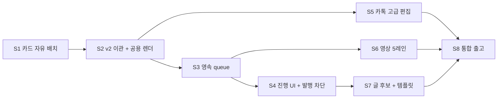

# 편집실 v2 본 구현 수직 슬라이스 계획

> STAMP: 2026-10-04 07:08 KST | model=gpt-5-codex | agent=tech-architect | skill=docs | 근거=https://www.postgresql.org/docs/current/sql-select.html, https://www.remotion.dev/docs/renderer/render-still | 고민=회장이 첫 슬라이스에서 v71 차이를 바로 체감하면서도 이후 데이터·렌더 구조를 다시 뜯지 않는 구현 순서

## 바로가기

- [결론](#결론)
- [착수 조건과 금지](#착수-조건과-금지)
- [모든 슬라이스의 공통 완료 조건](#모든-슬라이스의-공통-완료-조건)
- [슬라이스 의존 관계](#슬라이스-의존-관계)
- [S1 카드 자유 배치](#s1-카드-자유-배치)
- [S2 기존 카드 무손실 이관과 공용 장 렌더](#s2-기존-카드-무손실-이관과-공용-장-렌더)
- [S3 영속 내보내기 대기열](#s3-영속-내보내기-대기열)
- [S4 내보내기 UI와 발행실 최신 판 차단](#s4-내보내기-ui와-발행실-최신-판-차단)
- [S5 카톡 대화 고급 편집](#s5-카톡-대화-고급-편집)
- [S6 영상 5레인과 넣기 서랍](#s6-영상-5레인과-넣기-서랍)
- [S7 글 후보와 카드·영상 템플릿](#s7-글-후보와-카드영상-템플릿)
- [S8 통합 추적·성능·출고 준비](#s8-통합-추적성능출고-준비)
- [커밋과 검증 증거](#커밋과-검증-증거)

## 결론

첫 슬라이스는 카드 자유 배치다. 글·사진·도형·스티커·로고를 추가하고, 끌기·크기·회전·글자 크기 변경을 저장까지 연결한다. 회장이 v71에서 본 핵심 차이를 가장 빨리 체감하면서 `CardDeckV3`과 공용 장 컴포넌트라는 후속 작업의 기반도 세운다.

이후 기존 카드 무손실 이관과 화면·PNG 렌더 통일, PostgreSQL 내보내기 대기열, 진행 UI와 발행 차단을 순서대로 완성한다. 카톡·영상·글·템플릿은 같은 저장과 queue 경계 위에 얹는다.

기술설계 승인 전에는 build stage에 들어가지 않는다. 승인 뒤 code-builder가 아래 슬라이스를 하나씩 끝내고, 각 슬라이스를 독립 커밋한다.

## 착수 조건과 금지

### 착수 조건

- 기술설계 게이트가 `/approve`로 통과돼 approved artifact 버전이 고정돼야 한다.
- code-builder는 착수 직후 이 문서, `card-element-model.md`, `export-queue.md`, `user-flow-mapping.md`를 읽는다.
- `docs/design/prototypes/osmu-editroom-v71-hub-claude-opus-20261001-2335.html`과 v71 렌더를 기준 화면으로 둔다.
- 현재 main과 작업 branch 차이를 다시 확인하고 이미 구현된 부분은 확장한다.

### 금지

- Fabric, Konva, Canvas 편집기 도입 금지.
- 프로세스 메모리 queue, 공유 볼륨 queue, 외부 broker 도입 금지.
- `cardDeck` v2 덮어쓰기·삭제 금지.
- 빈 장 자동 삭제·순서 압축 금지.
- 변경 테스트만 통과했다는 이유로 아래 공통 테스트를 생략하지 않는다.
- 전체 build 실패를 피하려고 테스트 범위를 임의로 줄이지 않는다.
- 45분 제한 직전까지 큰 미커밋 묶음을 유지하지 않는다. 수직 슬라이스 안에서도 검증 가능한 작은 커밋을 남긴다.

## 모든 슬라이스의 공통 완료 조건

각 슬라이스는 아래 다섯 묶음을 전부 통과해야 한다. 결과는 `/tmp/editroom-v2-s<N>-*.log`로 저장하고 요약만 보고한다.

### 1. 변경 파일을 import하는 테스트 전부

```bash
cd dashboard
npx vitest related --run <이번 슬라이스에서 바뀐 모든 .ts/.tsx 파일>
```

`vitest related`가 테스트를 찾지 못하면 아래로 직접 import를 역검색하고, 동적 import·barrel 경로까지 확인한다.

```bash
rg -l '바뀐 모듈 경로|바뀐 export 이름' src tests scripts --glob '*.{test,spec}.{ts,tsx}'
```

찾은 테스트는 모두 실행한다. 0건이면 0건인 이유와 신규 테스트 경로를 커밋 본문에 적는다.

### 2. integrity 전체

```bash
cd dashboard
npx vitest run tests/integrity
```

현재 기준 32개 파일이다. 수량이 달라지면 현재 파일 수를 진실원으로 삼는다.

### 3. 모든 contract 테스트

```bash
cd dashboard
find . -type f -name '*.contract.test.*' -not -path './node_modules/*' -print0 \
  | xargs -0 npx vitest run
```

현재 기준 84개 파일이다. 특정 폴더로 범위를 줄이지 않는다.

### 4. CI 타입 검사

```bash
cd dashboard
npm run typecheck:ci
```

### 5. 사용자 축 직접 구동

- 해당 슬라이스의 브라우저 flow를 실제 dev server에서 수행한다.
- console error 0, 실패 network request 0을 확인한다.
- 1440, 1024, 390 폭에서 해당 기능을 확인한다. 카드 직접 변형은 1440·1024, 390에서는 요소 목록 기반 키보드·버튼 대체 흐름을 확인한다.
- 서버 렌더 슬라이스는 실제 PNG·MP4를 만들어 열고 결과를 확인한다.
- 대리지표만 확인한 항목은 `미검증`으로 남긴다.

## 슬라이스 의존 관계



## S1 카드 자유 배치

### 사용자 가치

v71과 현재 제품의 가장 큰 차이인 자유 배치를 첫 화면에서 확인한다. 요소 추가 뒤 끌기·크기·회전·글자 크기 변경이 저장되고 새로고침 뒤 유지돼야 한다.

### 범위

- `CardDeckV3` Zod 계약과 순수 command 함수.
- `CardSlideScene`과 `CardCanvasEditor`.
- 글·사진·도형·스티커·로고 추가.
- 선택 테두리, 8개 크기 손잡이, 회전 손잡이.
- 15도 회전 자석, Shift 1도.
- 가운데선과 다른 요소 4px 위치 자석.
- 방향키 1px, Shift+방향키 10px.
- 떠 있는 도구막대의 글꼴, 크기, 색, 굵기, 정렬, 층 이동.
- 요소 목록의 선택, 숨김, 잠금, 복제, 삭제.
- 실행 취소·다시 실행.
- 기존 draft revision 충돌 복구 경계 재사용.

### 건드릴 파일

| 종류 | 경로 |
|---|---|
| 신규 계약 | `dashboard/src/lib/studio/card-element-contract.ts` |
| 신규 command | `dashboard/src/lib/studio/card-element-commands.ts` |
| 신규 render model | `dashboard/src/lib/studio/card-render-model.ts` |
| 신규 scene | `dashboard/src/components/studio/card/CardSlideScene.tsx` |
| 신규 editor | `dashboard/src/components/studio/card/CardCanvasEditor.tsx` |
| 신규 UI | `dashboard/src/components/studio/card/CardElementToolbar.tsx`, `CardElementList.tsx` |
| 스타일 | 같은 폴더의 CSS Modules |
| 통합 | `dashboard/src/components/studio/StudioRooms.tsx` |
| 저장 | `dashboard/src/app/api/studio/drafts/route.ts`, `dashboard/src/lib/studio/editor-handoff*.ts` |
| 문서 | `docs/구현현황.md`, 관련 wiki 동작 문서 |

### 수용 기준

| ID | Given | When | Then |
|---|---|---|---|
| S1-AC1 | plain 카드 장을 열었다 | 글 요소를 추가해 끌고 크기를 바꾸고 17도 회전한다 | 화면과 저장 JSON에 같은 좌표·크기·회전이 남는다 |
| S1-AC2 | 글 요소를 선택했다 | 글자 크기·색·굵기·정렬을 바꾼다 | 즉시 반영되고 새로고침 뒤 유지된다 |
| S1-AC3 | 사진·도형·스티커·로고를 각각 추가했다 | 층 순서·잠금·숨김을 바꾼다 | 요소 목록과 장 화면이 일치한다 |
| S1-AC4 | 두 요소가 있다 | 이동 중 가운데선 또는 4px 안에 접근한다 | 자석 표시와 저장 좌표가 일치한다 |
| S1-AC5 | 키보드만 사용한다 | 방향키·Shift 이동·복제·삭제·undo를 수행한다 | 모든 행동이 가능하고 초점이 사라지지 않는다 |
| S1-AC6 | revision 충돌이 발생했다 | 최신본 불러오기와 내 변경 재적용을 고른다 | 기존 충돌 복구 흐름이 v3 요소를 잃지 않는다 |
| S1-AC7 | 390px 화면이다 | 요소 목록의 버튼으로 위치·층·숨김·잠금을 조작한다 | 가로 overflow 없이 대체 흐름이 동작한다 |

### 추가 필수 테스트

- `card-element-contract.test.ts`
- `card-element-commands.test.ts`
- `CardCanvasEditor.test.tsx`
- `StudioRooms` v3 draft round-trip 계약 테스트
- Playwright 또는 기존 스크립트 기반 drag·resize·rotate·font-size smoke

### 종료 증거

- 실제 4:5 카드에서 5종 요소 조작 전·후 캡처.
- 저장 요청과 새로고침 뒤 같은 element JSON.
- 1440·1024·390 실측.
- 공통 다섯 테스트 묶음 통과 로그.

## S2 기존 카드 무손실 이관과 공용 장 렌더

### 사용자 가치

기존 plain·카톡 카드가 사라지거나 바뀌지 않으면서 새 편집기를 쓸 수 있다. 화면에서 본 카드와 내려받은 PNG가 같은 모습이다.

### 범위

- v2 -> v3 결정적 변환, v3 -> legacy projection 회귀 검사.
- `payload.cardDeck` 보존, `payload.cardDeckV3` 이중 저장.
- 빈 장과 원래 장 위치 보존.
- `CardSlideComposition`을 Remotion entry에 등록.
- 기존 Remotion browser·bundle cache를 공용 runtime으로 추출.
- Pretendard Variable 파일·라이선스·hash 고정.
- 기존 Canvas PNG 경로는 fallback으로 유지하고 feature flag 뒤에서 새 렌더를 비교한 뒤 전환.

### 건드릴 파일

- `dashboard/src/lib/studio/card-deck-migration.ts`
- `dashboard/src/lib/studio/card-font.ts`
- `dashboard/src/lib/studio/card-render.ts`
- `dashboard/remotion/CardSlideComposition.tsx`
- `dashboard/remotion/entry.ts`
- `dashboard/src/lib/intro-outro-render.ts`
- `dashboard/src/lib/remotion-runtime.ts`
- `dashboard/public/fonts/PretendardVariable.woff2`
- `dashboard/public/fonts/Pretendard-OFL-1.1.txt`
- `dashboard/src/app/api/studio/drafts/route.ts`
- `dashboard/src/lib/card-deck.ts`

### 수용 기준

| ID | Given | When | Then |
|---|---|---|---|
| S2-AC1 | 빈 장이 중간에 있는 v2 plain 덱이다 | v3로 읽고 저장한다 | 원문·ID·순서·빈 장 위치가 같다 |
| S2-AC2 | 강조 세그먼트와 사진이 있는 chat_bubble 덱이다 | 왕복 변환한다 | base 의미 구조가 깊은 동등이다 |
| S2-AC3 | 같은 render model이다 | editor와 Remotion still을 렌더한다 | 합의한 픽셀 허용치 안에서 일치한다 |
| S2-AC4 | 폰트 파일을 일부러 제거했다 | 서버 렌더한다 | fallback 없이 `FONT_LOAD_FAILED`로 실패한다 |
| S2-AC5 | 기존 카드 draft다 | feature flag를 끈다 | 기존 경로로 즉시 롤백된다 |

### 추가 필수 테스트

- v2 fixture 전수 migration contract.
- empty slide 위치 회귀 테스트.
- chat bubble segment round-trip.
- editor DOM 대 Remotion PNG 시각 회귀.
- Docker image 안의 font hash·Chromium 경로 계약 테스트.

### 종료 증거

- v2 fixture 전수 round-trip 0 gap.
- 실제 plain·chat_bubble 각 1개 PNG 육안 확인.
- editor와 PNG diff 수치.
- 공통 다섯 테스트 묶음 통과 로그.

## S3 영속 내보내기 대기열

### 사용자 가치

브라우저나 컨테이너가 끊겨도 내보내기 상태가 남는다. 여러 컨테이너가 떠도 같은 장을 중복 렌더하지 않는다.

### 범위

- additive migration, schema, RLS, manifest.
- export repository, canonical hash, idempotency.
- 접수·상태·실패 장 재시도·최신 판 API.
- 별도 worker entry, advisory lock, tenant round-robin.
- `FOR UPDATE SKIP LOCKED` claim, lease, heartbeat, orphan reclaim.
- 장 PNG를 object storage에 결정적 key로 저장.
- 상태 집계와 worker health.

### 건드릴 파일

- `dashboard/db/migrations/20261004_010_studio_export_queue.sql`
- `dashboard/db/migration-manifest.tsv`
- `dashboard/db/schema.sql`
- `dashboard/db/rls.sql`
- `dashboard/src/lib/studio/export-contract.ts`
- `dashboard/src/lib/studio/export-repository.ts`
- `dashboard/src/lib/studio/export-worker.ts`
- `dashboard/src/lib/studio/export-source-hash.ts`
- `dashboard/src/app/api/studio/drafts/[draftId]/exports/route.ts`
- `dashboard/src/app/api/studio/drafts/[draftId]/exports/[exportId]/route.ts`
- `dashboard/src/app/api/studio/drafts/[draftId]/exports/[exportId]/retry/route.ts`
- `dashboard/src/app/api/studio/drafts/[draftId]/exports/latest/route.ts`
- worker 실행·배포 manifest와 환경 문서

### 수용 기준

| ID | Given | When | Then |
|---|---|---|---|
| S3-AC1 | 두 worker가 같은 item을 경쟁한다 | 동시에 claim한다 | 하나만 lease token을 받는다 |
| S3-AC2 | 다른 테넌트의 export ID를 안다 | 조회·retry한다 | 404이며 내용은 노출되지 않는다 |
| S3-AC3 | worker가 render 중 종료된다 | lease가 만료된다 | item이 자동 회수되고 상한 뒤 실패한다 |
| S3-AC4 | 같은 idempotency key를 반복한다 | 같은 본문과 다른 본문을 각각 보낸다 | 같은 본문은 재사용, 다른 본문은 409다 |
| S3-AC5 | 9장 중 1장만 실패한다 | 실패 장 retry를 요청한다 | 성공 8장은 유지되고 1장만 queued다 |
| S3-AC6 | 두 worker container를 기동한다 | advisory lock을 경쟁한다 | active 1, standby 1이다 |

### 추가 필수 테스트

- 실제 PostgreSQL migration up, schema 재실행 멱등, RLS cross-tenant.
- claim 동시성·lease fencing·orphan 회수 통합 테스트.
- API request·response·오류 전수 contract.
- object upload 뒤 crash 재시도 멱등 테스트.
- manifest checksum과 migration 순서 integrity.

### 종료 증거

- 실제 PostgreSQL에서 migration·RLS·동시 claim 결과.
- 2 worker 경쟁 결과와 queue 상태 전이.
- 실제 장 PNG object와 DB sha256 일치.
- 공통 다섯 테스트 묶음 통과 로그.

## S4 내보내기 UI와 발행실 최신 판 차단

### 사용자 가치

머리 줄에서 내보내기를 시작하고 `3 / 9장` 진행을 본다. 실패한 장만 다시 처리한다. 최신 결과가 없거나 빈 장이 있으면 잘못된 판을 발행하지 않는다.

### 범위

- 공통 `내보내기` 주 행동.
- 독립 내보내기 panel 또는 dialog.
- 진행률, 장별 상태, 실패 이유, 실패 장 retry.
- current source hash와 latest export 비교.
- `enqueue` 서버 route의 최신 판 강제.
- 빈 장이면 첫 빈 장 선택·초점 이동.

### 건드릴 파일

- `dashboard/src/components/studio/StudioRooms.tsx`
- `dashboard/src/components/studio/ExportPanel.tsx`
- `dashboard/src/components/studio/PublishHeaderControls.tsx`
- `dashboard/src/app/api/studio/drafts/[draftId]/enqueue/route.ts`
- `dashboard/src/lib/studio/editor-handoff.ts`
- 관련 CSS Modules와 route tests

### 수용 기준

| ID | Given | When | Then |
|---|---|---|---|
| S4-AC1 | 9장 export가 진행 중이다 | 상태를 조회한다 | 완료 수가 증가하고 새로고침 뒤 이어진다 |
| S4-AC2 | 4번째 장만 실패했다 | retry를 누른다 | 4번째만 다시 처리되고 최종 성공한다 |
| S4-AC3 | export 뒤 편집했다 | 발행실 이동을 누른다 | stale 이유와 새 내보내기 행동이 보인다 |
| S4-AC4 | 6번째가 빈 장이다 | 내보내기 또는 발행 이동을 누른다 | 6번째 장을 선택하고 빈 장을 설명한다 |
| S4-AC5 | 최신 export가 성공했다 | 발행실 이동을 누른다 | export ID·hash가 발행 queue에 고정된다 |
| S4-AC6 | 클라이언트 검사를 우회한다 | enqueue API를 직접 호출한다 | 서버가 같은 조건으로 차단한다 |

### 추가 필수 테스트

- ExportPanel component test.
- progress polling cleanup·timeout 회귀 테스트.
- enqueue stale·empty·failed·success contract.
- 1440·1024·390 UI E2E.

### 종료 증거

- 실제 9장 진행·부분 실패·retry 동영상 또는 연속 캡처.
- stale과 empty server response.
- 성공한 발행 queue payload의 export ID·hash.
- 공통 다섯 테스트 묶음 통과 로그.

## S5 카톡 대화 고급 편집

### 사용자 가치

기존 직접 편집을 유지하면서 말풍선을 같은 장·다른 장으로 옮기고, 화자를 일괄 변경하며, 말투 후보를 비교한다. 대화 위에 글·스티커·로고도 얹는다.

### 범위

- 말풍선 drag handle과 장 간 drop target.
- 화자 일괄 변경·서로 바꾸기.
- 말투 후보 3개, 사실 변화 경고, 선택 적용.
- chat base 위 자유 요소 overlay.
- 표지·마지막 사진과 PNG 반영 회귀 보존.

### 건드릴 파일

- `dashboard/src/components/studio/BubbleEditor.tsx`
- `dashboard/src/lib/studio/card-deck-ops.ts`
- `dashboard/src/lib/studio/card-element-commands.ts`
- `dashboard/src/app/api/studio/commands/route.ts`
- `dashboard/src/components/studio/card/CardSlideScene.tsx`
- 관련 tests와 E2E 스크립트

### 수용 기준

| ID | Given | When | Then |
|---|---|---|---|
| S5-AC1 | 말풍선 두 장이 있다 | 풍선을 다른 장으로 옮긴다 | 세그먼트·화자·순서가 보존된다 |
| S5-AC2 | 두 화자가 있다 | 서로 바꾸기를 누른다 | 전 덱의 speaker가 원자적으로 바뀌고 undo된다 |
| S5-AC3 | 말투 후보가 3개다 | 비교 뒤 하나를 적용한다 | 선택 후보만 반영되고 사실 경고가 남는다 |
| S5-AC4 | 대화 장 위에 로고를 올렸다 | PNG를 내보낸다 | 화면과 PNG에서 같은 위치다 |
| S5-AC5 | 기존 표지·마지막 사진이 있다 | 고급 편집을 저장한다 | 사진과 원래 bubble 구조가 유지된다 |

### 추가 필수 테스트

- bubble move·bulk speaker command unit.
- suggestion response contract와 사실 경고.
- 기존 `e2e:bubble-editor` 전부.
- chat overlay editor·PNG parity.

## S6 영상 5레인과 넣기 서랍

### 사용자 가치

영상·자막·글·훅/댓글·음악을 한 타임라인에서 조작한다. 전환, 자막 스타일, 음악, 인트로·아웃트로, 표지를 실제 결과물까지 연결한다.

### 범위

- 5레인 timeline과 공통 block drag·양끝 resize.
- 넣기 서랍.
- 전환 3종, 자막 style preset, 음악 5곡·업로드.
- 안전 영역, 원본 복원.
- 목소리 선택의 실제 렌더 반영.
- 내 브랜드 인트로·아웃트로 갤러리 미리 재생, 길이·글 수정, 다음 영상 기본값.
- 추천 표지 3개, 재생 막대 frame 선택, 사진 upload, 글 preset.
- 동기 영상 렌더를 export queue item으로 전환.

### 건드릴 파일

- `dashboard/src/components/studio/VideoEditor.tsx`
- `dashboard/src/components/studio/IntroOutroPanel.tsx`
- `dashboard/src/lib/studio/video-edit-contract.ts`
- `dashboard/src/lib/studio/playback-edit-plan.ts`
- `dashboard/src/app/api/video/subtitle/route.ts`
- `dashboard/src/app/api/video/intro-outro/route.ts`
- `dashboard/src/app/api/video/upload/route.ts`
- `dashboard/src/app/api/images/upload/route.ts`
- export worker video renderer adapter

### 수용 기준

| ID | Given | When | Then |
|---|---|---|---|
| S6-AC1 | 5레인에 block이 있다 | drag·resize한다 | preview와 저장 시간이 일치한다 |
| S6-AC2 | 전환·자막·음악·목소리를 바꿨다 | export한다 | 실제 mp4에 모두 반영된다 |
| S6-AC3 | intro/outro 길이와 글을 바꿨다 | 저장·재접속한다 | 설정과 결과가 복원된다 |
| S6-AC4 | 영상 표지를 세 방식으로 고른다 | 저장한다 | 추천·frame·upload 모두 같은 cover contract다 |
| S6-AC5 | worker가 중간에 죽는다 | lease가 만료된다 | queue에서 회수되고 중복 mp4가 남지 않는다 |

### 추가 필수 테스트

- video contract·render plan 전수.
- 5레인 pointer와 keyboard component tests.
- 실제 짧은 fixture mp4 render와 ffprobe.
- 영상 queue crash·retry 통합.
- 만료 media URL resign 회귀.

## S7 글 후보와 카드·영상 템플릿

### 사용자 가치

질문형·숫자형·고통 인식형 후보를 비교해 고르고, 카드 템플릿을 전체 또는 한 장에 적용하고 되돌린다. 생성실과 편집실의 템플릿 경험이 이어진다.

### 범위

- 글 후보 3개와 비교 UI, 사실 불일치·글자 수 경고.
- 생성실 카드 템플릿 6개 한 줄과 추천 기본값.
- 편집실 template gallery, 전체·한 장 적용.
- 적용 전후 비교와 이전 template 복원.
- template 적용을 하나의 undo command로 기록.

### 건드릴 파일

- `dashboard/src/components/studio/StudioRooms.tsx`
- `dashboard/src/components/studio/TextCandidatePicker.tsx`
- `dashboard/src/components/studio/card/CardTemplateGallery.tsx`
- `dashboard/src/lib/studio/card-templates/index.ts`
- `dashboard/src/app/api/studio/text/route.ts`
- generation request·candidate contract

### 수용 기준

| ID | Given | When | Then |
|---|---|---|---|
| S7-AC1 | 세 후보가 있다 | 비교 뒤 하나를 선택한다 | 선택 후보만 본문에 들어가고 경고가 유지된다 |
| S7-AC2 | 생성실에 들어왔다 | 카드 형식을 고른다 | 6개 template과 추천 선택이 보인다 |
| S7-AC3 | 자유 요소가 있는 덱이다 | 전체 template을 적용한다 | content와 요소 ID 정책에 따라 보존·이동되고 undo된다 |
| S7-AC4 | 한 장만 선택했다 | 이 장만 바꾸기를 누른다 | 다른 장 JSON과 화면은 변하지 않는다 |
| S7-AC5 | template을 바꿨다 | 전후 비교 뒤 복원을 누른다 | 이전 template과 요소 상태가 정확히 돌아온다 |

### 추가 필수 테스트

- candidate API contract.
- 글자 수·사실 경고 component tests.
- template command round-trip·undo.
- 생성실 추천과 편집실 gallery E2E.

## S8 통합 추적·성능·출고 준비

### 사용자 가치

v71의 모든 기능을 실제 경로에서 확인하고, 화면·내보내기·발행 판이 일치한 상태로 QA에 넘긴다.

### 범위

- `user-flow-mapping.md`의 모든 ID를 자동 test ID와 연결.
- 1440·1024·390 전 기능 상태표.
- editor DOM 대 PNG visual regression.
- queue age·failure·lease·latest blocker telemetry.
- migration rollback rehearsal과 운영 runbook.
- docs/구현현황·인프라 wiki·QA tracker 갱신.

### 건드릴 파일

- `dashboard/tests/integrity/editroom-v2-traceability.contract.test.ts`
- `dashboard/scripts/verify-editroom-v2-screen-conformance.mjs`
- observability module과 dashboard 설정
- `docs/구현현황.md`
- `wiki/ops/인프라.md`
- QA tracker와 release evidence 문서

### 수용 기준

| ID | Given | When | Then |
|---|---|---|---|
| S8-AC1 | mapping ID 전부가 있다 | traceability test를 돌린다 | endpoint·component·table·test 빈칸이 0이다 |
| S8-AC2 | 실제 draft가 있다 | 편집·export·publish flow를 끝까지 수행한다 | 같은 source hash가 세 경로에 남는다 |
| S8-AC3 | 1440·1024·390 viewport다 | 상태표 전부를 순회한다 | 가로 overflow 0, 주요 행동 접근 가능이다 |
| S8-AC4 | worker를 강제 종료한다 | recovery rehearsal을 수행한다 | lease 회수와 중복 방지가 관찰된다 |
| S8-AC5 | migration 적용 뒤 앱을 이전 버전으로 돌린다 | 기존 기능을 실행한다 | 신규 표가 남아도 기존 기능이 동작한다 |

### 추가 필수 테스트

- mapping completeness contract.
- 핵심 flow Playwright E2E.
- 실제 PostgreSQL·object storage·Remotion 통합.
- visual regression과 접근성 검사.
- migration rollback rehearsal.

## 커밋과 검증 증거

### 커밋 규칙

- 각 슬라이스는 최소 하나의 독립 커밋으로 끝낸다.
- migration·API·worker처럼 복구 단위가 다른 변경은 같은 슬라이스 안에서도 분리 커밋한다.
- 테스트 실패 상태를 숨기기 위한 범위 축소 커밋은 금지한다.
- user 변경과 무관한 파일은 stage하지 않는다.
- push는 ship 단계 전 별도 승인 없이는 하지 않는다.

### code-builder 종료 보고 필수값

| 값 | 내용 |
|---|---|
| 기반 | 읽은 approved artifact 경로와 commit |
| 변경 | 유지한 기존 기능 / 추가·변경한 기능 분리 |
| 테스트 | related, integrity, all contracts, typecheck 각각 command·exit·파일 수 |
| 구동 | 실제 사용자 flow, viewport, console·network 오류 수 |
| 서버 산출 | 실제 PNG·MP4 경로와 육안 결과 |
| 데이터 | migration·RLS·rollback rehearsal 결과 |
| 남은 것 | 미검증과 다음 소유자 |

## 벤치마크와 설계 판단

### 참고한 사례

1. [PostgreSQL SELECT](https://www.postgresql.org/docs/current/sql-select.html)의 queue-like `SKIP LOCKED` 경계를 S3 동시성 수용 기준으로 가져왔다.
2. [Remotion renderStill](https://www.remotion.dev/docs/renderer/render-still)의 React server still 렌더를 S2 화면·PNG 통일 경계로 사용했다.
3. [Polotno Design Format](https://polotno.com/docs/schema)의 typed element·page JSON을 S1 계약 분리 참고 사례로 사용했다. 제품 의존성은 도입하지 않는다.

### 반대 관점 검토

queue부터 만들면 기반이 먼저 안정된다는 주장이 있다. 그러나 회장이 지적한 핵심은 실제 편집실이 v71과 다르다는 점이다. 카드 자유 배치는 사용자 가치가 가장 크고 동시에 v3 모델과 공용 장 경계를 세우므로 첫 슬라이스로 적합하다. queue는 그 렌더 입력이 고정된 뒤 만드는 편이 재작업이 적다.

반대로 모든 카드 기능을 한 슬라이스에 넣으면 체감은 크지만 실패 범위가 너무 넓다. S1은 자유 배치와 저장까지, S2는 무손실·PNG parity까지로 쪼개 commit 손실과 원인 추적 위험을 줄였다.

### 셀프심문

- 이 순서가 틀렸다면 가장 그럴듯한 이유는 S1이 임시 로컬 렌더를 만들고 S2에서 다시 뜯는 경우다. 이를 막으려고 S1부터 `CardSlideScene`을 공용 경계로 만들고 S2는 같은 컴포넌트에 서버 adapter만 붙이게 했다.
- 가장 load-bearing한 가정은 기존 draft API가 v3 JSON을 수용할 수 있다는 점이다. v2의 64 KiB는 유지하고 v3만 256 KiB로 분리한다. S1에서 정상 덱·상한 덱·초과 덱을 검증하고, 더 큰 payload가 필요하면 한도를 무작정 늘리지 말고 자산 참조와 요소 상한을 먼저 조정한다.
- 스킬 우선 게이트는 지켰는가. `docs` 스킬을 읽고 작업자가 실행 가능한 체크리스트와 증거 계약을 적용했다.

## 추적성과 출고 푸터

기반 포맷: `docs/eng/editroom-v2/phase1-tasks.md`의 task·AC·test 연결 형식을 계승하고, 이번 본 구현은 수직 슬라이스별 사용자 구동 증거를 추가했다.

RUBRIC_SCORE: correctness=5/5 completeness=5/5 traceability=5/5 usability=5/5 readability=4/5 total=24/25

WEAKEST_LINE: 영상 렌더의 실제 timeout·처리량은 운영 fixture 실측 전이라 S6에서 확정해야 한다.

SKILLS_USED: docs, 수직 슬라이스·수용 기준·검증 증거를 공유 실행 문서로 구성

SKILLS_SKIPPED: document-generate·diagram, 현재 세션의 available-skills에 없어 저장소 Markdown과 Mermaid로 대체

SOURCES/MODEL: gpt-5-codex | `wiki/거버넌스/결정.md`, `docs/plan/prd-osmu-editroom-v2-v1.3.0-draft.md`, v71 prototype, `docs/eng/editroom-v2/gap-matrix.md`, `card-element-model.md`, `export-queue.md`, `dashboard/package.json`, 현재 source·test inventory, PostgreSQL·Remotion·Polotno 공식 문서

PRESENTATION_CHECK: 내부 태그 잔재 없음 확인 / Markdown 구조·Mermaid 정적 검토 / 코드는 작성·구동하지 않음

KNOWLEDGE_QUERY: BRAIN에서 구조화 편집 모델·queue 실패 모델·Remotion 재현성을 조회하고, 웹에서 typed element와 PostgreSQL·Remotion 공식 사례를 조사했다.

HITS_USED: BRAIN의 모델 정본·DOM 투영, 실패 모델 우선 queue 선택, 기존 Remotion 재사용 원칙을 슬라이스 순서와 수용 기준에 반영했다.

HITS_REJECTED: 외부 broker·canvas editor·새 렌더 엔진은 승인 결정과 단순성 기준에 맞지 않아 제외했다.

CONFLICTS: 없음. 첫 슬라이스의 사용자 체감 우선은 회장의 v71 불일치 지적과 일치하고, 데이터·queue 결정은 후속 기반으로 유지된다.
