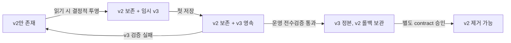
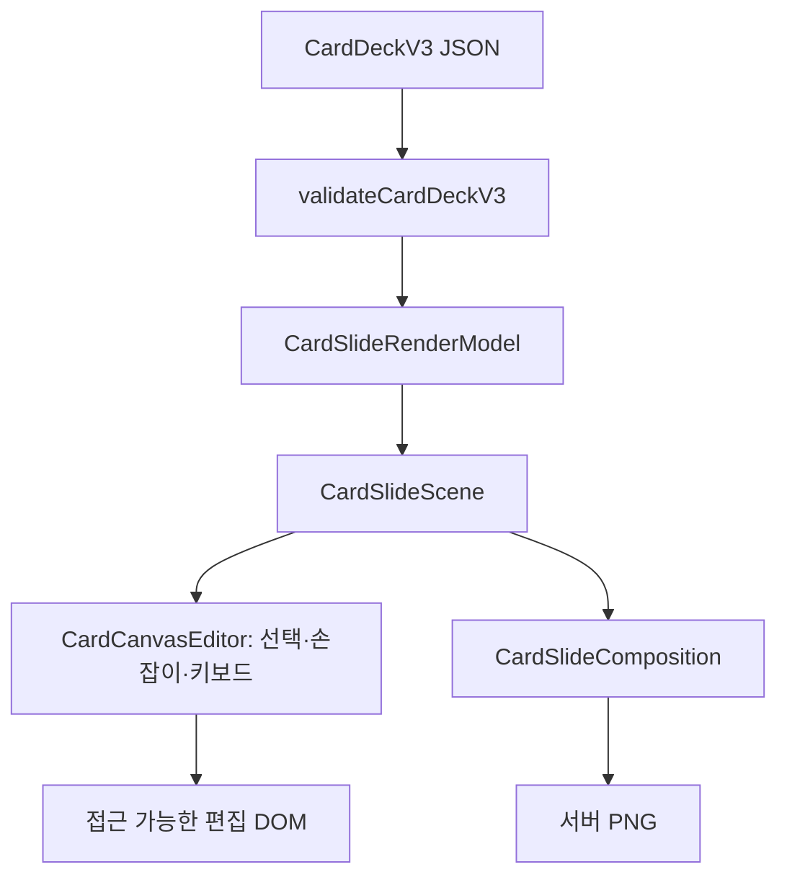
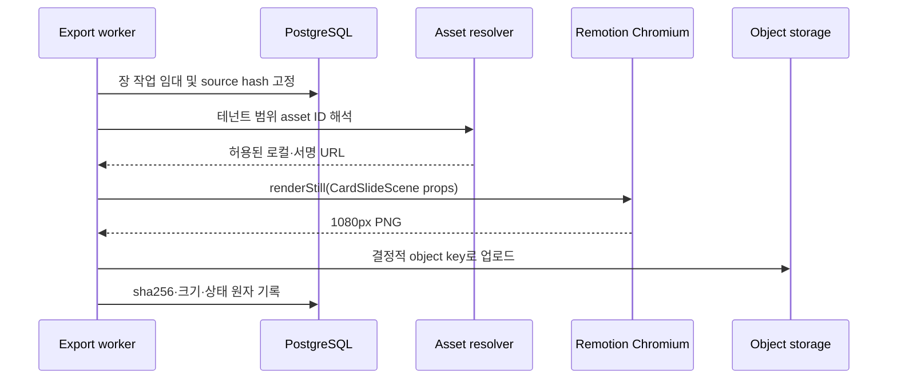

# 편집실 v2 카드 장 요소 모델

> STAMP: 2026-10-04 07:02 KST | model=gpt-5-codex | agent=tech-architect | skill=docs | 근거=https://polotno.com/docs/schema, https://www.remotion.dev/docs/renderer/render-still | 고민=자유 배치와 기존 카톡 구조를 함께 살리면서 화면과 PNG가 갈라지지 않게 하는 최소 모델

## 바로가기

- [결론](#결론)
- [현재 구현과 변경 경계](#현재-구현과-변경-경계)
- [정본 JSON 계약](#정본-json-계약)
- [요소별 계약](#요소별-계약)
- [검증 규칙](#검증-규칙)
- [v2에서 v3로 무손실 이관](#v2에서-v3로-무손실-이관)
- [공용 React 장 컴포넌트](#공용-react-장-컴포넌트)
- [서버 PNG 렌더](#서버-png-렌더)
- [글꼴 고정](#글꼴-고정)
- [수용 기준과 테스트](#수용-기준과-테스트)
- [벤치마크와 설계 판단](#벤치마크와-설계-판단)

## 결론

카드의 정본은 `drafts.payload.cardDeckV3`에 저장하는 구조화 JSON이다. 장은 고정 논리 좌표계에서 렌더하고, 글·사진·도형·스티커·로고를 판별 가능한 요소 배열로 가진다. 편집 화면과 서버 PNG는 `CardSlideScene`이라는 동일 React 컴포넌트를 사용한다. 편집 전용 선택 테두리와 손잡이는 이 컴포넌트 바깥에 둔다.

기존 `cardDeck` v2는 즉시 덮어쓰지 않는다. 확장 단계 동안 v2와 v3를 함께 보존하고, 결정적인 변환기로 v3를 생성한다. 이 방식은 `plain`과 `chat_bubble`의 원문, 빈 장, 원래 장 위치를 잃지 않으며 이전 버전으로 되돌릴 수 있다.

## 현재 구현과 변경 경계

### 확인된 현재 구현

| 영역 | 현재 진실원 | 판단 |
|---|---|---|
| 카드 계약 | `dashboard/src/lib/studio/card-deck-contract.ts` | v2, `plain`과 `chat_bubble`, 최대 11장, 자유 요소 배열 없음 |
| 저장 | `dashboard/src/app/api/studio/drafts/route.ts` | v2 `drafts.payload.cardDeck`은 64 KiB, revision 기반 충돌 감지 |
| 카톡 편집 | `dashboard/src/components/studio/BubbleEditor.tsx` | 구조화 말풍선 편집, 표지·마지막 장 이미지 지원 |
| 일반 카드 편집 | `dashboard/src/components/studio/EditPreview.tsx` | 문장 단위 편집과 제한된 위치값, 자유 좌표 없음 |
| 카드 PNG | `dashboard/src/lib/card-deck.ts` | Canvas 기반 별도 렌더러라 편집 DOM과 정의가 갈릴 수 있음 |
| Remotion | `dashboard/remotion/entry.ts`, `dashboard/src/lib/intro-outro-render.ts` | 번들러·Chromium·렌더 실행 경로가 이미 있음 |
| 글꼴 | 전역 CSS, Canvas, Remotion이 서로 다른 fallback | 같은 입력의 픽셀 결과를 보장할 수 없음 |

### 신규와 변경

- 신규: `CardDeckV3`, `CardSlideV3`, 5종 요소 판별 합집합, 논리 좌표계, 장별 배경.
- 신규: 순수 시각 컴포넌트 `CardSlideScene`과 편집 상호작용 어댑터 `CardCanvasEditor`.
- 변경: 카드 PNG를 Canvas 전용 코드에서 Remotion `renderStill()` 기반 공용 React 장 렌더로 전환.
- 보존: v2 `plain`·`chat_bubble` 데이터, 빈 장, 장 순서, 카톡 말풍선 세그먼트, 표지·마지막 장 사진.
- 금지: Fabric, Konva, Canvas 편집기, 만료 URL을 정본 JSON에 저장, v2 즉시 삭제.

## 정본 JSON 계약

### 논리 좌표계

| 비율 | 논리 폭 | 논리 높이 | 내보내기 픽셀 |
|---|---:|---:|---|
| `4:5` | 1080 | 1350 | 1080 x 1350 |
| `1:1` | 1080 | 1080 | 1080 x 1080 |

편집기는 논리 좌표를 저장하고 CSS로 화면 크기에 맞춰 한 번만 축소한다. 서버는 배율 1로 같은 좌표를 렌더한다. 좌표와 크기는 정수 또는 소수점 셋째 자리까지 허용한다.

### TypeScript 기준 계약

```ts
type CardRatio = "4:5" | "1:1";

interface CardDeckV3 {
  contract_version: "3.0";
  id: string;
  template: "plain" | "chat_bubble";
  ratio: CardRatio;
  revision: number;
  theme: CardThemeV2;
  brand: CardBrandV2;
  hook_type: CardHookTypeV2;
  cta: CardCtaV2;
  slides: CardSlideV3[];
  migration?: {
    source_contract_version: "2.0";
    source_sha256: string;
    converter_version: "card-deck-v2-to-v3@1";
  };
}

interface CardSlideV3 {
  id: string;
  order: number;
  role: "cover" | "body" | "cta";
  content_state: "filled" | "empty";
  background: CardBackground;
  base:
    | { kind: "plain"; lines: string[] }
    | { kind: "chat_bubble"; cover: ChatCoverV2 | null; bubbles: ChatBubbleV2[] };
  elements: CardElement[];
}

interface CardElementBase {
  id: string;
  type: "text" | "image" | "shape" | "sticker" | "logo";
  name: string;
  x: number;
  y: number;
  width: number;
  height: number;
  rotation: number;
  z_index: number;
  opacity: number;
  locked: boolean;
  hidden: boolean;
}
```

`base`는 기존 템플릿의 의미 구조다. `elements`는 자유 배치 객체다. `chat_bubble`을 무리하게 도형과 글 요소로 납작하게 만들지 않으므로 화자, 말풍선 경계, 강조 세그먼트가 보존된다. 이후 새 카드도 같은 구조로 저장한다.

### 예시

```json
{
  "contract_version": "3.0",
  "id": "deck_01J9ZQ7M8W7A7QFQ6J8FDX3E6T",
  "template": "plain",
  "ratio": "4:5",
  "revision": 13,
  "theme": { "id": "cream-editorial" },
  "brand": { "name": "ZERO-ONE", "primary_color": "#111111" },
  "hook_type": "pain_recognition",
  "cta": { "text": "다음 장에서 확인하세요" },
  "slides": [
    {
      "id": "slide_01J9ZQ9V6C1PM3S9K44XJ7Z0G2",
      "order": 0,
      "role": "cover",
      "content_state": "filled",
      "background": { "kind": "solid", "color": "#FFF9F0" },
      "base": { "kind": "plain", "lines": [] },
      "elements": [
        {
          "id": "el_01J9ZQB3X7GZ5N78P4R2XQ8E16",
          "type": "text",
          "name": "표지 제목",
          "x": 96,
          "y": 164,
          "width": 888,
          "height": 312,
          "rotation": 0,
          "z_index": 0,
          "opacity": 1,
          "locked": false,
          "hidden": false,
          "text": "열심히 만드는 것보다 먼저 볼 것",
          "style": {
            "font_family": "Pretendard Variable",
            "font_size": 78,
            "font_weight": 760,
            "line_height": 1.16,
            "letter_spacing": -1.2,
            "color": "#111111",
            "align": "left",
            "vertical_align": "top"
          }
        },
        {
          "id": "el_01J9ZQEE99VD1RQC59TBNT4THC",
          "type": "logo",
          "name": "브랜드 로고",
          "x": 840,
          "y": 1160,
          "width": 144,
          "height": 54,
          "rotation": 0,
          "z_index": 1,
          "opacity": 1,
          "locked": true,
          "hidden": false,
          "asset_id": "asset_01J9ZQFJ6R82Z6KFM9DPGNFH6B",
          "alt": "ZERO-ONE",
          "fit": "contain"
        }
      ]
    }
  ],
  "migration": {
    "source_contract_version": "2.0",
    "source_sha256": "64자리 소문자 16진수",
    "converter_version": "card-deck-v2-to-v3@1"
  }
}
```

## 요소별 계약

### 공통

| 필드 | 규칙 |
|---|---|
| `id` | 덱 안에서 유일한 ULID형 문자열. 저장 뒤 재생성 금지 |
| `x`, `y` | 장 좌상단 기준 논리 픽셀 |
| `width`, `height` | 회전 전 경계 상자의 논리 픽셀 |
| `rotation` | 시계 방향 도, 저장 범위 `-180..180` |
| `z_index` | 장 안에서 중복 없는 `0..n-1` 연속 정수 |
| `opacity` | `0..1` |
| `locked` | 선택과 변형 금지. 렌더에는 포함 |
| `hidden` | 편집 요소 목록에는 남고 화면·내보내기에는 제외 |

### 글

```ts
interface TextElement extends CardElementBase {
  type: "text";
  text: string;
  style: {
    font_family: "Pretendard Variable";
    font_size: number;
    font_weight: number;
    line_height: number;
    letter_spacing: number;
    color: CssHexColor;
    align: "left" | "center" | "right";
    vertical_align: "top" | "middle" | "bottom";
  };
}
```

글 상자의 폭과 글자 크기는 독립 값이다. 모서리 손잡이는 상자 폭·높이를 바꾸고, 떠 있는 도구막대의 크기 입력은 `font_size`를 바꾼다. 회전 중에는 줄바꿈을 재계산하지 않는다.

### 사진

```ts
interface ImageElement extends CardElementBase {
  type: "image";
  asset_id: string;
  alt: string;
  decorative: boolean;
  fit: "cover" | "contain";
  crop: { x: number; y: number; width: number; height: number };
  corner_radius: number;
}
```

`crop`은 원본 기준 `0..1` 정규화 사각형이다. 만료되는 서명 URL과 임의 외부 URL은 저장하지 않는다. `asset_id`는 서버에서 테넌트 소유권을 검증한 뒤 렌더 전용 URL로 해석한다.

### 도형

```ts
interface ShapeElement extends CardElementBase {
  type: "shape";
  shape: "rectangle" | "ellipse" | "line";
  fill: CssHexColor | "transparent";
  stroke: CssHexColor | "transparent";
  stroke_width: number;
  corner_radius: number;
}
```

`line`은 경계 상자의 가운데 수평선으로 렌더하며 회전으로 방향을 정한다. 선의 최소 폭은 8px, 최소 높이는 1px다.

### 스티커와 로고

```ts
interface StickerElement extends CardElementBase {
  type: "sticker";
  asset_id: string;
  alt: string;
  decorative: boolean;
  fit: "contain";
}

interface LogoElement extends CardElementBase {
  type: "logo";
  asset_id: string;
  alt: string;
  fit: "contain";
}
```

스티커는 `decorative=true`일 수 있다. 로고는 빈 대체 텍스트를 허용하지 않는다. SVG는 업로드 시 정화하고, 서버 렌더에는 정화된 파생 자산만 전달한다.

### 배경

```ts
type CardBackground =
  | { kind: "solid"; color: CssHexColor }
  | { kind: "gradient"; from: CssHexColor; to: CssHexColor; angle: number }
  | { kind: "image"; asset_id: string; crop: NormalizedCrop; overlay: CssHexColor | null };
```

## 검증 규칙

검증은 Zod 계약과 데이터베이스 진입 직전 검사를 함께 사용한다. UI 제한만 믿지 않는다.

| 범위 | 규칙 | 실패 코드 |
|---|---|---|
| 덱 | v3 UTF-8 JSON 직렬화 최대 256 KiB. v2는 기존 64 KiB 유지 | `CARD_DECK_TOO_LARGE` |
| 덱 | 장 수 `2..11`, `order`는 `0..n-1`, ID 중복 없음 | `INVALID_SLIDE_SET` |
| 장 | 요소 최대 50개, `z_index` 연속·유일 | `INVALID_ELEMENT_ORDER` |
| 기하 | 모든 수 유한, 소수 3자리, 폭·높이 최소 4px, 회전 뒤 경계가 장과 최소 1px 교차 | `INVALID_ELEMENT_GEOMETRY` |
| 글 | 최대 2,000자, 크기 `8..240`, 무게 `100..900`, 행간 `0.8..2.0` | `INVALID_TEXT_STYLE` |
| 색 | `#RRGGBB` 또는 `#RRGGBBAA`만 | `INVALID_COLOR` |
| 사진 | 자르기 사각형이 `0..1` 안이고 면적이 0보다 큼 | `INVALID_CROP` |
| 자산 | 같은 테넌트의 활성 자산이며 허용 MIME·용량 통과 | `ASSET_NOT_AVAILABLE` |
| 접근성 | 로고 `alt` 필수, 사진은 `alt` 또는 `decorative=true` | `ALT_TEXT_REQUIRED` |
| 저장 | 요청 revision이 현재 revision과 일치 | `REVISION_CONFLICT` |
| 내보내기 | `content_state=empty` 장이 하나라도 있으면 첫 빈 장 번호와 함께 거부 | `EMPTY_SLIDE` |

빈 글 요소와 빈 장은 편집 중 유효하다. D-2026-10-03-2에 따라 삭제하거나 순서를 당기지 않는다. 단, 내보내기와 발행실 진입 준비 검사는 빈 장을 차단한다.

## v2에서 v3로 무손실 이관

### 원칙

1. 확장 단계에서 기존 `drafts.payload.cardDeck`은 그대로 둔다.
2. `drafts.payload.cardDeckV3`을 새로 쓴다.
3. 읽기는 유효한 v3 우선, 없거나 검증 실패면 v2를 결정적으로 투영한다.
4. 저장은 과도기 동안 v3를 정본으로 쓰고, v2로 표현 가능한 변경은 v2에도 투영한다. 자유 요소처럼 v2가 표현하지 못하는 값은 v3에만 남되 v2를 삭제하지 않는다.
5. v2 삭제는 실제 덱 전수 변환, 양방향 회귀 테스트, 운영 롤백 기간 종료 뒤 별도 contract 마이그레이션으로만 한다.

### 필드 이관

| v2 입력 | v3 결과 | 무손실 근거 |
|---|---|---|
| 덱 공통 `id`, `ratio`, `theme`, `brand`, `hook_type`, `cta`, `revision` | 같은 의미 필드 복사 | 값 변환 없음 |
| `slides` 순서 | 같은 ID와 원래 배열 위치를 `order`로 저장 | 빈 장도 제거하지 않음 |
| `plain`의 줄 배열 | `base.kind=plain`, `base.lines`에 그대로 복사 | 원문·줄 경계 보존 |
| `plain` 표시 | 변환기가 고정 위치의 글 요소를 생성 | converter 버전과 원본 hash로 재현 가능 |
| `chat_bubble` cover·bubbles·segments | `base.kind=chat_bubble`에 그대로 복사 | 말풍선 의미 구조를 납작하게 만들지 않음 |
| 표지·마지막 장 사진 | 기존 값을 base에 보존하고 안정 asset ID가 있으면 image 요소로 참조 | 원문 보존 뒤 참조 추가 |
| `image_url` 등 기존 출력물 주소 | v2에 보존, v3 정본에서는 제외 | 출력 파생물은 export job이 소유 |
| 빈 장 | 같은 위치에 `content_state=empty`로 보존 | D-2026-10-03-2 충족 |

### 이관 상태기계



### 무손실 판정

- `v2 -> v3 -> legacy projection` 결과가 정규화한 v2와 깊은 동등이어야 한다.
- 모든 장 ID, 장 순서, 역할, 원문, 말풍선 세그먼트, CTA, 브랜드 값이 같아야 한다.
- 빈 장 개수와 위치가 같아야 한다.
- v2·v3의 화면 캡처는 허용 오차 내 픽셀 비교를 통과해야 한다. 의도적 서체 고정으로 생긴 차이는 golden 갱신 승인에 기록한다.

## 공용 React 장 컴포넌트

### 경계



#### `CardSlideScene`

권장 경로: `dashboard/src/components/studio/card/CardSlideScene.tsx`

- 입력: 검증을 마친 `CardSlideRenderModel`, `renderMode: "editor" | "export"`.
- 책임: 배경, base 템플릿, 요소의 시각 DOM, 동일한 CSS Modules.
- 금지: 선택 상태, 포인터 이벤트, 저장 호출, 시계·난수·브라우저 폭 의존, 서명 URL 발급.
- 접근성: 편집 모드에서 텍스트·이미지 역할과 대체 텍스트를 유지한다. export 모드는 동일 DOM을 시각 출력으로만 사용한다.

#### `CardCanvasEditor`

권장 경로: `dashboard/src/components/studio/card/CardCanvasEditor.tsx`

- 책임: 선택, 8개 크기 손잡이, 회전 손잡이, 끌기, 15도 자석, Shift 1도, 가운데선·요소 간 4px 자석, 키보드 이동, 실행 취소·다시 실행.
- 상태: 진행 중 포인터 변형은 로컬 preview 상태, 포인터 종료 시 하나의 command로 확정한다.
- 저장: command 확정 뒤 상위 `EditRoom`에 v3 덱을 전달한다. 네트워크 호출은 기존 draft 저장 경계를 재사용한다.
- 접근성: 요소 목록에서 선택·숨김·잠금·위·아래 이동을 모두 키보드로 수행할 수 있어야 한다.

#### `CardSlideComposition`

권장 경로: `dashboard/remotion/CardSlideComposition.tsx`

- `CardSlideScene`을 그대로 import한다.
- `width`와 `height`는 덱 비율로 결정한다.
- `durationInFrames=1`, 고정 `fps=30`으로 등록한다.
- export 전 자산과 글꼴이 모두 준비됐는지 기다린다.

### CSS 단일화

시각 규칙은 `CardSlideScene.module.css` 하나에서 관리한다. 편집 선택선과 손잡이는 `CardCanvasEditor.module.css`에만 둔다. export DOM에는 편집 전용 class를 전달하지 않는다.

## 서버 PNG 렌더

### 선택

기존 Remotion 번들러·Chromium 자산을 재사용하고 `@remotion/renderer`의 `renderStill()`로 장별 PNG를 만든다. 새 브라우저 엔진, 새 프로세스 메모리 큐, 별도 Canvas 구현은 추가하지 않는다.

권장 경로:

- `dashboard/remotion/entry.ts`: `CardSlideComposition` 등록.
- `dashboard/src/lib/studio/card-render.ts`: 번들 캐시, composition 선택, `renderStill()` 실행.
- `dashboard/src/lib/studio/card-assets.ts`: 테넌트 검증을 마친 asset ID를 렌더 입력으로 해석.
- `dashboard/src/lib/studio/card-render-model.ts`: 계약 JSON을 직렬화 가능한 순수 render model로 변환.

### 실행 순서



- 기존 `dashboard/Dockerfile`의 Chrome 라이브러리와 Remotion browser 설치를 재사용한다.
- 기존 `intro-outro-render.ts`의 browser executable 탐색과 번들 캐시 규칙을 공용 `remotion-runtime.ts`로 추출한다.
- 렌더 입력에는 데이터 URL, `file://`, 사설망 주소, 임의 외부 URL을 허용하지 않는다.
- 결과 object key는 `tenants/{tenantId}/drafts/{draftId}/exports/{jobId}/slides/{slideId}-{sourceHash}.png`로 결정한다.
- 같은 작업을 다시 실행하면 같은 key에 같은 내용만 덮어써 crash 이후 재시도를 멱등으로 만든다.

## 글꼴 고정

현재 코드의 Pretendard·Apple SD Gothic Neo·Noto Sans KR fallback 혼용은 화면과 PNG 불일치 원인이다. v71의 인상을 보존하기 위해 Pretendard Variable 한 파일을 정본으로 고정한다.

| 항목 | 계약 |
|---|---|
| 파일 | `dashboard/public/fonts/PretendardVariable.woff2` |
| 라이선스 | `dashboard/public/fonts/Pretendard-OFL-1.1.txt` 함께 보관 |
| 무결성 | 도입 커밋에서 SHA-256을 `card-font.ts`와 라이선스 문서에 기록 |
| family | `Pretendard Variable` 정확히 일치 |
| 네트워크 | 렌더 중 CDN 요청 금지 |
| 준비 확인 | `document.fonts.load()`와 `document.fonts.ready` 완료 전 캡처 금지 |
| 실패 | 시스템 fallback 금지, `FONT_LOAD_FAILED`로 장 작업 실패 |

공용 `card-font.ts`가 font family와 URL을 내보내고 편집 앱과 Remotion composition이 같은 파일을 로드한다. CSS `font-display`는 편집 UI에서는 `swap`이어도 되지만 PNG 캡처는 준비 완료 뒤에만 실행한다.

## 수용 기준과 테스트

| ID | Given | When | Then | 자동화 위치 |
|---|---|---|---|---|
| AC-CARD-01 | 4:5 장과 5종 요소가 있다 | v3 계약을 검증한다 | 모든 요소의 좌표·회전·층·서식·잠금·숨김이 왕복 보존된다 | `dashboard/src/lib/studio/card-element-contract.test.ts` |
| AC-CARD-02 | 빈 장이 중간에 있는 v2 plain 덱이다 | v3로 변환한다 | 빈 장과 뒤 장의 ID·순서가 그대로다 | `dashboard/src/lib/studio/card-deck-migration.contract.test.ts` |
| AC-CARD-03 | 강조 세그먼트와 표지 사진이 있는 chat_bubble 덱이다 | v3 왕복을 수행한다 | base 데이터가 깊은 동등이다 | 같은 migration 계약 테스트 |
| AC-CARD-04 | 동일 render model과 고정 글꼴이 있다 | editor와 Remotion PNG를 렌더한다 | 마스크 영역 제외 픽셀 차이가 합의 허용치 이하다 | `dashboard/tests/integrity/card-scene-parity.test.ts` |
| AC-CARD-05 | 키보드만 사용하는 편집자다 | 요소 목록과 조작 버튼을 순회한다 | 선택·이동·숨김·잠금·삭제가 가능하고 초점이 보인다 | `dashboard/src/components/studio/card/CardCanvasEditor.test.tsx` |
| AC-CARD-06 | 다른 테넌트의 asset ID가 들어 있다 | 저장 또는 렌더한다 | `ASSET_NOT_AVAILABLE`이고 자산 본문을 읽지 않는다 | route·repository 계약 테스트 |
| AC-CARD-07 | 빈 장이 있다 | 내보내기를 접수한다 | `EMPTY_SLIDE`와 첫 빈 장 order를 반환한다 | export API 계약 테스트 |

## 벤치마크와 설계 판단

### 참고한 사례

1. [Polotno Design Format](https://polotno.com/docs/schema): page 아래에 typed element를 두고 위치·크기·회전·층을 JSON으로 직렬화하는 구조를 차용했다. 제품 라이브러리는 도입하지 않고 저장 형식의 판별 합집합 원칙만 참고했다.
2. [Polotno JSON import/export](https://polotno.com/sdk/product/features/json-import-export): 데이터 모델을 저장·복제·내보내기의 정본으로 삼는 원칙을 차용했다. 우리 쪽은 v2를 덮지 않는 이중 보존으로 롤백 안전성을 더했다.
3. [Remotion renderStill](https://www.remotion.dev/docs/renderer/render-still): React composition을 서버 PNG로 렌더하는 경계를 채택했다. 기존 Remotion·Chromium 자산을 재사용해 새 렌더 스택은 만들지 않는다.
4. [Remotion Fonts API](https://www.remotion.dev/docs/fonts-api/): 캡처 전 font load 완료를 기다리는 규칙을 채택했다. 우리 쪽은 운영 네트워크 변수를 없애기 위해 폰트를 저장소 자산으로 고정한다.
5. [Pretendard Variable 배포 파일](https://github.com/orioncactus/pretendard/blob/main/packages/pretendard/dist/web/variable/woff2/PretendardVariable.woff2): v71과 현재 CSS의 서체 의도를 유지하는 근거다.

### 반대 관점 검토

가장 강한 반론은 Fabric이나 Konva를 쓰면 변형 핸들과 자석 기능을 빨리 얻는다는 것이다. 그러나 승인 결정은 접근 가능한 DOM과 서버 렌더가 같은 React 컴포넌트를 쓰도록 고정했다. 캔버스 편집기를 넣으면 시각 정의가 둘로 갈리고, DOM 접근성도 별도 구현이 된다. 첫 범위의 선택·변형은 Pointer Events와 CSS transform으로 충분하며 라이브러리 도입 비용이 더 크다.

두 번째 반론은 `plain`과 `chat_bubble`을 모두 자유 요소로 평탄화해야 모델이 단순하다는 것이다. 이 경우 말풍선 화자와 세그먼트 의미가 소실되고 v2로 되돌릴 수 없다. `base + elements` 구조가 약간 복잡해도 무손실과 템플릿 편집성을 지키는 편이 맞다.

### 셀프심문

- 이 결론이 틀렸다면 가장 그럴듯한 이유는 Remotion still이 카드 수십 장에서 느리거나 editor DOM과 Chromium 폰트 계측이 어긋나는 경우다. 그래서 번들 재사용, 글꼴 준비 대기, 장 단위 시각 회귀를 수용 기준에 넣었다.
- 가장 load-bearing한 가정은 같은 React tree와 같은 font bytes가 픽셀 동등성을 충분히 높인다는 것이다. 브라우저 버전 차이는 남으므로 Docker의 Chromium 버전도 잠그고 golden 이미지는 그 버전으로만 생성해야 한다.
- 스킬 우선 게이트는 지켰는가. `docs` 스킬을 읽고 문서 구조·검증 규율을 적용했다. 전용 `document-generate`와 `diagram` 스킬은 현재 Codex available-skills에 없어서 Mermaid를 문서 안에 작성했다.

## 추적성과 출고 푸터

기반 포맷: `docs/eng/editroom-v2/design.md`, `docs/eng/editroom-v2/phase1-tasks.md`, `docs/architecture.md`의 결정·추적 표 구조를 계승했다.

RUBRIC_SCORE: correctness=5/5 completeness=5/5 traceability=5/5 usability=5/5 readability=4/5 total=24/25

WEAKEST_LINE: 실제 Pretendard 파일 SHA-256은 파일 도입 전에는 확정할 수 없어 구현 수용 기준으로 남겼다.

SKILLS_USED: docs, 공유 기술 문서의 구조·표·검증 가능한 수용 기준에 적용

SKILLS_SKIPPED: document-generate·diagram, 현재 세션의 available-skills에 없어 저장소 Markdown과 Mermaid로 대체

SOURCES/MODEL: gpt-5-codex | `wiki/거버넌스/결정.md`, `docs/plan/prd-osmu-editroom-v2-v1.3.0-draft.md`, `docs/design/prototypes/osmu-editroom-v71-hub-claude-opus-20261001-2335.html`, `docs/eng/editroom-v2/gap-matrix.md`, `dashboard/src/lib/studio/card-deck-contract.ts`, `dashboard/src/lib/card-deck.ts`, `dashboard/remotion/entry.ts`, BRAIN `cto/개발/concept-에디터-데이터모델-ProseMirror-직렬화.md`, 위 벤치마크 URL

PRESENTATION_CHECK: 내부 태그 잔재 없음 확인 / Markdown 구조·Mermaid 문법 정적 검토 / v71 기존 렌더 이미지 육안 확인

KNOWLEDGE_QUERY: BRAIN에서 에디터 직렬화·렌더 재현성·Remotion을 조회하고, 웹에서 typed element JSON·React 서버 PNG·글꼴 고정을 조사했다.

HITS_USED: `concept-에디터-데이터모델-ProseMirror-직렬화.md`의 모델 정본·DOM 투영 원칙, `idea-Remotion-영상-모션-스킬.md`의 코드 렌더 재현성, Polotno schema와 Remotion 공식 문서를 채택했다.

HITS_REJECTED: Polotno 제품 의존성은 승인된 DOM React 경계와 라이선스·이중 렌더 위험 때문에 채택하지 않았다. BRAIN의 범용 대규모 시스템 조언은 이 문서의 카드 모델 범위를 넘어 제외했다.

CONFLICTS: 없음. 외부 사례의 구조화 JSON·동일 렌더 정의 원칙이 승인 결정과 일치한다.
