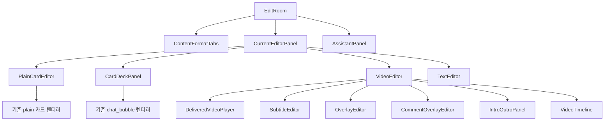
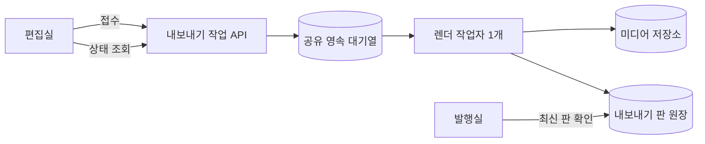

# 편집실 v2 기술 설계와 1차 구현 경계

> 결론: 편집실 v2 전체 개발 진입은 아직 불가하다. 기존 API로는 현재 기능의 정합성·회귀 검증과 화면의 정직화까지 바로 착수할 수 있다. PRD 묶음1의 핵심인 영속 내보내기 대기열과 최신 판 차단은 API·데이터 계약 합의 뒤에만 확정한다.

## 바로가기

- [설계 입력과 결손](#설계-입력과-결손)
- [기존 구현을 진실원으로 삼은 경계](#기존-구현을-진실원으로-삼은-경계)
- [권장 1차 범위](#권장-1차-범위)
- [컴포넌트 설계](#컴포넌트-설계)
- [상태와 저장](#상태와-저장)
- [기존 API 재사용](#기존-api-재사용)
- [요구·흐름·구현 매핑](#요구흐름구현-매핑)
- [합의 전 확정 금지 항목](#합의-전-확정-금지-항목)
- [테스트 설계](#테스트-설계)
- [셀프심문과 레드팀](#셀프심문과-레드팀)

## 설계 입력과 결손

### 읽은 필수 입력

- `wiki/거버넌스/결정.md`의 편집실·영상·Remotion·OD-2026-10-02 항목
- `docs/plan/prd-osmu-editroom-v2-v1.3.0-draft.md`
- `docs/design/prototypes/osmu-editroom-v71-hub-claude-opus-20261001-2335.html`
- 현재 `dashboard/src/app/studio/`, `dashboard/src/components/studio/`, 카드·영상 계약과 렌더 API
- `CLAUDE.md`, `wiki/ops/session-state.md`, 프로젝트와 dashboard 하위 지침

### 추가로 읽은 입력

- `~/.claude/pipeline/product-lane.yaml`의 eng-design 입력·산출 계약
- `standard-eng-design.md`, `standard-dev.md`, `standard-doc-review.md`, `standard-design.md` §16, `artifact-stamp.md`, `benchmarks.md`
- BRAIN `wiki/cto/index.md`, `wiki/cto/ai/idea-Remotion-영상-모션-스킬.md`, `wiki/cto/제품현황/status-openclaw-auto.md`
- Remotion Player·타임라인·렌더 공식 문서와 Playwright 시각·접근성 스냅숏 공식 문서

### 입력 결손

1. `docs/design/README.md`는 정본 위치 안내만 있고 current UI architecture, screen inventory, user flow, capture manifest 연결이 없다.
2. PRD가 지목한 `docs/design/design-spec-editroom-v71.md`가 저장소에 없다. v70 규격만 존재한다.
3. v71 승인 캡처 manifest가 없다. 현재 `docs/design/captures/manifest.json`은 로그인 두 화면만 담는다.
4. v71은 PRD v1.3 이전 시안이다. 템플릿 갤러리, 영상 표지, 글 후보 화면이 없다.

따라서 이 문서는 `현재 구현 대비 차이와 기존 API 1차 범위`를 설계한다. 편집실 v2 전체 FDD 승인본이라고 선언하지 않는다.

## 기존 구현을 진실원으로 삼은 경계

### 유지하는 현재 경계

- 초안 본문과 편집 상태는 `drafts.payload`에 저장한다.
- 카드 덱은 `drafts.payload.cardDeck`, 영상 편집은 `drafts.payload.videoEdit`를 사용한다.
- 카드 PNG는 브라우저가 렌더하고 `/api/images/upload`로 저장한다.
- 영상 컷·자막·훅·CTA·댓글은 `/api/video/subtitle`이 ffmpeg로 결과 파일을 만든다.
- 인트로·아웃트로는 `/api/video/intro-outro` 접수 후 `/api/video/intro-outro/job/{id}`를 조회한다.
- 만료 배달 주소는 `/api/media/resign`으로 다시 서명한다.
- 발행실 이동 전 자동 저장 오류와 revision 충돌은 반드시 해소한다.

### 이번 1차에서 하지 않는 것

- 카드 자유 배치 계약과 템플릿 6종을 임의로 `cardDeck`에 추가하지 않는다.
- 렌더 작업 테이블이나 새 엔드포인트를 합의 없이 만들지 않는다.
- v71에 보인 5레인·음악·전환·자막 스타일을 화면만 먼저 노출하지 않는다.
- v71에 없는 PRD v1.3 화면을 추측 구현하지 않는다.

## 권장 1차 범위

### 이름

`1차 준비 슬라이스: 현재 결과 정직화와 회귀 울타리`

이 범위는 PRD의 `묶음1 내보내기 뼈대` 전체가 아니다. 새 API·DB 결정 없이 code-builder가 바로 만들 수 있고, 다음 묶음에서 기존 기능을 다시 깨뜨리지 않게 하는 선행 슬라이스다.

### 포함

1. 영상 재생 재서명, 컷·자막·훅·CTA·댓글, 인트로·아웃트로의 화면 문구와 계약 주석을 현재 렌더 사실에 맞춘다.
2. 카드 plain·카톡 대화 두 렌더 경로에 미리보기와 PNG 결과 비교 픽스처를 둔다.
3. 영상은 같은 `videoEdit` 입력으로 플레이어 상태와 결과 mp4의 대표 프레임·길이·오디오 존재를 비교하는 통합 검사를 둔다.
4. 운영에서 아직 결과 파일에 들어가지 않는 목소리, 음악, 전환, 영상 표지는 노출하지 않거나 `선택만 저장` 사실을 명시한다.
5. 1440·1024·390에서 편집실의 핵심 조작, 가로 넘침, 44px 누름 영역, 콘솔 오류를 관찰한다.
6. `tests/integrity` 전체와 저장소의 모든 `*.contract.test.*`를 필수 회귀로 고정한다.

### 제외

- X-03의 영속 진행률과 실패 장 재시도
- P-05의 최신 내보내기 판 강제
- 컨테이너 간 공유 렌더 대기열
- 카드 자유 배치와 템플릿 교체
- 영상 5레인·음악·전환·표지
- 글 후보 3개

제외 사유는 `못 해서`가 아니라, 데이터 수명과 API 계약을 결정하지 않고 임시 구조를 만들면 다음 묶음에서 폐기할 가능성이 높기 때문이다.

## 컴포넌트 설계

### 1차 컴포넌트 구조



새 컴포넌트를 많이 늘리지 않는다. `StudioRooms.tsx`의 거대 분기를 분해할 때도 1차 목적은 테스트 가능한 경계 만들기다.

| 컴포넌트 | 책임 | 상태 소유 | 재사용 |
|---|---|---|---|
| `EditRoom` | 형식 전환, 저장 오류, 발행실 인계 | 활성 형식, 전체 저장 상태 | 유지 |
| `PlainCardEditor` | 현재 plain 카드 조작과 미리보기 | 줄, 위치, 비율 | `EditPreview`, `card-deck.ts` 재사용 |
| `CardDeckPanel` | 카톡 덱 직접 편집 | `CardDeck` | 유지 |
| `VideoEditor` | 플레이어, 대본, 오버레이, 인트로·아웃트로 조정 | `VideoEdit`, 재생 위치 | 유지 |
| `DeliveredVideoPlayer` | 서명 URL 재발급과 재생 상태 | resolved URL, renewing, failed | `DeliveredMedia` 함수를 재사용해 분기만 명확히 함 |
| `ExportParityFixture` | 화면 렌더와 결과 파일 비교용 고정 자료 | 없음 | 테스트 전용 신규 |

### 다음 단계에서 필요한 구조



이 다이어그램은 목표 관계만 보여 준다. API 경로·테이블 이름·필드는 아래 선택이 끝나기 전 확정하지 않는다.

## 상태와 저장

### 1차 상태

| 상태 | 소유자 | 저장 위치 | 전이 |
|---|---|---|---|
| 카드 본문·위치·비율 | 편집실 | `drafts.payload` 기존 필드 | 사용자 편집 후 자동 저장 |
| 카톡 덱 | `CardDeckPanel` | `drafts.payload.cardDeck` | 연산마다 revision 증가 |
| 영상 편집 | `VideoEditor` | `drafts.payload.videoEdit` | 연산마다 revision 증가 |
| 재생용 배달 URL | 플레이어 | 메모리, 필요 시 계약에 결과 URL | 만료 감지 후 재서명 |
| 인트로·아웃트로 결과 | `IntroOutroPanel` | `videoEdit.introOutro` | 작업 완료 후 적용, 원본 변경 시 stale |
| 테스트 픽스처 | 테스트 | 저장소 테스트 파일 | 고정 입력, 결정적 결과 |

### 불변식

1. 미리보기와 결과 파일은 같은 편집 입력을 받아야 한다.
2. 결과 파일에 들어가지 않는 기능은 완료처럼 보이면 안 된다.
3. 원본 영상이 바뀌면 이전 인트로·아웃트로 결과를 발행하면 안 된다.
4. 만료 URL 재서명 실패는 빈 화면이 아니라 원인과 다시 시도 행동을 보여야 한다.
5. 자동 저장 중 비어 있는 임시 항목을 조용히 삭제하지 않는다.
6. 테스트 주석과 픽스처에 PR 번호를 해시 기호로 쓰거나 HTML video 태그 문자열을 넣지 않는다. 기존 계약 검사가 이를 오탐한 전력이 있다.

## 기존 API 재사용

| 사용자 행동 | 기존 API | 요청 핵심 | 응답·오류 | 1차 판단 |
|---|---|---|---|---|
| 초안 읽기 | `GET /api/studio/drafts?id={draftId}` | 작업 공간, 초안 ID | 초안 또는 404 | 재사용 |
| 편집 자동 저장 | `POST /api/studio/drafts` | body revision, cardDeck, videoEdit | 200, 409, 4xx 검증 오류 | 재사용 |
| 편집 명령 적용 | `PATCH /api/studio/drafts/{draftId}/editor` | expected revision, change | handoff 또는 409 | 기존 호출부가 쓰는 범위만 재사용 |
| 카드 파일 저장 | `POST /api/images/upload` | PNG 파일 | URL, filename | 재사용 |
| 만료 미디어 재서명 | `POST /api/media/resign` | delivery URL, tenant | 새 file URL | 재사용 |
| 영상 컷·자막·오버레이 렌더 | `POST /api/video/subtitle` | filename, lines, videoEdit | 결과 파일 또는 4xx·429·503 | 재사용 |
| 인트로·아웃트로 접수 | `POST /api/video/intro-outro` | sourceFilename, composition IDs, brand | 202, jobId | 재사용 |
| 인트로·아웃트로 상태 | `GET /api/video/intro-outro/job/{id}` | tenant | 상태, 완료 파일 | 재사용 |

### 새 API 없이 가능한 최대치

- 카드와 영상의 현재 편집 결과 검증
- 한 브라우저 세션 안에서의 진행 표시
- 현재 편집 revision과 로컬 마지막 렌더 revision 비교

마지막 두 항목은 새로고침·컨테이너 재시작을 견디지 못한다. PRD가 요구한 `영속 대기열`과 `발행실 차단`의 완료 증거로 인정하지 않는다.

## 요구·흐름·구현 매핑

### 1차 준비 슬라이스, 매핑 갭 0

| 흐름 | 사용자 단계 | 엔드포인트 | 프론트 컴포넌트 | DB·저장 | 테스트 |
|---|---|---|---|---|---|
| F1 | 오래된 초안을 열고 영상을 재생 | `GET /api/studio/drafts`, `POST /api/media/resign` | `EditRoom` → `VideoEditor` → 플레이어 | `drafts.payload.vid`, URL은 재발급 | 만료 URL 선재서명, 재생 가능 상태, 실패 안내 |
| F2 | 자막을 고치고 한 구간을 컷 | `POST /api/studio/drafts`, `POST /api/video/subtitle` | `SubtitleEditor`, `VideoTimeline` | `drafts.payload.videoEdit.subtitles` | 컷 뒤 길이 감소, 남은 자막 일치 |
| F3 | 훅·CTA·댓글을 넣고 결과 확인 | 같은 영상 API | `OverlayEditor`, `CommentOverlayEditor`, 플레이어 | `videoEdit.overlays`, `videoEdit.comments` | 대표 프레임에서 문구 확인 |
| F4 | 인트로·아웃트로를 고르고 결과 확인 | `POST /api/video/intro-outro`, job GET, draft POST | `IntroOutroPanel`, 플레이어 | `videoEdit.introOutro` | 202, 진행, 완료, stale, tenant 격리 |
| F5 | plain 카드를 고치고 PNG 결과 확인 | draft POST, image upload | `EditPreview` | `drafts.payload` 기존 줄·위치·비율 | 화면과 PNG 글 경계·줄바꿈 비교 |
| F6 | 카톡 카드 사진·대화를 고치고 PNG 결과 확인 | draft POST, image upload | `CardDeckPanel` | `drafts.payload.cardDeck` | 표지 사진·말풍선·CTA 결과 비교 |
| F7 | 세 폭에서 편집하고 발행실로 이동 | 기존 저장·인계 API | `EditRoom`, `AssistantPanel` | 기존 draft 상태 | 1440·1024·390, overflow 0, 콘솔 오류 0 |

### 편집실 v2 전체, 현재 매핑 갭

| 흐름 | 엔드포인트 | 컴포넌트 | DB·저장 | 판정 |
|---|---|---|---|---|
| 카드 자유 배치 | 기존 draft API를 쓸 수 있으나 계약 확장 필요 | 자유 배치 캔버스 없음 | 요소별 좌표·회전·레이어 필드 없음 | 갭 |
| 템플릿 바꾸기 | 기존 draft API 후보 | 갤러리·전후 비교 없음 | 템플릿 변경 이력·복원 계약 없음 | 갭 |
| 영속 내보내기 접수·조회 | 없음 | 내보내기 화면 없음 | 공유 작업 원장 없음 | 갭 |
| 실패 장만 재시도 | 없음 | 진행·재시도 UI 없음 | 장별 작업 상태 없음 | 갭 |
| 최신 내보내기 판으로 발행 차단 | 없음 | 발행실 표시 없음 | 편집 revision과 결과 revision 연결 없음 | 갭 |
| 영상 표지 | 발행 경로 일부만 있음 | 표지 선택기 없음 | 선택 출처·프레임·글 계약 없음 | 갭 |
| 글 후보 3개 | 기존 text API 변경 필요 | 후보 칩·비교 없음 | 후보와 선택·사실 경고 계약 없음 | 갭 |

따라서 전체 user flow 매핑 갭은 0이 아니다. 기술설계 단계 exit gate는 통과시키지 않는다.

## 합의 전 확정 금지 항목

### ⛔ 회수 필요: 영속 내보내기 대기열의 정본

- 배경: PRD 묶음1은 컨테이너 재시작 뒤에도 살아 있는 대기열과 VM 전체 동시 상한을 요구한다. 현재 intro/outro job과 subtitle 상한은 프로세스 메모리라 컨테이너 사이에서 공유되지 않는다.
- 무엇을 정하나: 내보내기 작업과 장별 상태를 어디에 영속화하고 어떤 작업자가 소비할지.
- 옵션 A(추천): 기존 PostgreSQL에 작업·장별 상태 원장을 두고 단일 렌더 작업자가 `FOR UPDATE SKIP LOCKED` 방식으로 가져간다. 고르면 재시작 생존, 테넌트 격리, 발행 최신 판 연결이 한 정본에 선다. 안 고르면 별도 인프라 없이 PRD 묶음1을 닫을 길이 없다.
- 옵션 B: 공유 파일 볼륨에 작업 파일을 쓰고 파일 잠금으로 소비한다. 고르면 DB 변경은 없지만 조회·부분 재시도·고아 회수·감사 추적이 약하고 다중 컨테이너 잠금 오류 비용이 커진다.
- 옵션 C: 외부 큐 서비스를 쓴다. 고르면 큐 기능은 강하지만 새 계정·비용·운영 의존성이 생기고 발행 최신 판 원장은 여전히 DB가 필요하다.
- 추천 근거: 현재 제품의 작업 공간·초안·발행 상태가 PostgreSQL에 있고, 추가 비용 없이 같은 테넌트 경계와 트랜잭션을 재사용할 수 있다. I/O가 무거운 렌더는 별도 작업자가 하고 DB에는 상태와 객체 키만 둔다.

### ⛔ 회수 필요: 화면과 결과 파일을 하나로 만드는 렌더 기준

- 배경: plain 카드는 브라우저 canvas, 카톡 카드는 별도 canvas, v71 사진·글 카드는 DOM으로 표현돼 있다. 자유 배치 뒤에도 세 경로를 유지하면 화면과 PNG가 어긋난다.
- 무엇을 정하나: 카드 화면과 결과 PNG가 공유할 단일 렌더 정의.
- 옵션 A(추천): JSON 요소 모델을 정본으로 두고 접근 가능한 DOM 편집기와 서버 headless 렌더러가 같은 React 장 컴포넌트를 사용한다. 고르면 한글 입력과 접근성을 지키면서 결과를 같은 코드로 그릴 수 있다. 단점은 headless 렌더 부하와 글꼴 고정이 필요하다.
- 옵션 B: 현재 브라우저 canvas 렌더러를 편집 화면까지 확대한다. 고르면 서버 렌더가 단순하지만 한글 직접 편집, 선택 영역, 접근성이 복잡해진다.
- 옵션 C: Fabric 또는 Konva로 전환한다. 고르면 자유 배치 도구는 빨리 얻지만 기존 카드·말풍선·디자인 토큰을 크게 다시 짜야 한다.
- 추천 근거: PRD의 T-1과 v70의 캔버스 라이브러리 기각 사유를 함께 만족하는 안은 A다. Remotion 공식 문서도 미리보기와 렌더에 같은 직렬화 가능한 input props를 전달하라고 권고한다.

### ⛔ 회수 필요: 전체 기술설계 출고물 범위

- 배경: 파이프라인 정본은 eng-design에서 FDD, 폴더 구조, 패턴, 아키텍처, API 계약, 테스트 계획과 구현 작업을 요구한다. 이번 요청은 전문 3문서만 고정했다.
- 무엇을 정하나: 이 3문서를 단계 승격용 전체 설계로 확장할지, 차이 감사용 패키지로 유지할지.
- 옵션 A(추천): 이번 3문서는 감사·1차 범위 정본으로 승인하고, 위 두 설계 결정을 한 뒤 전체 eng-design 6종을 별도 버전으로 만든다. 고르면 잘못된 API·스키마를 먼저 박지 않는다.
- 옵션 B: 지금 3문서를 기존 6종 대신 승인한다. 고르면 빠르지만 파이프라인 artifact lint와 전체 user flow 매핑 조건을 위반한다.
- 추천 근거: 현재 `design-spec-editroom-v71.md`와 캡처 계약도 결손이라, 전체 설계를 승인했다고 하면 다음 개발자가 없는 입력을 있다고 믿게 된다.

## 테스트 설계

### 필수 층

| 층 | 검증 | 종료 증거 |
|---|---|---|
| 순수 계약 | cardDeck·videoEdit 검증, revision, stale 판정 | 관련 Vitest 통과 |
| API 계약 | draft, resign, subtitle, intro/outro 성공·경계·테넌트 격리 | route 계약 테스트 통과 |
| 렌더 통합 | 카드 PNG, 컷·오버레이 mp4, Remotion 합성 | 실제 파일 크기·프레임·길이 검사 |
| 화면 통합 | 편집 조작, 자동 저장, 충돌, 오류 | 컴포넌트 테스트와 E2E |
| 시각 정합 | 편집 캔버스 대 결과 파일 | Playwright `toHaveScreenshot`, 글 경계 2px, 줄바꿈 동일 |
| 전역 회귀 | integrity와 모든 contract | 두 집합 전체 통과 |

### 시각 비교 원칙

- Playwright 공식 visual comparison을 사용한다.
- 픽셀 차이만 보지 않고 글 경계, 줄바꿈, 줄 수를 구조적 단언으로 함께 검사한다.
- Chrome과 WebKit을 분리한다. 기준 스냅숏은 같은 환경에서 만든다.
- 편집 전용 도구막대·선택 테두리·34px 여백은 결과 PNG에 섞이지 않는 픽스처를 둔다.
- 영상은 동일 시각의 브라우저 프레임과 ffmpeg 추출 프레임을 비교한다.

### 반드시 포함할 회귀 집합

```text
dashboard/tests/integrity 전체
저장소의 모든 *.contract.test.* 전체
dashboard/tests/studio/media-resign.contract.test.tsx
dashboard/tests/studio/video-subtitle.contract.test.ts
dashboard/tests/intro-outro-route.contract.test.ts
dashboard/tests/studio/cardnews-generate-edit-publish.contract.test.tsx
```

`관련 테스트만`이라는 표현으로 위 집합을 줄이지 않는다. 전체 빌드·전체 일반 테스트는 code-builder 최종 검증에서 별도 실행하되, 이 설계 작업에서는 호스트 과부하 제약 때문에 실행하지 않았다.

## 벤치마크 반영

| 출처 | 차용 | 다르게 적용 |
|---|---|---|
| [Remotion Player](https://www.remotion.dev/docs/player) | React 입력으로 미리보기를 만드는 경계 | 현재 본편 전체를 Remotion으로 다시 짜지 않고 인트로·아웃트로부터 유지 |
| [Remotion 타임라인 편집기](https://www.remotion.dev/docs/building-a-timeline) | 트랙 상태를 직렬화 가능한 input props로 플레이어에 전달 | 유료 타임라인을 바로 도입하지 않고 기존 `VideoEdit`를 정본으로 유지 |
| [Remotion 타임라인 렌더](https://www.remotion.dev/docs/timeline/render) | 플레이어와 서버 렌더에 같은 입력 전달 | 현재 ffmpeg 본편과 Remotion 모션 구간의 혼합 파이프라인을 보존 |
| [Playwright 시각 비교](https://playwright.dev/docs/test-snapshots) | 기준 이미지와 결과의 자동 비교 | 픽셀 외에 글 경계·줄바꿈 구조 단언을 추가 |
| [Playwright 접근성 스냅숏](https://playwright.dev/docs/aria-snapshots) | 복잡 화면의 역할·이름·상태 회귀 | 시각 스냅숏과 함께 사용해 보기 좋은 화면만 통과하는 것을 막음 |

## 셀프심문과 레드팀

### 셀프심문

- 이 결론이 틀렸다면 가장 그럴듯한 이유는 `기존 drafts JSONB만으로 영속 작업 상태까지 넣을 수 있다`는 주장이다. 그러나 draft 저장과 렌더 작업 소비·고아 회수·동시성은 수명주기가 다르다. 하나의 JSON 문서에 섞으면 작업자가 행 전체 revision과 충돌하고 장별 재시도가 어렵다.
- 가장 하중을 받는 가정은 `현재 구현을 먼저 검증해야 다음 묶음이 안전하다`다. PR 104·105·107이 짧은 기간에 연속으로 들어왔고, 계약 주석과 화면 문구가 이미 실제 렌더 범위와 어긋난다. 이 불일치를 고정하지 않고 UI를 키우면 검증기가 거짓 상태를 승인할 가능성이 높다.
- 스킬 우선 게이트를 지켰는가. `docs` 스킬을 읽고 문서 구조와 검증 규율을 적용했다. 전용 document-generate·diagram 스킬은 현재 Codex 도구 목록에 없어 대체하지 않았다고 명시한다.

### 레드팀

회의적인 회장 관점의 공격은 `또 테스트와 문서만 만들고 내가 본 v71 화면은 안 만드는 것 아닌가`다. 맞는 지적이다. 그래서 1차를 제품 완성으로 부르지 않고 준비 슬라이스로 한정했다. 동시에 카드 자유 배치와 영속 내보내기 대기열은 단순 화면 작업이 아니며, 지금 임의로 만들면 다음 API·DB 합의에서 버릴 코드가 된다. 회장에게 필요한 선택은 대기열 정본과 렌더 기준 두 가지다. 그 선택 뒤에는 카드 자유 배치와 내보내기 화면을 묶음별로 바로 설계할 수 있다.

## 진입 판정

- 이 문서의 1차 준비 슬라이스: 설계상 착수 가능. 단, Stage Controller의 eng-design 승인 전 코드는 시작하지 않는다.
- 편집실 v2 전체 build stage: 진입 불가.
- 막는 조건: 전체 user flow 매핑 갭, 영속 대기열 결정, 단일 렌더 기준 결정, v71 디자인 규격·캡처 결손.

---

STAMP: 2026-10-03 21:04 KST | line: editroom-v2-inputs | model: gpt-5/codex | agent: tech-architect | skill: docs | 근거: PRD v1.3, v71, 현재 코드, Remotion·Playwright 공식 문서 | 고민: 바로 만들 수 있는 것과 합의 없이 만들면 안 되는 것을 같은 `1차`로 섞지 않았다.

RUBRIC_SCORE: accuracy=5/5 traceability=5/5 completeness=4/5 usability=4/5 presentation=4/5 total=22/25
WEAKEST_LINE: 전체 eng-design 6종과 v71 디자인 규격이 없어서 새 API·스키마를 구현 명세 수준으로 확정하지 않았다.
PRESENTATION_CHECK: 툴콜 태그 잔재 없음 / Markdown 표 7개와 Mermaid SVG 2개 Chrome headless 실제 렌더 확인 / em dash 0개

KNOWLEDGE_QUERY: BRAIN CTO 허브에서 Remotion·제품현황 조회, 저장소 결정·PRD·v71·현재 컴포넌트·API·테스트 검색, Remotion·Playwright 공식 문서 웹검색
HITS_USED: BRAIN Remotion의 재현성과 디자인 토큰 강제 원칙, Remotion 공식의 동일 input props 원칙, Playwright 공식의 시각·접근성 스냅숏을 채택
HITS_REJECTED: BRAIN 제품현황은 8월 상태라 현재 구현·배포 사실 판정에는 사용하지 않음. Remotion 유료 타임라인은 비용·라이선스 결정 전이라 도입안에서 제외
CONFLICTS: v71은 5레인 전체 목표를 보여 주지만 PRD 운영 묶음1·2는 영상 v70 유지다. 구현 순서는 PRD를 따르고 v71은 목표 화면으로만 사용

SKILLS_USED: docs, 문서 구조·검증·독자 중심 작성에 사용. 연결 도구 부재로 저장소 Markdown에 적용
SKILLS_SKIPPED: diagram, 별도 다이어그램 파일을 요구하지 않아 Mermaid를 문서 안에 작성. document-generate, 현재 Codex 세션에 해당 스킬이 없음
SOURCES/MODEL: gpt-5/codex | 내부: `wiki/거버넌스/결정.md`, PRD v1.3, v71 HTML, `dashboard/src/components/studio/*`, `dashboard/src/lib/studio/*`, `dashboard/src/app/api/*`, BRAIN CTO 문서 | 웹: https://www.remotion.dev/docs/player, https://www.remotion.dev/docs/building-a-timeline, https://www.remotion.dev/docs/timeline/render, https://playwright.dev/docs/test-snapshots, https://playwright.dev/docs/aria-snapshots
