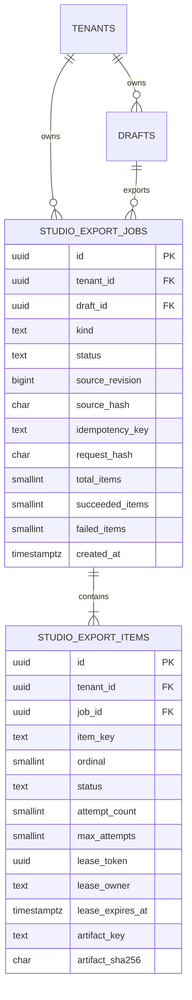
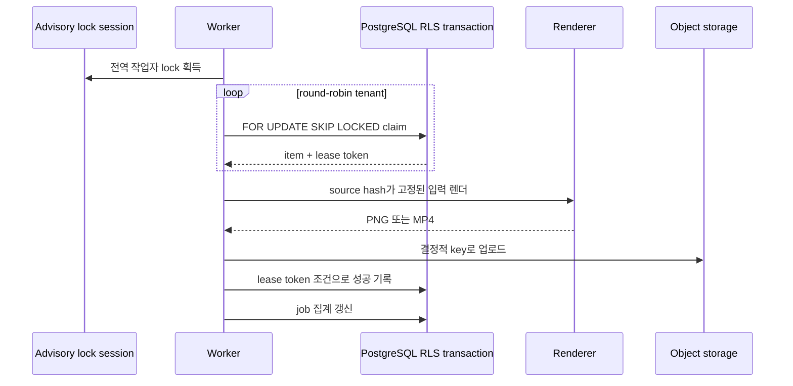

# 편집실 v2 영속 내보내기 대기열

> STAMP: 2026-10-04 07:12 KST | model=gpt-5-codex | agent=tech-architect | skill=docs | 근거=https://www.postgresql.org/docs/current/sql-select.html, https://www.postgresql.org/docs/current/ddl-rowsecurity.html | 고민=외부 큐 없이도 여러 컨테이너에서 중복 렌더와 테넌트 누출을 막는 최소 영속 설계

## 바로가기

- [결론](#결론)
- [현재 구현과 변경 경계](#현재-구현과-변경-경계)
- [데이터 모델](#데이터-모델)
- [마이그레이션 초안](#마이그레이션-초안)
- [테넌트 격리](#테넌트-격리)
- [렌더 작업자](#렌더-작업자)
- [API 계약](#api-계약)
- [발행실 최신 판 차단](#발행실-최신-판-차단)
- [실패·복구·롤백](#실패복구롤백)
- [수용 기준과 테스트](#수용-기준과-테스트)
- [벤치마크와 설계 판단](#벤치마크와-설계-판단)

## 결론

PostgreSQL의 `studio_export_jobs`와 `studio_export_items`를 내보내기 진실원으로 둔다. API는 접수와 조회만 하고, 하나의 렌더 작업자가 장 작업을 `FOR UPDATE SKIP LOCKED`로 임대한다. 장별 상태와 결과 object key를 보존하므로 실패한 장만 재시도할 수 있다.

작업자 단일성은 PostgreSQL advisory lock으로 보장한다. 작업 행 자체는 테넌트 RLS를 통과한 트랜잭션에서만 읽고 쓴다. 공유 볼륨, 프로세스 메모리 큐, RabbitMQ, Kafka는 추가하지 않는다.

발행실 진입은 현재 편집 판의 정규화 hash와 성공한 최신 내보내기의 `source_hash`가 같을 때만 허용한다. 빈 장, 진행 중, 실패, 오래된 내보내기는 각각 명시적인 차단 코드와 복구 행동을 반환한다.

## 현재 구현과 변경 경계

| 영역 | 현재 진실원 | 문제 | 변경 |
|---|---|---|---|
| 카드 PNG | `dashboard/src/lib/card-deck.ts` | 요청 흐름에서 순차 렌더, 장별 재시도 없음 | 영속 item 단위 렌더 |
| 영상 자막 | `dashboard/src/app/api/video/subtitle/route.ts` | 긴 동기 요청 | 같은 job/item 상태기계로 이전 가능 |
| 인트로·아웃트로 | `dashboard/src/lib/intro-outro-jobs.ts` | 테넌트 파일시스템 JSON, 컨테이너 간 공유 안 됨 | PostgreSQL 작업 장부로 이전 |
| 렌더 상한 | 프로세스 메모리 슬롯 | 컨테이너마다 별도라 전역 상한 아님 | advisory lock을 가진 작업자 1개 |
| 발행 이동 | `dashboard/src/app/api/studio/drafts/[draftId]/enqueue/route.ts` | 최신 내보내기 여부를 보지 않음 | 같은 트랜잭션에서 최신 판 확인 뒤 차단 |
| 테넌트 격리 | `withTenant()` + `osmu_service` RLS | 새 표가 정책 배열에 없음 | 두 표를 RLS 목록에 추가 |

## 데이터 모델

### ERD



### `studio_export_jobs`

| 열 | 형식 | 필수·제약 | 의미 |
|---|---|---|---|
| `id` | UUID | PK, 애플리케이션 생성 | 외부 공개 작업 ID |
| `tenant_id` | UUID | FK `tenants`, NOT NULL | RLS 경계 |
| `draft_id` | UUID | 복합 FK `(tenant_id,id)` | 다른 테넌트 초안 참조 차단 |
| `member_id` | TEXT | NOT NULL | 접수자 감사 정보 |
| `kind` | TEXT | `card_deck`, `video` | 결과 형식 |
| `status` | TEXT | 아래 상태 집합 | 집계 상태 |
| `source_revision` | BIGINT | `>=0` | 접수 시 편집 revision |
| `source_hash` | CHAR(64) | 소문자 SHA-256 | 실제 정규화 입력 판 |
| `request_payload` | JSONB | NOT NULL | 비밀·서명 URL을 뺀 접수 사본 |
| `idempotency_key` | TEXT | 길이 `1..255` | 중복 접수 방지 |
| `request_hash` | CHAR(64) | NOT NULL | 같은 key의 다른 요청 감지 |
| `total_items` | SMALLINT | `1..100` | 작업 항목 수 |
| `succeeded_items` | SMALLINT | 기본 0 | 성공 수 |
| `failed_items` | SMALLINT | 기본 0 | 최종 실패 수 |
| `error_code` | TEXT | nullable | job 수준 공개 오류 코드 |
| `error_detail` | TEXT | nullable, 최대 1,000자 | 비밀 제거 운영 진단 |
| 시각 | TIMESTAMPTZ | created·updated 필수, started·finished nullable | 수명주기 |

상태는 `queued`, `processing`, `succeeded`, `partially_failed`, `failed`, `cancelled`다. `succeeded_items + failed_items <= total_items`를 CHECK로 강제한다.

유일 제약:

- `(tenant_id, id)`
- `(tenant_id, member_id, kind, idempotency_key)`
- `(tenant_id, draft_id, kind, source_hash, id)`는 유일 제약이 아니다. 같은 판의 의도적 재내보내기를 허용한다.

### `studio_export_items`

| 열 | 형식 | 필수·제약 | 의미 |
|---|---|---|---|
| `id` | UUID | PK | 장 또는 영상 항목 ID |
| `tenant_id` | UUID | NOT NULL | RLS 경계 |
| `job_id` | UUID | 복합 FK | 부모 작업 |
| `item_key` | TEXT | 장 ID 또는 `video-main` | 안정 항목 식별자 |
| `ordinal` | SMALLINT | `0..99` | 표시·집계 순서 |
| `status` | TEXT | `queued`, `processing`, `succeeded`, `failed`, `cancelled` | 항목 상태 |
| `source_hash` | CHAR(64) | NOT NULL | 항목별 입력 hash |
| `attempt_count` | SMALLINT | 기본 0, `0..max_attempts` | claim 횟수 |
| `max_attempts` | SMALLINT | 기본 3, `1..5` | 자동 재시도 상한 |
| `available_at` | TIMESTAMPTZ | 기본 now | 다음 claim 가능 시각 |
| `lease_token` | UUID | processing일 때 필수 | 늦은 작업자의 완료 쓰기 차단 |
| `lease_owner` | TEXT | processing일 때 필수 | 운영 추적 |
| `lease_expires_at` | TIMESTAMPTZ | processing일 때 필수 | 고아 판정 |
| `heartbeat_at` | TIMESTAMPTZ | nullable | 긴 렌더 생존 신호 |
| `artifact_key` | TEXT | 성공일 때 필수 | object storage 내부 key |
| `artifact_sha256` | CHAR(64) | 성공일 때 필수 | 결과 무결성 |
| `content_type` | TEXT | 성공일 때 필수 | `image/png`, `video/mp4` |
| `byte_size` | BIGINT | 성공일 때 `>0` | 결과 크기 |
| `width`, `height` | INTEGER | 카드 성공일 때 필수 | 픽셀 규격 |
| `error_code` | TEXT | 실패 시 필수 | 분기 가능한 코드 |
| `error_detail` | TEXT | nullable, 최대 1,000자 | 비밀 제거 진단 |
| 시각 | TIMESTAMPTZ | created·updated 필수, started·finished nullable | 수명주기 |

유일 제약:

- `(tenant_id, id)`
- `(tenant_id, job_id, item_key)`
- `(tenant_id, job_id, ordinal)`

### 인덱스

```sql
CREATE INDEX idx_studio_export_items_claim
  ON studio_export_items(available_at, created_at, id)
  WHERE status = 'queued';

CREATE INDEX idx_studio_export_items_expired_lease
  ON studio_export_items(lease_expires_at, id)
  WHERE status = 'processing';

CREATE INDEX idx_studio_export_items_job_status
  ON studio_export_items(tenant_id, job_id, status, ordinal);

CREATE INDEX idx_studio_export_jobs_draft_latest
  ON studio_export_jobs(tenant_id, draft_id, kind, created_at DESC);

CREATE INDEX idx_studio_export_jobs_active
  ON studio_export_jobs(tenant_id, status, created_at)
  WHERE status IN ('queued', 'processing');
```

claim 인덱스는 전역 작업자가 아니라 테넌트 트랜잭션 안에서 사용되므로 실제 조건에는 `tenant_id`가 RLS로 붙는다. 구현 전 `EXPLAIN (ANALYZE, BUFFERS)`로 tenant 조건을 포함한 index scan을 확인한다.

## 마이그레이션 초안

### 파일과 manifest

- 신규 파일: `dashboard/db/migrations/20261004_010_studio_export_queue.sql`
- manifest: `dashboard/db/migration-manifest.tsv`에 `expand-export-queue` 단계와 실제 SHA-256을 추가한다.
- 동기화: 같은 커밋에서 `dashboard/db/schema.sql`에 두 표를 추가하고 `dashboard/db/rls.sql`의 tenant policy 목록에 두 표를 추가한다.

문서에는 초안을 싣되 이번 기술설계 단계에서는 SQL 파일을 만들지 않는다.

### SQL 초안

```sql
BEGIN;

CREATE TABLE studio_export_jobs (
  id UUID PRIMARY KEY,
  tenant_id UUID NOT NULL REFERENCES tenants(id) ON DELETE CASCADE,
  draft_id UUID NOT NULL,
  member_id TEXT NOT NULL,
  kind TEXT NOT NULL CHECK (kind IN ('card_deck', 'video')),
  status TEXT NOT NULL DEFAULT 'queued'
    CHECK (status IN ('queued','processing','succeeded','partially_failed','failed','cancelled')),
  source_revision BIGINT NOT NULL CHECK (source_revision >= 0),
  source_hash CHAR(64) NOT NULL CHECK (source_hash ~ '^[0-9a-f]{64}$'),
  request_payload JSONB NOT NULL,
  idempotency_key TEXT NOT NULL CHECK (char_length(idempotency_key) BETWEEN 1 AND 255),
  request_hash CHAR(64) NOT NULL CHECK (request_hash ~ '^[0-9a-f]{64}$'),
  total_items SMALLINT NOT NULL CHECK (total_items BETWEEN 1 AND 100),
  succeeded_items SMALLINT NOT NULL DEFAULT 0 CHECK (succeeded_items >= 0),
  failed_items SMALLINT NOT NULL DEFAULT 0 CHECK (failed_items >= 0),
  error_code TEXT,
  error_detail TEXT CHECK (error_detail IS NULL OR char_length(error_detail) <= 1000),
  created_at TIMESTAMPTZ NOT NULL DEFAULT now(),
  updated_at TIMESTAMPTZ NOT NULL DEFAULT now(),
  started_at TIMESTAMPTZ,
  finished_at TIMESTAMPTZ,
  UNIQUE (tenant_id, id),
  UNIQUE (tenant_id, member_id, kind, idempotency_key),
  FOREIGN KEY (tenant_id, draft_id) REFERENCES drafts(tenant_id, id) ON DELETE CASCADE,
  CHECK (succeeded_items + failed_items <= total_items)
);

CREATE TABLE studio_export_items (
  id UUID PRIMARY KEY,
  tenant_id UUID NOT NULL REFERENCES tenants(id) ON DELETE CASCADE,
  job_id UUID NOT NULL,
  item_key TEXT NOT NULL CHECK (char_length(item_key) BETWEEN 1 AND 160),
  ordinal SMALLINT NOT NULL CHECK (ordinal BETWEEN 0 AND 99),
  status TEXT NOT NULL DEFAULT 'queued'
    CHECK (status IN ('queued','processing','succeeded','failed','cancelled')),
  source_hash CHAR(64) NOT NULL CHECK (source_hash ~ '^[0-9a-f]{64}$'),
  attempt_count SMALLINT NOT NULL DEFAULT 0,
  max_attempts SMALLINT NOT NULL DEFAULT 3 CHECK (max_attempts BETWEEN 1 AND 5),
  available_at TIMESTAMPTZ NOT NULL DEFAULT now(),
  lease_token UUID,
  lease_owner TEXT,
  lease_expires_at TIMESTAMPTZ,
  heartbeat_at TIMESTAMPTZ,
  artifact_key TEXT,
  artifact_sha256 CHAR(64),
  content_type TEXT,
  byte_size BIGINT,
  width INTEGER,
  height INTEGER,
  error_code TEXT,
  error_detail TEXT CHECK (error_detail IS NULL OR char_length(error_detail) <= 1000),
  created_at TIMESTAMPTZ NOT NULL DEFAULT now(),
  updated_at TIMESTAMPTZ NOT NULL DEFAULT now(),
  started_at TIMESTAMPTZ,
  finished_at TIMESTAMPTZ,
  UNIQUE (tenant_id, id),
  UNIQUE (tenant_id, job_id, item_key),
  UNIQUE (tenant_id, job_id, ordinal),
  FOREIGN KEY (tenant_id, job_id)
    REFERENCES studio_export_jobs(tenant_id, id) ON DELETE CASCADE,
  CHECK (attempt_count BETWEEN 0 AND max_attempts),
  CHECK (
    status <> 'processing'
    OR (lease_token IS NOT NULL AND lease_owner IS NOT NULL AND lease_expires_at IS NOT NULL)
  ),
  CHECK (
    status <> 'succeeded'
    OR (artifact_key IS NOT NULL AND artifact_sha256 IS NOT NULL
        AND content_type IS NOT NULL AND byte_size > 0)
  )
);

CREATE INDEX idx_studio_export_items_claim
  ON studio_export_items(available_at, created_at, id) WHERE status = 'queued';
CREATE INDEX idx_studio_export_items_expired_lease
  ON studio_export_items(lease_expires_at, id) WHERE status = 'processing';
CREATE INDEX idx_studio_export_items_job_status
  ON studio_export_items(tenant_id, job_id, status, ordinal);
CREATE INDEX idx_studio_export_jobs_draft_latest
  ON studio_export_jobs(tenant_id, draft_id, kind, created_at DESC);
CREATE INDEX idx_studio_export_jobs_active
  ON studio_export_jobs(tenant_id, status, created_at)
  WHERE status IN ('queued', 'processing');

COMMIT;
```

이 마이그레이션은 additive다. 기존 행을 다시 쓰거나 잠그는 backfill이 없고, 두 표의 생성과 인덱스 생성만 수행한다.

## 테넌트 격리

### RLS

`dashboard/db/rls.sql`의 tenant 배열에 아래를 추가한다.

```text
studio_export_jobs
studio_export_items
```

두 표 모두 `ENABLE ROW LEVEL SECURITY`, `FORCE ROW LEVEL SECURITY`를 사용한다. 기존 `tenant_iso` 정책을 그대로 적용한다.

```sql
USING (tenant_id = current_setting('app.tenant_id', true)::uuid)
WITH CHECK (tenant_id = current_setting('app.tenant_id', true)::uuid)
```

API와 repository는 모든 고객 데이터 쿼리를 `withTenant(tenantId, tx => ...)` 안에서 실행한다. URL·본문의 `tenant_id`는 신뢰하지 않고 `effectiveTenantId()` 결과만 사용한다.

### 작업자의 테넌트 순회

작업자는 RLS 우회 계정으로 queue row를 직접 claim하지 않는다.

1. bare 운영 연결로 `tenants`의 활성 ID 목록만 읽는다. `tenants`는 현재 RLS 대상이 아니다.
2. 마지막으로 서비스한 tenant 이후부터 round-robin으로 순회한다.
3. 각 tenant를 `withTenant()`로 열고 한 항목만 claim한다.
4. claim 성공 시 순회를 멈추고 렌더한다.
5. 데이터 row의 본문은 항상 RLS가 강제된 `osmu_service` role에서만 읽는다.

다른 테넌트의 `draft_id`, `job_id`, `asset_id`를 섞어도 복합 FK와 RLS 중 하나에서 반드시 거부된다.

## 렌더 작업자

### 단일 작업자와 동시 상한

- 프로세스 시작 시 전용 PostgreSQL session으로 `pg_try_advisory_lock(hashtextextended('studio-export-render-worker-v1', 0))`을 얻는다.
- lock을 못 얻은 인스턴스는 render loop를 시작하지 않고 health 상태를 `standby`로 둔다.
- lock session이 끊기면 PostgreSQL이 자동 해제한다.
- `EXPORT_RENDER_CONCURRENCY`의 기본값과 허용값은 1이다. 실측 용량 계획과 별도 승인 전에는 2 이상을 허용하지 않는다.
- HTTP 서버 프로세스 안의 fire-and-forget promise로 돌리지 않는다. 같은 배포 이미지의 별도 worker entry로 실행한다.

### claim SQL

```sql
WITH candidate AS (
  SELECT id
  FROM studio_export_items
  WHERE tenant_id = current_setting('app.tenant_id')::uuid
    AND status = 'queued'
    AND available_at <= now()
  ORDER BY available_at, created_at, id
  FOR UPDATE SKIP LOCKED
  LIMIT 1
)
UPDATE studio_export_items AS item
SET status = 'processing',
    attempt_count = item.attempt_count + 1,
    lease_token = gen_random_uuid(),
    lease_owner = $1,
    lease_expires_at = now() + interval '5 minutes',
    heartbeat_at = now(),
    started_at = COALESCE(item.started_at, now()),
    updated_at = now()
FROM candidate
WHERE item.id = candidate.id
RETURNING item.*;
```

claim transaction은 즉시 commit한다. 렌더 중 row lock을 잡고 있지 않는다. 완료 update에는 `id`, `tenant_id`, `status='processing'`, `lease_token` 네 조건을 모두 걸어 임대가 끝난 옛 작업자가 새 결과를 덮지 못하게 한다.

### 실행 흐름



### heartbeat와 고아 회수

- heartbeat는 15초마다 `heartbeat_at`과 `lease_expires_at=now()+5 minutes`를 갱신한다.
- 30초마다 회수기를 실행한다.
- `processing AND lease_expires_at < now()`인 항목을 찾는다.
- `attempt_count < max_attempts`면 `queued`, 새 `available_at`, lease 필드 null로 되돌린다.
- 상한에 닿으면 `failed`, `error_code='LEASE_EXPIRED'`로 닫는다.
- 카드 한 장의 hard timeout은 120초다. 영상은 요청 payload의 검증된 제한 안에서 별도 timeout을 두되 lease보다 짧아야 한다.

### 재시도

| 오류 분류 | 예 | 자동 재시도 | 대기 |
|---|---|---|---|
| 일시적 | object storage timeout, Chromium crash, DB 연결 끊김 | 최대 3회 | 5초, 30초, 120초 |
| 입력 결정적 | JSON 검증 실패, 빈 장, 잘못된 자산 | 없음 | 사용자가 수정 뒤 새 내보내기 |
| 자원 결정적 | 글꼴 누락, 지원하지 않는 MIME | 없음 | 운영 수정 뒤 실패 장 수동 재시도 |
| 임대 만료 | worker 강제 종료 | 남은 횟수만큼 | 즉시 또는 5초 |

수동 재시도는 실패 item만 새 `lease_token=null`, `status=queued`, `available_at=now()`로 바꾼다. `attempt_count`는 감사 정보로 유지하고 `max_attempts`를 1 늘리되 최대 5를 넘지 않는다.

### crash 멱등성

artifact key에 job ID, item key, source hash를 포함한다. 업로드 성공 뒤 DB 완료 기록 전에 worker가 죽어도 다음 시도는 같은 key에 같은 내용을 덮어쓴다. DB 완료 update는 lease token이 맞을 때만 성공한다.

## API 계약

공통 인증은 현재 Studio route와 같은 `effectiveTenantId()`를 사용한다. 응답에 내부 object key, filesystem 경로, 서명되지 않은 자산 URL, stack trace를 싣지 않는다.

### 1. 내보내기 접수

`POST /api/studio/drafts/{draftId}/exports`

필수 header:

```http
Idempotency-Key: 1..255 characters
Content-Type: application/json
```

요청:

```json
{
  "kind": "card_deck",
  "expected_source_revision": 13,
  "expected_source_hash": "64자리 소문자 16진수",
  "item_keys": null
}
```

- `item_keys=null`은 모든 장이다.
- 일반 접수에서는 일부 장만 선택할 수 없다. 실패 장 재시도 API만 부분 선택을 허용한다.
- 서버가 현재 v3 JSON을 정규화해 hash를 다시 계산한다. 클라이언트 값만 믿지 않는다.

신규 응답 `202`:

```json
{
  "export_id": "2f6b7f3f-73b4-4dfa-9d78-b4f6d99fe639",
  "draft_id": "f6c4a61c-3d95-4ad0-aade-9073ed4c02a7",
  "kind": "card_deck",
  "status": "queued",
  "source_revision": 13,
  "source_hash": "...",
  "total_items": 9,
  "status_url": "/api/studio/drafts/f6c4.../exports/2f6b..."
}
```

같은 key와 같은 request hash면 기존 작업을 `200`으로 반환한다. 같은 key와 다른 요청이면 `409 IDEMPOTENCY_KEY_REUSED`다.

### 2. 상태 조회

`GET /api/studio/drafts/{draftId}/exports/{exportId}`

응답 `200`:

```json
{
  "export_id": "2f6b...",
  "status": "processing",
  "source_revision": 13,
  "source_hash": "...",
  "progress": { "completed": 3, "total": 9 },
  "items": [
    {
      "item_key": "slide_01...",
      "ordinal": 0,
      "status": "succeeded",
      "attempt_count": 1,
      "artifact_url": "/api/studio/drafts/f6c4.../exports/2f6b.../items/slide_01..."
    }
  ],
  "created_at": "2026-10-04T07:12:00+09:00",
  "updated_at": "2026-10-04T07:12:12+09:00"
}
```

`artifact_url`은 성공 item에만 있고, 호출 시점에 접근 권한을 다시 검사해 짧은 수명의 배달 URL을 생성한다.

### 3. 실패 장 재시도

`POST /api/studio/drafts/{draftId}/exports/{exportId}/retry`

요청:

```json
{
  "item_keys": ["slide_01J9ZQ9V6C1PM3S9K44XJ7Z0G2"]
}
```

응답 `202`:

```json
{
  "export_id": "2f6b...",
  "status": "queued",
  "requeued_item_keys": ["slide_01J9ZQ9V6C1PM3S9K44XJ7Z0G2"]
}
```

- 실패한 item만 허용한다.
- 요청 item이 현재 draft의 다른 source hash에 해당하면 `409 EXPORT_SOURCE_STALE`다. 사용자는 새 전체 내보내기를 해야 한다.
- 이미 성공·처리 중인 item을 포함하면 전체 요청을 `409 ITEM_NOT_RETRYABLE`로 거부한다.

### 4. 최신 판 확인

`GET /api/studio/drafts/{draftId}/exports/latest?kind=card_deck`

응답 `200`:

```json
{
  "draft_id": "f6c4...",
  "kind": "card_deck",
  "current_source_revision": 13,
  "current_source_hash": "...",
  "latest_export": {
    "export_id": "2f6b...",
    "status": "succeeded",
    "source_revision": 13,
    "source_hash": "...",
    "finished_at": "2026-10-04T07:13:10+09:00"
  },
  "is_latest": true,
  "blocker": null
}
```

`blocker` 값:

- `NO_SUCCESSFUL_EXPORT`
- `EXPORT_IN_PROGRESS`
- `EXPORT_FAILED`
- `EXPORT_SOURCE_STALE`
- `EMPTY_SLIDE`

`EMPTY_SLIDE`면 `first_empty_slide`에 0 기반 order와 사람용 1 기반 번호를 함께 준다.

### 오류 카탈로그

| HTTP | code | 조건 | 복구 |
|---:|---|---|---|
| 400 | `INVALID_EXPORT_REQUEST` | schema·kind·item 오류 | 요청 수정 |
| 401 | `NO_TENANT` | 인증 테넌트 없음 | 로그인·워크스페이스 선택 |
| 403 | `EXPORT_FORBIDDEN` | 권한 없음 | 권한 확인 |
| 404 | `DRAFT_NOT_FOUND` | 같은 테넌트의 draft 없음 | 목록 복귀 |
| 404 | `EXPORT_NOT_FOUND` | 같은 테넌트의 job 없음 | 최신 조회 |
| 409 | `REVISION_CONFLICT` | 기대 revision 불일치 | 최신 draft 다시 불러오기 |
| 409 | `SOURCE_HASH_CONFLICT` | 기대 hash 불일치 | 최신 draft 다시 불러오기 |
| 409 | `EMPTY_SLIDE` | 빈 장 존재 | 첫 빈 장으로 이동 |
| 409 | `IDEMPOTENCY_KEY_REUSED` | 같은 key, 다른 본문 | 새 key로 의도 확인 후 재접수 |
| 409 | `ITEM_NOT_RETRYABLE` | 실패 아닌 항목 재시도 | 상태 새로고침 |
| 409 | `EXPORT_SOURCE_STALE` | 이전 판 item 재시도 | 새 전체 내보내기 |
| 413 | `CARD_DECK_TOO_LARGE` | 64 KiB 초과 | 요소 정리 |
| 422 | `ASSET_NOT_AVAILABLE` | 자산 소유권·형식 실패 | 자산 교체 |
| 429 | `EXPORT_ALREADY_ACTIVE` | 같은 draft·kind의 활성 job 존재 | 현재 job 대기 |
| 500 | `EXPORT_ENQUEUE_FAILED` | DB 내부 실패 | 같은 idempotency key로 재요청 |
| 503 | `EXPORT_WORKER_UNAVAILABLE` | 작업자 health 비정상 | 잠시 뒤 재시도 |

## 발행실 최신 판 차단

### 서버 강제

현재 `POST /api/studio/drafts/{draftId}/enqueue`의 queue write 앞에서 같은 `withTenant()` 트랜잭션으로 아래를 검사한다.

1. 현재 draft의 cardDeckV3 또는 videoEdit를 정규화해 hash 계산.
2. 빈 카드 장 검사. 있으면 `409 EMPTY_SLIDE`와 첫 빈 장 반환.
3. 같은 `tenant_id + draft_id + kind + source_hash`의 `succeeded` job 조회.
4. 없으면 최신 상태에 따라 `LATEST_EXPORT_REQUIRED`, `EXPORT_IN_PROGRESS`, `EXPORT_FAILED`, `EXPORT_SOURCE_STALE` 중 하나 반환.
5. 성공 job의 모든 item artifact가 존재하고 sha256 메타가 있는지 확인.
6. 확인이 끝난 job ID와 source hash를 발행 queue payload에 함께 기록.

클라이언트의 `is_latest=true`는 신뢰하지 않는다. 검사와 발행 queue insert를 같은 transaction 안에서 수행해 검사 직후 draft 변경이 끼어들 틈을 막는다. draft revision을 조건부 update 또는 row lock으로 고정한다.

### UI 연결

- 머리 줄 `내보내기`는 접수 API를 호출하고 `3 / 9장` 진행을 상태 조회로 표시한다.
- 실패 장은 항목 목록에서 원인과 `실패한 장 다시 내보내기`를 제공한다.
- `발행실로 이동`은 최신 판 확인 응답을 먼저 보여주되, 실제 차단은 enqueue route가 다시 수행한다.
- `EMPTY_SLIDE`는 해당 썸네일을 선택하고 초점을 첫 편집 가능한 요소로 보낸다.

## 실패·복구·롤백

### 배포 순서

1. expand migration으로 표·인덱스·RLS를 추가한다.
2. repository와 API를 shadow write로 배포한다. 기존 렌더 경로는 유지한다.
3. worker를 concurrency 1로 배포하고 health·queue age를 관찰한다.
4. 카드 내보내기 UI를 새 queue로 전환한다.
5. 발행실 최신 판 차단을 켠다.
6. 운영 증거가 쌓인 뒤 인트로·아웃트로와 영상 렌더를 같은 queue로 옮긴다.
7. 파일 기반 job 기록 제거는 별도 contract 변경으로 한다.

### 애플리케이션 롤백

- 구버전 앱은 신규 표를 무시하므로 코드 롤백이 가능하다.
- 롤백 시 신규 접수만 중지하고 worker는 이미 claim한 item을 안전하게 완료하거나 lease 만료로 돌린다.
- additive 표는 자동으로 drop하지 않는다. queued·processing row와 artifact provenance를 보존한다.
- 긴급 중지 시 worker health를 drain으로 바꾸고 새 claim을 멈춘다. processing item은 timeout 뒤 회수한다.

### 데이터 롤백

표 drop은 자동 rollback SQL에 넣지 않는다. retention 기간과 발행 참조 여부를 확인한 뒤 별도 승인된 contract migration으로만 삭제한다. 삭제 전 table dump, row count, 최신 성공 job 참조 수를 증거로 남긴다.

### 관측 지표

- queue depth, oldest queued age, processing count.
- item 성공률, 시도 횟수 분포, 오류 코드별 실패율.
- p50·p95 장 렌더 시간, artifact upload 시간.
- lease expired 수, advisory lock standby 수.
- latest export 차단 코드별 횟수.
- 테넌트별 queue wait의 p95로 공정성 이상을 탐지한다.

## 수용 기준과 테스트

| ID | Given | When | Then | 자동화 위치 |
|---|---|---|---|---|
| AC-QUEUE-01 | 두 worker가 같은 queued item을 본다 | 동시에 claim한다 | 한 worker만 lease token을 받는다 | `dashboard/src/lib/studio/export-queue.repository.contract.test.ts` |
| AC-QUEUE-02 | 다른 테넌트의 job ID를 안다 | status·retry를 요청한다 | 404이고 행 내용이 노출되지 않는다 | route RLS 통합 테스트 |
| AC-QUEUE-03 | worker가 processing 중 종료된다 | lease가 만료된다 | item이 재대기 또는 최종 실패로 전이된다 | worker 계약 테스트 |
| AC-QUEUE-04 | 업로드 뒤 DB 완료 전 죽는다 | 같은 item을 재실행한다 | 같은 object key를 덮고 결과가 하나다 | object storage fake 통합 테스트 |
| AC-QUEUE-05 | 9장 중 4번째만 실패했다 | retry API를 호출한다 | 4번째만 queued이고 성공 8장은 유지된다 | export route 계약 테스트 |
| AC-QUEUE-06 | 같은 idempotency key·같은 본문이다 | 접수를 반복한다 | 같은 job을 반환한다 | export route 계약 테스트 |
| AC-QUEUE-07 | 같은 key·다른 본문이다 | 접수를 반복한다 | 409 `IDEMPOTENCY_KEY_REUSED`다 | export route 계약 테스트 |
| AC-QUEUE-08 | 편집 뒤 source hash가 바뀌었다 | 발행실 enqueue를 호출한다 | 409 `EXPORT_SOURCE_STALE`다 | editor handoff 계약 테스트 |
| AC-QUEUE-09 | 중간 빈 장이 있다 | export나 발행 enqueue를 호출한다 | 첫 빈 장 위치와 함께 차단된다 | export·handoff 계약 테스트 |
| AC-QUEUE-10 | 성공 job의 hash가 현재 draft와 같다 | 발행 enqueue를 호출한다 | export ID와 hash가 queue payload에 고정된다 | handoff 통합 테스트 |
| AC-QUEUE-11 | 두 컨테이너가 worker로 시작한다 | advisory lock을 경쟁한다 | 한 개만 active, 나머지는 standby다 | PostgreSQL 통합 테스트 |

## 벤치마크와 설계 판단

### 참고한 사례

1. [PostgreSQL SELECT locking clause](https://www.postgresql.org/docs/current/sql-select.html): `SKIP LOCKED`가 일반 조회의 일관된 뷰에는 맞지 않지만 queue-like table의 다중 소비자 충돌 회피에 적합하다는 경계를 채택했다.
2. [PostgreSQL UPDATE](https://www.postgresql.org/docs/current/sql-update.html): 작은 batch를 `FOR UPDATE SKIP LOCKED`로 고르고 update하는 공식 패턴을 claim과 orphan 회수에 적용했다.
3. [PostgreSQL Row Security](https://www.postgresql.org/docs/current/ddl-rowsecurity.html): policy가 없으면 default deny이고 table owner 우회 가능성이 있다는 점을 반영해 `FORCE RLS`와 `osmu_service` role을 유지했다.
4. [Polotno server image generation](https://polotno.com/docs/server-side-image-generation-with-node-js): server export에서 font·asset·오류 처리를 별도 계약으로 고정하는 점을 참고했다. 제품 의존성은 채택하지 않았다.

### 반대 관점 검토

가장 강한 반론은 Redis나 RabbitMQ가 worker queue에 더 익숙하다는 것이다. 현재 부하는 단일 렌더 worker이고 Postgres가 이미 RLS, draft revision, idempotency를 소유한다. 외부 queue를 추가하면 상태와 메시지의 이중 쓰기, 별도 운영, 새 계정 인벤토리가 생긴다. 승인된 범위에서는 PostgreSQL 한 곳이 실패 모델이 더 단순하다.

두 번째 반론은 전역 service role이 모든 queue row를 한 번에 claim하면 빠르다는 것이다. 그러나 현재 DB 래퍼의 안전 경계는 `withTenant()`와 강제 RLS다. 작업량이 작을 때 tenant round-robin 비용은 낮고, 테넌트 누출 방지와 공정성이 더 중요하다.

### 셀프심문

- 이 결론이 틀렸다면 가장 그럴듯한 이유는 활성 tenant 수가 커져 round-robin scan이 claim 지연을 만드는 경우다. 그 시점에는 tenant별 ready signal 표나 안전한 security-definer claim 함수를 별도 ADR로 검토한다. 지금은 사전 복잡도를 넣지 않는다.
- 가장 load-bearing한 가정은 advisory lock session이 worker 수명 동안 유지된다는 것이다. lock connection 전용 health check와 연결 종료 시 process exit를 요구해 split brain을 막는다.
- 스킬 우선 게이트는 지켰는가. `docs` 스킬을 읽고 API·데이터 계약을 검증 가능한 문서로 구성했다. 전용 `document-generate`와 `diagram`은 현재 available-skills에 없어 Mermaid로 대체했다.

## 추적성과 출고 푸터

기반 포맷: `docs/eng/editroom-v2/design.md`, `docs/architecture.md`, `dashboard/db/migrations/20260829_010_studio_generation_expand_contract.sql`의 계약·expand 패턴을 계승했다.

RUBRIC_SCORE: correctness=5/5 completeness=5/5 traceability=5/5 usability=5/5 readability=4/5 total=24/25

WEAKEST_LINE: 실제 PostgreSQL 실행계획과 부하 수치는 구현 전이라 미검증이며 수용 기준으로 남겼다.

SKILLS_USED: docs, 데이터·API 설계를 클라이언트와 구현자가 함께 읽을 수 있는 구조로 정리

SKILLS_SKIPPED: document-generate·diagram, 현재 세션의 available-skills에 없어 저장소 Markdown과 Mermaid로 대체

SOURCES/MODEL: gpt-5-codex | `wiki/거버넌스/결정.md`, `dashboard/db/schema.sql`, `dashboard/db/rls.sql`, `dashboard/db/migration-manifest.tsv`, `dashboard/src/lib/db.ts`, `dashboard/src/lib/intro-outro-jobs.ts`, `dashboard/src/app/api/studio/drafts/[draftId]/enqueue/route.ts`, BRAIN `cto/개발/concept-RabbitMQ-Kafka-Saga-메시징-선택.md`, `cto/인프라/concept-대규모-시스템-설계-TPS-캐싱-샤딩-큐.md`, 위 PostgreSQL 공식 문서

PRESENTATION_CHECK: 내부 태그 잔재 없음 확인 / Markdown 구조·Mermaid·SQL 정적 검토 / 실제 DB 적용은 설계 단계라 미실행

KNOWLEDGE_QUERY: BRAIN에서 작업 큐 선택·실패 모델·과잉 설계를 조회하고, 웹에서 PostgreSQL SKIP LOCKED·RLS·batch update를 조사했다.

HITS_USED: `concept-RabbitMQ-Kafka-Saga-메시징-선택.md`의 실패 모델 우선 선택과 멱등성, `concept-대규모-시스템-설계-TPS-캐싱-샤딩-큐.md`의 단일 DB 우선 원칙, PostgreSQL 공식 문서를 채택했다.

HITS_REJECTED: Kafka event log와 RabbitMQ broker는 현재 단일 작업자·작은 대기열에 운영 비용이 더 커 제외했다. 범용 sharding·cache 조언은 현재 병목 증거가 없어 제외했다.

CONFLICTS: 없음. 외부 queue를 추가하지 않는 단순 구조와 승인된 PostgreSQL 결정이 일치한다.
