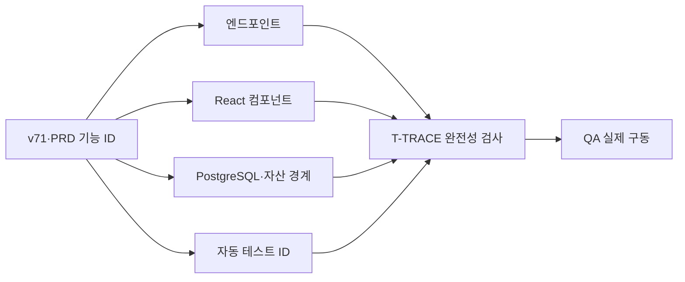

# 편집실 v2 v71 유저플로우 기술 매핑

> STAMP: 2026-10-04 07:10 KST | model=gpt-5-codex | agent=tech-architect | skill=docs | 근거=docs/design/prototypes/osmu-editroom-v71-hub-claude-opus-20261001-2335.html, docs/eng/editroom-v2/gap-matrix.md | 고민=v71 화면 기능과 PRD 추가 기능을 하나도 잃지 않고 구현·검증 단위에 1:1로 연결

## 바로가기

- [결론](#결론)
- [입력 범위와 번호 정규화](#입력-범위와-번호-정규화)
- [엔드포인트 카탈로그](#엔드포인트-카탈로그)
- [저장소 카탈로그](#저장소-카탈로그)
- [테스트 카탈로그](#테스트-카탈로그)
- [공통 화면 G](#공통-화면-g)
- [카드 C](#카드-c)
- [카톡 K](#카톡-k)
- [영상 V](#영상-v)
- [글 W](#글-w)
- [내보내기 X](#내보내기-x)
- [PRD 추가 TP·VC](#prd-추가-tpvc)
- [완전성 검사](#완전성-검사)

## 결론

`gap-matrix.md`의 기능 ID를 원문 기준으로 전수 매핑했다. 고유 ID는 83개다. 원문에서 `V-16`과 `W-03`이 한 번씩 다시 쓰여 의미 행은 85개다. 이 문서는 중복 의미를 `V-16a`, `V-16b`, `W-03a`, `W-03b`로 분리해 둘 다 보존한다.

모든 행은 엔드포인트, 프론트 컴포넌트, PostgreSQL 표 또는 저장 경계, 자동 테스트가 있다. 매핑 gap은 0이다. 브라우저 안에서만 잠깐 존재하는 선택·로딩 상태도 최종적으로 읽거나 쓰는 draft·export 경계를 명시했다.

## 입력 범위와 번호 정규화

### 읽은 흐름 입력

- v71 프로토타입 HTML과 기존 렌더 이미지.
- `docs/eng/editroom-v2/gap-matrix.md`의 G·C·K·V·W·X·TP·VC 기능 목록.
- `docs/user-flow.md`의 생성실 -> 편집실 -> 발행실 흐름.
- PRD v1.3의 템플릿·영상 표지·글 후보 추가 요구.
- 현재 `StudioRooms`, `BubbleEditor`, `VideoEditor`, draft·video·image API.

### 입력 품질 주의

`docs/design/README.md`는 current UI architecture, screen inventory, v71 user-flow, capture manifest를 지목하지 않는 3줄짜리 안내다. 이번 설계는 사용자가 버전핀한 v71 HTML과 `gap-matrix.md`, 현재 main을 진실원으로 사용했다. build 착수 전에 디자인 README를 보강해야 하지만, 기능 매핑 자체의 ID 누락은 없다.

### 중복 번호

| 정규화 ID | 원문 의미 |
|---|---|
| `V-16a` | 타임라인 블록 끌기와 양끝 길이 조절 |
| `V-16b` | 내 브랜드 인트로·아웃트로 갤러리 미리 재생 |
| `W-03a` | 질문형·숫자형·고통 인식형 후보 3개 |
| `W-03b` | 글 후보 칩 줄과 비교 보기 |

## 엔드포인트 카탈로그

| 코드 | 메서드·경로 | 역할 | 구현 상태 |
|---|---|---|---|
| E-DRAFT-R | `GET /api/studio/drafts?workspace_id={id}` | 편집 초안과 revision 조회 | 기존 |
| E-DRAFT-W | `POST /api/studio/drafts` | 편집 초안·v3 요소·videoEdit 저장 | 기존 확장 |
| E-EDITOR | `PATCH /api/studio/drafts/{draftId}/editor` | editor handoff revision 조건부 저장 | 기존 확장 |
| E-CMD | `POST /api/studio/commands` | 다중 편집·말투 후보 command | 기존 확장 |
| E-TEXT | `POST /api/studio/text` | 글 후보 3개 생성 | 기존 확장 |
| E-GEN | `POST /api/studio/v1/generations` | 생성실 후보·템플릿 추천 | 기존 확장 |
| E-IMG | `POST /api/images/upload` | 사진·스티커·로고·표지 자산 업로드 | 기존 |
| E-RESIGN | `POST /api/media/resign` | 만료 영상 배달 URL 재발급 | 기존 |
| E-VIDEO | `POST /api/video/subtitle` | 기존 영상 편집 렌더 adapter | 기존, S6에서 queue 연결 |
| E-INTRO | `POST /api/video/intro-outro` | 기존 intro/outro 요청 adapter | 기존, S6에서 queue 연결 |
| E-EXP-C | `POST /api/studio/drafts/{draftId}/exports` | card·video export 접수 | 신규 |
| E-EXP-S | `GET /api/studio/drafts/{draftId}/exports/{exportId}` | job·item 진행 조회 | 신규 |
| E-EXP-R | `POST /api/studio/drafts/{draftId}/exports/{exportId}/retry` | 실패 item 재대기 | 신규 |
| E-EXP-L | `GET /api/studio/drafts/{draftId}/exports/latest?kind={kind}` | 현재 판과 최신 성공 판 비교 | 신규 |
| E-PUB | `POST /api/studio/drafts/{draftId}/enqueue` | 최신 export 검증 뒤 발행실 queue 인계 | 기존 강화 |

UI command는 매번 독립 HTTP route를 만들지 않는다. `CardElementCommand`와 `VideoEditCommand`로 로컬 변경을 만들고 E-DRAFT-W 또는 E-EDITOR로 저장한다.

## 저장소 카탈로그

| 코드 | 표·경계 | 저장 내용 |
|---|---|---|
| D-CARD | `drafts.payload.cardDeckV3` | 카드 base·요소·장 순서·revision |
| D-CARD-V2 | `drafts.payload.cardDeck` | 이관 기간의 원본 v2 롤백 사본 |
| D-VIDEO | `drafts.payload.videoEdit` | 5레인·overlay·music·transition·cover 설정 |
| D-TEXT | `drafts.payload`의 text candidates·selected candidate | 글 후보·경고·선택 |
| D-TEMPLATE | `drafts.payload.cardDeckV3`의 template·undo snapshot | 적용된 template과 복원 정보 |
| D-JOB | `studio_export_jobs` | 접수 판·집계 상태·멱등성 |
| D-ITEM | `studio_export_items` | 장·영상 item 상태·lease·artifact metadata |
| D-ASSET | 테넌트 media/object storage + draft의 안정 `asset_id` 참조 | 원본 자산과 소유권 |
| D-PUBLISH | `queue_posts` + export ID·source hash | 발행실 인계 판 |

## 테스트 카탈로그

각 테스트 파일 안의 case title 또는 metadata에 기능 ID를 넣는다. `T-TRACE`가 이 표와 실제 test ID 집합을 비교한다.

| 코드 | 테스트 |
|---|---|
| T-SHELL | `dashboard/src/components/studio/StudioRooms.editroom-v2.contract.test.tsx` |
| T-RESP | `dashboard/scripts/verify-editroom-v2-screen-conformance.mjs` |
| T-CARD | `dashboard/src/components/studio/card/CardCanvasEditor.contract.test.tsx` |
| T-CARD-OPS | `dashboard/src/lib/studio/card-element-commands.contract.test.ts` |
| T-PARITY | `dashboard/tests/integrity/card-scene-parity.contract.test.ts` |
| T-BUBBLE | `dashboard/src/components/studio/BubbleEditor.contract.test.tsx` |
| T-BUBBLE-E2E | 기존 `dashboard/scripts/verify-bubble-editor-toolbar-e2e.mjs` 확장 |
| T-VIDEO | `dashboard/src/components/studio/VideoEditor.contract.test.tsx` |
| T-VIDEO-RENDER | `dashboard/src/lib/studio/video-export.contract.test.ts` |
| T-TEXT | `dashboard/src/components/studio/TextCandidatePicker.contract.test.tsx` |
| T-TEMPLATE | `dashboard/src/lib/studio/card-template-commands.contract.test.ts` |
| T-EXPORT | `dashboard/src/app/api/studio/drafts/[draftId]/exports/export-api.contract.test.ts` |
| T-WORKER | `dashboard/src/lib/studio/export-worker.contract.test.ts` |
| T-PUBLISH | `dashboard/src/app/api/studio/drafts/[draftId]/enqueue/route.contract.test.ts` |
| T-TRACE | `dashboard/tests/integrity/editroom-v2-traceability.contract.test.ts` |

## 공통 화면 G

| ID | 사용자 기능 | 엔드포인트 | 컴포넌트 | 저장소 | 테스트 |
|---|---|---|---|---|---|
| G-01 | 글·카드뉴스·영상 형식 탭 | E-DRAFT-R, E-DRAFT-W | `EditRoom`, `FormatTabs` | D-CARD, D-VIDEO, D-TEXT | T-SHELL `G-01` |
| G-02 | 목차·중앙 편집·담당 대화 3영역 | E-DRAFT-R | `EditRoom`, `EditOutline`, `AssistantPanel` | D-CARD, D-VIDEO, D-TEXT | T-SHELL `G-02` |
| G-03 | 말로 여러 곳 한 번에 변경 | E-CMD, E-DRAFT-W | `StudioCommandPanel`, `EditRoom` | D-CARD, D-VIDEO, D-TEXT | T-SHELL `G-03` |
| G-04 | 자동 저장 상태와 마지막 저장 시각 | E-DRAFT-W, E-EDITOR | `AutosaveStatus` | `drafts.updated_at`, 각 payload | T-SHELL `G-04` |
| G-05 | 다른 창 수정 충돌 복구 | E-EDITOR, E-DRAFT-R | `ConflictRecoveryPanel` | `drafts.payload.bodyRevision` | T-SHELL `G-05` |
| G-06 | 빈 상태 | E-DRAFT-R | `EditRoomEmptyState` | `drafts` 0행 | T-SHELL `G-06` |
| G-07 | 불러오는 중 | E-DRAFT-R | `EditRoomSkeleton` | `drafts` 조회 경계 | T-SHELL `G-07` |
| G-08 | 불러오기 실패·재시도 | E-DRAFT-R | `EditRoomErrorState` | `drafts` 조회 경계 | T-SHELL `G-08` |
| G-09 | 편집 중·저장됨·과다·첫 진입 상태표 | E-DRAFT-R, E-DRAFT-W | `EditRoomStateSwitch`, `AutosaveStatus` | D-CARD, D-VIDEO, D-TEXT | T-SHELL `G-09` |
| G-10 | 1440·1024·390 반응형 화면 | E-DRAFT-R | `EditRoom` responsive shell | D-CARD, D-VIDEO, D-TEXT | T-RESP `G-10` |
| G-11 | 머리 줄 공통 내보내기 | E-EXP-C, E-EXP-S | `PublishHeaderControls`, `ExportPanel` | D-JOB, D-ITEM | T-EXPORT `G-11` |

## 카드 C

| ID | 사용자 기능 | 엔드포인트 | 컴포넌트 | 저장소 | 테스트 |
|---|---|---|---|---|---|
| C-01 | 장 썸네일 목록·선택·순서 이동 | E-DRAFT-W | `CardDeckThumbnailStrip` | D-CARD | T-CARD-OPS `C-01` |
| C-02 | 본문을 그 자리에서 수정 | E-DRAFT-W | `CardCanvasEditor`, `CardSlideScene` | D-CARD | T-CARD `C-02` |
| C-03 | 9칸 또는 끌어서 글 위치 변경 | E-DRAFT-W | `CardCanvasEditor` | D-CARD | T-CARD `C-03` |
| C-04 | 선택 테두리와 손잡이 8개 | E-DRAFT-W | `SelectionBounds` | D-CARD | T-CARD `C-04` |
| C-05 | 회전 손잡이·15도·Shift 1도 | E-DRAFT-W | `RotationHandle` | D-CARD | T-CARD-OPS `C-05` |
| C-06 | 요소 끌기·가운데선·4px 자석 | E-DRAFT-W | `CardCanvasEditor`, `SnapGuides` | D-CARD | T-CARD-OPS `C-06` |
| C-07 | 방향키 1px·Shift 10px 이동 | E-DRAFT-W | `CardCanvasEditor` | D-CARD | T-CARD `C-07` |
| C-08 | 글 상자 폭·글자 크기 변경 | E-DRAFT-W | `TextResizeHandles`, `CardElementToolbar` | D-CARD | T-CARD `C-08` |
| C-09 | 떠 있는 요소 도구막대 | E-DRAFT-W | `CardElementToolbar` | D-CARD | T-CARD `C-09` |
| C-10 | 글꼴·크기·색·굵기·정렬·층 | E-DRAFT-W | `CardElementToolbar` | D-CARD | T-CARD-OPS `C-10` |
| C-11 | 글·이미지·도형·스티커·로고 추가 | E-DRAFT-W, E-IMG | `CardElementAddMenu` | D-CARD, D-ASSET | T-CARD `C-11` |
| C-12 | 요소 목록·숨김·잠금 | E-DRAFT-W | `CardElementList` | D-CARD | T-CARD `C-12` |
| C-13 | 이미지 교체·자르기 | E-IMG, E-DRAFT-W | `CardImageInspector`, `CropEditor` | D-ASSET, D-CARD | T-CARD `C-13` |
| C-14 | 장 배경 변경 | E-DRAFT-W, E-IMG | `CardBackgroundInspector` | D-CARD, D-ASSET | T-CARD `C-14` |
| C-15 | 4:5·1:1 비율판 | E-DRAFT-W | `CardRatioSwitch`, `CardSlideScene` | D-CARD | T-PARITY `C-15` |
| C-16 | 실행 취소·다시 실행 | E-DRAFT-W | `CardCommandHistory` | D-CARD | T-CARD-OPS `C-16` |
| C-17 | 요소 복제·삭제·잠금 | E-DRAFT-W | `CardElementToolbar`, `CardElementList` | D-CARD | T-CARD-OPS `C-17` |
| C-18 | 장 추가·복제·삭제 | E-DRAFT-W | `CardDeckThumbnailStrip` | D-CARD | T-CARD-OPS `C-18` |
| C-19 | 화면과 PNG가 같은 렌더 정의 | E-EXP-C, E-EXP-S | `CardSlideScene`, `CardSlideComposition` | D-CARD, D-JOB, D-ITEM | T-PARITY `C-19` |

## 카톡 K

| ID | 사용자 기능 | 엔드포인트 | 컴포넌트 | 저장소 | 테스트 |
|---|---|---|---|---|---|
| K-01 | 카톡 대화 template 덱 | E-DRAFT-R, E-DRAFT-W | `BubbleEditor`, `CardSlideScene` | D-CARD, D-CARD-V2 | T-BUBBLE `K-01` |
| K-02 | 말풍선 본문 직접 편집 | E-DRAFT-W | `BubbleContentEditable` | D-CARD | T-BUBBLE-E2E `K-02` |
| K-03 | 굵게·화자·나누기·합치기·삭제 | E-DRAFT-W | `BubbleToolbar` | D-CARD | T-BUBBLE `K-03` |
| K-04 | 장 썸네일 순서 변경 | E-DRAFT-W | `CardStripThumbnail` | D-CARD | T-BUBBLE-E2E `K-04` |
| K-05 | 말풍선 같은 장·다른 장 이동 | E-DRAFT-W | `BubbleDragHandle`, `BubbleDropZone` | D-CARD | T-BUBBLE `K-05` |
| K-06 | 화자 일괄 변경·서로 바꾸기 | E-DRAFT-W | `BubbleSpeakerBulkMenu` | D-CARD | T-BUBBLE `K-06` |
| K-07 | 말투 후보 3개·사실 변화 경고 | E-CMD | `BubbleSuggestionTray` | D-CARD | T-BUBBLE `K-07` |
| K-08 | 대화 장 위 글·스티커·로고 | E-DRAFT-W, E-IMG | `CardCanvasEditor` overlay mode | D-CARD, D-ASSET | T-PARITY `K-08` |
| K-09 | 표지·마지막 장 사진 선택 | E-IMG, E-DRAFT-W | `CoverImagePicker` | D-ASSET, D-CARD | T-BUBBLE-E2E `K-09` |
| K-10 | 고른 사진이 PNG에 반영 | E-EXP-C, E-EXP-S | `CardSlideScene`, `CardSlideComposition` | D-CARD, D-ITEM | T-PARITY `K-10` |

## 영상 V

| ID | 사용자 기능 | 엔드포인트 | 컴포넌트 | 저장소 | 테스트 |
|---|---|---|---|---|---|
| V-01 | 실제 영상 재생·일시정지·탐색 | E-DRAFT-R | `VideoPlayback` | D-VIDEO, D-ASSET | T-VIDEO `V-01` |
| V-02 | 만료 서명 URL 자동 재발급 | E-RESIGN | `VideoPlayback` | D-ASSET | T-VIDEO `V-02` |
| V-03 | 자막 직접 편집·현재 구간 강조 | E-DRAFT-W | `SubtitleScriptEditor` | D-VIDEO | T-VIDEO `V-03` |
| V-04 | 대본 줄 컷·결과 영상 제거 | E-DRAFT-W, E-EXP-C | `SubtitleScriptEditor` | D-VIDEO, D-JOB, D-ITEM | T-VIDEO-RENDER `V-04` |
| V-05 | 훅·CTA overlay 추가·수정·삭제 | E-DRAFT-W | `OverlayEditor` | D-VIDEO | T-VIDEO `V-05` |
| V-06 | 댓글 overlay 추가·수정·삭제 | E-DRAFT-W | `CommentOverlayEditor` | D-VIDEO | T-VIDEO `V-06` |
| V-07 | 컷·자막·훅·댓글이 mp4 반영 | E-EXP-C, E-EXP-S | `VideoEditor`, worker video adapter | D-VIDEO, D-JOB, D-ITEM | T-VIDEO-RENDER `V-07` |
| V-08 | 목소리 선택과 결과 반영 | E-DRAFT-W, E-EXP-C | `VoiceSelector` | D-VIDEO, D-ITEM | T-VIDEO-RENDER `V-08` |
| V-09 | intro·outro template 선택 | E-INTRO, E-DRAFT-W | `IntroOutroPanel` | D-VIDEO, D-JOB | T-VIDEO `V-09` |
| V-10 | intro·outro 결과 자동 저장·복원 | E-DRAFT-W, E-EXP-S | `IntroOutroPanel` | D-VIDEO, D-ITEM | T-VIDEO `V-10` |
| V-11 | 카드에서 즉시 무음 미리 재생 | E-DRAFT-R | `IntroOutroPreviewCard` | D-VIDEO | T-VIDEO `V-11` |
| V-12 | 적용 뒤 바꾸기·빼기 | E-DRAFT-W | `TimelineBlockToolbar` | D-VIDEO | T-VIDEO `V-12` |
| V-13 | 적용 뒤 길이·글 수정 | E-DRAFT-W | `IntroOutroInspector` | D-VIDEO | T-VIDEO `V-13` |
| V-14 | 다음 영상에도 쓰기 | E-DRAFT-W | `IntroOutroDefaultsToggle` | `drafts.payload.editorDefaults`, D-VIDEO | T-VIDEO `V-14` |
| V-15 | 영상·자막·글·훅/댓글·음악 5레인 | E-DRAFT-W | `VideoTimeline`, `TimelineLane` | D-VIDEO | T-VIDEO `V-15` |
| V-16a | block 끌기·양끝 길이 조절 | E-DRAFT-W | `TimelineBlock` | D-VIDEO | T-VIDEO `V-16a` |
| V-17 | 넣기 서랍 | E-DRAFT-W, E-IMG | `VideoInsertDrawer` | D-VIDEO, D-ASSET | T-VIDEO `V-17` |
| V-18 | 전환 3종 | E-DRAFT-W, E-EXP-C | `TransitionPicker` | D-VIDEO, D-ITEM | T-VIDEO-RENDER `V-18` |
| V-19 | 자막 style preset | E-DRAFT-W, E-EXP-C | `SubtitleStylePicker` | D-VIDEO, D-ITEM | T-VIDEO-RENDER `V-19` |
| V-20 | 배경음악 5곡·upload | E-DRAFT-W, E-IMG, E-EXP-C | `MusicPicker` | D-VIDEO, D-ASSET, D-ITEM | T-VIDEO-RENDER `V-20` |
| V-21 | 안전 영역 켜기 | E-DRAFT-W | `VideoSafeAreaOverlay` | D-VIDEO | T-VIDEO `V-21` |
| V-22 | 원본으로 복원 | E-DRAFT-W | `VideoRestoreOriginalAction` | D-VIDEO | T-VIDEO `V-22` |
| V-23 | 영상 표지 선택 | E-IMG, E-DRAFT-W | `VideoCoverPicker` | D-VIDEO, D-ASSET | T-VIDEO `V-23` |
| V-16b | 내 브랜드 intro·outro gallery 미리 재생 | E-DRAFT-R, E-INTRO | `BrandIntroOutroGallery` | D-VIDEO, D-ASSET | T-VIDEO `V-16b` |

## 글 W

| ID | 사용자 기능 | 엔드포인트 | 컴포넌트 | 저장소 | 테스트 |
|---|---|---|---|---|---|
| W-01 | 글 본문 직접 편집 | E-DRAFT-W | `TextDocumentEditor` | D-TEXT | T-SHELL `W-01` |
| W-02 | 채널 글자 수 상한 표시 | E-DRAFT-W | `ChannelLimitMeter` | D-TEXT | T-TEXT `W-02` |
| W-03a | 질문형·숫자형·고통 인식형 후보 3개 | E-TEXT | `TextCandidatePicker` | D-TEXT | T-TEXT `W-03a` |
| W-04 | 후보 비교 후 적용 | E-DRAFT-W | `TextCandidateCompare` | D-TEXT | T-TEXT `W-04` |
| W-05 | 사실 불일치·글자 수 넘침 경고 | E-TEXT | `TextCandidateWarning` | D-TEXT | T-TEXT `W-05` |
| W-03b | 후보 chip 줄과 비교 보기 | E-TEXT | `TextCandidateChipRow`, `TextCandidateCompare` | D-TEXT | T-TEXT `W-03b` |

## 내보내기 X

| ID | 사용자 기능 | 엔드포인트 | 컴포넌트 | 저장소 | 테스트 |
|---|---|---|---|---|---|
| X-01 | 카드 장마다 PNG 생성 | E-EXP-C, E-EXP-S | `ExportPanel`, `CardSlideComposition` | D-JOB, D-ITEM | T-WORKER `X-01` |
| X-02 | 4:5 1080x1350·1:1 1080x1080 | E-EXP-C | `CardSlideComposition` | D-CARD, D-ITEM | T-PARITY `X-02` |
| X-03 | 화면 미리보기와 PNG 자동 비교 | E-EXP-C | `CardSlideScene`, visual test harness | D-CARD, D-ITEM | T-PARITY `X-03` |
| X-04 | 독립 내보내기 화면 | E-EXP-C, E-EXP-S | `ExportPanel` | D-JOB, D-ITEM | T-EXPORT `X-04` |
| X-05 | `3 / 9장` 진행률 | E-EXP-S | `ExportProgress` | D-JOB, D-ITEM | T-EXPORT `X-05` |
| X-06 | 실패 장만 다시 내보내기 | E-EXP-R | `ExportItemList` | D-JOB, D-ITEM | T-EXPORT `X-06` |
| X-07 | 영상 내보내기 진행·재시도 | E-EXP-C, E-EXP-S, E-EXP-R | `ExportPanel` video mode | D-JOB, D-ITEM | T-WORKER `X-07` |
| X-08 | 여러 컨테이너 공유 영속 queue | E-EXP-C, E-EXP-S | worker health UI | D-JOB, D-ITEM | T-WORKER `X-08` |
| X-09 | 편집 판과 내보낸 판 최신성 비교 | E-EXP-L | `ExportFreshnessBadge` | D-CARD, D-VIDEO, D-JOB | T-EXPORT `X-09` |
| X-10 | 최신 내보내기 없으면 발행 차단 | E-PUB, E-EXP-L | `PublishHeaderControls` | D-JOB, D-PUBLISH | T-PUBLISH `X-10` |

## PRD 추가 TP·VC

| ID | 사용자 기능 | 엔드포인트 | 컴포넌트 | 저장소 | 테스트 |
|---|---|---|---|---|---|
| TP-01 | 생성실 template 6개 한 줄·추천 선택 | E-GEN | `CreateCardTemplateRow` | D-TEMPLATE | T-TEMPLATE `TP-01` |
| TP-02 | 편집실 gallery·전체·이 장만 변경 | E-DRAFT-W | `CardTemplateGallery` | D-TEMPLATE | T-TEMPLATE `TP-02` |
| TP-03 | template 전후 비교·이전 복원 | E-DRAFT-W | `CardTemplateCompare` | D-TEMPLATE | T-TEMPLATE `TP-03` |
| VC-01 | 추천 표지 3개·재생 막대에서 선택 | E-DRAFT-W | `VideoCoverPicker` | D-VIDEO, D-ASSET | T-VIDEO `VC-01` |
| VC-02 | 표지 사진 upload·글 preset | E-IMG, E-DRAFT-W | `VideoCoverPicker`, `CoverTextPresetPicker` | D-VIDEO, D-ASSET | T-VIDEO `VC-02` |

## 완전성 검사

### 정적 검사 계약

`dashboard/tests/integrity/editroom-v2-traceability.contract.test.ts`는 다음을 강제한다.

1. `gap-matrix.md`에서 `/\b(?:G|C|K|V|W|X|TP|VC)-\d{2}\b/g`로 고유 ID 집합을 추출한다.
2. 이 문서에서 같은 집합을 추출한다. `V-16a/b`, `W-03a/b`는 base ID도 함께 등록한다.
3. 원문 집합과 mapping 집합의 차집합이 모두 0인지 검사한다.
4. 각 table row의 endpoint, component, storage, test cell이 비어 있지 않은지 검사한다.
5. test catalog 파일이 존재하고 각 기능 ID가 실제 test title 또는 metadata에 있는지 검사한다.

### 현재 설계 집계

| 구분 | 원문 의미 행 | 고유 ID | 매핑 행 | gap |
|---|---:|---:|---:|---:|
| G | 11 | 11 | 11 | 0 |
| C | 19 | 19 | 19 | 0 |
| K | 10 | 10 | 10 | 0 |
| V | 24 | 23 | 24 | 0 |
| W | 6 | 5 | 6 | 0 |
| X | 10 | 10 | 10 | 0 |
| TP | 3 | 3 | 3 | 0 |
| VC | 2 | 2 | 2 | 0 |
| 합계 | 85 | 83 | 85 | 0 |

### 추적 흐름

## 벤치마크와 설계 판단

### 참고한 사례

1. [Polotno Design Format](https://polotno.com/docs/schema)의 page·typed element 분리는 C 기능을 하나의 `CardSlideScene`과 element command로 묶는 근거로 사용했다.
2. [Remotion renderStill](https://www.remotion.dev/docs/renderer/render-still)은 C-19·X-01..03에서 같은 React scene을 서버 PNG로 연결하는 경계다.
3. [PostgreSQL SELECT](https://www.postgresql.org/docs/current/sql-select.html)의 `SKIP LOCKED` queue 경계는 X-05..08의 작업자 구현에 사용했다.

### 반대 관점 검토

기존 구현이 있는 기능은 mapping에서 빼고 새 gap만 다루자는 반론이 있다. 그러나 기존 기능도 새 저장 모델과 내보내기 경계에서 회귀할 수 있다. 전수 mapping이 있어야 S1 자유 배치가 기존 충돌 복구, 카톡 사진, 영상 편집을 망가뜨리지 않았는지 검증할 수 있다.

모든 UI 행동마다 별도 API를 만들자는 접근도 있다. 이는 command 수만큼 route가 늘고 draft revision 원자성이 깨진다. 편집 command는 클라이언트에서 순수 함수로 만들고 draft 저장 경계로 묶으며, 오래 걸리는 생성·렌더·자산 작업만 독립 endpoint로 둔다.

### 셀프심문

- 이 매핑이 틀렸다면 가장 그럴듯한 이유는 v71 HTML의 데모 전용 상태 토글을 제품 기능으로 과도하게 해석한 경우다. G-09는 상태 전환기 자체가 아니라 실제 편집 중·저장됨·과다·첫 진입 상태를 제품에서 재현하는 것으로 좁혔다.
- 가장 load-bearing한 가정은 `gap-matrix.md`가 v71 기능 inventory의 정본이라는 점이다. 디자인 README가 불완전하므로 build 전 README에 v71 user-flow와 capture를 명시하는 후속이 필요하다.
- 스킬 우선 게이트는 지켰는가. `docs` 스킬을 읽고 표·용어·검증 가능한 RTM 구조를 적용했다.

## 추적성과 출고 푸터

기반 포맷: `docs/eng/editroom-v2/gap-matrix.md`의 기능 ID와 근거 열을 계승하고 endpoint·component·storage·test 열을 추가했다.

RUBRIC_SCORE: correctness=5/5 completeness=5/5 traceability=5/5 usability=5/5 readability=4/5 total=24/25

WEAKEST_LINE: 디자인 README가 v71 user-flow와 capture manifest를 지목하지 않아 입력 계약 자체는 후속 보강이 필요하다.

SKILLS_USED: docs, 요구·구현·데이터·테스트 1:1 추적 표와 검증 계약에 적용

SKILLS_SKIPPED: document-generate·diagram, 현재 세션의 available-skills에 없어 저장소 Markdown과 Mermaid로 대체

SOURCES/MODEL: gpt-5-codex | `docs/eng/editroom-v2/gap-matrix.md`, v71 prototype, `docs/user-flow.md`, PRD v1.3, `StudioRooms.tsx`, `BubbleEditor.tsx`, `VideoEditor.tsx`, 현재 Studio·video·image API, `card-element-model.md`, `export-queue.md`, Polotno·Remotion·PostgreSQL 공식 문서

PRESENTATION_CHECK: 내부 태그 잔재 없음 확인 / Markdown 표·Mermaid 정적 검토 / v71 기존 렌더 이미지 육안 확인

KNOWLEDGE_QUERY: BRAIN에서 구조화 편집·queue 실패 모델을 조회하고, 웹에서 typed element·React still render·PostgreSQL queue 공식 사례를 조사했다.

HITS_USED: 모델 정본과 DOM 투영 원칙을 C·K에, 단일 DB queue 원칙을 X에, 기존 Remotion 재현성을 C-19·X-01..03에 반영했다.

HITS_REJECTED: 외부 editor library와 broker는 승인된 기술 경계를 바꾸고 추적 범위를 늘려 제외했다.

CONFLICTS: 없음. 다만 디자인 README의 v71 입력 지목 결손은 외부 사례 충돌이 아니라 저장소 문서 결손으로 분리했다.
