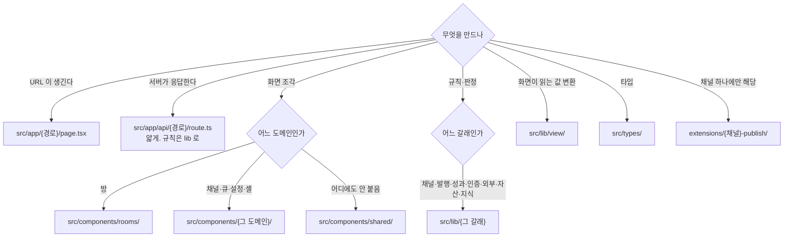

<!--
STAMP | openclaw-auto 폴더 구조 | v1.0.0 | 2026-08-27 KST
model: claude-opus-5[1m] | agent: tech-architect (서브에이전트)
기반 산출물: docs/architecture.md v1.0.0 · CLAUDE.md(레포 정책) · 실측 트리(ls/find, 2026-08-27)
기반 포맷: CLAUDE.md "대시보드 구조" 절의 트리 표기를 이어받아 확장했다.
고민한 것: 폴더를 새로 설계하고 싶은 충동이 가장 큰 자리가 여기다. 그런데 회장이 일곱 번
  지적한 것이 "기존 구현 무시하고 새로 만든다"이고, 폴더 재편은 그 지적의 가장 비싼 형태다.
  그래서 이 문서는 ①지금 있는 것을 그대로 적고 ②각 폴더의 책임을 명문화하고
  ③새로 추가할 자리만 표시한다. 기존 폴더를 옮기는 제안은 하지 않는다.
-->

# openclaw-auto 폴더 구조 v1.0.0

## 목차
- [1. 이 문서의 규칙](#규칙)
- [2. 레포 최상위](#최상위)
- [3. dashboard — 화면과 서버](#dashboard)
- [4. openclaw + extensions — 크론과 채널 확장](#openclaw)
- [5. docs · studio · wiki — 산출물](#산출물)
- [6. 새로 여는 자리 (선택지 확정 후)](#신설)
- [7. 관습 — 새 파일을 어디에 두나](#관습)
- [8. 개정 이력](#이력)

> **TL;DR** 폴더를 재편하지 않는다. 지금 구조(`dashboard/src/{app,components,lib,hooks,types,store}` + `extensions/*` + `openclaw/`)를 그대로 두고 각 폴더의 **책임**과 **새 파일을 어디에 두는가**만 못박는다. 신설은 세 자리뿐이고(`src/lib/view/`, `src/lib/rooms/`, `src/components/rooms/`) 전부 아키텍처 §4 레이어 계약이 요구한 것이다.

---

## 1. 이 문서의 규칙 <a id="규칙"></a>

1. **옮기지 않는다.** 기존 파일의 이사를 제안하지 않는다. Feature-Sliced Design 같은 전면 재편은 실조사했으나 채택하지 않았다(architecture.md §9-②).
2. **관습이 우선이다.** 이미 `components/{도메인}` + `lib/{도메인}` 이 서 있다. 새 파일은 그 관습을 따른다.
3. **신설은 근거가 있을 때만.** 아래 §6 세 자리는 각각 ADR 이 요구한 것이고 그 ADR 번호를 적었다.

---

## 2. 레포 최상위 <a id="최상위"></a>

```
openclaw-auto/
├── dashboard/          화면과 서버. 이 기술설계의 주 무대
├── openclaw/           에이전트 런타임. 크론이 여기서 돈다
├── extensions/         채널 publish 확장 15종 + 도구 확장
├── config/             openclaw.json · jobs.json (모델 · 크론 주기)
├── data/               prompt-guide · search-keywords (채널별 파일)
├── docs/               파이프라인 산출물. PRD · 유저플로우 · 기술설계 · 프로토타입
├── studio/             studio 라인 산출물 (별도 제품 라인)
├── wiki/               레포 지식 정본 (SSOT)
├── scripts/            검사기 · 백업 · 프로비저닝
├── supabase/           마이그레이션
├── DESIGN.md           디자인 시스템 정본
├── CLAUDE.md           기술 개요와 환경 변수
└── pipeline-state.osmu.md   이 라인의 파이프라인 런타임 상태
```

| 폴더 | 책임 | 이 폴더에 두면 안 되는 것 |
|---|---|---|
| `dashboard/` | Next.js 애플리케이션. App Router 페이지와 API 라우트 | 크론 로직 |
| `openclaw/` | 스케줄 실행 · Tool Registry · 에이전트 상태 | 화면 |
| `extensions/` | 채널 하나당 폴더 하나. 발행·수집 도구 | 여러 채널에 걸친 규칙 |
| `config/` | 모델 선택 · 크론 주기 | 비밀값 (환경 변수로) |
| `data/` | 채널별 가이드·키워드 텍스트 파일 | 회원 데이터 |
| `docs/` | 파이프라인 산출물 | 코드 |
| `wiki/` | 결정(ADR) · 아키텍처 · 학습 | 진행 중인 초안 |

**레포 정책 하나.** 이 레포는 서비스 중립적 공통 플랫폼이다. 코드·커밋·PR 에 특정 서비스 URL · 사용자명 · 브랜드명 · API 키를 넣지 않는다. 커스텀 연동은 fork 에서 한다.

---

## 3. dashboard — 화면과 서버 <a id="dashboard"></a>

```
dashboard/
├── src/
│   ├── app/                       App Router. 경로 = 폴더
│   │   ├── api/                     Route Handler 163개
│   │   ├── page.tsx                 대시보드 홈 (성과 요약 정본)
│   │   ├── studio/                  생성·편집 화면 (현행)
│   │   ├── inbox/                   승인 인박스
│   │   ├── calendar/                발행 캘린더
│   │   ├── performance/             성과
│   │   ├── channels/                채널별 페이지 (capability 로 탭 결정)
│   │   ├── blog/ images/ videos/    자산과 갈래별 작업대
│   │   ├── keyword-planner/ naver-trends/ google-trends/ search-console/
│   │   ├── settings/                채널 연결 · AI Engine · Notifications · Account
│   │   ├── operator/ services/      운영자 · 서비스 전환
│   │   ├── login/ signup/           인증
│   │   └── layout.tsx               루트 레이아웃 + 사이드바
│   ├── components/
│   │   ├── layout/                  Sidebar · Providers · ThemeToggle · Toast
│   │   ├── channel/                 ChannelPage · ChannelTabs · SocialConnectButton …
│   │   ├── studio/                  PlatformPreview · ChannelConnect · SchedulePanel …
│   │   ├── queue/                   QueueList · UnifiedPostCard · PostCard …
│   │   ├── settings/                설정 패널 17종
│   │   ├── home/                    PipelineTimeline
│   │   ├── shared/                  Button · Card · Field · EmptyState · LoginModal …
│   │   └── legal/
│   ├── lib/                       도메인 모듈. 규칙과 판정
│   ├── hooks/                     useQueue · useChannelConfig · useOverview · useOnboarding
│   ├── types/                     channel · cron · notification · queue
│   └── store/                     ui-store (전역 UI 상태만)
├── db/
│   ├── schema.sql                 17 테이블
│   └── rls.sql                    테넌트 격리
├── tests/                         vitest. 아래 §3.4
└── legacy/                        Flask 병행층. Phase 3 삭제 대상
```

### 3.1 `src/app/` — 경로가 곧 폴더

**책임:** URL 하나 = 폴더 하나. 그 폴더의 `page.tsx` 는 **얇다.** 데이터를 읽고 방·화면 컴포넌트에 넘긴다.

**여기 두면 안 되는 것:** 재사용 가능한 UI(→ `components/`), 규칙(→ `lib/`).

### 3.2 `src/app/api/` — Route Handler

**책임:** 인증 · 입력 검증 · 도메인 모듈 호출 · 표시 모델 변환. 네 가지뿐이다(architecture.md §4.3).

**관습:** 폴더가 곧 경로다. 동적 구간은 `[channel]` · `[provider]` · `[postId]` 처럼 이미 서 있는 이름을 재사용한다. 새 이름을 만들지 않는다.

**여기 두면 안 되는 것:** 규칙과 판정. 그것은 `lib/` 이고, 테스트가 거기 붙는다.

### 3.3 `src/lib/` — 도메인 모듈

지금 43개 모듈이 도메인별로 서 있다. 새 파일은 이 갈래 중 하나에 붙인다.

| 갈래 | 지금 있는 것 | 책임 |
|---|---|---|
| 채널 | `channel-capabilities` · `channel-accounts` · `channel-connection` · `channel-text-limits` · `verify-channel` · `connect-readiness` | 채널 능력 · 규격 · 연결 판정 |
| 발행 | `publish` · `queue-store` · `tiktok` · `video-limits` | 발행 실행과 큐 |
| 성과 | `home-metrics` · `home-data-source` · `popular-posts` · `analytics/` | 지표 수집과 집계 |
| 인증·격리 | `auth` · `tenant-auth` · `tenant-context` · `supabase` · `db` | 누가 무엇을 보나 |
| 외부 | `anthropic` · `higgsfield` · `github` · `gsc-auth` · `youtube-token` · `oauth-*` | 외부 서비스 어댑터 |
| 자산 | `storage` · `image-token` · `media-token` · `file-io` | 파일과 만료 링크 |
| 브랜드·지식 | `wiki-retrieve` · `context-source` · `voice-tone` · `voice-examples` | 그라운딩 재료 |

**규칙:** 한 모듈은 한 갈래에만 속한다. 두 갈래에 걸치면 갈래가 잘못 그어진 것이다.

### 3.4 `dashboard/tests/`

```
tests/
├── api/            Route Handler 계약 (me.test.ts 등)
├── publish/        발행 흐름 (npm run test:publish)
├── isolation/      테넌트 격리 · RLS
├── lib/            도메인 모듈 단위
├── components/     화면 단위
├── db/ integrity/  스키마와 정합
├── analytics/ brand/ observability/
├── fixtures/       고정 입력
└── setup.ts helpers.ts
```

**관습:** 테스트 폴더 이름은 `src/` 의 갈래를 그대로 따라간다. `src/lib/publish.ts` 의 테스트는 `tests/lib/` 또는 흐름 단위면 `tests/publish/` 다.

---

## 4. openclaw + extensions <a id="openclaw"></a>

```
openclaw/
└── src/state/
    ├── openclaw-state-schema.sql
    └── openclaw-agent-schema.sql

extensions/
├── threads-publish/       ┐
├── x-publish/             │ 채널 발행 확장 15종
├── instagram-publish/     │ 각 4파일:
├── facebook-publish/      │   package.json · plugin.json · index.ts · tool.ts
├── bluesky-publish/       │
├── telegram-publish/      │
├── linkedin-publish/      │
├── pinterest-publish/     │
├── naver-blog-publish/    │
├── slack-publish/         │
├── discord-publish/       │
├── line-publish/          ┘
├── threads-queue/         큐 CRUD (멀티채널)
├── threads-style/         style-data RAG
├── threads-insights/      반응 수집 · 터진 글 감지
├── threads-search/        외부 인기글 수집
├── threads-growth/        팔로워 추적
├── card-generator/        카드뉴스
├── midjourney-image/      이미지 생성
├── image-upload/          R2 업로드
├── blog-queue/ sample-blog/ seo-keywords/
└── longform-to-shorts/ sync-insights/ generate-drafts/
```

**새 채널을 추가하는 절차는 이미 확정돼 있다(CLAUDE.md).** 6단계다: 확장 폴더 생성 → `channel-config` route 의 `OTHER_CHANNELS` 등록 → `verify-channel` 검증 로직 → `setup-guides` 가이드 → `constants` 의 `CH_LABELS`·`IMPLEMENTED_PLUGINS` → Docker 리빌드. **이 절차를 바꾸지 않는다.**

---

## 5. docs · studio · wiki <a id="산출물"></a>

| 폴더 | 무엇 | 이 판에서 |
|---|---|---|
| `docs/prototype/` | 프로토타입 HTML. v61 이 이번 판 입력 | 읽기만 |
| `docs/design-docs/` | 유저 플로우 · 채널 계약 | 읽기만 |
| `docs/requests/` | 회장 요구 대장 (200건) | 읽기만. 지우지 않는다 |
| `docs/` 루트 | PRD · 사업계획 · 기술설계 | 이번 판이 여기에 쓴다 |
| `studio/docs/` | studio 라인 기술설계 | 재사용 판정만 (아래) |
| `wiki/` | 레포 지식 SSOT | 작업 후 반영 |
| `scripts/` | `check-requirements.sh` · `check-frame-purity.sh` · `check-regression.sh` · `prototype-coverage-check.sh` | 릴레이 전 기계 검사 |

---

## 6. 새로 여는 자리 <a id="신설"></a>

세 자리뿐이다. 전부 architecture.md 의 ADR 이 요구한 것이고, **선택지 확정 전에는 만들지 않는다.**

| 신설 | 무엇 | 요구한 ADR | 언제 |
|---|---|---|---|
| `src/lib/view/` | 표시 모델 변환. 저장 이름이 화면에 못 가게 막는 층 | ADR-003 | 선택지 무관. 바로 열 수 있다 |
| `src/lib/rooms/` | 방별 도메인 규칙(방 진입 조건 · 방 전이 판정 · 방별 카운트) | ADR-004 | 선택지 D-04(상태 머신) 확정 후 |
| `src/components/rooms/` | 방 컴포넌트 4개. 한 방 = 한 파일 = default export 하나 | ADR-004 | D-04 확정 후 |

```
src/
├── lib/
│   ├── view/            ← 신설. 표시 모델. 테이블명·컬럼명·크론명 차단선
│   └── rooms/           ← 신설. 방 규칙
└── components/
    └── rooms/           ← 신설
        ├── CreateRoom.tsx
        ├── EditRoom.tsx
        ├── PublishRoom.tsx
        └── PerfRoom.tsx
```

**`src/components/rooms/` 의 불변조건 (ADR-004).**
- 파일 하나에 default export 하나.
- 그 파일 밖에서 이 컴포넌트를 감싸 덮어쓰지 않는다.
- 빈 상태 · 갈래 분기는 **그 파일 안에서** 갈린다. 별도 컴포넌트를 만들어 바꿔 끼우지 않는다.
- 검사: `docs/test-cases.md` TC-ARCH-01.

---

## 7. 관습 — 새 파일을 어디에 두나 <a id="관습"></a>



### 7.1 판단이 애매할 때의 세 물음

1. **"이것이 URL 을 갖나?"** 갖는다면 `app/`. 아니면 `components/`.
2. **"이것이 화면 없이도 테스트되나?"** 된다면 `lib/`. 규칙은 전부 여기로 온다.
3. **"이것이 채널 하나에만 해당하나?"** 그렇다면 `extensions/`. 여러 채널에 걸치면 `lib/channel-*`.

### 7.2 하지 않는 것

| 금지 | 왜 |
|---|---|
| 새 최상위 폴더를 여는 것 | 관습이 깨진다. 필요하면 이 문서를 먼저 고친다 |
| `components/` 안에 규칙을 쓰는 것 | 테스트가 화면에 묶여 느려지고 깨진다 |
| `app/api/` 안에 규칙을 쓰는 것 | ADR-003 의 DTO 누출이 여기서 시작된다 |
| 방 컴포넌트를 감싸 덮어쓰는 것 | ADR-004. 되살아나는 병의 뿌리 |
| `dashboard/legacy/` 에 새 기능 | Phase 3 삭제 대상 |

---

## 8. 개정 이력 <a id="이력"></a>

| 판 | 날짜 | 무엇 |
|---|---|---|
| v1.0.0 | 2026-08-27 | 초판. 실측 트리 기록 + 책임 명문화 + 신설 세 자리 |

---

RUBRIC_SCORE: 완결5 정밀4 벤치4 추적4 톤5 total=22/25
WEAKEST_LINE: "`src/lib/` 갈래표가 43개 모듈 중 33개만 분류했다. 나머지 10개(secret-mask · observability · format 등)는 어느 갈래인지 이 문서가 답하지 않는다."
