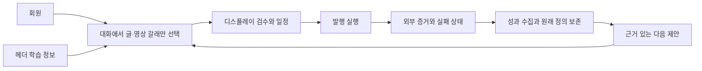
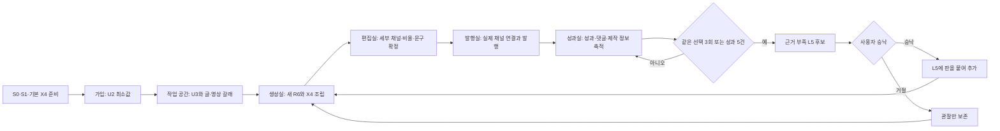
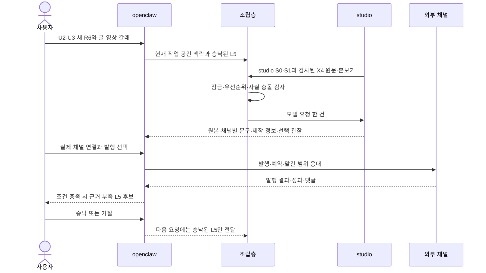

<!--
STAMP | line: osmu | 생성: 2026-08-23 00:51 KST | model: gpt-5.6-sol | agent: prd-architect worker
기반 산출물 버전 핀: 사업계획-osmu-v1.3(파일명 v1.0) §3.4.1~3.4.3 · docs/prd-openclaw-운영-v3.0.md 직전판 · 회장-확정-요구사항-대장 R01~R99 · two-service-boundary
스킬: pipeline(status·게이트 규율). 일반 PRD 작성 전용 스킬은 현재 목록에 없어 품질헌법 템플릿과 방법론을 직접 적용
고민: openclaw가 모든 층 원본을 보관한다는 옛 요구를 폐기하면서도, 발행·성과에 필요한 자기 S0·S1과 작업 공간 격리를 분명히 하는 방법
-->

# openclaw-service 운영 PRD v3.0

> **개정 배너:** 이 문서는 직전 v3.0을 처음부터 다시 쓰지 않고 사업계획 v1.3 §3.4.1~3.4.3에 맞춰 증분 교정한 계획 산출물이다. 기존 기능·요구·검증 카드는 보존했다. 구현과 설계의 새 입력은 plan 승인 뒤 이 문서로 핀을 바꿔야 한다.

| 항목 | 값 |
|---|---|
| 판 | v3.0 |
| 작성 | 2026-08-23 00:51 KST |
| 작성자·모델 | prd-architect worker / gpt-5.6-sol |
| 상태 | plan 산출 완료, 독립 비평과 회장 승인 대기 |
| 상류 기준 | 사업계획 v1.3 §3.4.1~3.4.3, 요구 대장 R01~R99, 두 서비스 경계 위키 |
| 기존 문서 | `docs/prd-openclaw-운영-v2.0.md` 보존 |
| 승인 게이트 | /approve plan 전 다음 단계 진입 금지 |

## 목차

- [0. 문서 지위와 요약](#0-문서-지위와-요약)
- [1. 문제와 현재 상태](#1-문제와-현재-상태)
- [2. 페르소나와 시나리오](#2-페르소나와-시나리오)
- [3. 한 가지 약속](#3-한-가지-약속)
- [4. 범위와 배치](#4-범위와-배치)
- [5. 학습 정보와 스킬과 조립층](#5-학습-정보와-스킬과-조립층)
- [6. 전체 흐름과 데이터 흐름](#6-전체-흐름과-데이터-흐름)
- [7. 최소 제품 기능 다섯 개](#7-최소-제품-기능-다섯-개)
- [8. 기능 요구와 수용 기준](#8-기능-요구와-수용-기준)
- [9. 비기능 요구와 데이터 원칙](#9-비기능-요구와-데이터-원칙)
- [10. 사업 모델과 운영 부하](#10-사업-모델과-운영-부하)
- [11. 법적·시장·기술 리스크](#11-법적시장기술-리스크)
- [12. 벤치마크와 차용·차별](#12-벤치마크와-차용차별)
- [13. 회장 요구 R01~R99 대조](#13-회장-요구-r01r99-대조)
- [14. 회장이 정할 것](#14-회장이-정할-것)
- [15. 반론·실패 가정·접는 기준](#15-반론실패-가정접는-기준)
- [16. 품질 판정과 추적성](#16-품질-판정과-추적성)
- [17. 개정 이력과 출처](#17-개정-이력과-출처)

## 0. 문서 지위와 요약

**요약:** studio가 만든 완성 원본과 채널별 문구를 증거 있는 발행·성과로 잇고, 같은 선택 3회 또는 성과 표본 5건부터 근거 부족 표시가 붙은 `L5` 후보를 제시한다. openclaw는 모든 층 원본의 중앙 저장소가 아니다. 발행·성과에 필요한 자기 `S0·S1`을 갖고 `U2·U3·L5·R6`을 읽으며, `X4`는 원문을 실행하지 않고 제작 정보만 성과와 연결한다.

### 0.1 용어

| 용어 | 이 문서에서의 뜻 |
|---|---|
| 서비스 | 회원, 화면, 데이터베이스, 과금과 운영 책임을 가진 상품 단위 |
| 엔진 | 요청 봉투 하나만 보고 만들거나 실행하는 무상태 처리기 |
| 정본 | 사람이 넣고 고치고 지우는 원본. 한 항목은 한 서비스에 하나만 존재 |
| 투영본 | 정본을 읽어 복제한 읽기 전용 사본. 직접 수정 금지 |
| X4 스킬 | studio가 실행하는 제작 구조·순서·길이·구성의 원문. openclaw는 스킬 원문을 실행하지 않고 이름과 판만 읽음 |
| 디스플레이 | 사용자와 담당이 함께 보는 발표 화면. 불가피한 경우가 아니면 스크롤 없음 |
| 기능 요구 번호 | FR로 시작하는 추적용 번호. 설계와 시험에서 같은 번호를 이어 사용 |
| 수용 기준 | 사용자 관점에서 해당 요구가 충족됐는지 직접 관찰하는 조건 |

### 0.2 전체 흐름 한 장과 가로형 데이터 흐름



**가로형 데이터 흐름:** 정본 또는 읽기 전용 투영본 → 요청 봉투 → 무상태 엔진 → 결과·외부 증거 → 꼬리표와 최소 작업 기록 → 승낙 전 제안. 각 화살표는 판, 마지막 갱신 시각, 권한·권리 상태를 보존한다.

## 1. 문제와 현재 상태

### 1.1 해결할 문제

만든 콘텐츠를 채널마다 옮기고 예약·댓글·성과를 다른 화면에서 관리하느라 루프가 끊긴다. 더 큰 문제는 증거 없는 성공 표시와 꼬리표 없는 성과 때문에 사용자가 자동화를 믿지 못한다는 것이다.

### 1.2 현재 구현 상태

| 영역 | 현재 상태 | 위키 정본 | v3 처리 |
|---|---|---|---|
| 고객 화면 | 25개 경로, 사이드바 23개 목적지 소스 존재 | marketing-hub-surface-map.md | 보존. 소스 존재를 실제 동작으로 과장 금지 |
| 채널 발행과 연결 | Threads 라이브, Instagram 연결, 13종 구현완료·미연결 | channel-status.md | 재구현 금지. 실제 공급자 동작은 미검증 표시 |
| 예약·큐·달력 | 부분구현. 2시간 크론과 큐 기반 화면 | CLAUDE.md, marketing-hub-surface-map.md | 증거·정밀도·중복 방지 보강 |
| 댓글·성과 수집 | Threads 중심 부분구현 | CLAUDE.md, channel-status.md | 위임 범위와 상태 계약 위에 연결 |
| 서비스 간 작업 공간 맥락 인계 | 미구현 | 사업계획 v1.3 §3.4, 요구 R71·R91 | 모든 층 원본 중앙 보관을 폐기하고 요청별 필요한 값과 판만 인계 |
| 디스플레이·대화 중심 학습 | 미구현 | R70, R75~R78 | 기능 요구로 신설 |
| 운영 실제 경로 | OAuth 거짓 성공·Instagram 이중 입력·설정 상태 누락·502가 열린 관찰 | marketing-hub-surface-map.md | 해결 주장 금지. 다음 단계 선행 증거 |

**증거 경계:** 위키는 1차 진실원이다. 위 표의 이미구현은 소스와 계약 존재를 뜻할 수 있으며 운영·공급자 실제 동작을 뜻하지 않는다. 직접 관찰하지 않은 외부 경로는 미검증이다.

⛔ 회수 필요: `wiki/architecture/two-service-boundary.md`는 studio를 회원 없는 1차 무상태 서비스로 쓰고 채널별 문구를 openclaw 소유로 적어 R71·R88과 어긋난다. 이 PRD는 더 최신인 사업계획 v1.3과 요구 대장 상단 R71·R88·R89를 따랐다. 위키 정본은 plan 승인 뒤 같은 내용으로 갱신해야 한다. 위키와 구현 현황 문서에 필요한 상태가 있어 추가 코드 검색은 하지 않았다.

## 2. 페르소나와 시나리오

### 2.1 핵심 페르소나

**박도윤, 32세, 혼자 구독형 소프트웨어를 만든 바이브 코더.** 제품과 랜딩페이지는 혼자 만들지만 알리는 일은 계속 뒤로 밀린다. 스레드, 인스타그램, 링크드인에 같은 소재를 올리려면 문구와 비율과 발행 시각을 각각 맞춰야 해서 한 편에 두 시간이 든다. 세 채널 중 하나만 올리고 나머지는 미루며, 댓글은 하루 뒤에 확인한다. 예약했다고 생각했는데 토큰 만료로 발행되지 않았던 경험 뒤로 자동화 화면의 성공 표시를 믿지 않는다. 조회수가 오른 글을 봐도 어떤 훅, 제작법, 브랜드 판이 영향을 줬는지 몰라 다음 콘텐츠는 다시 감으로 정한다. 마케팅 담당자를 뽑을 여력은 없고 여러 도구를 합쳐 쓰는 것도 관리 업무가 된다. 프롬프트를 직접 쓸 수 있지만 늘 무엇을 써야 하는지 아는 것은 아니다. 그래서 담당과 대화하며 추천을 고르고, 가운데 디스플레이에서 결과와 수정안을 함께 본 뒤, 지금 발행·보관·예약 중 하나를 고르고 싶다. 출시 주간에는 고객 응대와 장애 대응이 겹쳐 예약 하나가 실패해도 원인을 찾을 시간이 없고, 다음 주에야 빈 채널을 발견한다. 통합 숫자보다 어떤 채널의 어떤 정의인지, 언제 마지막으로 확인됐는지, 다시 시도하면 중복 발행되지 않는지를 먼저 본다. 자동 답글은 편하지만 가격·환불·법적 약속을 대신 말하는 순간 바로 끄고 싶다. 가장 큰 불신은 예상 밖 비용과 증거 없는 성공 표시다. 성공은 한 번의 흐름에서 채널 연결 상태, 발행 증거, 실패 원인, 반응의 원래 정의, 다음 제안 근거가 끊기지 않는 상태다.

### 2.2 시나리오

| 시나리오 | 시작 상태 | 성공 장면 |
|---|---|---|
| 첫 사용 | 학습 정보와 작업물 0 | 대화에서 후보를 고르고 빈 화면 없이 첫 결과에 도달 |
| 재방문 | 브랜드·작업 공간·이전 판 존재 | 온보딩을 건너뛰고 헤더에서 학습 정보를 확인한 뒤 이어서 작업 |
| 값 수정 직후 | 정본이 바뀌고 투영본 밀기 진행 | 멈추는 값은 확인 응답 뒤 사용, 나머지는 판을 표시 |
| 외부 실패 | 모델·채널·밀기·토큰 중 하나 실패 | 성공으로 위장하지 않고 이름 붙은 상태와 다음 행동 표시 |
| 다중 브랜드 | 같은 회원이 브랜드 둘 보유 | 사실·목소리·금지 표현의 자동 상속 0 |

## 3. 한 가지 약속

| 후보 | 함정 판정 |
|---|---|
| 여러 채널에 한 번에 발행한다 | 성숙한 스케줄러와 오픈소스가 이미 제공해 기각 |
| 댓글을 대신 답한다 | 전용 도구가 성숙했고 사고 위험이 커 단독 답으로 기각 |
| 성과를 자동 학습한다 | 표본·인과·승낙이 미검증이라 기각 |
| 대행사보다 싸다 | 원가와 운영부하를 가리고 가격 경쟁으로 끌려가 기각 |
| 발행 증거와 성과 근거를 다음 행동까지 잇는다 | 기존 구현 위에 추가되는 고유 계보라 채택 |

**한 가지 약속:** 완성 원본을 증거 있는 발행과 성과로 잇고, 그 근거를 다음 행동 제안으로 되돌려 마케팅 운영의 끊김을 없앤다.

## 4. 범위와 배치

| 포함 | 제외 |
|---|---|
| 회원·채널 연결, 발행·예약, 위임 운영, 성과, 트렌드, 발행 운영 학습, studio 인계 | 미디어 바이트 생성·크롭·재인코딩, 창작 규칙 정본, 전문 편집 |

### 4.1 openclaw 배치

openclaw 단독은 사용자가 올린 완성 파일을 발행·운영·성과 수집하는 상품이다. 합친 배치는 studio 결과와 꼬리표를 받아 주력 루프를 만든다. openclaw는 창작 엔진을 내장하거나 미디어 바이트를 고치지 않는다.

### 4.2 외부 플랫폼과 책임

| 플랫폼 | 쓰임 | 현재 상태와 경계 |
|---|---|---|
| Threads | 발행·성과·인기글 수집 | 라이브. 기존 구현 보존 |
| Instagram | 연결과 발행 | 연결 상태. 실제 경로 결함은 미검증으로 유지 |
| X·LinkedIn·YouTube·TikTok 등 | 채널별 발행·규격 | 구현완료·미연결 또는 준비중을 구분. 개수 과장 금지 |
| Google Trends·Search Console | 공개 추세와 사용자 소유 검색 성과 | 관찰일·권한·원래 정의를 붙여 S1 신호로 사용 |

## 5. 학습 정보와 스킬과 조립층

이 절은 사업계획 v1.3 §3.4.1~3.4.3을 그대로 물려받는다. 다른 이름이나 번호를 추가하지 않는다. 여러 브랜드, 언어, 취향은 작업 공간을 여러 개 만들거나 복제해 분리한다.

### 5.1 일곱 층의 이름과 범위

| 칸 | 뜻 | 무엇이 담기나 | 언제 받나 | 누가 채우나 |
|---|---|---|---|---|
| `R6` 이번 요청 | 이번 한 번의 목표 | 주제, 원하는 결과, 이번 출력 언어, 이번만의 조정 | 요청할 때마다 | 사용자가 카드·선택지·대화로 |
| `L5` 배운 규칙 | 선택과 성과에서 자란 취향 | 잘 먹힌 훅, 선호한 구성, 반응이 좋았던 소재 | 사용과 성과가 쌓인 뒤 | 시스템이 후보를 만들고 사용자가 승낙 |
| `X4` 스킬 | 콘텐츠를 만드는 제작법 | 숏폼 구성법, 카드뉴스 순서, 영상 장면 조립법 | 필요할 때 고르거나 올림 | 우리가 제공하고 사용자도 추가 |
| `U3` 작업 공간 | 이 공간만의 브랜드와 목표 | 브랜드 사실, 금지 표현, 말투, 타깃, 컨셉, 언어, 채널 갈래, 반입 문서 요약 | 공간을 만들 때 조금, 쓰면서 보강 | 사용자와 담당이 함께 |
| `U2` 개인 | 공간이 늘어도 같은 사용자 기본값 | 화면 언어, 시간대, 알림 방식, 기본 자동화 정도, 마케팅 설명 수준 | 가입 때 최소한 | 사용자 |
| `S1` 우리 지식 | 우리가 쌓은 시장·모델 지식 | 시장별 문법, 모델별 특성, 유효기간이 있는 트렌드 신호 | 출시와 운영 중 계속 | 우리 서비스 |
| `S0` 시스템 고정 | 누구도 넘지 못하는 안전선 | 법·플랫폼 정책, AI 표기, 저작권·소재 권리, 계정 격리 | 출시 전, 정책 변경 때 | 우리 서비스. 사용자는 덮지 못함 |

`S`는 서비스, `U`는 사용자, `X`는 우리와 사용자가 함께 채우는 스킬, `L`은 배워서 자라는 규칙, `R`은 이번 요청이다. 개인과 작업 공간을 가르는 질문은 하나다. **작업 공간을 하나 더 만들면 이 값이 바뀌는가?** 안 바뀌면 `U2`, 바뀌면 `U3`다.

일반 우선순위는 `R6 → L5 → X4 → U3 → U2 → S1`이다. `S0`와 사용자가 `U3`에 직접 적은 금지 표현은 어떤 층도 덮지 못한다. 가격, 주소, 효능처럼 참과 거짓이 갈리는 사실이 충돌하면 자동 선택하지 않고 멈춰 질문 하나를 낸다.

### 5.2 층과 네 방의 맞물림

| 층 | 생성실, studio | 편집실, studio | 발행실, openclaw | 성과실, openclaw |
|---|---|---|---|---|
| `S0` | 읽음 | 읽음 | 읽음 | 읽음 |
| `S1` | 읽음 | 읽음 | 읽음 | 읽음 |
| `U2` | 읽음 | 읽음 | 읽음 | 읽음 |
| `U3` | 읽음 | 읽음 | 읽음 | 읽음 |
| `X4` | 읽음 | 읽음 | 안 씀 | 꼬리표만 읽음 |
| `L5` | 읽음 | 읽음 | 읽음 | 읽음·씀. 유일한 쓰기는 `L5` 후보 |
| `R6` | 읽음 | 읽음 | 읽음 | 안 씀 |

선의 “씀”은 결과물을 만든다는 뜻이 아니라 학습 정보 층의 값을 새로 기록하거나 바꾼다는 뜻이다. `S0·S1·U2·U3·X4`의 원본 수정은 네 방 밖의 정책 배포 또는 학습 정보 관리에서 일어난다. 발행실은 `X4` 원문을 쓰지 않으며 `S0` 안전선과 `U3` 금지 표현을 읽기만 한다. 확정된 발행 준비본을 자기 판단으로 고치지 않는다.

합친 상품에서는 성과실만 선택 관찰·성과·꼬리표를 모아 `L5` 후보를 쓴다. 생성실과 편집실은 선택과 수정 관찰을 남기지만 직접 `L5`를 쓰지 않는다. studio 단독 상품에는 openclaw 성과실이 없으므로 studio 안의 별도 학습 담당이 같은 역할을 한다. 같은 선택 3회부터 후보를 보여 주되 성과 5건 조건은 채널 성과가 연결된 경우에만 쓴다. 어느 경우든 사용자 승낙 뒤에만 `L5`로 기록한다.

### 5.3 조립층이 조립하는 열 단계

| 단계 | 들어오는 것 | 처리 | 나오는 것 | 담당 |
|---|---|---|---|---|
| 1. 현재 범위 꺼내기 | 현재 회원·작업 공간, 승낙된 `L5`, 이번 `R6`, 고른 `X4` | 다른 작업 공간 값을 제외 | 현재 요청 봉투 | 합친 상품은 openclaw가 맥락을 전달, 단독은 studio가 직접 구성 |
| 2. 금지 표현 바꾸기 | `S0`, `U3` 금지 표현, `R6` 목표 | 금지선은 잠그고 쓸 수 있는 허용 표현을 함께 만듦 | 금지 목록과 허용 문장 | studio 조립층 |
| 3. 우선순위 적용 | 충돌하는 `S1·U2·U3·X4·L5·R6` | 일반 우선순위를 적용하고 예외 잠금 유지 | 항목별 적용값 하나 | studio 조립층 |
| 4. 사실 충돌 검사 | 적용값과 브랜드 사실 | 말투 충돌은 우선순위로 풀고 사실 충돌은 멈춤 | 모순 없는 묶음 또는 질문 하나 | studio 조립층 |
| 5. 앞부분 시작 | 정리된 `S0→S1→U2→U3` | 안정된 순서로 배치 | 재사용 가능한 앞부분 | studio 조립층 |
| 6. 스킬 원문 붙이기 | 검사 통과한 `X4` | 요약·재작성 없이 원문을 붙이고 금지선 침범 문장은 적용하지 않음 | `S0→S1→U2→U3→X4` | studio 조립층 |
| 7. 본보기 붙이기 | `X4` 본보기, 사용자 승인 본보기 | 이번 형식과 가까운 권리 확인 본보기만 선택 | 품질 기준이 보이는 앞부분 | studio 조립층 |
| 8. 앞·뒤 가르기 | 앞 단계 결과, `L5`, `R6` | 안정된 앞부분과 가변 뒷부분을 분리 | 앞 `S0→S1→U2→U3→X4→본보기`, 뒤 `L5→R6` | studio 조립층 |
| 9. 모델별 최종 문장 | 뜻이 확정된 앞·뒤, 선택 모델 | 역할 표기와 구획만 모델에 맞추고 뜻·금지선·스킬 원문은 보존 | 모델 요청 한 건 | studio 모델 맞춤부 |
| 10. 검사와 제작 정보 | 모델 결과, 사용 층 판, 스킬 판 | 사실·권리·금지선을 다시 검사하고 사용값·모델·비용을 기록 | 결과물, 제작 정보, 충돌 질문 | 생성·편집 검사는 studio, 발행 직전 검사는 openclaw |

### 5.4 가입부터 반복 사용까지



첫 사용자는 채널을 연결하지 않고 글·영상 갈래만 정한다. 영상이면 편집실에서 세부 채널과 규격을 정하고, 실제 계정 연결은 발행할 때 openclaw가 받는다. 새 브랜드·언어·취향은 작업 공간을 추가하거나 복제한다.

### 5.5 두 서비스 상호작용



### 5.6 이번 요청과 화면 원칙

`R6`는 자동으로 `L5`가 되지 않는다. 중복 방지, 이어하기, 비용 분쟁, 재현을 위해 요청 식별자, 정규화 입력, 사용한 층 판, 스킬 판, 비용, 결과 식별자만 보유 기간 정책에 따라 남긴다. 원문 보유 기간은 회장이 정할 것에 둔다.

학습 정보는 헤더에서 작업 공간 이름과 크레딧 왼쪽에 가로 정렬한다. 디스플레이는 사용자와 담당이 추천·예시·편집 결과를 함께 보는 발표 화면이며 불가피한 경우 외에는 스크롤하지 않는다. 챗봇은 접으면 화면 구석 단추로 들어가고 필요할 때 나온다. 긴 설명 대신 선택, 상태, 미리보기를 사용한다.

## 6. 전체 흐름과 데이터 흐름

### 6.1 사용자 흐름


### 6.2 데이터 흐름

| 시점 | 입력 | 처리 | 출력·기록 |
|---|---|---|---|
| 시작 | 회원·작업 공간·이번 요청 | 현재 작업 공간의 U2·U3·승낙된 L5·R6와 studio에 보낼 범위를 선택 | 요청 식별자와 현재 범위 봉투 |
| 실행 전 | 층 값, 제작법, 정책, 비용 상한 | 의미 해소와 권한·권리 검사 | 엔진 봉투 |
| 실행 | 엔진이 봉투 하나 처리 | 외부 호출과 단계별 실패 기록 | 결과 참조와 실비 |
| 완료 | 결과, 선택, 외부 증거 | 금지 표현·권리·완결성 재검사 | 꼬리표와 작업 기록 |
| 환류 | 선택·성과·트렌드 | 같은 선택 3회 또는 성과 5건부터 근거 부족 후보 생성 | 승낙 전 제안, 승낙 뒤 L5 |

## 7. 최소 제품 기능 다섯 개

| 최소 기능 | 한 가지 약속과 연결 | 제외선 |
|---|---|---|
| 1. 채널 연결 상태와 발행 세 갈래 | 완성 원본을 옮기지 않고 내보낸다 | 공급자 기능 재구현 제외 |
| 2. 디스플레이·헤더 학습 정보·대화 | 사람과 담당이 한 화면에서 고른다 | 긴 설명 화면 제외 |
| 3. 증거 기반 예약·발행·복구 | 성공을 증거로만 말한다 | 증거 없는 자동 재발행 제외 |
| 4. 위임 운영과 성과 정의 보존 | 맡긴 범위와 관찰 사실만 다룬다 | 무승인 자유 답글 제외 |
| 5. 정본 밀기·꼬리표·다음 제안 | 성과를 다음 행동으로 잇는다 | 자동 학습 약속 제외 |

## 8. 기능 요구와 수용 기준

### FR-OP-001 회원·작업 공간과 서비스별 자기 층

| 항목 | 내용 |
|---|---|
| 현재 상태 | 부분구현 |
| 요구 | openclaw는 자기 회원·작업 공간과 발행·성과에 필요한 `S0·S1`을 갖는다. studio는 별도 회원과 자기 층을 갖는 독립 상품이며, 합친 배치에서는 현재 요청에 필요한 `U2·U3·L5·R6` 값과 판만 주고받는다. |
| 출처 | 사업계획 v1.3 §3.4, 회장 요구 대장 R01~R99, 관련 위키 |
| 우선순위 | 최소 제품 필수 또는 기존 기능 보존 |

**수용 기준**

```gherkin
Given 관련 회원·작업 공간과 필요한 외부 상태가 준비됨
When 사용자가 회원·작업 공간 흐름을 실행
Then 작업 공간을 바꾸면 브랜드 사실·타깃·금지 표현·L5 범위도 명시적으로 바뀌고 다른 공간의 자동 혼합은 0건이다.
And 실패·빈 상태·권한 없음은 성공으로 위장하지 않고 이름 붙은 상태로 보인다
```

### FR-OP-002 헤더 학습 정보와 디스플레이

| 항목 | 내용 |
|---|---|
| 현재 상태 | 미구현 |
| 요구 | 학습 정보는 헤더에, 작업 공간은 가로 배열로 두고 디스플레이는 무스크롤 발표 화면으로 쓴다. |
| 출처 | 사업계획 v1.3 §3.4, 회장 요구 대장 R01~R99, 관련 위키 |
| 우선순위 | 최소 제품 필수 또는 기존 기능 보존 |

**수용 기준**

```gherkin
Given 관련 회원·작업 공간과 필요한 외부 상태가 준비됨
When 사용자가 헤더 학습 정보와 디스플레이 흐름을 실행
Then 되짚어 보기와 내 에이전시 문구가 0건이고 1024에서 핵심 행동이 스크롤 없이 보인다.
And 실패·빈 상태·권한 없음은 성공으로 위장하지 않고 이름 붙은 상태로 보인다
```

### FR-OP-003 대화 중심 학습 정보 수집

| 항목 | 내용 |
|---|---|
| 현재 상태 | 미구현 |
| 요구 | 담당이 질문하고 사용자가 대화 안에서 후보를 고른다. 긴 예시·편집 결과만 디스플레이가 받는다. |
| 출처 | 사업계획 v1.3 §3.4, 회장 요구 대장 R01~R99, 관련 위키 |
| 우선순위 | 최소 제품 필수 또는 기존 기능 보존 |

**수용 기준**

```gherkin
Given 관련 회원·작업 공간과 필요한 외부 상태가 준비됨
When 사용자가 대화 중심 학습 정보 수집 흐름을 실행
Then 대화가 질문 한 번에 하나만 제시하고 선택 결과가 올바른 U2·U3 칸에 저장된다.
And 실패·빈 상태·권한 없음은 성공으로 위장하지 않고 이름 붙은 상태로 보인다
```

### FR-OP-004 발행 세 갈래

| 항목 | 내용 |
|---|---|
| 현재 상태 | 미구현 |
| 요구 | 지금 발행하기, 승인 인박스에 보관하기, 캘린더로 예약하기 문구를 그대로 쓴다. |
| 출처 | 사업계획 v1.3 §3.4, 회장 요구 대장 R01~R99, 관련 위키 |
| 우선순위 | 최소 제품 필수 또는 기존 기능 보존 |

**수용 기준**

```gherkin
Given 관련 회원·작업 공간과 필요한 외부 상태가 준비됨
When 사용자가 발행 세 갈래 흐름을 실행
Then 편집 확정 결과마다 세 갈래가 모두 보이고 기본은 승인 후 발행이다.
And 실패·빈 상태·권한 없음은 성공으로 위장하지 않고 이름 붙은 상태로 보인다
```

### FR-OP-005 채널 규격과 연결 상태

| 항목 | 내용 |
|---|---|
| 현재 상태 | 이미구현·부분검증 |
| 요구 | 기존 단일 채널 능력 정본과 연결 준비 상태를 확장하고 두 번째 사본을 만들지 않는다. |
| 출처 | 사업계획 v1.3 §3.4, 회장 요구 대장 R01~R99, 관련 위키 |
| 우선순위 | 최소 제품 필수 또는 기존 기능 보존 |

**수용 기준**

```gherkin
Given 관련 회원·작업 공간과 필요한 외부 상태가 준비됨
When 사용자가 채널 규격과 연결 상태 흐름을 실행
Then 미연결·오픈 준비중·연결됨(심사 전)·오류·연결됨이 구분되고 90일 넘은 외부 규격은 확인 필요다.
And 연결됨(심사 전) 상태는 "발행이 안 된다"고 말하지 않는다 — provider별 실제 결과(YouTube 비공개
게시·TikTok 본인만 보기 등, 확인 안 된 provider는 "제한될 수 있음")만 안내한다(2026-09-21 정정).
And 실패·빈 상태·권한 없음은 성공으로 위장하지 않고 이름 붙은 상태로 보인다
```

### FR-OP-006 채널별 문구 역할 분리

| 항목 | 내용 |
|---|---|
| 현재 상태 | 미구현 |
| 요구 | 채널별 제목·소개·해시태그·첫 댓글은 studio 편집실이 만들고 사용자가 확정한다. openclaw 발행실은 확정 문구를 고치지 않고 예약·발행하며, 정책 위반이나 규격 초과면 막힌 이유를 돌려준다. |
| 출처 | 사업계획 v1.3 §3.4, 회장 요구 대장 R01~R99, 관련 위키 |
| 우선순위 | 최소 제품 필수 또는 기존 기능 보존 |

**수용 기준**

```gherkin
Given 관련 회원·작업 공간과 필요한 외부 상태가 준비됨
When 사용자가 채널별 문구 역할 분리 흐름을 실행
Then studio 단독 사용자도 선택한 채널별 문구를 원본과 함께 내려받을 수 있고 openclaw는 그 문구를 임의로 다시 쓰지 않는다.
And 실패·빈 상태·권한 없음은 성공으로 위장하지 않고 이름 붙은 상태로 보인다
```

### FR-OP-007 예약과 중복 방지

| 항목 | 내용 |
|---|---|
| 현재 상태 | 부분구현 |
| 요구 | 사용자 시간대를 보존하고 실행 정밀도를 약속 전에 알리며 동일 발행은 한 번만 일어난다. |
| 출처 | 사업계획 v1.3 §3.4, 회장 요구 대장 R01~R99, 관련 위키 |
| 우선순위 | 최소 제품 필수 또는 기존 기능 보존 |

**수용 기준**

```gherkin
Given 관련 회원·작업 공간과 필요한 외부 상태가 준비됨
When 사용자가 예약과 중복 방지 흐름을 실행
Then 20회 재시도와 동시 실행에서도 외부 게시물은 1건이다.
And 실패·빈 상태·권한 없음은 성공으로 위장하지 않고 이름 붙은 상태로 보인다
```

### FR-OP-008 증거 기반 발행 상태

| 항목 | 내용 |
|---|---|
| 현재 상태 | 부분구현 |
| 요구 | 외부 식별자나 원문 주소를 받은 뒤에만 게시됨으로 표시한다. |
| 출처 | 사업계획 v1.3 §3.4, 회장 요구 대장 R01~R99, 관련 위키 |
| 우선순위 | 최소 제품 필수 또는 기존 기능 보존 |

**수용 기준**

```gherkin
Given 관련 회원·작업 공간과 필요한 외부 상태가 준비됨
When 사용자가 증거 기반 발행 상태 흐름을 실행
Then 증거가 없으면 확인 중이며 자동 재발행하지 않는다.
And 실패·빈 상태·권한 없음은 성공으로 위장하지 않고 이름 붙은 상태로 보인다
```

### FR-OP-009 위임 운영과 전체 정지

| 항목 | 내용 |
|---|---|
| 현재 상태 | 부분구현 |
| 요구 | 좋아요·정형 답글·자유 답글·저조 글 내리기는 각각 꺼짐이 기본이다. |
| 출처 | 사업계획 v1.3 §3.4, 회장 요구 대장 R01~R99, 관련 위키 |
| 우선순위 | 최소 제품 필수 또는 기존 기능 보존 |

**수용 기준**

```gherkin
Given 관련 회원·작업 공간과 필요한 외부 상태가 준비됨
When 사용자가 위임 운영과 전체 정지 흐름을 실행
Then 범위 밖 발화 0건, 전체 정지 후 60초 안 예정 발화 0건이다.
And 실패·빈 상태·권한 없음은 성공으로 위장하지 않고 이름 붙은 상태로 보인다
```

### FR-OP-010 성과 정의 보존

| 항목 | 내용 |
|---|---|
| 현재 상태 | 부분구현 |
| 요구 | 미수집·0·미지원을 구분하고 서로 다른 정의를 합계로 위장하지 않는다. |
| 출처 | 사업계획 v1.3 §3.4, 회장 요구 대장 R01~R99, 관련 위키 |
| 우선순위 | 최소 제품 필수 또는 기존 기능 보존 |

**수용 기준**

```gherkin
Given 관련 회원·작업 공간과 필요한 외부 상태가 준비됨
When 사용자가 성과 정의 보존 흐름을 실행
Then 모든 성과 값에 채널 원래 정의·관찰 기간·마지막 확인 시각이 붙는다.
And 실패·빈 상태·권한 없음은 성공으로 위장하지 않고 이름 붙은 상태로 보인다
```

### FR-OP-011 근거 있는 다음 제안

| 항목 | 내용 |
|---|---|
| 현재 상태 | 미구현 |
| 요구 | 성과가 없어도 다른 방향을 제안하고 잘되는 근거가 있으면 가속안을 제안한다. |
| 출처 | 사업계획 v1.3 §3.4, 회장 요구 대장 R01~R99, 관련 위키 |
| 우선순위 | 최소 제품 필수 또는 기존 기능 보존 |

**수용 기준**

```gherkin
Given 관련 회원·작업 공간과 필요한 외부 상태가 준비됨
When 사용자가 근거 있는 다음 제안 흐름을 실행
Then 인과를 단정하지 않고 꼬리표·표본·관찰 기간이 있는 제안만 표시된다.
And 실패·빈 상태·권한 없음은 성공으로 위장하지 않고 이름 붙은 상태로 보인다
```

### FR-OP-012 자기 S0·S1과 발행 운영 규칙

| 항목 | 내용 |
|---|---|
| 현재 상태 | 미구현 |
| 요구 | openclaw는 발행 정책, 호출 한도, 시각대 성과, 지표 정규화의 자기 지식을 보유한다. |
| 출처 | 사업계획 v1.3 §3.4, 회장 요구 대장 R01~R99, 관련 위키 |
| 우선순위 | 최소 제품 필수 또는 기존 기능 보존 |

**수용 기준**

```gherkin
Given 관련 회원·작업 공간과 필요한 외부 상태가 준비됨
When 사용자가 자기 S0·S1과 발행 운영 규칙 흐름을 실행
Then studio의 창작 지식과 섞이지 않고 발행 운영 L5는 openclaw 정본으로 남는다.
And 실패·빈 상태·권한 없음은 성공으로 위장하지 않고 이름 붙은 상태로 보인다
```

### FR-OP-013 studio 요청 봉투와 반환물

| 항목 | 내용 |
|---|---|
| 현재 상태 | 미구현 |
| 요구 | 봉투 한 건을 보내 완성물 참조·꼬리표·실비를 함께 받는다. |
| 출처 | 사업계획 v1.3 §3.4, 회장 요구 대장 R01~R99, 관련 위키 |
| 우선순위 | 최소 제품 필수 또는 기존 기능 보존 |

**수용 기준**

```gherkin
Given 관련 회원·작업 공간과 필요한 외부 상태가 준비됨
When 사용자가 studio 요청 봉투와 반환물 흐름을 실행
Then 셋 중 하나라도 없으면 발행 준비 완료가 되지 않고 같은 요청 20회 재시도에서 studio 작업은 1건이다.
And 실패·빈 상태·권한 없음은 성공으로 위장하지 않고 이름 붙은 상태로 보인다
```

### FR-OP-014 서비스별 자기 층과 요청별 맥락 인계

| 항목 | 내용 |
|---|---|
| 현재 상태 | 미구현. v1의 FR-OP-027은 폐기 대상 |
| 요구 | 층 원본을 무조건 openclaw에 보관한다는 FR-OP-027을 폐기한다. studio-service와 openclaw-service는 자기 회원과 자기 `S0·S1`을 갖고, 합친 배치에서는 현재 요청에 필요한 `U2·U3·L5·R6` 값과 판만 전달한다. `X4` 원문은 studio에 남고 openclaw는 제작 정보만 읽는다. |
| 출처 | 사업계획 v1.3 §3.4, 회장 요구 대장 R01~R99, 관련 위키 |
| 우선순위 | 최소 제품 필수 또는 기존 기능 보존 |

**수용 기준**

```gherkin
Given 관련 회원·작업 공간과 필요한 외부 상태가 준비됨
When openclaw가 studio에 제작을 요청하거나 studio 결과를 받는다
Then openclaw가 `X4` 원문을 저장·실행하지 않고 studio가 다른 작업 공간 값에 접근하지 않는다.
And 두 서비스 어느 쪽도 다른 서비스의 모든 층 원본을 중앙 복제하지 않는다
And 실패·빈 상태·권한 없음은 성공으로 위장하지 않고 이름 붙은 상태로 보인다
```

### FR-OP-015 밀기와 값 등급

| 항목 | 내용 |
|---|---|
| 현재 상태 | 미구현 |
| 요구 | 정본 변경 때 투영본으로 밀고 제작 요청마다 대조하지 않는다. |
| 출처 | 사업계획 v1.3 §3.4, 회장 요구 대장 R01~R99, 관련 위키 |
| 우선순위 | 최소 제품 필수 또는 기존 기능 보존 |

**수용 기준**

```gherkin
Given 관련 회원·작업 공간과 필요한 외부 상태가 준비됨
When 사용자가 밀기와 값 등급 흐름을 실행
Then 금지 표현·브랜드 사실·소재 권리만 낡으면 멈추고 나머지는 판과 시각을 표시한 채 진행한다.
And 실패·빈 상태·권한 없음은 성공으로 위장하지 않고 이름 붙은 상태로 보인다
```

### FR-OP-016 이번 요청 최소 기록

| 항목 | 내용 |
|---|---|
| 현재 상태 | 부분구현 |
| 요구 | R6를 자동 학습으로 올리지 않되 중복·재시도·비용·재현 기록은 기간을 두고 남긴다. |
| 출처 | 사업계획 v1.3 §3.4, 회장 요구 대장 R01~R99, 관련 위키 |
| 우선순위 | 최소 제품 필수 또는 기존 기능 보존 |

**수용 기준**

```gherkin
Given 관련 회원·작업 공간과 필요한 외부 상태가 준비됨
When 사용자가 이번 요청 최소 기록 흐름을 실행
Then 같은 요청 20회에서 결과와 과금은 1건이고 원문 삭제 후에도 정규화 기록과 꼬리표가 유지된다.
And 실패·빈 상태·권한 없음은 성공으로 위장하지 않고 이름 붙은 상태로 보인다
```

### FR-OP-017 트렌드와 영감 수집

| 항목 | 내용 |
|---|---|
| 현재 상태 | 부분구현 |
| 요구 | 유튜브와 공개 소스로 시작하고 작성자·팔로워 개인정보 없이 주제·형식·훅 패턴만 저장한다. |
| 출처 | 사업계획 v1.3 §3.4, 회장 요구 대장 R01~R99, 관련 위키 |
| 우선순위 | 최소 제품 필수 또는 기존 기능 보존 |

**수용 기준**

```gherkin
Given 관련 회원·작업 공간과 필요한 외부 상태가 준비됨
When 사용자가 트렌드와 영감 수집 흐름을 실행
Then 모든 영감에 출처와 관찰일이 있고 약관상 금지된 자동 수집 경로는 0건이다.
And 실패·빈 상태·권한 없음은 성공으로 위장하지 않고 이름 붙은 상태로 보인다
```

### FR-OP-018 상품별 크레딧과 비용 원장

| 항목 | 내용 |
|---|---|
| 현재 상태 | 미구현 |
| 요구 | 카드·숏폼 몫을 분리하고 최상급 영상은 건별 결제로 격리한다. |
| 출처 | 사업계획 v1.3 §3.4, 회장 요구 대장 R01~R99, 관련 위키 |
| 우선순위 | 최소 제품 필수 또는 기존 기능 보존 |

**수용 기준**

```gherkin
Given 관련 회원·작업 공간과 필요한 외부 상태가 준비됨
When 사용자가 상품별 크레딧과 비용 원장 흐름을 실행
Then 상품 몫 교환 0건, 숨은 과금 0건, 발행 실패 재시도 차감 0건이다.
And 실패·빈 상태·권한 없음은 성공으로 위장하지 않고 이름 붙은 상태로 보인다
```

### FR-OP-019 예약 작업물 되돌리기

| 항목 | 내용 |
|---|---|
| 현재 상태 | 미구현 |
| 요구 | 예약된 작업물을 되돌리기 전에 예약 해제와 크레딧 비복구를 알리고 원본을 보존한다. |
| 출처 | 사업계획 v1.3 §3.4, 회장 요구 대장 R01~R99, 관련 위키 |
| 우선순위 | 최소 제품 필수 또는 기존 기능 보존 |

**수용 기준**

```gherkin
Given 관련 회원·작업 공간과 필요한 외부 상태가 준비됨
When 사용자가 예약 작업물 되돌리기 흐름을 실행
Then 확인 뒤 앞 방에 새 판이 생기고 기존 예약 원본과 기록은 덮어쓰지 않는다.
And 실패·빈 상태·권한 없음은 성공으로 위장하지 않고 이름 붙은 상태로 보인다
```

### FR-OP-020 인공지능 생성·변형 표시

| 항목 | 내용 |
|---|---|
| 현재 상태 | 부분구현 |
| 요구 | 채널 정책이 요구하는 표시와 그때의 정책 판을 발행 전에 확인하고 증거에 남긴다. |
| 출처 | 사업계획 v1.3 §3.4, 회장 요구 대장 R01~R99, 관련 위키 |
| 우선순위 | 최소 제품 필수 또는 기존 기능 보존 |

**수용 기준**

```gherkin
Given 관련 회원·작업 공간과 필요한 외부 상태가 준비됨
When 사용자가 인공지능 생성·변형 표시 흐름을 실행
Then 필수 표시가 빠진 발행 0건이고 미지원 채널은 지원하는 척하지 않는다.
And 실패·빈 상태·권한 없음은 성공으로 위장하지 않고 이름 붙은 상태로 보인다
```

### FR-OP-021 저조한 글 내리기와 보관

| 항목 | 내용 |
|---|---|
| 현재 상태 | 부분구현 |
| 요구 | 기존 Threads 저조 삭제를 재구현하지 않고 기준·사유·원문이 남는 보관 흐름으로 감싼다. |
| 출처 | 사업계획 v1.3 §3.4, 회장 요구 대장 R01~R99, 관련 위키 |
| 우선순위 | 최소 제품 필수 또는 기존 기능 보존 |

**수용 기준**

```gherkin
Given 관련 회원·작업 공간과 필요한 외부 상태가 준비됨
When 사용자가 저조한 글 내리기와 보관 흐름을 실행
Then 자동으로 내린 글마다 기준값과 사유가 있고 복구 불가능성은 실행 전에 보인다.
And 실패·빈 상태·권한 없음은 성공으로 위장하지 않고 이름 붙은 상태로 보인다
```

### FR-OP-022 성과에서 새 작업으로 인계

| 항목 | 내용 |
|---|---|
| 현재 상태 | 미구현 |
| 요구 | 성과·트렌드·꼬리표·관찰 기간을 들고 studio 새 작업 요청으로 이동한다. |
| 출처 | 사업계획 v1.3 §3.4, 회장 요구 대장 R01~R99, 관련 위키 |
| 우선순위 | 최소 제품 필수 또는 기존 기능 보존 |

**수용 기준**

```gherkin
Given 관련 회원·작업 공간과 필요한 외부 상태가 준비됨
When 사용자가 성과에서 새 작업으로 인계 흐름을 실행
Then 자동 학습 없이 제안으로 시작하고 승낙 전 U2·U3·L5 변경은 0건이다.
And 실패·빈 상태·권한 없음은 성공으로 위장하지 않고 이름 붙은 상태로 보인다
```

### FR-OP-023 돈이 움직인 자리 공개

| 항목 | 내용 |
|---|---|
| 현재 상태 | 미구현 |
| 요구 | 생성·발행·재시도·환불·크레딧 이동을 사용자 원장에 남긴다. |
| 출처 | 사업계획 v1.3 §3.4, 회장 요구 대장 R01~R99, 관련 위키 |
| 우선순위 | 최소 제품 필수 또는 기존 기능 보존 |

**수용 기준**

```gherkin
Given 관련 회원·작업 공간과 필요한 외부 상태가 준비됨
When 사용자가 돈이 움직인 자리 공개 흐름을 실행
Then 모든 차감은 작업 식별자와 연결되고 숨은 차감과 발행 실패 재시도 차감이 0건이다.
And 실패·빈 상태·권한 없음은 성공으로 위장하지 않고 이름 붙은 상태로 보인다
```

## 9. 비기능 요구와 데이터 원칙

| 번호 | 범주 | 요구 | 합격 기준 |
|---|---|---|---|
| NFR-01 | 격리 | 회원·작업 공간 범위 밖 읽기·쓰기 금지 | 교차 접근 0건 |
| NFR-02 | 정본 | 한 항목의 정본 하나, 투영본 직접 수정 금지 | 이중 정본 0건, 투영본 쓰기 0건 |
| NFR-03 | 재현 | 같은 판과 요청은 같은 값 묶음 | 20회 조립 결과 동일 |
| NFR-04 | 증거 | 직접 관찰하지 않은 성공 표시 금지 | 증거 없는 완료 0건 |
| NFR-05 | 비밀 | 자격증명·개인정보 원문을 로그·분석·문서에 기록 금지 | 노출 0건 |
| NFR-06 | 접근성 | 키보드·초점·오류 연결·44픽셀 터치·모션 축소 | 핵심 행동 가림 0건 |
| NFR-07 | 디스플레이 | 발표 화면 원칙과 텍스트 절약 | 1024 핵심 화면 세로 스크롤 0, 390 예외 사유 기록 |
| NFR-08 | 회귀 | 기존 화면·기능·상태·경로 삭제 금지 | 보존 목록 대비 삭제·이름변경 0건 |
| NFR-09 | 원가 | 승인 상한과 실제 비용 대사 | 상한 초과 0건, 미대사 유료 작업 0건 |
| NFR-10 | 기록 | R6 자동 승격 금지와 최소 작업 기록 | 무승낙 L5 적용 0건, 중복 결과·과금 0건 |

private 서비스의 원문·성과·회원 데이터는 공용 분석에 섞지 않는다. 포트폴리오 지표가 필요하면 개인과 브랜드를 복원할 수 없는 집계만 사용하고 출처 서비스의 데이터 권리를 먼저 확인한다.

## 10. 사업 모델과 운영 부하

- **판매:** 자영업자·작은 브랜드에는 대행 대체 묶음으로 판매하고, 기능 수가 아니라 발행 증거와 운영 책임으로 값을 받는다.
- **가격:** 사업계획의 19,900원~99,000원은 가설이다. 상품별 크레딧과 실제 지원 원가를 확인하기 전 확정 금지.
- **무료 실제 결과:** studio가 무료 사용자에게 세로 `1080x1920`, `30fps`, 약 90초, 컷당 약 1초 기준의 실제 영상 한 편을 제공한다. openclaw는 이 결과도 유료 결과와 같은 승인·발행·증거 경로로 다루며 생성 몫을 중복 차감하지 않는다.
- **작업 공간 상한:** 무료와 스타터는 1개, 프로는 3개, 기업은 협의한다. 초과 작업 공간은 월 추가 요금이며 각 작업 공간의 회원 범위와 학습 정보는 섞지 않는다.
- **운영 부하:** 플랫폼 심사·토큰 갱신·정책 판 확인, 실패 복구, 댓글 넘김, 공급자 장애, 고객 문의, 환불·권리 분쟁이 상시 발생한다.
- **원가 방어:** 발행 실패 재시도 무과금, 생성 상품별 몫 분리, 최상급 영상 별도 결제, 계정 상한, 봇 방어.
- **자기잠식:** studio 단독 고객에게 openclaw를 강매하지 않는다. 운영이 필요한 고객만 합친 상품으로 올린다.

## 11. 법적·시장·기술 리스크

| 범주 | 실패 장면 | 완화와 관측 |
|---|---|---|
| 법적 | 자동 댓글이 환불·법적 확답으로 해석됨 | 고위험 문맥 넘김, 꺼짐 기본, 전체 정지, 발화 감사 |
| 개인정보 | 타 브랜드·작업 공간 성과가 섞임 | 범위별 정본과 읽기 권한. 분석에는 private 서비스 데이터 혼합 금지 |
| 시장 | 시그마인·Buffer·Planable이 생성·발행·승인을 이미 제공 | 발행 기능이 아니라 꼬리표에서 다음 제안까지의 계보로 차별 |
| 기술 | OAuth 거짓 성공과 토큰 만료로 예약이 조용히 실패 | 외부 증거 전 게시됨 금지, 만료·확인 중 상태 분리 |
| 기술 | 밀기 실패로 낡은 브랜드 사실 사용 | 확인 응답·재시도·멈추는 값 좁은 대조 |
| 원가 | 상위 사용자가 생성 원가로 구독료를 초과 | 상품별 몫·계정 상한·건별 고비용 모델 |
| 운영 | 플랫폼 정책과 호출 한도 변경을 놓침 | openclaw 자기 S0·S1과 마지막 확인일·정책 판 |

## 12. 벤치마크와 차용·차별

| 공식 사례 | 확인한 사실 | 차용 | 그대로 복제하지 않는 것 |
|---|---|---|---|
| 시그마인 | 공식 판매 문구에서 브랜드 학습, 자동 제작·발행, 월간 성과의 다음 전략 반영을 주장한다. 요금 페이지는 B2B 월 300개 제작과 채널·숏폼·묶음 단가를 제시 | 자동화 약속이 이미 시장 언어라는 현실, 국내 가격 앵커 | 검증 전 성과 자동 개선 약속과 물량 경쟁 |
| Jasper Brand Voice | 공식 도움말은 작업 공간 기본 목소리, 최대 8개 입력 예시, 적용 전후 비교 미리보기를 제공한다 | `U3` 작업 공간 기본값을 저장하기 전 결과 비교를 보여 주는 원리 | 목소리를 `U2` 개인값으로 올리거나 자동 적용을 강제하는 방식 |
| Synthesia Workspaces | 공식 도움말은 self-serve 작업 공간에 주 사용자 한 명을 두고, 분리 작업 공간끼리 콘텐츠·가시성·기본 Brand Kit·템플릿을 공유하지 않는다고 설명한다 | studio가 자기 회원과 작업 공간을 갖는 독립 상품이라는 경계, openclaw는 연결 관계만 관리 | openclaw가 studio 회원과 작업 공간 원본을 중앙 소유하는 구조 |
| Descript App Settings | 공식 도움말은 회원·작업 공간·사용량·청구·발행 통합을 한 제품 설정에서 관리한다 | openclaw가 자기 회원·발행 연결·사용량·청구를 책임해야 한다는 기준 | studio 제작 데이터와 회원 원본까지 openclaw가 중앙 소유하는 것 |
| Canva Brand | 공식 제품 페이지는 한 계정에서 최대 100개 브랜드를 분리 관리하고 편집기에서 관련 자산을 바로 적용한다 | 다브랜드 분리 수요와 현재 작업 공간 자산의 즉시 사용 원리 | 별도 계층 신설. 우리는 작업 공간 추가·복제로만 분리 |
| Jasper Knowledge Base | 작업 공간에 사실과 맥락을 저장하고 대화·에이전트에 최대 5개를 붙이며, URL 자료는 최대 2일 캐시 | 정본·통제된 지식·출처 표시 | 실시간 읽기 의존. 우리는 밀기와 투영본으로 장애 격리 |
| Planable | 콘텐츠 위에서 검토·승인하고, 승인 뒤 읽기 전용 잠금과 예약을 지원 | 디스플레이에서 결과와 판단을 함께 보고 승인 후 변경을 추적 | 다단계 기업 승인. 1인 사용자 최소 제품에는 과함 |
| Buffer AI Assistant | 한 아이디어를 여러 소셜 형식으로 다시 쓰고 채널별 문구를 선택적으로 만든다 | studio가 만든 확정 문구를 채널별 결과로 보존하는 비교 기준 | openclaw 발행실이 확정 문구를 임의 재작성하는 흐름 |
| Shape Up | 문제·투입 한도·해법·위험 구멍·명시적 제외를 한 제안서에 담음 | 범위, 실패 가정, 접는 기준, 제외선 | 6주 숫자 자체는 우리 팀 근거가 아니므로 복제 안 함 |
| Linear Method | 방향·목표·막힘 우선·범위 축소·사용자와 만들기를 구분 | 이미 구현된 것 보존, 막힘과 결과 중심 요구 | 단순 이슈 문법을 PRD 전체에 강제하지 않음 |

## 13. 회장 요구 R01~R99 대조

| 요구 | 요구 요지 | 현재 상태 | 위키 정본 | 기획 판정 | 이 문서의 처리 |
|---|---|---|---|---|---|
| R01 | 제작은 한 화면에 하나씩 고르며 진행한다 | 부분구현 | wiki/product/marketing-hub-surface-map.md + pipeline-state.osmu.md | 경계 반영 | studio 직접 소유다. FR-OP-006·013의 요청 봉투와 반환 검수 경계만 연결했다. |
| R02 | 학습 정보는 언제든 열람·수정 가능하고 재방문 시 건너뛸 수 있다 | 부분구현 | wiki/product/marketing-hub-surface-map.md + pipeline-state.osmu.md | 반영 | §5 층계 계약, §6 흐름과 FR-OP-001·003·012·014·015·016에 연결했다. |
| R03 | 학습 입력 경로 넷: 직접 수정 / 위키·노션 반입 / 원본 넣어 결 학습 / 후보 선택 시 동의 학습 | 부분구현 | wiki/product/marketing-hub-surface-map.md + pipeline-state.osmu.md | 반영 | §5 층계 계약, §6 흐름과 FR-OP-001·003·012·014·015·016에 연결했다. |
| R04 | 추천 유입 셋: 가끔 던지는 질문 / 성과 기반 / 트렌드 기반 | 부분구현 | wiki/product/marketing-hub-surface-map.md + pipeline-state.osmu.md | 반영 | §5 층계 계약, §6 흐름과 FR-OP-001·003·012·014·015·016에 연결했다. |
| R05 | 플로우 갈래: 첫 가입(학습 0) / 두 번째 이후 / 추가 입력·추천 | 부분구현 | wiki/product/marketing-hub-surface-map.md + pipeline-state.osmu.md | 반영 | §5 층계 계약, §6 흐름과 FR-OP-001·003·012·014·015·016에 연결했다. |
| R06 | 발행 후 세 갈래: 플랫폼 직접 / OSMU 종합 / 플랫폼별 탭 | 부분구현 | wiki/reference/channel-status.md | 반영 | §2 시나리오와 FR-OP-004·005·007·008·009·010·011·017에 연결했다. |
| R07 | 플랫폼별 헤더 옵션을 통일한다 | 부분구현 | wiki/reference/channel-status.md | 반영 | §2 시나리오와 FR-OP-004·005·007·008·009·010·011·017에 연결했다. |
| R08 | 사이드바 왼쪽에 네 방을 둔다 | 부분구현 | wiki/product/marketing-hub-surface-map.md + pipeline-state.osmu.md | 반영 | §2 시나리오, §6 흐름과 FR-OP-002·003·004의 디자인 수용 기준에 연결했다. |
| R09 | 작업물 목록과 히스토리는 상단 영역에 둔다 | 부분구현 | wiki/product/marketing-hub-surface-map.md + pipeline-state.osmu.md | 반영 | §2 시나리오, §6 흐름과 FR-OP-002·003·004의 디자인 수용 기준에 연결했다. |
| R10 | 챗봇이 먼저 친절하게 알려주고 안내한다 | 부분구현 | wiki/product/marketing-hub-surface-map.md + pipeline-state.osmu.md | 반영 | §2 시나리오, §6 흐름과 FR-OP-002·003·004의 디자인 수용 기준에 연결했다. |
| R11 | 발행 쪽에도 학습된 취향이 있다(댓글 말투·발행 시간 위임) | 부분구현 | wiki/reference/channel-status.md | 반영 | §2 시나리오와 FR-OP-004·005·007·008·009·010·011·017에 연결했다. |
| R12 | 학습 정보 층위: 공통 정보가 상위, 워크스페이스가 그 안 | 부분구현 | wiki/product/marketing-hub-surface-map.md + pipeline-state.osmu.md | 반영 | §5 층계 계약, §6 흐름과 FR-OP-001·003·012·014·015·016에 연결했다. |
| R13 | 되돌리기는 덮어쓰지 않고 앞 방 목록에 항목을 추가한다 | 부분구현 | wiki/product/marketing-hub-surface-map.md + pipeline-state.osmu.md | 반영 | §2 시나리오, §6 흐름과 FR-OP-002·003·004의 디자인 수용 기준에 연결했다. |
| R14 | 네 단계 흐름을 헤더에 올린다(사이드바에서 빼는 것이 아니다) | 부분구현 | wiki/product/marketing-hub-surface-map.md + pipeline-state.osmu.md | 반영 | §2 시나리오, §6 흐름과 FR-OP-002·003·004의 디자인 수용 기준에 연결했다. |
| R15 | 학습 정보도 헤더에 올린다 | 미구현 | wiki/product/marketing-hub-surface-map.md + pipeline-state.osmu.md | 반영 | §2 시나리오, §6 흐름과 FR-OP-002·003·004의 디자인 수용 기준에 연결했다. |
| R16 | 유저는 각 단계에 작업물을 보관하고 언제든 꺼내 이어서 작업한다 | 미구현 | wiki/product/marketing-hub-surface-map.md + pipeline-state.osmu.md | 반영 | §2 시나리오, §6 흐름과 FR-OP-002·003·004의 디자인 수용 기준에 연결했다. |
| R17 | 발행 선택지 문구: 지금 발행하기 / 승인 인박스에 보관하기 / 캘린더로 예약하기 | 부분구현 | wiki/reference/channel-status.md | 반영 | §2 시나리오와 FR-OP-004·005·007·008·009·010·011·017에 연결했다. |
| R18 | 제품 화면(기기 프레임) 안에 프로토타입 설명물을 넣지 않는다 | 부분구현 | wiki/product/marketing-hub-surface-map.md | 경계 반영 | studio 또는 상세 화면 설계 소유 요구다. §4 경계와 FR-OP-002·006·013에서 표시·인계·상태 책임만 보존한다. |
| R19 | 좌측 흐름 색인은 390을 뺀 전 폭에서 항상 보인다 | 부분구현 | wiki/product/marketing-hub-surface-map.md | 경계 반영 | studio 또는 상세 화면 설계 소유 요구다. §4 경계와 FR-OP-002·006·013에서 표시·인계·상태 책임만 보존한다. |
| R20 | 우측 해설(실구현 경로·심리 근거·벤치마크)은 항상 보인다 | 부분구현 | wiki/product/marketing-hub-surface-map.md | 경계 반영 | studio 또는 상세 화면 설계 소유 요구다. §4 경계와 FR-OP-002·006·013에서 표시·인계·상태 책임만 보존한다. |
| R21 | 실제 코드에 있는 화면은 하나도 빼지 않는다 | 부분구현 | wiki/product/marketing-hub-surface-map.md | 경계 반영 | studio 또는 상세 화면 설계 소유 요구다. §4 경계와 FR-OP-002·006·013에서 표시·인계·상태 책임만 보존한다. |
| R22 | 이전 판에 있던 요소는 사라지지 않는다 | 부분구현 | wiki/product/marketing-hub-surface-map.md | 경계 반영 | studio 또는 상세 화면 설계 소유 요구다. §4 경계와 FR-OP-002·006·013에서 표시·인계·상태 책임만 보존한다. |
| R23 | 방 이름 후보를 화면에서 갈아 끼워 비교한다 | 부분구현 | wiki/product/marketing-hub-surface-map.md | 경계 반영 | studio 또는 상세 화면 설계 소유 요구다. §4 경계와 FR-OP-002·006·013에서 표시·인계·상태 책임만 보존한다. |
| R24 | 첫 사용자에게는 학습 정보를 먼저 얻는다. studio 생성 API 입력 계약이 질문 순서를 정한다 | 미구현 | wiki/product/marketing-hub-surface-map.md + pipeline-state.osmu.md | 반영 | §5 층계 계약, §6 흐름과 FR-OP-001·003·012·014·015·016에 연결했다. |
| R25 | 챗봇이 텍스트로 묻고 답하되, 대시보드 영역에 후보안·예시 화면을 발표하듯 띄운다 | 미구현 | wiki/product/marketing-hub-surface-map.md + pipeline-state.osmu.md | 경계 반영 | studio 직접 소유다. FR-OP-006·013의 요청 봉투와 반환 검수 경계만 연결했다. |
| R26 | 매체 종류는 묻지 않는다. 제안 카드가 매체를 갖는다. 직접 지정은 보조 경로 | 미구현 | wiki/product/marketing-hub-surface-map.md + pipeline-state.osmu.md | 경계 반영 | studio 또는 상세 화면 설계 소유 요구다. §4 경계와 FR-OP-002·006·013에서 표시·인계·상태 책임만 보존한다. |
| R27 | 후보 셋 다 거절 시 하루 1회 무료 재생성, 그 이상 과금 | 미구현 | wiki/product/marketing-hub-surface-map.md + pipeline-state.osmu.md | 경계 반영 | studio 또는 상세 화면 설계 소유 요구다. §4 경계와 FR-OP-002·006·013에서 표시·인계·상태 책임만 보존한다. |
| R28 | 정보 2층 분리. 없으면 생성이 안 되는 것은 맨 처음 받아 학습 정보에 저장하고 큰 수정도 거기서. 성과·트렌드 기반 미세 조정은 생성 화면에서 | 미구현 | wiki/product/marketing-hub-surface-map.md + pipeline-state.osmu.md | 반영 | §5 층계 계약, §6 흐름과 FR-OP-001·003·012·014·015·016에 연결했다. |
| R29 | 고해상도 완성물이 마음에 안 들 수 있다. 확정 / 보관 / 다른 제안 받기 세 갈래를 준다 | 미구현 | wiki/product/marketing-hub-surface-map.md + pipeline-state.osmu.md | 경계 반영 | studio 또는 상세 화면 설계 소유 요구다. §4 경계와 FR-OP-002·006·013에서 표시·인계·상태 책임만 보존한다. |
| R30 | 크기·재생 시간·비율 조정은 편집실. 30초에 맞춰 다시 만들어야 하면 생성실 | 미구현 | wiki/product/marketing-hub-surface-map.md + pipeline-state.osmu.md | 경계 반영 | studio 또는 상세 화면 설계 소유 요구다. §4 경계와 FR-OP-002·006·013에서 표시·인계·상태 책임만 보존한다. |
| R31 | 제목·소개·해시태그는 발행실이 쓴다는 옛 요구 | 이미구현 | 요구 대장 R88 | 폐기 이력 보존 | 최신 R88이 폐기했다. 채널별 문구는 studio 편집실이 만들고 openclaw는 확정 문구를 임의로 고치지 않는다. |
| R32 | 브랜드 톤과 금지선은 어느 서비스 소유도 아닌 공통 학습 정보. 생성·편집·발행·성과가 모두 읽는 헌법 | 미구현 | 사업계획 v1.3 §3.4 + wiki/architecture/two-service-boundary.md | 확정 반영 | 브랜드 사실·목소리·금지 표현은 각 서비스의 U3 작업 공간에 둔다. 합친 배치에서도 모든 층을 한 서비스에 중앙 복제하지 않고 현재 요청에 필요한 값만 전달한다. |
| R33 | 편집실은 손 편집 프로그램이 아니다. 결과를 재생하며 대화 지시 또는 선택지로 조정한다 | 미구현 | wiki/product/marketing-hub-surface-map.md + pipeline-state.osmu.md | 경계 반영 | studio 또는 상세 화면 설계 소유 요구다. §4 경계와 FR-OP-002·006·013에서 표시·인계·상태 책임만 보존한다. |
| R34 | 학습 정보 데이터를 층계에 맞게 분리하고 계약한다. 이 구조의 핵심 | 미구현 | 사업계획 v1.3 §3.4 + wiki/architecture/two-service-boundary.md | 반영 | §5 층계 계약, §6 흐름과 FR-OP-001·003·012·014·015·016에 연결했다. |
| R35 | 타깃 = 하네스 엔지니어링을 잘하면 되는데 어렵거나 못 하는, 심지어 그게 뭔지도 모르는 사람 | 미구현 | wiki/product/marketing-hub-surface-map.md + pipeline-state.osmu.md | 경계 반영 | studio 직접 소유다. FR-OP-006·013의 요청 봉투와 반환 검수 경계만 연결했다. |
| R36 | 약속 = 클릭만으로 만들되 쓸수록 정교하고 터지는 콘텐츠가 된다 | 미구현 | wiki/product/marketing-hub-surface-map.md + pipeline-state.osmu.md | 경계 반영 | studio 직접 소유다. FR-OP-006·013의 요청 봉투와 반환 검수 경계만 연결했다. |
| R37 | 범위를 '생성' 하나로 쪼갠다. studio는 생성 PRD·기술설계·개발, openclaw는 studio를 입출력 함수로 보고 층위·유저플로우·데이터흐름 PRD와 프로토타입 | 부분구현 | wiki/product/marketing-hub-surface-map.md + pipeline-state.osmu.md | 경계 반영 | studio 직접 소유다. FR-OP-006·013의 요청 봉투와 반환 검수 경계만 연결했다. |
| R38 | 채널별 제목·소개·해시태그는 편집실이 만든다. 원본만 받는 경로도 유지 | 미구현 | 사업계획 v1.3 §3.2, 요구 R88 | 경계 반영 | openclaw는 studio 편집실에서 확정한 채널 문구를 받아 예약·발행하고 임의로 다시 쓰지 않는다. |
| R39 | 클릭만이 아니라 챗봇으로 프롬프트를 직접 쓸 수도 있다. 두 입구를 다 준다 | 미구현 | wiki/product/marketing-hub-surface-map.md + pipeline-state.osmu.md | 경계 반영 | studio 직접 소유다. FR-OP-006·013의 요청 봉투와 반환 검수 경계만 연결했다. |
| R40 | 타깃에 프롬프트 엔지니어링을 못 하는 사람 포함. 무엇을 요청해야 하는지조차 모르는 사람 | 미구현 | wiki/product/marketing-hub-surface-map.md + pipeline-state.osmu.md | 경계 반영 | studio 직접 소유다. FR-OP-006·013의 요청 봉투와 반환 검수 경계만 연결했다. |
| R41 | 기획서에는 유저 플로우와 데이터 흐름 도식이 있어야 한다. 기능 나열만으로는 판단 불가 | 미구현 | wiki/product/marketing-hub-surface-map.md + pipeline-state.osmu.md | 반영 | 공통 목차·도식·추적성·출고 게이트인 §6·§13·§16·§17에 연결했다. |
| R42 | 기획서에 확정 학습 정보 계층이 반영되어야 한다 | 미구현 | 사업계획 v1.3 §3.4 + wiki/architecture/two-service-boundary.md | 반영 | 사업계획 v1.3 §3.4의 `S0·S1·U2·U3·X4·L5·R6` 일곱 층만 사용한다. |
| R43 | studio 기획서는 생성과 편집을 같이 다룬다 | 미구현 | wiki/product/marketing-hub-surface-map.md + pipeline-state.osmu.md | 경계 반영 | studio 또는 상세 화면 설계 소유 요구다. §4 경계와 FR-OP-002·006·013에서 표시·인계·상태 책임만 보존한다. |
| R44 | 기획서에 어느 플랫폼을 쓸지 명시한다. 스레드·인스타그램·구글 트렌드·서치 콘솔 등 | 미구현 | wiki/reference/channel-status.md | 반영 | §2 시나리오와 FR-OP-004·005·007·008·009·010·011·017에 연결했다. |
| R45 | 두 기획서가 같은 양식을 쓴다. 페르소나와 시나리오를 양쪽 다 갖춘다 | 미구현 | wiki/product/marketing-hub-surface-map.md + pipeline-state.osmu.md | 반영 | 공통 목차·도식·추적성·출고 게이트인 §6·§13·§16·§17에 연결했다. |
| R46 | 기획서 목차에 문서 내부 링크(앵커)를 건다. 오가며 읽는다 | 미구현 | wiki/product/marketing-hub-surface-map.md + pipeline-state.osmu.md | 반영 | 공통 목차·도식·추적성·출고 게이트인 §6·§13·§16·§17에 연결했다. |
| R47 | 기획서는 위에서 문제와 전체 흐름을 보이고 아래로 갈수록 구체화한다 | 미구현 | wiki/product/marketing-hub-surface-map.md + pipeline-state.osmu.md | 반영 | 공통 목차·도식·추적성·출고 게이트인 §6·§13·§16·§17에 연결했다. |
| R48 | 확정 일곱 층마다 어떻게 받고 어디에 두고 언제 조립되는지 데이터 정의를 쓴다 | 미구현 | 사업계획 v1.3 §3.4 + wiki/architecture/two-service-boundary.md | 반영 | 사업계획 v1.3 §3.4의 일곱 층별 수집·소유·전달 규칙을 사용한다. |
| R49 | 스킬을 어떻게 받고 어떻게 추천하는지 데이터 정의를 쓴다 | 미구현 | 사업계획 v1.3 §3.4 + wiki/architecture/two-service-boundary.md | 확정 반영 | 스킬은 X4 층이다. X4에서 등록·추천·권한·판을 관리하며 외부 스킬 권한 경계만 §14의 기술 결정으로 남긴다. |
| R50 | 사용자에게 목적·유통 채널·발행 전략을 받아 studio 요청 파라미터로 전달한다. studio는 리소스의 근원이고 파라미터에 따라 응답이 달라진다 | 미구현 | wiki/product/marketing-hub-surface-map.md + pipeline-state.osmu.md | 경계 반영 | studio 직접 소유다. FR-OP-006·013의 요청 봉투와 반환 검수 경계만 연결했다. |
| R51 | 정보를 세 시점에 나눠 받는다. 작업 공간 만들 때 공통 / 만들 때 생성·편집 / 첫 콘텐츠가 나온 뒤 발행·운영. 한 번에 다 받으면 지친다 | 미구현 | wiki/product/marketing-hub-surface-map.md + pipeline-state.osmu.md | 반영 | §5 층계 계약, §6 흐름과 FR-OP-001·003·012·014·015·016에 연결했다. |
| R52 | 공통 정보 = 목적, 콘텐츠 종류, 업종, 타깃, 사업 규모, 목표, 톤, 발행 채널, 기존 채널 보유 여부. 없으면 질문으로 만들어 간다 | 미구현 | wiki/product/marketing-hub-surface-map.md + pipeline-state.osmu.md | 경계 반영 | studio 또는 상세 화면 설계 소유 요구다. §4 경계와 FR-OP-002·006·013에서 표시·인계·상태 책임만 보존한다. |
| R53 | 기존 채널이 있으면 그 채널을 분석해 톤에 맞는 콘텐츠를 이어 만든다 | 미구현 | wiki/product/marketing-hub-surface-map.md + pipeline-state.osmu.md | 반영 | §5 층계 계약, §6 흐름과 FR-OP-001·003·012·014·015·016에 연결했다. |
| R54 | 생성 시점 입력에는 추천이 근거와 함께 붙는다. 벤치마킹 대상 없으면 추천, 길이는 목적 기준 추천(수익화면 1분 이상), 실사·캐릭터·톤도 목적 보고 추천 | 미구현 | wiki/product/marketing-hub-surface-map.md + pipeline-state.osmu.md | 경계 반영 | studio 또는 상세 화면 설계 소유 요구다. §4 경계와 FR-OP-002·006·013에서 표시·인계·상태 책임만 보존한다. |
| R55 | 학습 정보 화면에 공통·생성·편집·발행·예약 정보와 사용자 메모와 기록이 다 있고, 갱신되면 눈에 띄게 하고, 챗봇으로 학습 정보만 고칠 수 있다 | 미구현 | wiki/product/marketing-hub-surface-map.md + pipeline-state.osmu.md | 반영 | §5 층계 계약, §6 흐름과 FR-OP-001·003·012·014·015·016에 연결했다. |
| R56 | 챗봇이 성과와 트렌드를 근거로 먼저 콘텐츠를 제안하고 알림을 준다 | 미구현 | wiki/product/marketing-hub-surface-map.md + pipeline-state.osmu.md | 반영 | §5 층계 계약, §6 흐름과 FR-OP-001·003·012·014·015·016에 연결했다. |
| R57 | 학습 정보를 쌓이는 순서(스택)로 재분류한다. 시스템이 넣을 것과 사용자에게 받을 것을 구분하고, 어느 방에 쓰이는지와 어느 시점에 받는지도 층마다 표시. 겹칠 때 우선순위 기준이 된다 | 미구현 | 사업계획 v1.3 §3.4 + wiki/architecture/two-service-boundary.md | 반영 | §5 층계 계약, §6 흐름과 FR-OP-001·003·012·014·015·016에 연결했다. |
| R58 | studio가 성과와 트렌드와 외부 조사 결과를 입력받아 추천한다. 타깃과 톤을 정할 때도 참고한다. 단 발행 전략 자체는 openclaw 소유(studio는 독립 서비스라 발행을 생각하지 않는다) | 미구현 | wiki/product/marketing-hub-surface-map.md + pipeline-state.osmu.md | 경계 반영 | studio 직접 소유다. FR-OP-006·013의 요청 봉투와 반환 검수 경계만 연결했다. |
| R59 | 나와 비슷한 주제나 타깃의 뜨는 콘텐츠를 가져와 보여 준다. 이 추천도 모델을 거치므로 studio 소관 | 미구현 | wiki/product/marketing-hub-surface-map.md + pipeline-state.osmu.md | 경계 반영 | studio 직접 소유다. FR-OP-006·013의 요청 봉투와 반환 검수 경계만 연결했다. |
| R60 | 챗봇은 처음 들어왔을 때, 그리고 며칠에 한 번 추천 콘텐츠가 떴다고 알린다 | 미구현 | wiki/product/marketing-hub-surface-map.md + pipeline-state.osmu.md | 반영 | §8 기능 요구와 §9 비기능 요구에 연결했다. |
| R61 | 편집실에서 자막과 이미지의 위치와 간격은 화면에서 직접 조정해 확정한다. 말투 일괄 변경 같은 것은 프롬프트로 받는다. 둘 다 준다 | 미구현 | wiki/product/marketing-hub-surface-map.md + pipeline-state.osmu.md | 경계 반영 | studio 또는 상세 화면 설계 소유 요구다. §4 경계와 FR-OP-002·006·013에서 표시·인계·상태 책임만 보존한다. |
| R62 | 생성실 초입에 요즘 뜨는 숏폼을 보여 줘 영감을 준다 | 미구현 | wiki/product/marketing-hub-surface-map.md + pipeline-state.osmu.md | 경계 반영 | studio 또는 상세 화면 설계 소유 요구다. §4 경계와 FR-OP-002·006·013에서 표시·인계·상태 책임만 보존한다. |
| R63 | openclaw도 모델과 주고받는 자리가 있다. 기획서에 그 도식이 있어야 한다 | 미구현 | wiki/reference/channel-status.md | 반영 | §2 시나리오와 FR-OP-004·005·007·008·009·010·011·017에 연결했다. |
| R64 | 문서 최상단에 전체 흐름 한 장과 함께 가로형 데이터 흐름 도식도 둔다 | 미구현 | wiki/product/marketing-hub-surface-map.md + pipeline-state.osmu.md | 반영 | 공통 목차·도식·추적성·출고 게이트인 §6·§13·§16·§17에 연결했다. |
| R65 | 온보딩에서 채널 연결은 openclaw가 한다. studio는 계정을 갖지 않는다 | 미구현 | wiki/reference/channel-status.md | 확정 반영 | R71과 R89가 옛 요구를 대체했다. studio는 자기 회원을 갖고, 첫 제작은 채널 연결 없이 진행하며 연결은 openclaw 발행실에서만 한다. |
| R66 | 영감 소스를 유튜브 하나로 시작하되 다양하게 열어 둔다 | 미구현 | wiki/product/marketing-hub-surface-map.md + pipeline-state.osmu.md | 경계 반영 | studio 직접 소유다. FR-OP-006·013의 요청 봉투와 반환 검수 경계만 연결했다. |
| R67 | 남의 뜨는 콘텐츠는 참고해 학습하고 수정하는 용도이지 재발행이 아니다 | 미구현 | wiki/product/marketing-hub-surface-map.md + pipeline-state.osmu.md | 경계 반영 | studio 직접 소유다. FR-OP-006·013의 요청 봉투와 반환 검수 경계만 연결했다. |
| R68 | 성과가 없어도 다른 방향을 제안할 수 있다. 잘되는 것이 있으면 가속한다 | 미구현 | wiki/reference/channel-status.md | 반영 | §2 시나리오와 FR-OP-004·005·007·008·009·010·011·017에 연결했다. |
| R69 | 계층 이름은 번호와 이름을 함께 쓴다. 시스템이 못 바꾸는 것은 앞글자로 구분한다 | 미구현 | 사업계획 v1.3 §3.4 + wiki/architecture/two-service-boundary.md | 확정 반영 | 회장이 확정한 `S0·S1·U2·U3·X4·L5·R6`만 사용한다. |
| R70 | openclaw 화면 정의를 바꾼다. 학습 정보는 기본적으로 챗봇에서 골라 받는다. 가운데 화면은 고르는 자리가 아니라 추천 콘텐츠, 예시, 편집을 사람과 담당이 같이 보는 자리다. 설명이 길어져야 할 때만 가운데 화면이 받는다 | 부분구현 | wiki/product/marketing-hub-surface-map.md | 반영 | 학습 정보의 주 통로를 대화로 두고, 디스플레이는 추천·예시·편집 결과를 함께 보는 자리로 정의한다. |
| R71 | studio 만으로 독립 제품이 되어야 한다. 화면만 붙이면 바로 쓰는 수준. 그래서 studio 도 자기 회원 정보와 U2·U3·R6 를 가진다. 반대로 openclaw 도 발행과 성과에 대한 자기 S0·S1 을 가질 수 있다. openclaw 는 거기에 발행과 성과 루프를 먹여 계속 돌리는 것 | 미구현 | 사업계획 v1.3 §3.4 + wiki/architecture/two-service-boundary.md | 확정 반영 | 무상태 범위를 studio-engine으로 한정하고 studio-service의 회원과 자기 층, openclaw의 발행·성과 S0·S1을 명시한다. |
| R72 | 층계 계약은 깨끗한 세션이나 다른 모델로 비평을 받는다. 프로토타입과 기술설계도 리뷰를 돌린다 | 부분구현 | wiki/product/marketing-hub-surface-map.md + pipeline-state.osmu.md | 반영 | 이 문서의 레드팀과 셀프심문은 수행했다. 별도 독립 비평은 plan 승인 전 남은 게이트다. |
| R73 | 회장이 볼 산출물은 한 페이지에 링크로 모아 전달한다 | 부분구현 | wiki/product/marketing-hub-surface-map.md + pipeline-state.osmu.md | 반영 | 컨트롤러가 최종 열람 허브에서 두 문서를 한 페이지 링크로 묶어야 한다. 이 워커는 파일 경로만 반환한다. |
| R74 | 산출물은 웹에서 복사 붙여넣기로 바로 열 수 있게 준다. 파일 경로가 아니라 주소로 | 부분구현 | wiki/product/marketing-hub-surface-map.md + pipeline-state.osmu.md | 반영 | 컨트롤러 출고 책임이다. 원본 문서는 웹 변환 가능한 표준 마크다운으로 작성한다. |
| R75 | 사용자와 담당이 같이 보는 화면을 "디스플레이"라 부른다. 디스플레이는 발표 화면처럼 다룬다. 정말 어쩔 수 없는 경우가 아니면 스크롤을 내리지 않는다 | 미구현 | wiki/product/marketing-hub-surface-map.md | 반영 | 사용자와 담당이 같이 보는 자리를 디스플레이라고 정의하고 무스크롤 발표 화면 원칙을 기능 요구로 반영한다. |
| R76 | 학습 정보는 헤더에 둔다 (회장 재지시. 2026-08-18 에 이미 한 번 지시했던 것) | 미구현 | wiki/product/marketing-hub-surface-map.md | 반영 | 학습 정보 진입점을 헤더 고정 요구로 반영한다. |
| R77 | 텍스트를 덕지덕지 붙이지 않는다. 직관적인 UI 로 풀고 글자는 아낀다 | 미구현 | wiki/product/marketing-hub-surface-map.md | 반영 | 디스플레이는 긴 설명 대신 상태·선택·미리보기로 전달하도록 반영한다. |
| R78 | 챗봇의 "되짚어 보기, 어느 말이 화면의 무엇을 가리켰나"를 없앤다. 헤더의 작업 공간 표기는 세로가 아니라 가로 배열. "내 에이전시"는 근거 없이 만들어진 것이라 제거 | 미구현 | wiki/product/marketing-hub-surface-map.md | 반영 | 되짚어 보기 문구와 내 에이전시를 금지하고, 작업 공간 표시는 헤더 가로 배열로 요구한다. |
| R79 | 학습 정보는 크레딧 왼쪽의 헤더 줄에 두고 작업 공간 이름·크레딧과 가로 정렬한다 | 미구현 | 요구 대장 R79 + wiki/product/marketing-hub-surface-map.md | 반영 | §5.6과 화면 수용 기준에 헤더 순서와 가로 정렬을 고정했다. |
| R80 | 브랜드와 설명 같은 정보는 디스플레이가 아니라 헤더에 둔다 | 미구현 | 요구 대장 R80 + wiki/product/marketing-hub-surface-map.md | 반영 | 현재 작업 공간 이름·설명을 헤더에 표시한다. |
| R81 | 챗봇은 접으면 화면 구석 단추로 들어가고 필요할 때 다시 나온다 | 미구현 | 요구 대장 R81 + wiki/product/marketing-hub-surface-map.md | 반영 | §5.6에 접힘·복귀·디스플레이 비가림 기준을 넣었다. |
| R82 | 기술설계의 논의 중 내용은 최상단에 분리하고 본문에는 정식 설계만 둔다 | 미구현 | 요구 대장 R82 | 다음 단계 이관 | PRD에서 구조를 확정하지 않고 기술설계 대화 게이트와 문서 작성 규칙으로 넘긴다. |
| R83 | 사업계획서가 원본이다 | 미구현 | 사업계획 v1.3 + 요구 대장 R83 | 반영 | §5 전체와 추적성의 최상위 기준을 사업계획 v1.3로 고정했다. |
| R84 | 별도 층계 문서가 아니라 사업계획서의 조립층 설명을 정본으로 삼는다 | 미구현 | 사업계획 v1.3 §3.4 + 요구 대장 R84 | 반영 | 별도 층계 계약은 이력으로만 남기고 사업계획 §3.4를 그대로 상속했다. |
| R85 | 여러 브랜드는 여러 작업 공간으로 분리한다 | 미구현 | 사업계획 v1.3 §3.4 + 요구 대장 R85 | 반영 | 작업 공간 복제·추가로만 분리하고 다른 계층 이름을 추가하지 않는다. |
| R86 | 스킬은 층이다 | 미구현 | 사업계획 v1.3 §3.4 + 요구 대장 R86 | 반영 | `X4` 스킬의 입력·소유·조립·권한을 §5와 기능 요구에 유지했다. |
| R87 | 취향을 갈라 쓰려면 학습 정보를 복제한 작업 공간을 추가한다 | 미구현 | 사업계획 v1.3 §3.4 + 요구 대장 R87 | 반영 | 별도 취향 장치를 만들지 않고 작업 공간 복제 경로로 고정했다. |
| R88 | 채널별 문구는 편집실이 만들며 R31은 폐기한다 | 미구현 | 사업계획 v1.3 §3.2 + 요구 대장 R88 | 반영 | studio 편집실이 만든 제목·소개·해시태그·첫 댓글을 openclaw가 임의 수정 없이 발행한다. |
| R89 | 첫 사용자는 채널을 연결하지 않고 글·영상 갈래만 정하며 채널 연결은 발행 때 한다 | 미구현 | 사업계획 v1.3 §3.2 + 요구 대장 R89 | 반영 | 제작 진입에서는 글·영상만 받고 채널 연결은 발행실에 처음 들어갈 때 요청한다. |
| R90 | 문서의 덧붙임은 최신이 위로 온다 | 미구현 | 요구 대장 R90 | 반영 | STAMP와 v3.0 개정 이력을 위에 두고 과거 이력을 아래에 배치한다. |
| R91 | 층과 네 방의 상호작용, studio·openclaw 몫, 조립 과정을 도식화한다 | 미구현 | 사업계획 v1.3 §3.4 + 요구 대장 R91 | 반영 | §5.2~5.5에 네 방, 열 단계 조립, 두 서비스 상호작용을 함께 넣었다. |
| R92 | 판단 요청에는 그대로 복사해 답할 한 줄을 붙인다 | 미구현 | 요구 대장 R92 | 반영 | §14의 각 미결정 항목에 선택 결과·추천·복사 문장을 붙였다. |
| R93 | 선택 화면은 선택·저장·미리보기·복사 문장을 제공한다 | 미구현 | 요구 대장 R93 | 디자인 단계 이관 | PRD는 결과 요구만 보존하고 실제 선택 화면은 디자인 단계에서 만든다. |
| R94 | 층 스택과 조립·서비스 상호작용 도식을 통합한다 | 미구현 | 사업계획 v1.3 §3.4 + 요구 대장 R94 | 반영 | §5.4와 §5.5가 조립 흐름과 서비스 교환을 연속해서 보여 준다. |
| R95 | 사업계획서의 요구 대장 반영표를 제거한다 | 미구현 | 요구 대장 R95 | 경계 반영 | 사업계획서에는 새 표를 만들지 않는다. 이 PRD의 표는 사용자 요청에 따른 산출물별 추적표다. |
| R96 | 무료에도 세로 1080x1920, 30fps, 90초 안팎의 실제 영상 한 편을 준다 | 미구현 | 사업계획 v1.3 §5 + 요구 대장 R96 | 경계 반영 | 영상 생성 규격은 studio가 집행하고 openclaw는 무료 결과도 같은 발행·증거 경로로 받는다. |
| R97 | 작업 공간은 무료·스타터 1개, 프로 3개, 기업 협의이며 초과는 월 추가 요금이다 | 미구현 | 사업계획 v1.3 §5 + 요구 대장 R97 | 반영 | §10의 계정 격리와 요금 경계로 반영했다. |
| R98 | 같은 선택 3회 또는 성과 5건부터 근거 부족 후보를 보이고 승낙 뒤 적용한다 | 미구현 | 사업계획 v1.3 §3.4 + 요구 대장 R98 | 반영 | §5.4의 후보 문턱·근거 표시·승낙 적용을 성과실 수용 기준으로 고정했다. |
| R99 | 확정된 결정은 회장이 정할 것에서 지우고 본문으로 옮긴다 | 미구현 | 요구 대장 R99 | 반영 | 층 이름·스킬층·회원·브랜드 처리·무료 영상·공간 수를 §14에서 제거하고 본문으로 옮겼다. |

**집계:** 99건 전량 대조. 누락 0건. R82·R93은 각각 기술설계·디자인 단계로 이관했고 나머지는 반영 또는 서비스 경계에 연결했다. 부분구현은 재구현하지 않고 연결·개선한다. 운영 실제 경로를 직접 보지 않은 항목은 이미구현으로 올리지 않았다.

### 13.1 R01~R78 상세 검증 카드

R79~R99 최신 확정 요구는 위 대조표와 본문 수용 기준에서 직접 검증한다. 같은 내용을 카드로 반복하지 않는다.

### R01 검증 카드

- **원문 요지:** 제작은 한 화면에 하나씩 고르며 진행한다
- **현재 상태:** 부분구현. 부분구현은 재구현하지 않고 기존 화면·흐름 위에 연결한다.
- **위키 정본:** wiki/product/marketing-hub-surface-map.md + pipeline-state.osmu.md
- **판정:** 경계 반영
- **반영 방식:** studio 직접 소유다. FR-OP-006·013의 요청 봉투와 반환 검수 경계만 연결했다.
- **종료 증거:** 설계 단계는 이 요구가 연결된 화면·상태를 프로토타입에서 관찰하고, 개발 단계는 같은 번호의 시험으로 증명한다. 지금은 기획 반영까지만 근거 확인 상태다.

### R02 검증 카드

- **원문 요지:** 학습 정보는 언제든 열람·수정 가능하고 재방문 시 건너뛸 수 있다
- **현재 상태:** 부분구현. 부분구현은 재구현하지 않고 기존 화면·흐름 위에 연결한다.
- **위키 정본:** wiki/product/marketing-hub-surface-map.md + pipeline-state.osmu.md
- **판정:** 반영
- **반영 방식:** §5 층계 계약, §6 흐름과 FR-OP-001·003·012·014·015·016에 연결했다.
- **종료 증거:** 설계 단계는 이 요구가 연결된 화면·상태를 프로토타입에서 관찰하고, 개발 단계는 같은 번호의 시험으로 증명한다. 지금은 기획 반영까지만 근거 확인 상태다.

### R03 검증 카드

- **원문 요지:** 학습 입력 경로 넷: 직접 수정 / 위키·노션 반입 / 원본 넣어 결 학습 / 후보 선택 시 동의 학습
- **현재 상태:** 부분구현. 부분구현은 재구현하지 않고 기존 화면·흐름 위에 연결한다.
- **위키 정본:** wiki/product/marketing-hub-surface-map.md + pipeline-state.osmu.md
- **판정:** 반영
- **반영 방식:** §5 층계 계약, §6 흐름과 FR-OP-001·003·012·014·015·016에 연결했다.
- **종료 증거:** 설계 단계는 이 요구가 연결된 화면·상태를 프로토타입에서 관찰하고, 개발 단계는 같은 번호의 시험으로 증명한다. 지금은 기획 반영까지만 근거 확인 상태다.

### R04 검증 카드

- **원문 요지:** 추천 유입 셋: 가끔 던지는 질문 / 성과 기반 / 트렌드 기반
- **현재 상태:** 부분구현. 부분구현은 재구현하지 않고 기존 화면·흐름 위에 연결한다.
- **위키 정본:** wiki/product/marketing-hub-surface-map.md + pipeline-state.osmu.md
- **판정:** 반영
- **반영 방식:** §5 층계 계약, §6 흐름과 FR-OP-001·003·012·014·015·016에 연결했다.
- **종료 증거:** 설계 단계는 이 요구가 연결된 화면·상태를 프로토타입에서 관찰하고, 개발 단계는 같은 번호의 시험으로 증명한다. 지금은 기획 반영까지만 근거 확인 상태다.

### R05 검증 카드

- **원문 요지:** 플로우 갈래: 첫 가입(학습 0) / 두 번째 이후 / 추가 입력·추천
- **현재 상태:** 부분구현. 부분구현은 재구현하지 않고 기존 화면·흐름 위에 연결한다.
- **위키 정본:** wiki/product/marketing-hub-surface-map.md + pipeline-state.osmu.md
- **판정:** 반영
- **반영 방식:** §5 층계 계약, §6 흐름과 FR-OP-001·003·012·014·015·016에 연결했다.
- **종료 증거:** 설계 단계는 이 요구가 연결된 화면·상태를 프로토타입에서 관찰하고, 개발 단계는 같은 번호의 시험으로 증명한다. 지금은 기획 반영까지만 근거 확인 상태다.

### R06 검증 카드

- **원문 요지:** 발행 후 세 갈래: 플랫폼 직접 / OSMU 종합 / 플랫폼별 탭
- **현재 상태:** 부분구현. 부분구현은 재구현하지 않고 기존 화면·흐름 위에 연결한다.
- **위키 정본:** wiki/reference/channel-status.md
- **판정:** 반영
- **반영 방식:** §2 시나리오와 FR-OP-004·005·007·008·009·010·011·017에 연결했다.
- **종료 증거:** 설계 단계는 이 요구가 연결된 화면·상태를 프로토타입에서 관찰하고, 개발 단계는 같은 번호의 시험으로 증명한다. 지금은 기획 반영까지만 근거 확인 상태다.

### R07 검증 카드

- **원문 요지:** 플랫폼별 헤더 옵션을 통일한다
- **현재 상태:** 부분구현. 부분구현은 재구현하지 않고 기존 화면·흐름 위에 연결한다.
- **위키 정본:** wiki/reference/channel-status.md
- **판정:** 반영
- **반영 방식:** §2 시나리오와 FR-OP-004·005·007·008·009·010·011·017에 연결했다.
- **종료 증거:** 설계 단계는 이 요구가 연결된 화면·상태를 프로토타입에서 관찰하고, 개발 단계는 같은 번호의 시험으로 증명한다. 지금은 기획 반영까지만 근거 확인 상태다.

### R08 검증 카드

- **원문 요지:** 사이드바 왼쪽에 네 방을 둔다
- **현재 상태:** 부분구현. 부분구현은 재구현하지 않고 기존 화면·흐름 위에 연결한다.
- **위키 정본:** wiki/product/marketing-hub-surface-map.md + pipeline-state.osmu.md
- **판정:** 반영
- **반영 방식:** §2 시나리오, §6 흐름과 FR-OP-002·003·004의 디자인 수용 기준에 연결했다.
- **종료 증거:** 설계 단계는 이 요구가 연결된 화면·상태를 프로토타입에서 관찰하고, 개발 단계는 같은 번호의 시험으로 증명한다. 지금은 기획 반영까지만 근거 확인 상태다.

### R09 검증 카드

- **원문 요지:** 작업물 목록과 히스토리는 상단 영역에 둔다
- **현재 상태:** 부분구현. 부분구현은 재구현하지 않고 기존 화면·흐름 위에 연결한다.
- **위키 정본:** wiki/product/marketing-hub-surface-map.md + pipeline-state.osmu.md
- **판정:** 반영
- **반영 방식:** §2 시나리오, §6 흐름과 FR-OP-002·003·004의 디자인 수용 기준에 연결했다.
- **종료 증거:** 설계 단계는 이 요구가 연결된 화면·상태를 프로토타입에서 관찰하고, 개발 단계는 같은 번호의 시험으로 증명한다. 지금은 기획 반영까지만 근거 확인 상태다.

### R10 검증 카드

- **원문 요지:** 챗봇이 먼저 친절하게 알려주고 안내한다
- **현재 상태:** 부분구현. 부분구현은 재구현하지 않고 기존 화면·흐름 위에 연결한다.
- **위키 정본:** wiki/product/marketing-hub-surface-map.md + pipeline-state.osmu.md
- **판정:** 반영
- **반영 방식:** §2 시나리오, §6 흐름과 FR-OP-002·003·004의 디자인 수용 기준에 연결했다.
- **종료 증거:** 설계 단계는 이 요구가 연결된 화면·상태를 프로토타입에서 관찰하고, 개발 단계는 같은 번호의 시험으로 증명한다. 지금은 기획 반영까지만 근거 확인 상태다.

### R11 검증 카드

- **원문 요지:** 발행 쪽에도 학습된 취향이 있다(댓글 말투·발행 시간 위임)
- **현재 상태:** 부분구현. 부분구현은 재구현하지 않고 기존 화면·흐름 위에 연결한다.
- **위키 정본:** wiki/reference/channel-status.md
- **판정:** 반영
- **반영 방식:** §2 시나리오와 FR-OP-004·005·007·008·009·010·011·017에 연결했다.
- **종료 증거:** 설계 단계는 이 요구가 연결된 화면·상태를 프로토타입에서 관찰하고, 개발 단계는 같은 번호의 시험으로 증명한다. 지금은 기획 반영까지만 근거 확인 상태다.

### R12 검증 카드

- **원문 요지:** 학습 정보 층위: 공통 정보가 상위, 워크스페이스가 그 안
- **현재 상태:** 부분구현. 부분구현은 재구현하지 않고 기존 화면·흐름 위에 연결한다.
- **위키 정본:** wiki/product/marketing-hub-surface-map.md + pipeline-state.osmu.md
- **판정:** 반영
- **반영 방식:** §5 층계 계약, §6 흐름과 FR-OP-001·003·012·014·015·016에 연결했다.
- **종료 증거:** 설계 단계는 이 요구가 연결된 화면·상태를 프로토타입에서 관찰하고, 개발 단계는 같은 번호의 시험으로 증명한다. 지금은 기획 반영까지만 근거 확인 상태다.

### R13 검증 카드

- **원문 요지:** 되돌리기는 덮어쓰지 않고 앞 방 목록에 항목을 추가한다
- **현재 상태:** 부분구현. 부분구현은 재구현하지 않고 기존 화면·흐름 위에 연결한다.
- **위키 정본:** wiki/product/marketing-hub-surface-map.md + pipeline-state.osmu.md
- **판정:** 반영
- **반영 방식:** §2 시나리오, §6 흐름과 FR-OP-002·003·004의 디자인 수용 기준에 연결했다.
- **종료 증거:** 설계 단계는 이 요구가 연결된 화면·상태를 프로토타입에서 관찰하고, 개발 단계는 같은 번호의 시험으로 증명한다. 지금은 기획 반영까지만 근거 확인 상태다.

### R14 검증 카드

- **원문 요지:** 네 단계 흐름을 헤더에 올린다(사이드바에서 빼는 것이 아니다)
- **현재 상태:** 부분구현. 부분구현은 재구현하지 않고 기존 화면·흐름 위에 연결한다.
- **위키 정본:** wiki/product/marketing-hub-surface-map.md + pipeline-state.osmu.md
- **판정:** 반영
- **반영 방식:** §2 시나리오, §6 흐름과 FR-OP-002·003·004의 디자인 수용 기준에 연결했다.
- **종료 증거:** 설계 단계는 이 요구가 연결된 화면·상태를 프로토타입에서 관찰하고, 개발 단계는 같은 번호의 시험으로 증명한다. 지금은 기획 반영까지만 근거 확인 상태다.

### R15 검증 카드

- **원문 요지:** 학습 정보도 헤더에 올린다
- **현재 상태:** 미구현. 부분구현은 재구현하지 않고 기존 화면·흐름 위에 연결한다.
- **위키 정본:** wiki/product/marketing-hub-surface-map.md + pipeline-state.osmu.md
- **판정:** 반영
- **반영 방식:** §2 시나리오, §6 흐름과 FR-OP-002·003·004의 디자인 수용 기준에 연결했다.
- **종료 증거:** 설계 단계는 이 요구가 연결된 화면·상태를 프로토타입에서 관찰하고, 개발 단계는 같은 번호의 시험으로 증명한다. 지금은 기획 반영까지만 근거 확인 상태다.

### R16 검증 카드

- **원문 요지:** 유저는 각 단계에 작업물을 보관하고 언제든 꺼내 이어서 작업한다
- **현재 상태:** 미구현. 부분구현은 재구현하지 않고 기존 화면·흐름 위에 연결한다.
- **위키 정본:** wiki/product/marketing-hub-surface-map.md + pipeline-state.osmu.md
- **판정:** 반영
- **반영 방식:** §2 시나리오, §6 흐름과 FR-OP-002·003·004의 디자인 수용 기준에 연결했다.
- **종료 증거:** 설계 단계는 이 요구가 연결된 화면·상태를 프로토타입에서 관찰하고, 개발 단계는 같은 번호의 시험으로 증명한다. 지금은 기획 반영까지만 근거 확인 상태다.

### R17 검증 카드

- **원문 요지:** 발행 선택지 문구: 지금 발행하기 / 승인 인박스에 보관하기 / 캘린더로 예약하기
- **현재 상태:** 부분구현. 부분구현은 재구현하지 않고 기존 화면·흐름 위에 연결한다.
- **위키 정본:** wiki/reference/channel-status.md
- **판정:** 반영
- **반영 방식:** §2 시나리오와 FR-OP-004·005·007·008·009·010·011·017에 연결했다.
- **종료 증거:** 설계 단계는 이 요구가 연결된 화면·상태를 프로토타입에서 관찰하고, 개발 단계는 같은 번호의 시험으로 증명한다. 지금은 기획 반영까지만 근거 확인 상태다.

### R18 검증 카드

- **원문 요지:** 제품 화면(기기 프레임) 안에 프로토타입 설명물을 넣지 않는다
- **현재 상태:** 부분구현. 부분구현은 재구현하지 않고 기존 화면·흐름 위에 연결한다.
- **위키 정본:** wiki/product/marketing-hub-surface-map.md
- **판정:** 경계 반영
- **반영 방식:** studio 또는 상세 화면 설계 소유 요구다. §4 경계와 FR-OP-002·006·013에서 표시·인계·상태 책임만 보존한다.
- **종료 증거:** 설계 단계는 이 요구가 연결된 화면·상태를 프로토타입에서 관찰하고, 개발 단계는 같은 번호의 시험으로 증명한다. 지금은 기획 반영까지만 근거 확인 상태다.

### R19 검증 카드

- **원문 요지:** 좌측 흐름 색인은 390을 뺀 전 폭에서 항상 보인다
- **현재 상태:** 부분구현. 부분구현은 재구현하지 않고 기존 화면·흐름 위에 연결한다.
- **위키 정본:** wiki/product/marketing-hub-surface-map.md
- **판정:** 경계 반영
- **반영 방식:** studio 또는 상세 화면 설계 소유 요구다. §4 경계와 FR-OP-002·006·013에서 표시·인계·상태 책임만 보존한다.
- **종료 증거:** 설계 단계는 이 요구가 연결된 화면·상태를 프로토타입에서 관찰하고, 개발 단계는 같은 번호의 시험으로 증명한다. 지금은 기획 반영까지만 근거 확인 상태다.

### R20 검증 카드

- **원문 요지:** 우측 해설(실구현 경로·심리 근거·벤치마크)은 항상 보인다
- **현재 상태:** 부분구현. 부분구현은 재구현하지 않고 기존 화면·흐름 위에 연결한다.
- **위키 정본:** wiki/product/marketing-hub-surface-map.md
- **판정:** 경계 반영
- **반영 방식:** studio 또는 상세 화면 설계 소유 요구다. §4 경계와 FR-OP-002·006·013에서 표시·인계·상태 책임만 보존한다.
- **종료 증거:** 설계 단계는 이 요구가 연결된 화면·상태를 프로토타입에서 관찰하고, 개발 단계는 같은 번호의 시험으로 증명한다. 지금은 기획 반영까지만 근거 확인 상태다.

### R21 검증 카드

- **원문 요지:** 실제 코드에 있는 화면은 하나도 빼지 않는다
- **현재 상태:** 부분구현. 부분구현은 재구현하지 않고 기존 화면·흐름 위에 연결한다.
- **위키 정본:** wiki/product/marketing-hub-surface-map.md
- **판정:** 경계 반영
- **반영 방식:** studio 또는 상세 화면 설계 소유 요구다. §4 경계와 FR-OP-002·006·013에서 표시·인계·상태 책임만 보존한다.
- **종료 증거:** 설계 단계는 이 요구가 연결된 화면·상태를 프로토타입에서 관찰하고, 개발 단계는 같은 번호의 시험으로 증명한다. 지금은 기획 반영까지만 근거 확인 상태다.

### R22 검증 카드

- **원문 요지:** 이전 판에 있던 요소는 사라지지 않는다
- **현재 상태:** 부분구현. 부분구현은 재구현하지 않고 기존 화면·흐름 위에 연결한다.
- **위키 정본:** wiki/product/marketing-hub-surface-map.md
- **판정:** 경계 반영
- **반영 방식:** studio 또는 상세 화면 설계 소유 요구다. §4 경계와 FR-OP-002·006·013에서 표시·인계·상태 책임만 보존한다.
- **종료 증거:** 설계 단계는 이 요구가 연결된 화면·상태를 프로토타입에서 관찰하고, 개발 단계는 같은 번호의 시험으로 증명한다. 지금은 기획 반영까지만 근거 확인 상태다.

### R23 검증 카드

- **원문 요지:** 방 이름 후보를 화면에서 갈아 끼워 비교한다
- **현재 상태:** 부분구현. 부분구현은 재구현하지 않고 기존 화면·흐름 위에 연결한다.
- **위키 정본:** wiki/product/marketing-hub-surface-map.md
- **판정:** 경계 반영
- **반영 방식:** studio 또는 상세 화면 설계 소유 요구다. §4 경계와 FR-OP-002·006·013에서 표시·인계·상태 책임만 보존한다.
- **종료 증거:** 설계 단계는 이 요구가 연결된 화면·상태를 프로토타입에서 관찰하고, 개발 단계는 같은 번호의 시험으로 증명한다. 지금은 기획 반영까지만 근거 확인 상태다.

### R24 검증 카드

- **원문 요지:** 첫 사용자에게는 학습 정보를 먼저 얻는다. studio 생성 API 입력 계약이 질문 순서를 정한다
- **현재 상태:** 미구현. 부분구현은 재구현하지 않고 기존 화면·흐름 위에 연결한다.
- **위키 정본:** wiki/product/marketing-hub-surface-map.md + pipeline-state.osmu.md
- **판정:** 반영
- **반영 방식:** §5 층계 계약, §6 흐름과 FR-OP-001·003·012·014·015·016에 연결했다.
- **종료 증거:** 설계 단계는 이 요구가 연결된 화면·상태를 프로토타입에서 관찰하고, 개발 단계는 같은 번호의 시험으로 증명한다. 지금은 기획 반영까지만 근거 확인 상태다.

### R25 검증 카드

- **원문 요지:** 챗봇이 텍스트로 묻고 답하되, 대시보드 영역에 후보안·예시 화면을 발표하듯 띄운다
- **현재 상태:** 미구현. 부분구현은 재구현하지 않고 기존 화면·흐름 위에 연결한다.
- **위키 정본:** wiki/product/marketing-hub-surface-map.md + pipeline-state.osmu.md
- **판정:** 경계 반영
- **반영 방식:** studio 직접 소유다. FR-OP-006·013의 요청 봉투와 반환 검수 경계만 연결했다.
- **종료 증거:** 설계 단계는 이 요구가 연결된 화면·상태를 프로토타입에서 관찰하고, 개발 단계는 같은 번호의 시험으로 증명한다. 지금은 기획 반영까지만 근거 확인 상태다.

### R26 검증 카드

- **원문 요지:** 매체 종류는 묻지 않는다. 제안 카드가 매체를 갖는다. 직접 지정은 보조 경로
- **현재 상태:** 미구현. 부분구현은 재구현하지 않고 기존 화면·흐름 위에 연결한다.
- **위키 정본:** wiki/product/marketing-hub-surface-map.md + pipeline-state.osmu.md
- **판정:** 경계 반영
- **반영 방식:** studio 또는 상세 화면 설계 소유 요구다. §4 경계와 FR-OP-002·006·013에서 표시·인계·상태 책임만 보존한다.
- **종료 증거:** 설계 단계는 이 요구가 연결된 화면·상태를 프로토타입에서 관찰하고, 개발 단계는 같은 번호의 시험으로 증명한다. 지금은 기획 반영까지만 근거 확인 상태다.

### R27 검증 카드

- **원문 요지:** 후보 셋 다 거절 시 하루 1회 무료 재생성, 그 이상 과금
- **현재 상태:** 미구현. 부분구현은 재구현하지 않고 기존 화면·흐름 위에 연결한다.
- **위키 정본:** wiki/product/marketing-hub-surface-map.md + pipeline-state.osmu.md
- **판정:** 경계 반영
- **반영 방식:** studio 또는 상세 화면 설계 소유 요구다. §4 경계와 FR-OP-002·006·013에서 표시·인계·상태 책임만 보존한다.
- **종료 증거:** 설계 단계는 이 요구가 연결된 화면·상태를 프로토타입에서 관찰하고, 개발 단계는 같은 번호의 시험으로 증명한다. 지금은 기획 반영까지만 근거 확인 상태다.

### R28 검증 카드

- **원문 요지:** 정보 2층 분리. 없으면 생성이 안 되는 것은 맨 처음 받아 학습 정보에 저장하고 큰 수정도 거기서. 성과·트렌드 기반 미세 조정은 생성 화면에서
- **현재 상태:** 미구현. 부분구현은 재구현하지 않고 기존 화면·흐름 위에 연결한다.
- **위키 정본:** wiki/product/marketing-hub-surface-map.md + pipeline-state.osmu.md
- **판정:** 반영
- **반영 방식:** §5 층계 계약, §6 흐름과 FR-OP-001·003·012·014·015·016에 연결했다.
- **종료 증거:** 설계 단계는 이 요구가 연결된 화면·상태를 프로토타입에서 관찰하고, 개발 단계는 같은 번호의 시험으로 증명한다. 지금은 기획 반영까지만 근거 확인 상태다.

### R29 검증 카드

- **원문 요지:** 고해상도 완성물이 마음에 안 들 수 있다. 확정 / 보관 / 다른 제안 받기 세 갈래를 준다
- **현재 상태:** 미구현. 부분구현은 재구현하지 않고 기존 화면·흐름 위에 연결한다.
- **위키 정본:** wiki/product/marketing-hub-surface-map.md + pipeline-state.osmu.md
- **판정:** 경계 반영
- **반영 방식:** studio 또는 상세 화면 설계 소유 요구다. §4 경계와 FR-OP-002·006·013에서 표시·인계·상태 책임만 보존한다.
- **종료 증거:** 설계 단계는 이 요구가 연결된 화면·상태를 프로토타입에서 관찰하고, 개발 단계는 같은 번호의 시험으로 증명한다. 지금은 기획 반영까지만 근거 확인 상태다.

### R30 검증 카드

- **원문 요지:** 크기·재생 시간·비율 조정은 편집실. 30초에 맞춰 다시 만들어야 하면 생성실
- **현재 상태:** 미구현. 부분구현은 재구현하지 않고 기존 화면·흐름 위에 연결한다.
- **위키 정본:** wiki/product/marketing-hub-surface-map.md + pipeline-state.osmu.md
- **판정:** 경계 반영
- **반영 방식:** studio 또는 상세 화면 설계 소유 요구다. §4 경계와 FR-OP-002·006·013에서 표시·인계·상태 책임만 보존한다.
- **종료 증거:** 설계 단계는 이 요구가 연결된 화면·상태를 프로토타입에서 관찰하고, 개발 단계는 같은 번호의 시험으로 증명한다. 지금은 기획 반영까지만 근거 확인 상태다.

### R31 검증 카드

- **원문 요지:** 제목·소개·해시태그는 발행실이 쓴다. studio 단독 판매 시 역할 분리를 해치기 때문
- **현재 상태:** 이미구현. 최신 R88이 R31을 폐기한 원장이 있으므로 옛 요구를 재구현하지 않는다.
- **위키 정본:** wiki/reference/channel-status.md
- **판정:** 폐기 이력 보존
- **반영 방식:** 최신 R88을 따른다. 채널별 문구는 studio 편집실이 만들고 openclaw는 확정 문구를 임의로 고치지 않고 발행한다.
- **종료 증거:** 설계 단계는 이 요구가 연결된 화면·상태를 프로토타입에서 관찰하고, 개발 단계는 같은 번호의 시험으로 증명한다. 지금은 기획 반영까지만 근거 확인 상태다.

### R32 검증 카드

- **원문 요지:** 브랜드 톤과 금지선은 어느 서비스 소유도 아닌 공통 학습 정보. 생성·편집·발행·성과가 모두 읽는 헌법
- **현재 상태:** 미구현. 부분구현은 재구현하지 않고 기존 화면·흐름 위에 연결한다.
- **위키 정본:** 사업계획 v1.3 §3.4 + wiki/architecture/two-service-boundary.md
- **판정:** 반영
- **반영 방식:** 브랜드 사실·목소리·금지 표현은 각 서비스의 U3 작업 공간에 둔다. 합친 배치에서도 모든 층을 한 서비스에 중앙 복제하지 않고 현재 요청에 필요한 값만 전달한다.
- **종료 증거:** 설계 단계는 이 요구가 연결된 화면·상태를 프로토타입에서 관찰하고, 개발 단계는 같은 번호의 시험으로 증명한다. 지금은 기획 반영까지만 근거 확인 상태다.

### R33 검증 카드

- **원문 요지:** 편집실은 손 편집 프로그램이 아니다. 결과를 재생하며 대화 지시 또는 선택지로 조정한다
- **현재 상태:** 미구현. 부분구현은 재구현하지 않고 기존 화면·흐름 위에 연결한다.
- **위키 정본:** wiki/product/marketing-hub-surface-map.md + pipeline-state.osmu.md
- **판정:** 경계 반영
- **반영 방식:** studio 또는 상세 화면 설계 소유 요구다. §4 경계와 FR-OP-002·006·013에서 표시·인계·상태 책임만 보존한다.
- **종료 증거:** 설계 단계는 이 요구가 연결된 화면·상태를 프로토타입에서 관찰하고, 개발 단계는 같은 번호의 시험으로 증명한다. 지금은 기획 반영까지만 근거 확인 상태다.

### R34 검증 카드

- **원문 요지:** 학습 정보 데이터를 층계에 맞게 분리하고 계약한다. 이 구조의 핵심
- **현재 상태:** 미구현. 부분구현은 재구현하지 않고 기존 화면·흐름 위에 연결한다.
- **위키 정본:** 사업계획 v1.3 §3.4 + wiki/architecture/two-service-boundary.md
- **판정:** 반영
- **반영 방식:** §5 층계 계약, §6 흐름과 FR-OP-001·003·012·014·015·016에 연결했다.
- **종료 증거:** 설계 단계는 이 요구가 연결된 화면·상태를 프로토타입에서 관찰하고, 개발 단계는 같은 번호의 시험으로 증명한다. 지금은 기획 반영까지만 근거 확인 상태다.

### R35 검증 카드

- **원문 요지:** 타깃 = 하네스 엔지니어링을 잘하면 되는데 어렵거나 못 하는, 심지어 그게 뭔지도 모르는 사람
- **현재 상태:** 미구현. 부분구현은 재구현하지 않고 기존 화면·흐름 위에 연결한다.
- **위키 정본:** wiki/product/marketing-hub-surface-map.md + pipeline-state.osmu.md
- **판정:** 경계 반영
- **반영 방식:** studio 직접 소유다. FR-OP-006·013의 요청 봉투와 반환 검수 경계만 연결했다.
- **종료 증거:** 설계 단계는 이 요구가 연결된 화면·상태를 프로토타입에서 관찰하고, 개발 단계는 같은 번호의 시험으로 증명한다. 지금은 기획 반영까지만 근거 확인 상태다.

### R36 검증 카드

- **원문 요지:** 약속 = 클릭만으로 만들되 쓸수록 정교하고 터지는 콘텐츠가 된다
- **현재 상태:** 미구현. 부분구현은 재구현하지 않고 기존 화면·흐름 위에 연결한다.
- **위키 정본:** wiki/product/marketing-hub-surface-map.md + pipeline-state.osmu.md
- **판정:** 경계 반영
- **반영 방식:** studio 직접 소유다. FR-OP-006·013의 요청 봉투와 반환 검수 경계만 연결했다.
- **종료 증거:** 설계 단계는 이 요구가 연결된 화면·상태를 프로토타입에서 관찰하고, 개발 단계는 같은 번호의 시험으로 증명한다. 지금은 기획 반영까지만 근거 확인 상태다.

### R37 검증 카드

- **원문 요지:** 범위를 '생성' 하나로 쪼갠다. studio는 생성 PRD·기술설계·개발, openclaw는 studio를 입출력 함수로 보고 층위·유저플로우·데이터흐름 PRD와 프로토타입
- **현재 상태:** 부분구현. 부분구현은 재구현하지 않고 기존 화면·흐름 위에 연결한다.
- **위키 정본:** wiki/product/marketing-hub-surface-map.md + pipeline-state.osmu.md
- **판정:** 경계 반영
- **반영 방식:** studio 직접 소유다. FR-OP-006·013의 요청 봉투와 반환 검수 경계만 연결했다.
- **종료 증거:** 설계 단계는 이 요구가 연결된 화면·상태를 프로토타입에서 관찰하고, 개발 단계는 같은 번호의 시험으로 증명한다. 지금은 기획 반영까지만 근거 확인 상태다.

### R38 검증 카드

- **원문 요지:** 채널별 제목·소개·해시태그는 편집실이 만든다. 플랫폼 규격에 맞춰 원본을 채널별로 편집하는 자리가 편집실이기 때문. 원본만 받는 경로도 유지
- **현재 상태:** 미구현. 부분구현은 재구현하지 않고 기존 화면·흐름 위에 연결한다.
- **위키 정본:** wiki/product/marketing-hub-surface-map.md + pipeline-state.osmu.md
- **판정:** 반영
- **반영 방식:** R31과 충돌을 역할 분리로 해소한다. 원본만 받는 studio 단독 경로에는 채널 문구가 없다.
- **종료 증거:** 설계 단계는 이 요구가 연결된 화면·상태를 프로토타입에서 관찰하고, 개발 단계는 같은 번호의 시험으로 증명한다. 지금은 기획 반영까지만 근거 확인 상태다.

### R39 검증 카드

- **원문 요지:** 클릭만이 아니라 챗봇으로 프롬프트를 직접 쓸 수도 있다. 두 입구를 다 준다
- **현재 상태:** 미구현. 부분구현은 재구현하지 않고 기존 화면·흐름 위에 연결한다.
- **위키 정본:** wiki/product/marketing-hub-surface-map.md + pipeline-state.osmu.md
- **판정:** 경계 반영
- **반영 방식:** studio 직접 소유다. FR-OP-006·013의 요청 봉투와 반환 검수 경계만 연결했다.
- **종료 증거:** 설계 단계는 이 요구가 연결된 화면·상태를 프로토타입에서 관찰하고, 개발 단계는 같은 번호의 시험으로 증명한다. 지금은 기획 반영까지만 근거 확인 상태다.

### R40 검증 카드

- **원문 요지:** 타깃에 프롬프트 엔지니어링을 못 하는 사람 포함. 무엇을 요청해야 하는지조차 모르는 사람
- **현재 상태:** 미구현. 부분구현은 재구현하지 않고 기존 화면·흐름 위에 연결한다.
- **위키 정본:** wiki/product/marketing-hub-surface-map.md + pipeline-state.osmu.md
- **판정:** 경계 반영
- **반영 방식:** studio 직접 소유다. FR-OP-006·013의 요청 봉투와 반환 검수 경계만 연결했다.
- **종료 증거:** 설계 단계는 이 요구가 연결된 화면·상태를 프로토타입에서 관찰하고, 개발 단계는 같은 번호의 시험으로 증명한다. 지금은 기획 반영까지만 근거 확인 상태다.

### R41 검증 카드

- **원문 요지:** 기획서에는 유저 플로우와 데이터 흐름 도식이 있어야 한다. 기능 나열만으로는 판단 불가
- **현재 상태:** 미구현. 부분구현은 재구현하지 않고 기존 화면·흐름 위에 연결한다.
- **위키 정본:** wiki/product/marketing-hub-surface-map.md + pipeline-state.osmu.md
- **판정:** 반영
- **반영 방식:** 공통 목차·도식·추적성·출고 게이트인 §6·§13·§16·§17에 연결했다.
- **종료 증거:** 설계 단계는 이 요구가 연결된 화면·상태를 프로토타입에서 관찰하고, 개발 단계는 같은 번호의 시험으로 증명한다. 지금은 기획 반영까지만 근거 확인 상태다.

### R42 검증 카드

- **원문 요지:** 기획서에 확정 학습 정보 계층이 반영되어야 한다
- **현재 상태:** 미구현. 부분구현은 재구현하지 않고 기존 화면·흐름 위에 연결한다.
- **위키 정본:** 사업계획 v1.3 §3.4 + wiki/architecture/two-service-boundary.md
- **판정:** 반영
- **반영 방식:** 사업계획 v1.3 §3.4의 `S0·S1·U2·U3·X4·L5·R6` 일곱 층만 사용한다.
- **종료 증거:** 설계 단계는 이 요구가 연결된 화면·상태를 프로토타입에서 관찰하고, 개발 단계는 같은 번호의 시험으로 증명한다. 지금은 기획 반영까지만 근거 확인 상태다.

### R43 검증 카드

- **원문 요지:** studio 기획서는 생성과 편집을 같이 다룬다
- **현재 상태:** 미구현. 부분구현은 재구현하지 않고 기존 화면·흐름 위에 연결한다.
- **위키 정본:** wiki/product/marketing-hub-surface-map.md + pipeline-state.osmu.md
- **판정:** 경계 반영
- **반영 방식:** studio 또는 상세 화면 설계 소유 요구다. §4 경계와 FR-OP-002·006·013에서 표시·인계·상태 책임만 보존한다.
- **종료 증거:** 설계 단계는 이 요구가 연결된 화면·상태를 프로토타입에서 관찰하고, 개발 단계는 같은 번호의 시험으로 증명한다. 지금은 기획 반영까지만 근거 확인 상태다.

### R44 검증 카드

- **원문 요지:** 기획서에 어느 플랫폼을 쓸지 명시한다. 스레드·인스타그램·구글 트렌드·서치 콘솔 등
- **현재 상태:** 미구현. 부분구현은 재구현하지 않고 기존 화면·흐름 위에 연결한다.
- **위키 정본:** wiki/reference/channel-status.md
- **판정:** 반영
- **반영 방식:** §2 시나리오와 FR-OP-004·005·007·008·009·010·011·017에 연결했다.
- **종료 증거:** 설계 단계는 이 요구가 연결된 화면·상태를 프로토타입에서 관찰하고, 개발 단계는 같은 번호의 시험으로 증명한다. 지금은 기획 반영까지만 근거 확인 상태다.

### R45 검증 카드

- **원문 요지:** 두 기획서가 같은 양식을 쓴다. 페르소나와 시나리오를 양쪽 다 갖춘다
- **현재 상태:** 미구현. 부분구현은 재구현하지 않고 기존 화면·흐름 위에 연결한다.
- **위키 정본:** wiki/product/marketing-hub-surface-map.md + pipeline-state.osmu.md
- **판정:** 반영
- **반영 방식:** 공통 목차·도식·추적성·출고 게이트인 §6·§13·§16·§17에 연결했다.
- **종료 증거:** 설계 단계는 이 요구가 연결된 화면·상태를 프로토타입에서 관찰하고, 개발 단계는 같은 번호의 시험으로 증명한다. 지금은 기획 반영까지만 근거 확인 상태다.

### R46 검증 카드

- **원문 요지:** 기획서 목차에 문서 내부 링크(앵커)를 건다. 오가며 읽는다
- **현재 상태:** 미구현. 부분구현은 재구현하지 않고 기존 화면·흐름 위에 연결한다.
- **위키 정본:** wiki/product/marketing-hub-surface-map.md + pipeline-state.osmu.md
- **판정:** 반영
- **반영 방식:** 공통 목차·도식·추적성·출고 게이트인 §6·§13·§16·§17에 연결했다.
- **종료 증거:** 설계 단계는 이 요구가 연결된 화면·상태를 프로토타입에서 관찰하고, 개발 단계는 같은 번호의 시험으로 증명한다. 지금은 기획 반영까지만 근거 확인 상태다.

### R47 검증 카드

- **원문 요지:** 기획서는 위에서 문제와 전체 흐름을 보이고 아래로 갈수록 구체화한다
- **현재 상태:** 미구현. 부분구현은 재구현하지 않고 기존 화면·흐름 위에 연결한다.
- **위키 정본:** wiki/product/marketing-hub-surface-map.md + pipeline-state.osmu.md
- **판정:** 반영
- **반영 방식:** 공통 목차·도식·추적성·출고 게이트인 §6·§13·§16·§17에 연결했다.
- **종료 증거:** 설계 단계는 이 요구가 연결된 화면·상태를 프로토타입에서 관찰하고, 개발 단계는 같은 번호의 시험으로 증명한다. 지금은 기획 반영까지만 근거 확인 상태다.

### R48 검증 카드

- **원문 요지:** 확정 일곱 층마다 어떻게 받고 어디에 두고 언제 조립되는지 데이터 정의를 쓴다
- **현재 상태:** 미구현. 부분구현은 재구현하지 않고 기존 화면·흐름 위에 연결한다.
- **위키 정본:** 사업계획 v1.3 §3.4 + wiki/architecture/two-service-boundary.md
- **판정:** 반영
- **반영 방식:** 사업계획 v1.3 §3.4의 일곱 층별 수집·소유·전달 규칙을 사용한다.
- **종료 증거:** 설계 단계는 이 요구가 연결된 화면·상태를 프로토타입에서 관찰하고, 개발 단계는 같은 번호의 시험으로 증명한다. 지금은 기획 반영까지만 근거 확인 상태다.

### R49 검증 카드

- **원문 요지:** 스킬을 어떻게 받고 어떻게 추천하는지 데이터 정의를 쓴다
- **현재 상태:** 미구현. 부분구현은 재구현하지 않고 기존 화면·흐름 위에 연결한다.
- **위키 정본:** 사업계획 v1.3 §3.4 + wiki/architecture/two-service-boundary.md
- **판정:** 반영
- **반영 방식:** 스킬은 X4 층이다. X4에서 등록·추천·권한·판을 관리하며 외부 스킬 권한 경계만 §14의 기술 결정으로 남긴다.
- **종료 증거:** 설계 단계는 이 요구가 연결된 화면·상태를 프로토타입에서 관찰하고, 개발 단계는 같은 번호의 시험으로 증명한다. 지금은 기획 반영까지만 근거 확인 상태다.

### R50 검증 카드

- **원문 요지:** 사용자에게 목적·유통 채널·발행 전략을 받아 studio 요청 파라미터로 전달한다. studio는 리소스의 근원이고 파라미터에 따라 응답이 달라진다
- **현재 상태:** 미구현. 부분구현은 재구현하지 않고 기존 화면·흐름 위에 연결한다.
- **위키 정본:** wiki/product/marketing-hub-surface-map.md + pipeline-state.osmu.md
- **판정:** 경계 반영
- **반영 방식:** studio 직접 소유다. FR-OP-006·013의 요청 봉투와 반환 검수 경계만 연결했다.
- **종료 증거:** 설계 단계는 이 요구가 연결된 화면·상태를 프로토타입에서 관찰하고, 개발 단계는 같은 번호의 시험으로 증명한다. 지금은 기획 반영까지만 근거 확인 상태다.

### R51 검증 카드

- **원문 요지:** 정보를 세 시점에 나눠 받는다. 작업 공간 만들 때 공통 / 만들 때 생성·편집 / 첫 콘텐츠가 나온 뒤 발행·운영. 한 번에 다 받으면 지친다
- **현재 상태:** 미구현. 부분구현은 재구현하지 않고 기존 화면·흐름 위에 연결한다.
- **위키 정본:** wiki/product/marketing-hub-surface-map.md + pipeline-state.osmu.md
- **판정:** 반영
- **반영 방식:** §5 층계 계약, §6 흐름과 FR-OP-001·003·012·014·015·016에 연결했다.
- **종료 증거:** 설계 단계는 이 요구가 연결된 화면·상태를 프로토타입에서 관찰하고, 개발 단계는 같은 번호의 시험으로 증명한다. 지금은 기획 반영까지만 근거 확인 상태다.

### R52 검증 카드

- **원문 요지:** 공통 정보 = 목적, 콘텐츠 종류, 업종, 타깃, 사업 규모, 목표, 톤, 발행 채널, 기존 채널 보유 여부. 없으면 질문으로 만들어 간다
- **현재 상태:** 미구현. 부분구현은 재구현하지 않고 기존 화면·흐름 위에 연결한다.
- **위키 정본:** wiki/product/marketing-hub-surface-map.md + pipeline-state.osmu.md
- **판정:** 경계 반영
- **반영 방식:** studio 또는 상세 화면 설계 소유 요구다. §4 경계와 FR-OP-002·006·013에서 표시·인계·상태 책임만 보존한다.
- **종료 증거:** 설계 단계는 이 요구가 연결된 화면·상태를 프로토타입에서 관찰하고, 개발 단계는 같은 번호의 시험으로 증명한다. 지금은 기획 반영까지만 근거 확인 상태다.

### R53 검증 카드

- **원문 요지:** 기존 채널이 있으면 그 채널을 분석해 톤에 맞는 콘텐츠를 이어 만든다
- **현재 상태:** 미구현. 부분구현은 재구현하지 않고 기존 화면·흐름 위에 연결한다.
- **위키 정본:** wiki/product/marketing-hub-surface-map.md + pipeline-state.osmu.md
- **판정:** 반영
- **반영 방식:** §5 층계 계약, §6 흐름과 FR-OP-001·003·012·014·015·016에 연결했다.
- **종료 증거:** 설계 단계는 이 요구가 연결된 화면·상태를 프로토타입에서 관찰하고, 개발 단계는 같은 번호의 시험으로 증명한다. 지금은 기획 반영까지만 근거 확인 상태다.

### R54 검증 카드

- **원문 요지:** 생성 시점 입력에는 추천이 근거와 함께 붙는다. 벤치마킹 대상 없으면 추천, 길이는 목적 기준 추천(수익화면 1분 이상), 실사·캐릭터·톤도 목적 보고 추천
- **현재 상태:** 미구현. 부분구현은 재구현하지 않고 기존 화면·흐름 위에 연결한다.
- **위키 정본:** wiki/product/marketing-hub-surface-map.md + pipeline-state.osmu.md
- **판정:** 경계 반영
- **반영 방식:** studio 또는 상세 화면 설계 소유 요구다. §4 경계와 FR-OP-002·006·013에서 표시·인계·상태 책임만 보존한다.
- **종료 증거:** 설계 단계는 이 요구가 연결된 화면·상태를 프로토타입에서 관찰하고, 개발 단계는 같은 번호의 시험으로 증명한다. 지금은 기획 반영까지만 근거 확인 상태다.

### R55 검증 카드

- **원문 요지:** 학습 정보 화면에 공통·생성·편집·발행·예약 정보와 사용자 메모와 기록이 다 있고, 갱신되면 눈에 띄게 하고, 챗봇으로 학습 정보만 고칠 수 있다
- **현재 상태:** 미구현. 부분구현은 재구현하지 않고 기존 화면·흐름 위에 연결한다.
- **위키 정본:** wiki/product/marketing-hub-surface-map.md + pipeline-state.osmu.md
- **판정:** 반영
- **반영 방식:** §5 층계 계약, §6 흐름과 FR-OP-001·003·012·014·015·016에 연결했다.
- **종료 증거:** 설계 단계는 이 요구가 연결된 화면·상태를 프로토타입에서 관찰하고, 개발 단계는 같은 번호의 시험으로 증명한다. 지금은 기획 반영까지만 근거 확인 상태다.

### R56 검증 카드

- **원문 요지:** 챗봇이 성과와 트렌드를 근거로 먼저 콘텐츠를 제안하고 알림을 준다
- **현재 상태:** 미구현. 부분구현은 재구현하지 않고 기존 화면·흐름 위에 연결한다.
- **위키 정본:** wiki/product/marketing-hub-surface-map.md + pipeline-state.osmu.md
- **판정:** 반영
- **반영 방식:** §5 층계 계약, §6 흐름과 FR-OP-001·003·012·014·015·016에 연결했다.
- **종료 증거:** 설계 단계는 이 요구가 연결된 화면·상태를 프로토타입에서 관찰하고, 개발 단계는 같은 번호의 시험으로 증명한다. 지금은 기획 반영까지만 근거 확인 상태다.

### R57 검증 카드

- **원문 요지:** 학습 정보를 쌓이는 순서(스택)로 재분류한다. 시스템이 넣을 것과 사용자에게 받을 것을 구분하고, 어느 방에 쓰이는지와 어느 시점에 받는지도 층마다 표시. 겹칠 때 우선순위 기준이 된다
- **현재 상태:** 미구현. 부분구현은 재구현하지 않고 기존 화면·흐름 위에 연결한다.
- **위키 정본:** 사업계획 v1.3 §3.4 + wiki/architecture/two-service-boundary.md
- **판정:** 반영
- **반영 방식:** §5 층계 계약, §6 흐름과 FR-OP-001·003·012·014·015·016에 연결했다.
- **종료 증거:** 설계 단계는 이 요구가 연결된 화면·상태를 프로토타입에서 관찰하고, 개발 단계는 같은 번호의 시험으로 증명한다. 지금은 기획 반영까지만 근거 확인 상태다.

### R58 검증 카드

- **원문 요지:** studio가 성과와 트렌드와 외부 조사 결과를 입력받아 추천한다. 타깃과 톤을 정할 때도 참고한다. 단 발행 전략 자체는 openclaw 소유(studio는 독립 서비스라 발행을 생각하지 않는다)
- **현재 상태:** 미구현. 부분구현은 재구현하지 않고 기존 화면·흐름 위에 연결한다.
- **위키 정본:** wiki/product/marketing-hub-surface-map.md + pipeline-state.osmu.md
- **판정:** 경계 반영
- **반영 방식:** studio 직접 소유다. FR-OP-006·013의 요청 봉투와 반환 검수 경계만 연결했다.
- **종료 증거:** 설계 단계는 이 요구가 연결된 화면·상태를 프로토타입에서 관찰하고, 개발 단계는 같은 번호의 시험으로 증명한다. 지금은 기획 반영까지만 근거 확인 상태다.

### R59 검증 카드

- **원문 요지:** 나와 비슷한 주제나 타깃의 뜨는 콘텐츠를 가져와 보여 준다. 이 추천도 모델을 거치므로 studio 소관
- **현재 상태:** 미구현. 부분구현은 재구현하지 않고 기존 화면·흐름 위에 연결한다.
- **위키 정본:** wiki/product/marketing-hub-surface-map.md + pipeline-state.osmu.md
- **판정:** 경계 반영
- **반영 방식:** studio 직접 소유다. FR-OP-006·013의 요청 봉투와 반환 검수 경계만 연결했다.
- **종료 증거:** 설계 단계는 이 요구가 연결된 화면·상태를 프로토타입에서 관찰하고, 개발 단계는 같은 번호의 시험으로 증명한다. 지금은 기획 반영까지만 근거 확인 상태다.

### R60 검증 카드

- **원문 요지:** 챗봇은 처음 들어왔을 때, 그리고 며칠에 한 번 추천 콘텐츠가 떴다고 알린다
- **현재 상태:** 미구현. 부분구현은 재구현하지 않고 기존 화면·흐름 위에 연결한다.
- **위키 정본:** wiki/product/marketing-hub-surface-map.md + pipeline-state.osmu.md
- **판정:** 반영
- **반영 방식:** §8 기능 요구와 §9 비기능 요구에 연결했다.
- **종료 증거:** 설계 단계는 이 요구가 연결된 화면·상태를 프로토타입에서 관찰하고, 개발 단계는 같은 번호의 시험으로 증명한다. 지금은 기획 반영까지만 근거 확인 상태다.

### R61 검증 카드

- **원문 요지:** 편집실에서 자막과 이미지의 위치와 간격은 화면에서 직접 조정해 확정한다. 말투 일괄 변경 같은 것은 프롬프트로 받는다. 둘 다 준다
- **현재 상태:** 미구현. 부분구현은 재구현하지 않고 기존 화면·흐름 위에 연결한다.
- **위키 정본:** wiki/product/marketing-hub-surface-map.md + pipeline-state.osmu.md
- **판정:** 경계 반영
- **반영 방식:** studio 또는 상세 화면 설계 소유 요구다. §4 경계와 FR-OP-002·006·013에서 표시·인계·상태 책임만 보존한다.
- **종료 증거:** 설계 단계는 이 요구가 연결된 화면·상태를 프로토타입에서 관찰하고, 개발 단계는 같은 번호의 시험으로 증명한다. 지금은 기획 반영까지만 근거 확인 상태다.

### R62 검증 카드

- **원문 요지:** 생성실 초입에 요즘 뜨는 숏폼을 보여 줘 영감을 준다
- **현재 상태:** 미구현. 부분구현은 재구현하지 않고 기존 화면·흐름 위에 연결한다.
- **위키 정본:** wiki/product/marketing-hub-surface-map.md + pipeline-state.osmu.md
- **판정:** 경계 반영
- **반영 방식:** studio 또는 상세 화면 설계 소유 요구다. §4 경계와 FR-OP-002·006·013에서 표시·인계·상태 책임만 보존한다.
- **종료 증거:** 설계 단계는 이 요구가 연결된 화면·상태를 프로토타입에서 관찰하고, 개발 단계는 같은 번호의 시험으로 증명한다. 지금은 기획 반영까지만 근거 확인 상태다.

### R63 검증 카드

- **원문 요지:** openclaw도 모델과 주고받는 자리가 있다. 기획서에 그 도식이 있어야 한다
- **현재 상태:** 미구현. 부분구현은 재구현하지 않고 기존 화면·흐름 위에 연결한다.
- **위키 정본:** wiki/reference/channel-status.md
- **판정:** 반영
- **반영 방식:** §2 시나리오와 FR-OP-004·005·007·008·009·010·011·017에 연결했다.
- **종료 증거:** 설계 단계는 이 요구가 연결된 화면·상태를 프로토타입에서 관찰하고, 개발 단계는 같은 번호의 시험으로 증명한다. 지금은 기획 반영까지만 근거 확인 상태다.

### R64 검증 카드

- **원문 요지:** 문서 최상단에 전체 흐름 한 장과 함께 가로형 데이터 흐름 도식도 둔다
- **현재 상태:** 미구현. 부분구현은 재구현하지 않고 기존 화면·흐름 위에 연결한다.
- **위키 정본:** wiki/product/marketing-hub-surface-map.md + pipeline-state.osmu.md
- **판정:** 반영
- **반영 방식:** 공통 목차·도식·추적성·출고 게이트인 §6·§13·§16·§17에 연결했다.
- **종료 증거:** 설계 단계는 이 요구가 연결된 화면·상태를 프로토타입에서 관찰하고, 개발 단계는 같은 번호의 시험으로 증명한다. 지금은 기획 반영까지만 근거 확인 상태다.

### R65 검증 카드

- **원문 요지:** 온보딩에서 채널 연결은 openclaw가 한다. studio는 계정을 갖지 않는다
- **현재 상태:** 미구현. 부분구현은 재구현하지 않고 기존 화면·흐름 위에 연결한다.
- **위키 정본:** wiki/reference/channel-status.md
- **판정:** 반영
- **반영 방식:** R71과 R89가 옛 요구를 대체했다. studio는 자기 회원을 갖고, 첫 제작은 채널 연결 없이 진행하며 연결은 openclaw 발행실에서만 한다.
- **종료 증거:** 설계 단계는 이 요구가 연결된 화면·상태를 프로토타입에서 관찰하고, 개발 단계는 같은 번호의 시험으로 증명한다. 지금은 기획 반영까지만 근거 확인 상태다.

### R66 검증 카드

- **원문 요지:** 영감 소스를 유튜브 하나로 시작하되 다양하게 열어 둔다
- **현재 상태:** 미구현. 부분구현은 재구현하지 않고 기존 화면·흐름 위에 연결한다.
- **위키 정본:** wiki/product/marketing-hub-surface-map.md + pipeline-state.osmu.md
- **판정:** 경계 반영
- **반영 방식:** studio 직접 소유다. FR-OP-006·013의 요청 봉투와 반환 검수 경계만 연결했다.
- **종료 증거:** 설계 단계는 이 요구가 연결된 화면·상태를 프로토타입에서 관찰하고, 개발 단계는 같은 번호의 시험으로 증명한다. 지금은 기획 반영까지만 근거 확인 상태다.

### R67 검증 카드

- **원문 요지:** 남의 뜨는 콘텐츠는 참고해 학습하고 수정하는 용도이지 재발행이 아니다
- **현재 상태:** 미구현. 부분구현은 재구현하지 않고 기존 화면·흐름 위에 연결한다.
- **위키 정본:** wiki/product/marketing-hub-surface-map.md + pipeline-state.osmu.md
- **판정:** 경계 반영
- **반영 방식:** studio 직접 소유다. FR-OP-006·013의 요청 봉투와 반환 검수 경계만 연결했다.
- **종료 증거:** 설계 단계는 이 요구가 연결된 화면·상태를 프로토타입에서 관찰하고, 개발 단계는 같은 번호의 시험으로 증명한다. 지금은 기획 반영까지만 근거 확인 상태다.

### R68 검증 카드

- **원문 요지:** 성과가 없어도 다른 방향을 제안할 수 있다. 잘되는 것이 있으면 가속한다
- **현재 상태:** 미구현. 부분구현은 재구현하지 않고 기존 화면·흐름 위에 연결한다.
- **위키 정본:** wiki/reference/channel-status.md
- **판정:** 반영
- **반영 방식:** §2 시나리오와 FR-OP-004·005·007·008·009·010·011·017에 연결했다.
- **종료 증거:** 설계 단계는 이 요구가 연결된 화면·상태를 프로토타입에서 관찰하고, 개발 단계는 같은 번호의 시험으로 증명한다. 지금은 기획 반영까지만 근거 확인 상태다.

### R69 검증 카드

- **원문 요지:** 계층 이름은 번호와 이름을 함께 쓴다. 시스템이 못 바꾸는 것은 앞글자로 구분한다
- **현재 상태:** 미구현. 부분구현은 재구현하지 않고 기존 화면·흐름 위에 연결한다.
- **위키 정본:** 사업계획 v1.3 §3.4 + wiki/architecture/two-service-boundary.md
- **판정:** 반영
- **반영 방식:** 회장이 확정한 `S0·S1·U2·U3·X4·L5·R6`만 사용한다.
- **종료 증거:** 설계 단계는 이 요구가 연결된 화면·상태를 프로토타입에서 관찰하고, 개발 단계는 같은 번호의 시험으로 증명한다. 지금은 기획 반영까지만 근거 확인 상태다.

### R70 검증 카드

- **원문 요지:** openclaw 화면 정의를 바꾼다. 학습 정보는 기본적으로 챗봇에서 골라 받는다. 가운데 화면은 고르는 자리가 아니라 추천 콘텐츠, 예시, 편집을 사람과 담당이 같이 보는 자리다. 설명이 길어져야 할 때만 가운데 화면이 받는다
- **현재 상태:** 부분구현. 부분구현은 재구현하지 않고 기존 화면·흐름 위에 연결한다.
- **위키 정본:** wiki/product/marketing-hub-surface-map.md
- **판정:** 반영
- **반영 방식:** 학습 정보의 주 통로를 대화로 두고, 디스플레이는 추천·예시·편집 결과를 함께 보는 자리로 정의한다.
- **종료 증거:** 설계 단계는 이 요구가 연결된 화면·상태를 프로토타입에서 관찰하고, 개발 단계는 같은 번호의 시험으로 증명한다. 지금은 기획 반영까지만 근거 확인 상태다.

### R71 검증 카드

- **원문 요지:** studio 만으로 독립 제품이 되어야 한다. 화면만 붙이면 바로 쓰는 수준. 그래서 studio 도 자기 회원 정보와 U2·U3·R6 를 가진다. 반대로 openclaw 도 발행과 성과에 대한 자기 S0·S1 을 가질 수 있다. openclaw 는 거기에 발행과 성과 루프를 먹여 계속 돌리는 것
- **현재 상태:** 미구현. 부분구현은 재구현하지 않고 기존 화면·흐름 위에 연결한다.
- **위키 정본:** 사업계획 v1.3 §3.4 + wiki/architecture/two-service-boundary.md
- **판정:** 반영
- **반영 방식:** 무상태 범위를 studio-engine으로 한정하고 studio-service의 회원과 자기 층, openclaw의 발행·성과 S0·S1을 명시한다.
- **종료 증거:** 설계 단계는 이 요구가 연결된 화면·상태를 프로토타입에서 관찰하고, 개발 단계는 같은 번호의 시험으로 증명한다. 지금은 기획 반영까지만 근거 확인 상태다.

### R72 검증 카드

- **원문 요지:** 층계 계약은 깨끗한 세션이나 다른 모델로 비평을 받는다. 프로토타입과 기술설계도 리뷰를 돌린다
- **현재 상태:** 부분구현. 부분구현은 재구현하지 않고 기존 화면·흐름 위에 연결한다.
- **위키 정본:** wiki/product/marketing-hub-surface-map.md + pipeline-state.osmu.md
- **판정:** 반영
- **반영 방식:** 이 문서의 레드팀과 셀프심문은 수행했다. 별도 독립 비평은 plan 승인 전 남은 게이트다.
- **종료 증거:** 설계 단계는 이 요구가 연결된 화면·상태를 프로토타입에서 관찰하고, 개발 단계는 같은 번호의 시험으로 증명한다. 지금은 기획 반영까지만 근거 확인 상태다.

### R73 검증 카드

- **원문 요지:** 회장이 볼 산출물은 한 페이지에 링크로 모아 전달한다
- **현재 상태:** 부분구현. 부분구현은 재구현하지 않고 기존 화면·흐름 위에 연결한다.
- **위키 정본:** wiki/product/marketing-hub-surface-map.md + pipeline-state.osmu.md
- **판정:** 반영
- **반영 방식:** 컨트롤러가 최종 열람 허브에서 두 문서를 한 페이지 링크로 묶어야 한다. 이 워커는 파일 경로만 반환한다.
- **종료 증거:** 설계 단계는 이 요구가 연결된 화면·상태를 프로토타입에서 관찰하고, 개발 단계는 같은 번호의 시험으로 증명한다. 지금은 기획 반영까지만 근거 확인 상태다.

### R74 검증 카드

- **원문 요지:** 산출물은 웹에서 복사 붙여넣기로 바로 열 수 있게 준다. 파일 경로가 아니라 주소로
- **현재 상태:** 부분구현. 부분구현은 재구현하지 않고 기존 화면·흐름 위에 연결한다.
- **위키 정본:** wiki/product/marketing-hub-surface-map.md + pipeline-state.osmu.md
- **판정:** 반영
- **반영 방식:** 컨트롤러 출고 책임이다. 원본 문서는 웹 변환 가능한 표준 마크다운으로 작성한다.
- **종료 증거:** 설계 단계는 이 요구가 연결된 화면·상태를 프로토타입에서 관찰하고, 개발 단계는 같은 번호의 시험으로 증명한다. 지금은 기획 반영까지만 근거 확인 상태다.

### R75 검증 카드

- **원문 요지:** 사용자와 담당이 같이 보는 화면을 "디스플레이"라 부른다. 디스플레이는 발표 화면처럼 다룬다. 정말 어쩔 수 없는 경우가 아니면 스크롤을 내리지 않는다
- **현재 상태:** 미구현. 부분구현은 재구현하지 않고 기존 화면·흐름 위에 연결한다.
- **위키 정본:** wiki/product/marketing-hub-surface-map.md
- **판정:** 반영
- **반영 방식:** 사용자와 담당이 같이 보는 자리를 디스플레이라고 정의하고 무스크롤 발표 화면 원칙을 기능 요구로 반영한다.
- **종료 증거:** 설계 단계는 이 요구가 연결된 화면·상태를 프로토타입에서 관찰하고, 개발 단계는 같은 번호의 시험으로 증명한다. 지금은 기획 반영까지만 근거 확인 상태다.

### R76 검증 카드

- **원문 요지:** 학습 정보는 헤더에 둔다 (회장 재지시. 2026-08-18 에 이미 한 번 지시했던 것)
- **현재 상태:** 미구현. 부분구현은 재구현하지 않고 기존 화면·흐름 위에 연결한다.
- **위키 정본:** wiki/product/marketing-hub-surface-map.md
- **판정:** 반영
- **반영 방식:** 학습 정보 진입점을 헤더 고정 요구로 반영한다.
- **종료 증거:** 설계 단계는 이 요구가 연결된 화면·상태를 프로토타입에서 관찰하고, 개발 단계는 같은 번호의 시험으로 증명한다. 지금은 기획 반영까지만 근거 확인 상태다.

### R77 검증 카드

- **원문 요지:** 텍스트를 덕지덕지 붙이지 않는다. 직관적인 UI 로 풀고 글자는 아낀다
- **현재 상태:** 미구현. 부분구현은 재구현하지 않고 기존 화면·흐름 위에 연결한다.
- **위키 정본:** wiki/product/marketing-hub-surface-map.md
- **판정:** 반영
- **반영 방식:** 디스플레이는 긴 설명 대신 상태·선택·미리보기로 전달하도록 반영한다.
- **종료 증거:** 설계 단계는 이 요구가 연결된 화면·상태를 프로토타입에서 관찰하고, 개발 단계는 같은 번호의 시험으로 증명한다. 지금은 기획 반영까지만 근거 확인 상태다.

### R78 검증 카드

- **원문 요지:** 챗봇의 "되짚어 보기, 어느 말이 화면의 무엇을 가리켰나"를 없앤다. 헤더의 작업 공간 표기는 세로가 아니라 가로 배열. "내 에이전시"는 근거 없이 만들어진 것이라 제거
- **현재 상태:** 미구현. 부분구현은 재구현하지 않고 기존 화면·흐름 위에 연결한다.
- **위키 정본:** wiki/product/marketing-hub-surface-map.md
- **판정:** 반영
- **반영 방식:** 되짚어 보기 문구와 내 에이전시를 금지하고, 작업 공간 표시는 헤더 가로 배열로 요구한다.
- **종료 증거:** 설계 단계는 이 요구가 연결된 화면·상태를 프로토타입에서 관찰하고, 개발 단계는 같은 번호의 시험으로 증명한다. 지금은 기획 반영까지만 근거 확인 상태다.

## 14. 회장이 정할 것

R83~R99에서 확정된 층 이름, `X4` 스킬, studio 회원, 브랜드의 작업 공간 분리, 무료 실제 영상, 작업 공간 수, `L5` 후보 문턱은 이 절에서 지우고 본문으로 옮겼다. 아래 다섯 건만 되돌리기 비싼 기술·권리·보존 결정이라 확정하지 않았다.

| 무엇을 정하나 | 선택지와 각각의 결과 | 추천과 근거 | 회장이 그대로 붙일 한 줄 |
|---|---|---|---|
| 기존 openclaw 회원과 studio 단독 회원의 병합 방식 | ① 자동 병합: 진입은 빠르지만 잘못된 계정 결합과 작업 공간 노출 위험이 있다. ② 사용자가 항목을 확인해 연결: 한 단계 늘지만 데이터 권리와 격리를 지킨다. | ② 추천. 계정 식별자가 같다는 이유만으로 private 작업 공간을 합치면 되돌리기 어렵다. | `계정 병합은 자동으로 하지 말고, 사용자가 작업 공간과 학습 정보를 확인한 뒤 연결하게 한다.` |
| 생성 요청 원문 보유 기간 | ① 30일: 개인정보 노출 기간은 짧지만 재현·분쟁 대응이 약하다. ② 90일: 재현성은 높지만 보존 책임과 삭제 운영이 커진다. | ① 추천. 필요한 재현 정보는 비식별 꼬리표로 남기고 원문은 최소 보존한다. | `생성 요청 원문은 기본 30일 보관하고, 사용자가 즉시 삭제할 수 있게 한다.` |
| 사용자가 올린 외부 X4 스킬의 실행 권한 | ① 파일·망·비밀값 접근을 모두 막은 제한 실행: 기능은 좁지만 안전하다. ② 심사 뒤 선택 권한 허용: 확장성은 높지만 보안·운영 비용이 커진다. | ① 추천. 첫 판매의 가치는 스킬 장터가 아니라 실제 결과 한 편의 완주다. | `첫 출시의 외부 X4 스킬은 파일·망·비밀값 접근을 막은 제한 실행만 허용한다.` |
| 이전 계층 자료와 확정 일곱 층 자료의 동시 수용 기간 | ① 즉시 전환: 구현은 단순하지만 기존 작업이 끊길 수 있다. ② 30일 읽기 호환: 회귀를 줄이지만 변환·관측 비용이 든다. | ② 추천. 기존 기능 보존 요구를 지키되 새 쓰기는 확정 일곱 층만 허용한다. | `이전 계층 자료는 30일 동안 읽기만 호환하고, 새 저장은 S0·S1·U2·U3·X4·L5·R6로만 한다.` |
| 층 전달 실패를 사용자에게 알리는 시간 | ① 15분: 빠르게 멈추지만 일시 지연도 장애로 보일 수 있다. ② 24시간: 알림은 적지만 금지 표현·정책이 낡은 채 제작될 수 있다. | 값 종류별 분리 추천. R6 금지·정책은 15분, 나머지는 24시간 안에 알린다. | `R6 금지·정책 전달 실패는 15분 안에 멈추고 알리며, 나머지 층은 24시간 안에 경고한다.` |

위 추천은 기술설계 입력 후보일 뿐이다. 회장 확정 전에는 계정 계약, 보존 정책, 실행 권한, 변환 방식, 장애 시간으로 확정하지 않는다.

## 15. 반론·실패 가정·접는 기준

### 15.1 Steelman 반론과 수정

**가장 강한 반론:** 발행·승인·달력은 Buffer와 Planable이 이미 잘하고, 국내 시그마인은 자동 제작·발행·성과 반영까지 판다. 꼬리표는 사용자가 겪기 전에는 가치가 보이지 않는 보험이고, 자동 학습을 약속하지 않으면 성과실은 잘 보지 않는 대시보드가 된다.

**수정:** 성과실의 종료 행동을 보고서 읽기가 아니라 근거를 들고 새 작업을 만드는 한 번의 선택으로 둔다. 게시됨은 외부 증거가 있을 때만 말하고, 기존 오픈소스 발행 기능을 해자로 포장하지 않는다. 국내 사용자는 대행 대체로 사고, 단독 제작 사용자는 studio로 분리한다.

**실패 가정:** 1년 뒤 플랫폼 토큰 변경으로 2주간 예약이 조용히 실패했고 자동 답글 하나가 환불 약속으로 해석됐다. 사용자는 모든 채널을 다시 직접 확인하기 시작했다. 대책은 증거 없는 성공 금지, 고위험 넘김, 꺼짐 기본, 60초 전체 정지, 정책 판과 토큰 수명 사전 알림이다.

### 15.2 접는 기준

| 조건 | 판정과 조치 |
|---|---|
| 바이브 코딩 커뮤니티 공개 8주 안 유료 전환 10명 미만 | 운영 묶음 지불 의사 기각, studio 단독 순서를 앞당김 |
| 발행 100건 중 꼬리표 80퍼센트 미만 또는 상위 10건 중 설명 가능 3건 미만 | 계보 차별 가설 기각, 성과실 축소 |
| 4주 안 조용한 발행 실패 5건 이상 | 예약 자동 실행 중지, 승인 후 수동 발행만 유지 |
| 위임 범위 밖 발화 1건 | 자유 답글 즉시 회수 |
| 상위 10퍼센트 계정 원가가 요금의 100퍼센트 초과 | 신규 가입 중지 후 요금제 재설계 |

### 15.3 셀프심문

1. **이 판단이 틀렸다면 왜 틀렸나:** 사용자는 계보와 근거가 아니라 싸고 많은 발행만 사고, 기존 스케줄러와 국내 자동화 서비스가 충분할 수 있다. **자답:** 발행 기능을 해자로 포장하지 않고 외부 증거, 실패 원인, 다음 제안까지 이어지는 실제 한 건으로 검증한다. **수정 흔적:** 8주 유료 전환 10명과 발행 100건 꼬리표 80퍼센트 기준을 유지했다.
2. **이 판단이 틀렸다면 왜 틀렸나:** studio와 openclaw가 각자 회원과 작업 공간을 가지면 사용자는 계정 연결과 범위 확인을 번거롭게 느낄 수 있다. **자답:** 중앙 소유로 합치면 잘못된 계정 결합과 작업 공간 노출의 복구 비용이 더 크다. **수정 흔적:** 자동 병합을 확정하지 않고 §14의 회장 결정으로 남겼으며 합친 배치는 현재 요청에 필요한 `U2·U3·L5·R6` 값과 판만 전달한다.
3. **이 판단이 틀렸다면 왜 틀렸나:** 성과 5건은 특정 `X4`나 콘텐츠 선택이 성과 원인이라는 증거가 아닐 수 있다. **자답:** `X4`는 성과실에서 꼬리표만 읽고, 성과에서 나오는 것은 규칙이 아니라 `근거 부족` 후보뿐이다. **수정 흔적:** 사업계획 v1.3의 네 방 맞물림을 §5.2에 그대로 복제하고 승낙 전 `L5` 적용 0건을 NFR-10으로 유지했다.

## 16. 품질 판정과 추적성

### 16.1 기획 7원칙

| 원칙 | 판정 | 근거 |
|---|---|---|
| 용어 통일 | 통과 | 서비스·엔진·정본·투영본·제작법·디스플레이를 §0에서 고정 |
| 구체화 | 통과 | 후보 3개, 일곱 층, 요구 99건, 재시도 20회 등 관측값 명시 |
| 입출력 분리 | 통과 | §6 데이터 흐름과 각 기능 요구의 수용 기준 분리 |
| 정합성 | 통과 | 사업계획 v1.3와 R83~R99를 기준으로 FR-OP-027·R31·R65의 옛 내용을 폐기 또는 대체 |
| 정책 상세 | 통과 | 빈 상태·권한 없음·외부 실패·낡은 투영본·삭제·중복 경계 포함 |
| 추출 철저 | 통과 | R01~R99 전량 대조, R01~R78 상세 카드, R79~R99 최신 확정 표 |
| 논리 영역 | 통과 | 직관적·안정적 같은 표현을 화면·시간·건수 기준으로 변환 |

### 16.2 요구 추적

| 상류 | 이 문서 | 다음 단계 | 상태 |
|---|---|---|---|
| 사업계획 v1.3 | §3·§4·§5·§7·§10 | 사업모델·로드맵 | 근거 확인 |
| 사업계획 v1.3 §3.4 | §5, FR-OP-012~016 | 설계·데이터·시험 | 근거 확인 |
| 요구 대장 R01~R99 | §13 전량 | 디자인 수용 기준 | 99/99 기획 반영 |
| 기존 v2 PRD | 현재 상태와 기존 기능 | 회귀 시험 | v2 파일 보존 |
| plan 승인 | 승인된 버전 핀 | 디자인 또는 기술설계 | 승인 대기 |

## 17. 개정 이력과 출처

| 판 | 날짜 | 변경 | 작성자 |
|---|---|---|---|
| v3.0-r1 | 2026-08-23 | 사업계획 v1.3 §3.4.1~3.4.3 정합 교정, studio 독립 상품 경계 재확인, 외부 공식 벤치마크 4건, 셀프심문 3건 보강 | gpt-5.6-sol / prd-architect worker |
| v3.0 | 2026-08-22 | 사업계획 v1.3 §3.4, R01~R99, 중앙 층 원본 폐기, R88 문구 소유, 디스플레이·무료 영상·작업 공간 확정 반영 | gpt-5.6-sol / prd-architect worker |
| v2.0 | 2026-08-22 | 층계 계약 v2.1, R01~R99, 동일 목차, 디스플레이·FR-OP-027 재작성 반영 | gpt-5.6-sol / prd-architect worker |
| v1.0 | 2026-08-21 | 최초 분할 PRD | claude-opus-5 / prd-architect |

### SOURCES

1. [OSMU 사업계획 v1.3 정본](/Users/sj/sj_code_master/openclaw-auto/docs/사업계획-osmu-v1.0.md)
2. [학습 정보 층계 계약 v2.1, 역사 자료](/Users/sj/sj_code_master/openclaw-auto/docs/학습정보-층계-계약-v2.1.md)
3. [회장 확정 요구사항 대장](/Users/sj/sj_code_master/openclaw-auto/docs/requests/회장-확정-요구사항-대장.md)
4. [두 서비스 경계 위키](/Users/sj/sj_code_master/openclaw-auto/wiki/architecture/two-service-boundary.md)
5. [현재 화면 구현 지도](/Users/sj/sj_code_master/openclaw-auto/wiki/product/marketing-hub-surface-map.md)
6. [시그마인](https://sigmine.ai/)과 [시그마인 요금](https://sigmine.ai/pricing)
7. [Jasper Brand Voice](https://help.jasper.ai/hc/en-us/articles/18618693085339-Brand-Voice)
8. [Jasper Knowledge Base](https://help.jasper.ai/hc/en-us/articles/18618707176347-Knowledge-Base)
9. [Planable 콘텐츠 승인 안내](https://planable.io/guides/content-approvals-in-planable/)
10. [Buffer AI Assistant](https://buffer.com/ai-assistant)
11. [Basecamp Shape Up](https://basecamp.com/shapeup/1.5-chapter-06)
12. [Linear Method](https://linear.app/method)
13. [Synthesia 작업 공간 분리 안내](https://help.synthesia.io/en/articles/11504362-how-do-i-choose-between-one-workspace-or-multiple-in-synthesia)
14. [Descript 앱 설정 안내](https://help.descript.com/account-and-app-settings/app-settings)
15. [Canva 브랜드 관리](https://www.canva.com/business/features/brand/)

### MODEL / STAMP

MODEL: gpt-codex/gpt-5.6-sol

🏷 STAMP | line: osmu | 생성: 2026-08-23 00:51 KST | model: gpt-5.6-sol | agent: prd-architect worker

skills: pipeline(상태·게이트 규율) | 근거: 사업계획 v1.3 §3.4.1~3.4.3 · 요구 대장 R01~R99 · 위키 정본 · Jasper·Synthesia·Descript·Canva 공식 자료

고민: 엔진의 무상태성과 서비스의 독립 상품성을 분리하고 정본 하나·읽기 전용 투영본·밀기 방식으로 결합

RUBRIC_SCORE: 완결성=5/5 정밀성=5/5 벤치마크=5/5 추적성=5/5 전문성=5/5 total=25/25

WEAKEST_LINE: "현재는 미구현·미검증이다." | 구현 증거가 아직 없다는 정확한 경계이지만 상품 검증 수치까지는 다음 단계가 필요하다.

SKILLS_USED: pipeline | 현재 plan 단계 확인, 산출 뒤 승인 대기에서 정지하는 게이트 규율에 사용

SKILLS_SKIPPED: 일반 PRD 작성 전용 스킬 없음. course-offer-packager 등 매칭되지 않는 마케팅 스킬은 사용하지 않음

PRESENTATION_CHECK: 목차 앵커·긴 대시·툴 태그·요구 99건·표 구조를 검사했고 Mermaid는 문법 검사와 이미지 렌더를 수행했다
