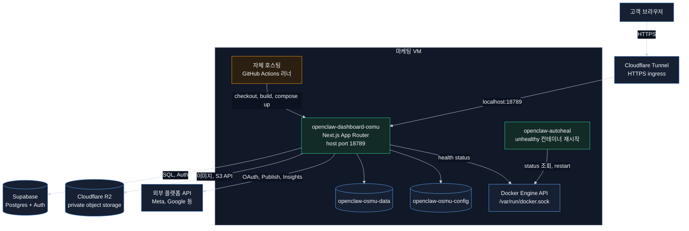
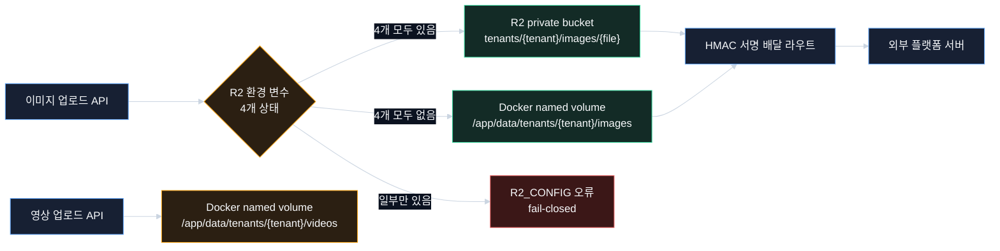
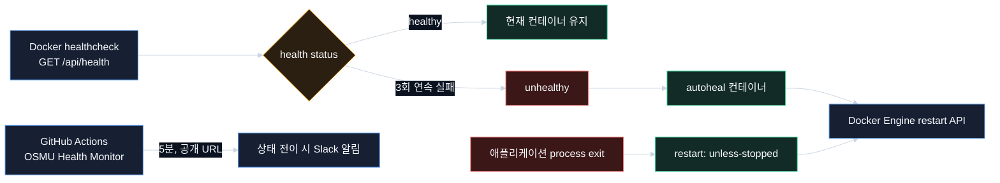

# OSMU 인프라 아키텍처

## 결론

OSMU 운영 구성은 `openclaw-dashboard-osmu` Next.js 애플리케이션 컨테이너, `openclaw-autoheal` autoheal 컨테이너, Supabase, Cloudflare Tunnel, Docker named volume, Cloudflare R2, GitHub Actions workflow로 구성된다.

`openclaw-autoheal`은 모니터링 시스템이나 healthcheck 수행 주체가 아니다. 애플리케이션 컨테이너의 Docker health status가 `unhealthy`로 변하면 Docker Engine API로 해당 컨테이너를 재시작한다.

R2는 미디어 원본을 위한 object storage다. 현재 구현에서 이미지 업로드와 배달은 R2 저장 경로에 연결돼 있지만, 영상 업로드는 Docker named volume의 로컬 경로를 사용한다. 텍스트 생성은 LLM 호출과 데이터베이스 계약에 의존하며 R2와 독립적이다. R2 장애를 텍스트 생성 장애의 원인으로 판정하면 안 된다.

## 근거 범위와 확실성

| 분류 | 판정 | 근거 |
|---|---|---|
| 저장소 구성 | 근거 확인 | `docker-compose.postagi-4tenants.yml`, `dashboard/Dockerfile`, GitHub Actions workflow, `dashboard/src/lib/media-store.ts` |
| 운영 컨테이너 2개 | 2026-08-30 관찰 기록 | 기존 VM 실측 보고와 `pipeline-state.osmu.md`. 이 작업에서 VM을 재조회하지는 않음 |
| R2 버킷 생성 | 2026-09-01 관찰 기록 | `wiki/5-hubs/hub-eng/architecture/system-architecture.md`. 이 작업에서 secret 값은 조회하지 않음 |
| 운영 이미지 업로드, R2 저장, HMAC 배달 왕복 | 미검증 | 이 문서 작업은 코드 및 문서 전용으로 운영 사용자 플로우를 실행하지 않음 |
| 영상의 R2 저장 | 구현되지 않음 | `dashboard/src/app/api/video/upload/route.ts`가 `/app/data/tenants/{tenant}/videos`에 직접 기록 |
| Cloudflare Tunnel 정확한 hostname routing | 미검증 | 정본이 저장소가 아닌 Cloudflare 설정에 있음 |

### 기존 구현 확인

- 이미지 업로드, 조회, 삭제는 `dashboard/src/lib/media-store.ts`를 통해 R2 또는 Docker named volume을 선택한다.
- 영상 업로드는 `dashboard/src/app/api/video/upload/route.ts`에서 Docker named volume에 직접 기록한다. 영상의 R2 저장은 현 구현 범위가 아니다.
- 텍스트 후보와 영상 대본, 장면 구성은 `docs/구현현황.md`에 Anthropic API와 Claude CLI 경로가 구현된 것으로 기록돼 있다. 완성 영상 렌더링은 미구현이다. 이 작업에서는 운영 LLM 호출을 재실행하지 않았으므로 실제 동작은 미검증이다.

## 1. 시스템 구성

### 컨테이너 계약

| 컨테이너 | 배포 이미지 | 네트워크 | 재시작 정책 | 역할 |
|---|---|---|---|---|
| `openclaw-dashboard-osmu` | `openclaw-auto/dashboard:0.2.0` | `network_mode: host`, `18789` | `unless-stopped` | Next.js 프론트엔드, Route Handler, 도메인 모듈 실행 |
| `openclaw-autoheal` | `willfarrell/autoheal:latest` | Docker socket | `unless-stopped` | `autoheal=true` label을 가진 `unhealthy` 컨테이너 재시작 |

Compose에는 레거시 tenant 서비스도 정의돼 있다. `openclaw-gateway-tenant1`은 `legacy-tenant1` profile에 격리돼 있고 `18789`를 사용하므로 OSMU 애플리케이션과 동시 기동하면 host port가 충돌한다. OSMU 배포 workflow에서는 `services` 입력을 `openclaw-dashboard-osmu`로 제한해 무관한 게이트웨이 빌드와 포트 충돌을 방지해야 한다.

## 2. 네트워크 경로

| 출발 | 목적지 | 프로토콜 및 경로 | 인증 및 보안 경계 |
|---|---|---|---|
| 고객 브라우저 | Cloudflare Tunnel | HTTPS | 공개 origin, 터널 라우팅은 Cloudflare 설정 소유 |
| Cloudflare Tunnel | Next.js 애플리케이션 | VM `localhost:18789` | VM에 public inbound port를 직접 노출하지 않는 구성 |
| Next.js 애플리케이션 | Supabase | PostgreSQL, HTTPS Auth | `DATABASE_URL`, Supabase URL, anon key, RLS |
| Next.js 이미지 저장 모듈 | Cloudflare R2 | S3-compatible HTTPS API | R2 access key, secret key, bucket, endpoint. 비공개 버킷 |
| Meta, Threads 서버 | Next.js 배달 라우트 | `GET /api/images/deliver/<signed-token>` 또는 `GET /api/media/<token>` | Authorization header 대신 만료 시각을 가진 HMAC 서명 토큰 |
| GitHub Actions | 자체 호스팅 러너 | GitHub Actions job 배차 | `self-hosted`, `marketing_runner` label 모두 일치해야 함 |
| GitHub 호스팅 러너 | 공개 health endpoint | `GET /api/health`, 5분 schedule | 운영 VM과 분리된 외부 가용성 감시 |

`network_mode: host`로 인해 애플리케이션 컨테이너는 Docker bridge network의 port mapping을 거치지 않고 VM host port `18789`에 바인딩한다. 이 구성은 단순하지만 host port 충돌에 취약하다.

## 3. 스토리지

### 영속 볼륨

| 볼륨 | 마운트 | 용도 | 컨테이너 재생성 영향 |
|---|---|---|---|
| `openclaw-osmu-data` | `/app/data` | 로컬 미디어와 레거시 파일 상태 | 유지 |
| `openclaw-osmu-config` | `/app/config` | 런타임 구성 파일 | 유지 |

이미지 경로에서 `media-store.ts`의 저장 모드 계약은 다음과 같다.

1. `R2_ACCESS_KEY_ID`, `R2_SECRET_ACCESS_KEY`, `R2_BUCKET`, `R2_ENDPOINT`가 모두 없으면 Docker named volume을 사용한다.
2. 네 값이 모두 있으면 R2를 사용한다.
3. 일부만 있으면 `R2_CONFIG` 오류로 업로드를 실패 처리한다. 로컬 저장으로 묵시적 fallback하지 않는다.
4. R2 객체가 404인 경우에만 기존 로컬 파일을 조회해 이전 자산을 보존한다. R2 연결 오류는 404로 간주하지 않는다.
5. R2 public URL이나 presigned URL을 외부 플랫폼에 전달하지 않는다. 외부 배달은 애플리케이션의 HMAC 서명 라우트를 사용한다.

영상 업로드 라우트는 이 저장 모듈을 사용하지 않고 `/app/data/tenants/{tenant}/videos`에 직접 기록한다. 따라서 R2를 전체 미디어에 적용됐다고 보고하면 현재 구현과 어긋난다.

### R2와 생성 기능의 관계

| 기능 | 주요 의존성 | R2 장애의 직접 영향 |
|---|---|---|
| 텍스트 후보 생성 | LLM provider, 생성 권한, 프롬프트, `usage_quotas`, `usage_events` | 없음 |
| 이미지 생성 | 이미지 생성 provider, 생성 job | 생성된 원본의 영속화 단계에 영향 |
| 영상 대본, 장면 구성 | LLM provider, 생성 권한, 프롬프트 | 직접 영향 없음 |
| 완성 영상 렌더링 | 영상 생성 provider 또는 ffmpeg 경로 | 현재 미구현. 영상 업로드는 로컬 볼륨을 사용하므로 R2와 독립 |
| 이미지 편집 | 편집 엔진, 원본 조회 | 원본이 R2에만 있고 R2가 불가용하면 영향 |
| 영상 편집 | 편집 엔진, 로컬 원본 조회 | 현재 영상 경로 기준 직접 영향 없음 |
| 소셜 플랫폼 발행 | OAuth 토큰, provider API, 발행 멱등성 | 미디어 게시물의 원본 배달에 영향. 텍스트 전용 게시물은 독립 |

따라서 R2 미설정이 텍스트 생성 실패를 설명하지 못한다. R2 네 값이 전부 없으면 이미지는 Docker named volume을 사용하고, 영상은 현재 구현에서 항상 Docker named volume을 사용한다. R2 일부 설정 또는 R2 연결 오류는 이미지 저장 실패로 분류해야 한다.

## 4. healthcheck와 재시작 정책

| 계층 | 구성 | 탐지 대상 | 액션 | 한계 |
|---|---|---|---|---|
| Docker restart policy | `restart: unless-stopped` | 애플리케이션 process termination | 컨테이너 재시작 | process가 종료되지 않은 hang은 직접 탐지하지 못함 |
| Docker healthcheck | 30초 간격, 8초 timeout, 3회 retries, 40초 start period | `/api/health` 실패 | health status를 `unhealthy`로 변경 | endpoint가 장애를 정상으로 응답하면 탐지하지 못함 |
| autoheal | 15초 간격, 60초 start period | `autoheal=true` label + `unhealthy` | Docker Engine API restart | Docker socket 접근 권한이 크고, VM 장애나 Docker daemon 장애를 복구하지 못함 |
| 외부 health monitor | GitHub-hosted runner, 5분 schedule | 공개 `/api/health` HTTP 200 여부 | 상태 전이에 Slack 알림 | 알림이지 자동 복구가 아님 |

## 5. CI/CD 파이프라인

```mermaid
%%{init: {"theme":"base","themeVariables":{"background":"#0b1220","primaryColor":"#172033","primaryTextColor":"#f8fafc","primaryBorderColor":"#60a5fa","lineColor":"#cbd5e1","secondaryColor":"#132b26","secondaryTextColor":"#f8fafc","secondaryBorderColor":"#34d399","tertiaryColor":"#2b1f12","tertiaryTextColor":"#f8fafc","tertiaryBorderColor":"#f59e0b","clusterBkg":"#111827","clusterBorder":"#64748b","edgeLabelBackground":"#0b1220","textColor":"#f8fafc"}}}%%
flowchart LR
  Commit["Git commit<br/>GITHUB_SHA"] --> Dispatch["workflow_dispatch<br/>Deploy openclaw"]
  Dispatch --> Runner["자체 호스팅 러너<br/>marketing_runner"]
  Runner --> Checkout["actions/checkout"]
  Checkout --> Preflight["DB schema<br/>read-only preflight"]
  Preflight --> Build["docker compose build<br/>서비스별 순차 빌드"]
  Build --> Image["openclaw-auto/dashboard:0.2.0<br/>OCI revision=GITHUB_SHA"]
  Image --> Up["docker compose up -d"]
  Up --> Smoke["로그인, 인증, Supabase inline,<br/>Google OAuth, operator API 스모크"]
  Smoke --> Cleanup["unused image, build cache,<br/>stopped container 정리"]
  Smoke -->|FAIL| Rollback["이전 컨테이너 rename 복구"]

  style Commit fill:#172033,color:#f8fafc,stroke:#60a5fa
  style Dispatch fill:#172033,color:#f8fafc,stroke:#60a5fa
  style Runner fill:#2b1f12,color:#f8fafc,stroke:#f59e0b
  style Checkout fill:#172033,color:#f8fafc,stroke:#60a5fa
  style Preflight fill:#172033,color:#f8fafc,stroke:#60a5fa
  style Build fill:#132b26,color:#f8fafc,stroke:#34d399
  style Image fill:#132b26,color:#f8fafc,stroke:#34d399
  style Up fill:#132b26,color:#f8fafc,stroke:#34d399
  style Smoke fill:#132b26,color:#f8fafc,stroke:#34d399
  style Cleanup fill:#172033,color:#f8fafc,stroke:#60a5fa
  style Rollback fill:#3b1717,color:#f8fafc,stroke:#f87171
```

### workflow 구분

| workflow | 파일 | trigger | 러너 | 책임 |
|---|---|---|---|---|
| CI | `.github/workflows/ci.yml` | push, pull request 정책 | GitHub-hosted | 테스트와 정적 검증 |
| Deploy openclaw | `.github/workflows/deploy-marketing.yml` | `workflow_dispatch` | `self-hosted`, `marketing_runner` | secret로 `.env.osmu` 렌더, DB preflight, 이미지 빌드, Compose 기동, 스모크, 정리 |
| OSMU DB Migration | `.github/workflows/osmu-db-migrate.yml` | 수동 단계 선택 | `self-hosted`, `marketing_runner` | 승인 환경에서 명시한 migration phase만 실행 |
| OSMU Health Monitor | `.github/workflows/osmu-health-monitor.yml` | 5분 schedule, 수동 | GitHub-hosted | 외부 healthcheck와 상태 전이 알림 |

### Git 소스 리비전과 Docker 이미지 태그

`openclaw-auto/dashboard:0.2.0`과 `GITHUB_SHA`는 목적이 다르다.

| 값 | 예시 | 생성 지점 | 용도 |
|---|---|---|---|
| Docker 이미지 태그 | `openclaw-auto/dashboard:0.2.0` | Compose service 정의 | 빌드와 기동 대상 선택 |
| Git 소스 리비전 | GitHub Actions `GITHUB_SHA` | workflow 실행 커밋 | 이미지가 어느 코드 상태로 빌드됐는지 식별 |
| OCI 이미지 리비전 라벨 | `org.opencontainers.image.revision=<GITHUB_SHA>` | `dashboard/Dockerfile` build stage | 실행 이미지와 Git 소스 리비전 추적 |

배포 workflow는 `OSMU_BUILD_COMMIT=${GITHUB_SHA}`를 `.env.osmu`에 기록하고 Compose build argument `BUILD_COMMIT`으로 전달한다. Dockerfile은 그 값을 OCI 라벨에 기록한다. 이 값을 보관하는 이유는 배포된 컨테이너가 어느 Git 소스 리비전에서 빌드됐는지 확인하고 DB migration compatibility를 검증하기 위해서다. 이미지 태그가 고정돼 있어도 리비전 라벨은 빌드마다 달라진다.

이 구성의 리스크는 고정 태그 `0.2.0`이 매 배포에서 다른 이미지를 가리키는 mutable tag라는 점이다. rollback과 공급망 추적성을 강화하려면 release tag 또는 digest로 배포 대상을 고정해야 한다. 이 문서는 현행 구성을 보고하며 tag 정책을 변경하지 않는다.

## 6. 런타임 환경 변수와 secret 경계

| 분류 | 예 | 주입 시점 | 노출 정책 |
|---|---|---|---|
| build-time public value | `NEXT_PUBLIC_SUPABASE_URL`, `NEXT_PUBLIC_SUPABASE_ANON_KEY`, `NEXT_PUBLIC_GA_MEASUREMENT_ID` | Docker 이미지 빌드 | 클라이언트 번들에 inline. secret이 아님 |
| runtime secret | `DATABASE_URL`, `OSMU_SECRET_KEY`, OAuth client secret, R2 secret key | Compose `env_file` | GitHub Actions secret에서 `.env.osmu`로 렌더. 원문 로깅 금지 |
| runtime non-secret | `OSMU_PUBLIC_URL`, `R2_BUCKET`, `R2_ENDPOINT`, `OSMU_BUILD_COMMIT` | Compose `env_file` | secret 값과 같은 전달 경로를 쓰더라도 보안 등급은 다름 |
| 런타임 인증 볼륨 | host `~/.claude` to container `/root/.claude:ro` | Compose bind mount | 공유 Claude CLI fallback용. 읽기 전용 |

`.env.osmu`는 GitHub Actions 러너에서 `umask 077`로 생성된다. 이 파일의 원문과 secret 값은 본 보고서에 포함하지 않는다.

## 7. 장애 경계와 운영 리스크

| 리스크 | 영향 | 현재 제어 | 남은 불확실성 |
|---|---|---|---|
| VM 단일 장애점 | 애플리케이션, autoheal, self-hosted runner가 함께 중단 | GitHub-hosted 외부 health monitor | failover와 RTO 미검증 |
| Docker socket 마운트 | autoheal과 애플리케이션이 Docker Engine 제어 권한 보유 | label로 autoheal 대상 제한 | socket compromise의 blast radius가 큼 |
| `network_mode: host` | port 충돌, 네트워크 격리 축소 | 레거시 tenant1 profile 격리 | 잘못된 다중 서비스 기동 시 충돌 가능 |
| mutable image tag `0.2.0` | 같은 tag가 다른 이미지를 가리킴 | OCI revision label | digest 고정 배포 아님 |
| R2 일부 설정 | 이미지 업로드 실패 | fail-closed | 운영 secret 전체 주입과 실 왕복 미검증 |
| 영상 저장의 R2 미연결 | 영상 원본이 VM의 named volume에만 남음 | named volume 영속성 | R2 전환과 외부 배달 계약이 미설계 |
| Cloudflare 라우팅 정본의 저장소 외부 존재 | 변경 추적 불가 | 운영 인벤토리와 수동 대조 필요 | 이 작업에서 콘솔 재확인 안 함 |

## 8. 회장 지적 종결 대조

| 지적 | 교정 결과 |
|---|---|
| R-S10-01 | 비표준 명칭을 컨테이너, healthcheck, self-hosted runner, Route Handler, Docker volume, OCI label로 교체 |
| R-S10-02 | autoheal을 healthcheck 수행 주체가 아닌 `unhealthy` 컨테이너 재시작 주체로 분리 |
| R-S10-03 | 일반 개념 풀이를 제거하고 저장소의 실제 파일, 값, 한계를 기술 |
| R-S10-04 | 프론트엔드 렌더링과 API 라우트로 교체 |
| R-S10-07 | `GITHUB_SHA`, Docker image tag, OCI `org.opencontainers.image.revision` label의 차이와 보관 이유를 명시 |
| R-S10-10 | R2를 미디어 원본 저장 계층으로 한정하고 텍스트 생성 원인과 분리. 현재 R2 연결 범위는 이미지이며 영상은 로컬 볼륨이라는 구현 차이도 명시 |

## 9. 사용자 흐름 추적성과 build 게이트

이 보고서는 인프라 현황과 용어 교정을 다루며 API, 프론트엔드 component, DB schema를 변경하지 않는다. 따라서 이 작업으로 추가된 user-flow step은 0개이고, 추가 매핑 gap도 0개다.

다만 기존 `docs/user-flow.md:879-900`에 17개의 미확정 gap이 남아 있다. 이 항목들은 endpoint, 프론트엔드 component, DB table에 1:1로 매핑될 수 없다. 따라서 전체 기술설계 기준의 build stage 진입은 **불가**다. 이 보고서는 문서 교정 작업의 종료 증거이지, 기존 user-flow gap을 닫았다는 증거가 아니다.

## 10. 벤치마크 적용

- Docker Compose 공식 문서의 `healthcheck`와 `restart` 계약을 차용했다. 이 저장소에서는 process termination 재시작, health status 판정, autoheal 액션을 세 계층으로 분리했다: https://docs.docker.com/reference/compose-file/services/
- GitHub 공식 self-hosted runner 문서의 label routing을 차용했다. 이 저장소에서는 `self-hosted`와 `marketing_runner`를 모두 요구한다: https://docs.github.com/en/actions/how-tos/manage-runners/self-hosted-runners/use-in-a-workflow
- OCI Image Spec의 소스 리비전 annotation을 차용했다. 이 저장소에서는 `GITHUB_SHA`를 `org.opencontainers.image.revision`에 기록한다: https://github.com/opencontainers/image-spec/blob/main/annotations.md
- Cloudflare R2 공식 문서의 S3-compatible object storage 계약을 차용했다. R2를 생성 엔진이 아닌 미디어 원본 저장 계층으로 한정했다: https://developers.cloudflare.com/r2/how-r2-works/
- autoheal 제작자 README의 label 기반 `unhealthy` 컨테이너 재시작 계약을 차용했다: https://github.com/willfarrell/docker-autoheal

## 11. 레드팀과 셀프심문

**레드팀 공격.** 회의적인 SRE는 이 문서가 Compose 정의를 운영 상태로 오판한다고 공격할 수 있다. 맞는 공격이다. 그래서 저장소 구성은 `근거 확인`, 기존 VM 실측은 `2026-08-30 관찰 기록`, 현재 운영 R2 왕복과 Cloudflare routing은 `미검증`으로 분리했다.

**이 결론이 틀렸다면 가장 그럴듯한 이유.** 배포 workflow에 R2 secret 참조가 있어도 실제 GitHub secret이 비어 있거나 최신 컨테이너가 이전 이미지일 수 있다. 따라서 R2의 운영 사용 상태를 단정하지 않고 실 미디어 왕복을 미검증으로 남겼다.

**셀프심문.** 내가 쓴 설명 중 회장이 이미 아는 것을 굳이 풀어 쓴 문장이 있는가? 초안에는 Docker 컨테이너와 GitHub Actions의 일반 정의가 있었다. 그 문장을 제거하고 컨테이너 이름, port, interval, retry, workflow trigger, image tag, OCI label 같은 이 저장소의 값만 남겼다.

---

STAMP | line: osmu-terms0901 | 생성: 2026-09-01 06:55 KST | model: gpt-5.6-sol | agent: tech-architect

skills: SKILLS_SKIPPED. 설치된 스킬 중 인프라 아키텍처 보고서에 직접 매칭되는 스킬 없음.

근거: `wiki/거버넌스/결정.md` ADR-004, ADR-006, 표준 IT 용어 결정 | `wiki/거버넌스/실수.md` | `wiki/거버넌스/요청.md` | `wiki/5-hubs/hub-eng/architecture/system-architecture.md` | `docs/qa/회장-세션발화-전건-대조표-2026-08-31.md` | `docs/구현현황.md` | `DESIGN.md` | `docs/user-flow.md` | `wiki/5-hubs/hub-eng/architecture/data-model.md` | `docker-compose.postagi-4tenants.yml` | `.github/workflows/*.yml` | `dashboard/Dockerfile` | `dashboard/src/lib/media-store.ts` | `dashboard/src/app/api/video/upload/route.ts` | 공식 및 1차 소스 URL 5건

고민: 저장소에 정의된 구성과 현재 운영 상태를 같은 사실로 쓰지 않았다. 구성은 파일 근거로 확정하고, 이 작업에서 운영 왕복을 재현하지 않은 항목은 미검증으로 남겼다.

SKILLS_USED: 없음

SKILLS_SKIPPED: 인프라 아키텍처 보고서에 직접 매칭되는 설치 스킬 없음

SOURCES: `wiki/거버넌스/결정.md` | `wiki/거버넌스/실수.md` | `wiki/거버넌스/요청.md` | `wiki/5-hubs/hub-eng/architecture/system-architecture.md` | `docs/qa/회장-세션발화-전건-대조표-2026-08-31.md` | `docs/구현현황.md` | `pipeline-state.osmu.md` | `DESIGN.md` | `docs/user-flow.md` | `wiki/5-hubs/hub-eng/architecture/data-model.md` | `docker-compose.postagi-4tenants.yml` | `.github/workflows/deploy-marketing.yml` | `.github/workflows/osmu-db-migrate.yml` | `.github/workflows/osmu-health-monitor.yml` | `.github/workflows/ci.yml` | `dashboard/Dockerfile` | `dashboard/src/lib/media-store.ts` | `dashboard/src/app/api/video/upload/route.ts` | https://docs.docker.com/reference/compose-file/services/ | https://docs.github.com/en/actions/how-tos/manage-runners/self-hosted-runners/use-in-a-workflow | https://github.com/opencontainers/image-spec/blob/main/annotations.md | https://developers.cloudflare.com/r2/how-r2-works/ | https://github.com/willfarrell/docker-autoheal

MODEL: gpt-5.6-sol
