<!--
STAMP
파일: docs/user-flow.md (stages.yaml design.artifacts 첫 항목. 경로 고정)
판: user-flow v1 (4실 구조 기준 전면 개정. 직전 v24 흐름 문서를 대체한다)
생성: 2026-08-18 21:40 KST
model: claude-fable-5
agent: product-designer
skills: 없음 호출. 이번 산출은 화면이 아니라 흐름 문서다. design-html·design-shotgun·design-review는 화면 산출물 스킬이라 미해당이며, 위임서가 프로토타입 제작을 명시적으로 금지했다. (SKILLS_SKIPPED 상세는 문서 끝)
기반 산출물 (버전핀, 전부 실제 Read):
  - docs/prd-openclaw-service-v8.2.1-gpt-codex.md (정본. §3.3·§3.4·§3.6·§3.7·§3.8·§3.9·§4·§6.3·§7·§8 FR-OS81-001~028·FR-OS82-029~044)
  - docs/requests/회장-확정-요구사항-대장.md (R01~R23 전량)
  - docs/requests/2026-08-17-회장-4실-구조-구상.md (원문 + 회신 5건)
  - docs/requests/2026-08-16-회장-유저플로우-전면개정.md (원문)
  - wiki/architecture/two-service-boundary.md
  - docs/design-docs/channel-capability-and-readiness-contract-v1-opus.md
  - docs/design-docs/v38-개선제안-fable.md
  - docs/prototype/openclaw-auto-4room-v38.html (현재 화면 상태)
  - dashboard/src/components/layout/Sidebar.tsx, dashboard/src/components/channel/ (실구현)
  - DESIGN.md v18
벤치마크: Planable 콘텐츠 워크플로 문서(생성·내부검토·외부검토 3단 승인), Buffer(승인 워크플로 없음, 예약·성과 중심) 실조사 1건. 빌린 것 = 승인이 별도 단계가 아니라 발행 단계의 하위 보관함이라는 배치. 버린 것 = 다자 승인 체인(1인 사용자에 과함)
고민 한 줄: 회장이 물은 것은 그림이지만 값이 있는 산출은 그림이 아니라 PRD가 답하지 않는 자리 목록이다. 그래서 도식은 짧게 그리고 빈틈에 지면을 몰았다.
-->

# 유저 플로우: 생성 · 편집 · 발행 · 성과

## v68 최신 증분 · 생성실과 성과실 여섯 상태를 닫는다 (2026-09-03)

기반은 `docs/prototype/osmu-v67-edit-publish-hub-gpt-codex-20260902-0448.html`, DESIGN.md v37, 실제 `StudioRooms.tsx`, 홈의 `PerformanceRoom.tsx`, `PerformanceChatPanel.tsx`, `AutomationRulesPanel.tsx`다. 기존 네 단계와 현재 기능을 유지하고, 생성실과 성과실의 비교 가능한 화면 및 상태 경로만 추가한다.

### 생성실 happy path

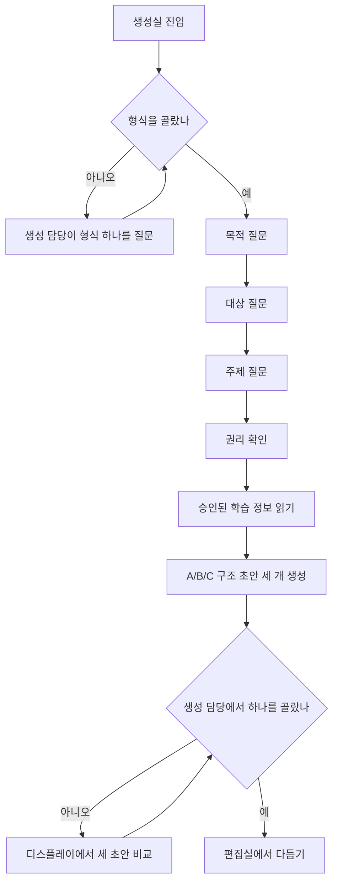

### 생성실 edge, empty, error, loading

| 진입 상태 | 사용자에게 보이는 것 | 가능한 행동 | 종료 경로 |
|---|---|---|---|
| 빈 상태 | 구조 초안 0건, 시작 순서 | 형식부터 고르기, 학습 정보 확인 | 형식 질문으로 연결 |
| 불러오는 중 | 카드 3개 형태의 뼈대, 입력 보존 안내 | 입력 내용 확인 | 생성 완료 뒤 비교로 연결 |
| 오류 | 실패 이유, 목적·대상·주제·학습 정보 보존 | 다시 만들기, 입력 내용 확인 | 재시도 또는 질문 수정 |
| 공유 AI 승인 대기 | 사용 불가 이유, 입력 보존, 다시 열리는 조건 | 승인 상태 확인, 자체 AI 연결 확인 | 승인 완료 뒤 같은 입력으로 생성 |
| 긴 내용 | 긴 제목, 본문, 학습 정보 다중 태그 | 세로 스크롤 | A/B/C 선택 또는 편집실 이동 |

생성실 dead-end: 0. 모든 상태에서 질문 재개, 재시도, 승인 상태 확인, 편집실 이동 중 하나로 끝난다.

### 성과실 후보 happy path

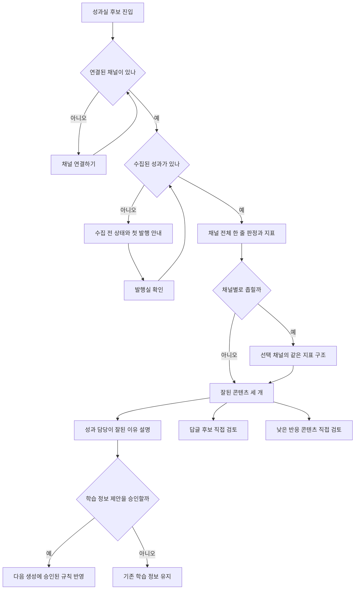

### 성과실 edge, empty, error, loading

| 진입 상태 | 사용자에게 보이는 것 | 가능한 행동 | 종료 경로 |
|---|---|---|---|
| 빈 상태 | 숫자 0이 아닌 수집 전 상태 | 발행실 확인, 수집 기준 보기 | 첫 발행 또는 안내 확인 |
| 불러오는 중 | 필터와 지표 자리를 유지한 뼈대 | 다른 방 이동 | 수집 완료 뒤 같은 방으로 복귀 |
| 오류 | 마지막 확인 시점의 성과와 일부 실패 안내 | 다시 불러오기, 마지막 성과 보기 | 재시도 또는 보존본 확인 |
| 채널 미연결 | 연결 필요 이유와 심사 전 임시 안내 | 채널 연결하기, 연결 안내 보기 | 연결 뒤 성과 수집 시작 |
| 긴 내용 | 긴 판정, 많은 콘텐츠와 반응 | 채널 필터, 세로 스크롤 | 다음 행동 또는 직접 검토 |

성과실 dead-end: 0. 채널 연결 버튼은 심사 전 안내와 무관하게 활성 상태를 유지하며, 자동 삭제는 어떤 경로에도 없다.

### 정보구조 분기

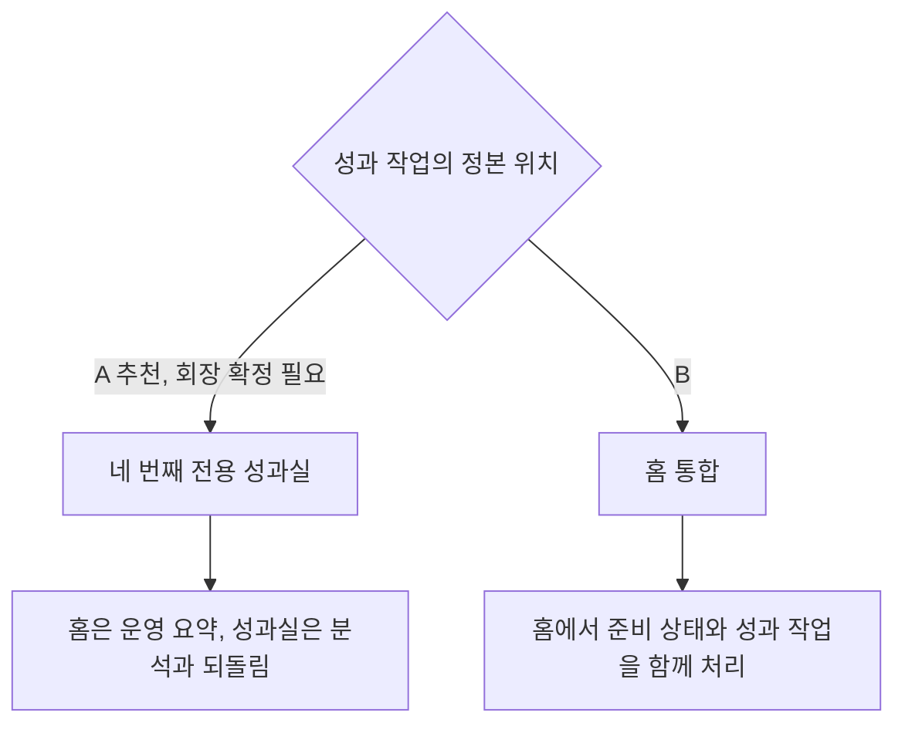

⛔ 회수 필요: 전용 성과실과 홈 통합 중 하나를 회장이 확정해야 한다. v68 시안은 A를 비교 가능한 후보로 만들었지만 정본으로 선언하지 않는다.

### v68 품질 계약

SKILLS_USED: 없음
SKILLS_SKIPPED: imagegen. 기존 UI 시스템을 계승하는 코드 기반 제품 흐름이라 래스터 생성 작업과 맞지 않는다.

SOURCES: `docs/prototype/osmu-v67-edit-publish-hub-gpt-codex-20260902-0448.html`; `dashboard/src/components/studio/StudioRooms.tsx`; `dashboard/src/components/home/PerformanceRoom.tsx`; `dashboard/src/components/home/PerformanceChatPanel.tsx`; `dashboard/src/components/home/AutomationRulesPanel.tsx`; https://www.canva.com/help/use-magic-design/; https://buffer.com/insights
MODEL: gpt-codex/gpt-5.6

## v66 최신 증분 · 계정 정보와 게시물 필드를 분리한다 (2026-09-01)

기반은 승인된 `docs/prototype/openclaw-auto-4room-v64.html`, DESIGN.md v34, 실제 `PlatformPreview.tsx`와 `studio/page.tsx`, `docs/reference/플랫폼-발행-필드-규격-2026-09-01.md`다. 기존 일곱 플랫폼 미리보기와 발행 행동은 유지한다. 이번 증분은 R-S10-39, R-S10-40, R-S10-42에 따라 표시 이름 소유권, 실제 플랫폼 필드, 사용자 용어를 바로잡는다.

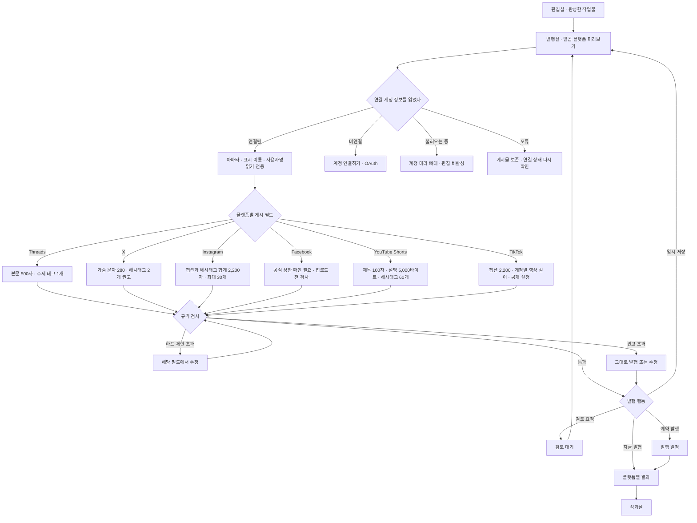

### 기본 경로

1. 편집실에서 완성한 작업물과 기존 플랫폼별 문구를 발행실로 가져온다.
2. 발행실은 OAuth로 연결한 플랫폼 계정의 아바타, 표시 이름, 사용자명을 읽는다.
3. 계정 정보는 읽기 전용으로 보여 준다. 잘못 연결한 경우 `연결 계정 바꾸기`로 이동한다.
4. 사용자는 플랫폼마다 실제로 있는 게시 필드만 고친다.
5. 카운터는 플랫폼의 실제 계산법을 쓴다. 공식 상한을 확인하지 못한 값은 `규격 확인 필요`로 표시한다.
6. 하드 제한 초과는 해당 필드에서 수정한다. 권고 초과는 경고를 읽고 그대로 발행하거나 수정한다.
7. `임시 저장하기`, `검토 요청하기`, `선택한 곳에 지금 발행`, `예약 발행` 중 하나를 고른다.

### 상태별 경로와 종료점

| 진입 상태 | 보여주는 것 | 사용자 행동 | 다음 화면 | 막다른 길 |
|---|---|---|---|---|
| 정상 | 일곱 플랫폼과 읽기 전용 계정, 실제 게시 필드 | 문구 수정 뒤 발행 행동 선택 | 검토 대기, 발행 결과, 발행 일정 | 없음 |
| 계정 미연결 | 연결 계정 없음과 대상 플랫폼 | 계정 연결하기 | OAuth 연결 뒤 발행실 복귀 | 없음 |
| 계정 정보 불러오는 중 | 계정 머리 뼈대와 비활성 편집기 | 기다림 | 정상 또는 오류 | 없음 |
| 계정 정보 오류 | 고친 게시물 보존 여부와 실패 원인 | 연결 상태 다시 확인하기 또는 계정 바꾸기 | 정상 또는 연결 화면 | 없음 |
| 하드 제한 초과 | 붉은 카운터와 초과 필드 | 제한 이내로 수정 | 발행 가능 상태 | 없음 |
| 권고 초과 | 주황 경고와 권고 이유 | 그대로 발행 또는 수정 | 발행 결과 또는 정상 | 없음 |
| 공식 상한 미확인 | `규격 확인 필요`와 업로드 전 검사 안내 | 게시 시 검사 결과 확인 | 발행 성공 또는 플랫폼 오류 | 없음 |
| 게시 실패 | 플랫폼명, 실패 원인, 성공한 플랫폼 결과 | 실패한 곳만 다시 시도 | 발행 결과 | 없음 |
| 검토 요청 | `검토 대기`에 보관됐다는 결과 | 발행실로 돌아가기 | 발행실 | 없음 |
| 심사 전 한시 상태 | `플랫폼 연결 준비 중`과 테스트 절차 | 제공된 절차로 확인 | 발행실 또는 연결 화면 | 없음. App Review 통과 뒤 자동 제거 |

### 소유권 경계

| 값 | 소유 위치 | 발행실 행동 |
|---|---|---|
| 표시 이름, 사용자명, 아바타 | 연결한 플랫폼 계정 | 읽기 전용 표시, 연결 계정 교체만 허용 |
| 제목, 본문, 캡션, 설명, 해시태그, 주제 태그 | 플랫폼별 게시물 | 미리보기 안 직접 편집 |
| OAuth 권한과 연결 상태 | 채널 연결 | 연결 또는 재연결 |
| 심사 전 임시 절차 | OSMU 운영과 App Review 상태 | ADR-006에 따라 한시 안내, 심사 통과 뒤 자동 제거 |
| 달린 댓글의 답글 | 성과실 | 발행실에 두지 않음 |

### 용어 경로

| 이전 표현 | 사용자 표현 | 이유 |
|---|---|---|
| 승인 인박스로 보내기 | 검토 요청하기 | 무엇을 하는 행동인지 동사로 말함 |
| 승인 인박스 | 검토 대기 | 요청 뒤 작업물이 어디에 있는지 상태로 말함 |
| 운영자 API | 플랫폼 연결 준비 중 | 내부 구현 주체가 아니라 사용자가 겪는 상태를 말함 |

### 레드팀과 셀프심문

까다로운 고객의 공격: 모든 제한을 화면에 늘어놓으면 발행보다 규격 공부가 주인공이 된다.

수정: 정상일 때는 라벨 옆 카운터와 미디어 한 줄만 보여 준다. 상세 규칙은 초과 또는 오류가 생긴 필드에서만 펼친다. 오른쪽 행동 열에는 선택한 곳과 확인할 규격 수만 남긴다.

질문: 이 흐름이 틀렸다면 가장 그럴듯한 이유는 무엇인가?

답: 연결 계정 정보를 늦게 불러와 사용자가 이미 고친 뒤 대상 계정이 다르다는 것을 알게 되는 경우다. 그래서 계정 머리를 게시 필드보다 먼저 렌더하고, 계정 조회 중에는 편집과 발행 행동을 비활성화한다.

질문: 내가 적은 규격 중 출처 없이 기억으로 쓴 값이 있는가?

답: 없다. 모든 수치는 `docs/reference/플랫폼-발행-필드-규격-2026-09-01.md`의 공식 출처를 따른다. 공식 고정 상한을 확인하지 못한 값은 숫자 없이 `규격 확인 필요`로 남겼다.

SKILLS_USED: 없음. 현재 제공된 스킬 목록에 제품 화면 설계용 스킬이 없다.
SKILLS_SKIPPED: design-review 계열 스킬이 현재 세션에 제공되지 않아 수동 상태 점검으로 대체했다.

SOURCES: DESIGN.md v34; docs/prototype/openclaw-auto-4room-v64.html; docs/reference/플랫폼-발행-필드-규격-2026-09-01.md; wiki/거버넌스/결정.md ADR-004, ADR-006; Meta, X, Google, TikTok 공식 문서
MODEL: gpt-codex/gpt-5.6-sol

## v65 최신 증분 · 편집 대상과 발행 채널을 분리한다 (2026-09-01)

기반은 승인된 4개 방 구조 `docs/prototype/openclaw-auto-4room-v64.html`과 DESIGN.md v33이다. 기존 방 순서와 셸은 바꾸지 않는다. 이번 증분은 회장 지적 R-S10-31~38, R-S10-41에 따라 편집실 안의 형식, 편집 대상, 저장, 발행실 이동을 다시 연결한다.

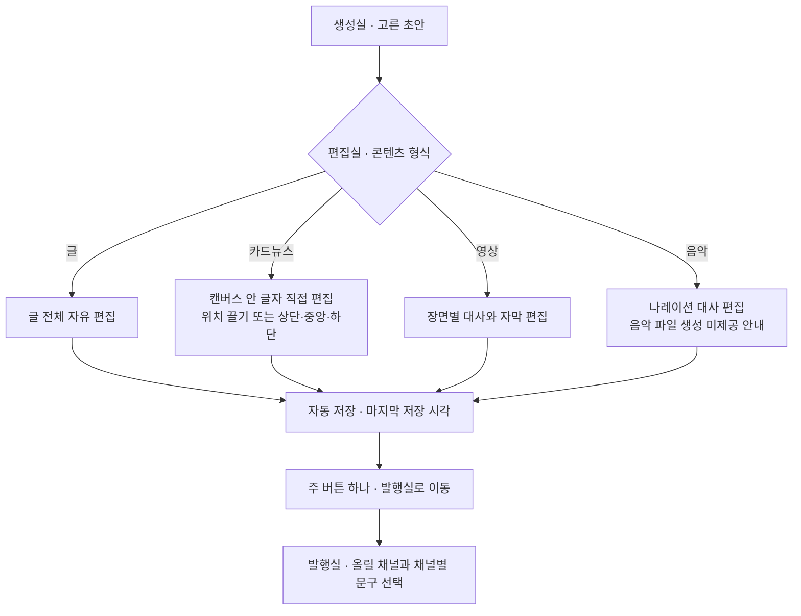

### 기본 흐름

1. 생성실에서 초안을 고르면 편집실에 도착한다.
2. 편집실 상단에서 만드는 형식을 글, 카드뉴스, 영상, 음악 중 하나로 확인하거나 바꾼다.
3. 형식에 맞는 결과물 자체를 고친다. 글은 전체 글, 카드뉴스는 캔버스, 영상은 장면, 음악은 나레이션 대사다.
4. 변경은 자동 저장된다. 마지막 저장 시각을 `발행실로 이동` 바로 위에서 확인한다.
5. `발행실로 이동`을 누른다.
6. 발행실에서 스레드, 인스타그램 등 올릴 채널과 채널별 문구를 정한다.

### 상태별 흐름과 종료점

| 진입 상태 | 보여주는 것 | 사용자 행동 | 다음 화면 | 막다른 길 |
|---|---|---|---|---|
| 정상 | 형식별 편집기와 자동 저장 상태 | 결과물 편집 후 발행실로 이동 | 발행실 | 없음 |
| 빈 상태 | `아직 편집할 작업물이 없습니다`와 이유 | 생성실에서 작업물 고르기 | 생성실 | 없음 |
| 불러오는 중 | 편집기 뼈대 화면 | 기다림 | 편집실 정상 또는 오류 | 없음. 발행실 이동 비활성 |
| 오류 | 마지막 저장본 보존 여부와 원인 | 다시 불러오기 | 편집실 정상 | 없음 |
| 긴 내용 | 12개 이상 목차와 긴 본문 | 독립 스크롤하며 편집 | 발행실 | 없음. 가로 넘침 없음 |
| 음악 파일 생성 미제공 | 제공하지 않는 범위와 가능한 대사 편집 | 대사 편집 또는 다른 형식 선택 | 편집실 정상 | 없음. 기능을 조용히 숨기지 않음 |
| 자동 저장 실패 | 저장되지 않은 변경과 재시도 안내 | 다시 저장 시도 또는 내용 복사 | 편집실 정상 | 없음. 발행실 이동 비활성 |
| 발행실 이동 실패 | 연결 실패와 현재 편집본 보존 | 다시 이동 | 발행실 | 없음 |

### 형식과 플랫폼의 소유 경계

| 결정 | 소유 화면 | 이유 |
|---|---|---|
| 글, 카드뉴스, 영상, 음악 중 무엇을 만드는가 | 편집실 | 결과물 편집 도구를 정하는 결정이다 |
| 스레드, 인스타그램 등 어디에 올리는가 | 발행실 | 계정 연결, 채널별 길이와 문구를 정하는 결정이다 |
| 카드 비율, 글자 위치, 영상 자막 | 편집실 | 결과물 자체의 모양이다 |
| 채널별 캡션, 첫 댓글, 발행 시각 | 발행실 | 게시 대상과 게시 조건이다 |

히크의 법칙에 따라 성격이 다른 두 결정을 한 줄에 섞지 않는다. 야콥의 법칙에 따라 글은 문서 편집기처럼 전체 본문을, 카드뉴스는 캔버스처럼 대상 안의 텍스트를 직접 고친다. 포그 행동모델에 따라 주 촉발은 `발행실로 이동` 하나만 둔다. 오류는 닐슨의 오류 회복 원칙에 따라 보존 여부와 다음 행동을 한 문장 안에서 말한다.

셀프심문: 이 흐름이 틀렸다면 가장 그럴듯한 이유는 자동 저장만으로 사용자가 저장 완료를 믿지 못하는 것이다. 이를 줄이기 위해 저장을 별도 주 행동으로 되돌리지 않고 마지막 저장 시각과 실패 상태를 주 버튼 가까이에 둔다. 주 행동을 하나로 유지하면서 신뢰 근거를 보강한다.

벤치마크: [Canva 텍스트 편집](https://www.canva.com/help/add-and-edit-text/), [Canva 위치와 정렬](https://www.canva.com/help/layer-group-align/?query=group), [Google Docs 문서 편집](https://support.google.com/docs/answer/7068618?hl=ko). 차용한 것은 캔버스 안 직접 편집, 위치 조정, 전체 문서 편집이다. 발행 채널 결정을 별도 방으로 미룬 것은 OSMU의 4개 방 구조에 맞춘 차별화다.

SKILLS_USED: 없음. 현재 제공된 스킬 목록에 제품 화면 설계용 스킬이 없다.
SKILLS_SKIPPED: design-review 계열 스킬이 현재 세션에 제공되지 않아 수동 상태 점검으로 대체했다.

SOURCES: DESIGN.md v33; docs/prototype/openclaw-auto-4room-v64.html; wiki/거버넌스/요청.md; Canva Help; Google Docs Help
MODEL: gpt-codex/gpt-5.6-sol

## v55 최신 증분 · 모르는 채로 만들지 않는다 (2026-08-25)

회장 지적 R168에서 나온 증분이다. 원문은 "화면 보면 학습정보 어떻게 받는지는 하나도 고려안하고 있는 것 같은데 사업계획이나 PRD는 보고 작업하는지도 모르겠음. 유저 플로우를 잘 이해를 못하는 병신같음"이다.

**무엇이 빠져 있었나.** 학습 정보를 넣는 화면은 v28부터 있었다(네 갈래: 직접 고쳐 넣기 · 위키와 노션 가져오기 · 원본 넣어 결 맞추기 · 고를 때 물어보고 배우기). 빠진 것은 그 앞이다. **첫 손님이 학습 정보를 넣고 첫 생성으로 가는 길이 주 흐름에 없었다.** 그래서 갓 가입한 손님도 생성 1단계에서 "오늘 만들 수 있는 화면 세 장입니다"를 봤다. 아무것도 안 받은 상태에서 무엇을 근거로 뽑았는지 화면이 답하지 못했다.

이 증분의 기준은 사업계획 §3.4.2 가. 시간축이다. 이 문서 §4.1(첫 가입 갈래 7단계)은 그대로 유효하고, 그 앞에 **무엇을 받아야 그 7단계가 성립하는지**를 명시한다.

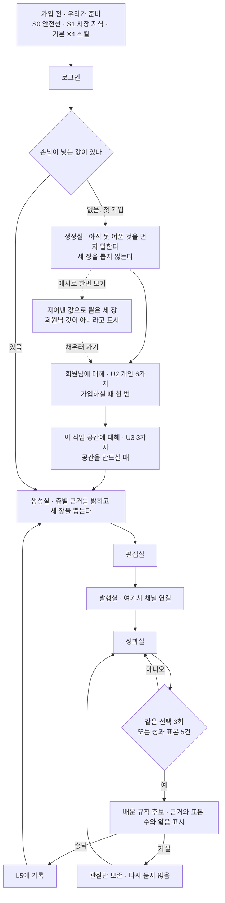

### 이 증분이 닫는 dead-end 셋

| 무엇이 막혀 있었나 | 어떻게 닫았나 |
|---|---|
| 첫 손님이 아무것도 안 준 채 생성실에 도착하면 지어낸 세 장을 자기 것으로 오해한다 | 안 받은 값이 남아 있으면 세 장을 뽑지 않는다. 무엇을 못 여쭀는지 이름으로 적고 받으러 가는 길을 붙인다 |
| 받으러 가려 해도 갈 수가 없다. `/onboard`와 `/learn`이 목적지 표에 없어 라우팅이 끊겨 있었다 | 두 경로를 목적지 표에 넣었다. 못 찾는 경로의 폴백도 생성실로 못박았다 |
| 값을 다 받고도 왜 이 세 장인지 화면이 답하지 못한다 | 세 장 위에 층별 근거를 세운다. 배운 규칙이 0건이면 0건이라 적는다 |

막다른 길을 만들지 않기 위해 **"그래도 예시로 한번 보기"**를 남긴다. 다만 그 화면에는 이것이 회원님 값이 아니라는 표시와 채우러 돌아가는 길이 함께 붙는다.

### 정본이 갈리는 자리와 어느 쪽을 따랐나

작업하면서 문서 사이가 어긋나는 곳을 셋 찾았다. 어느 쪽을 따랐는지 적어 둔다.

| 어긋난 곳 | 두 문서가 다르게 말하는 것 | 따른 쪽과 이유 |
|---|---|---|
| 채널 연결을 언제 요구하나 | 이 문서 §4.1은 **빈틈 12번(미정)**으로 두고 있다. 사업계획 §3.4.2는 "첫 사용자는 채널을 연결하지 않아도 만든다. 처음에는 글과 영상 갈래만 받고 세부 채널은 편집실에서 정한다. **실제 계정 연결은 발행할 때 받는다**"로 답을 갖고 있다 | **사업계획을 따랐다.** 사업계획 §3.4가 학습 정보 계층의 원본이라고 자기 문서에 명시돼 있다. 이 문서의 빈틈 12번은 **닫힌 것으로 본다** |
| 브랜드 사실과 금지 표현이 어느 층인가 | `학습정보-층계-계약-v1.0.md`는 U2 계정 공통에 둔다. 사업계획 §3.4.1 표는 U3 작업 공간에 둔다 | **사업계획을 따랐다.** 계약 v1.0은 문서 제목에 스스로 **(대체됨)**이라 적고 있고 이력·기술설계 입력으로만 보존한다고 밝힌다. 다만 계정 전체에 거는 금지선과 공간별 금지선은 둘 다 필요하므로 두 층 모두에 남긴다 |
| 작업 공간 층의 코드 표기 | 프로토타입 내부 코드가 `U4`로 적혀 있었다. 사업계획 §3.4.1에는 `U4`가 없고 `U3`다 | **사업계획을 따라 `U3`로 정정했다.** 회원에게 보이는 이름 "작업 공간"은 그대로다. 이 표기는 제품 화면에 노출되지 않는다 |

---

## v50 최신 증분 · 단계로 넘기고 소유 경계를 지킨다 (2026-08-25)

이 증분은 v47·v49의 화면 정의, 상시 담당, 두 층 헤더, 왼쪽 탐색 접기, 카드 여백 A/B를 보존한다.
새로 닫는 흐름은 셋이다. ①생성을 세 단계로 나눠 한 화면에 결정을 하나만 두는 것(R138) ②편집실에서
제목·문구·해시태그를 걷어 발행실로 옮기는 것(R139·R132) ③발행 결정을 미리보기에서 떼어 자기 탭으로
보내는 것(R137).

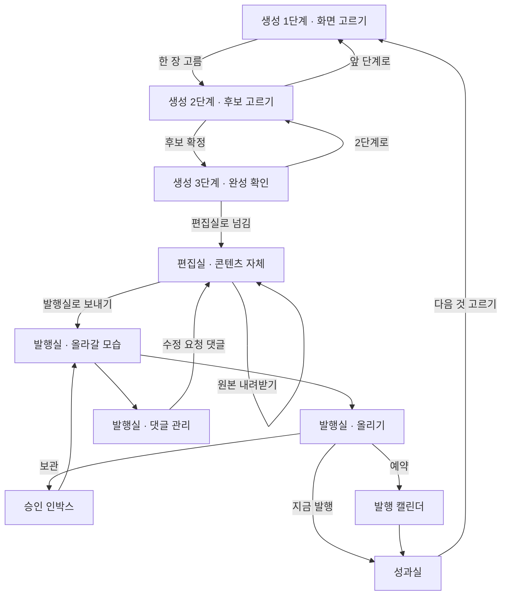

### Happy path

1. 생성 1단계에서 오늘 만들 수 있는 화면 세 장 중 한 장을 고른다. 고르기 전에는 다음 단추가 비활성이다.
2. 2단계로 넘어가면 1단계에서 고른 화면이 맨 위에 한 줄로 이어지고 그 아래에서 후보 세 개만 고른다.
3. 3단계에서 고른 화면·고른 후보·들인 값·형식을 한 줄씩 확인하고 편집실로 넘긴다.
4. 편집실은 콘텐츠 자체만 다룬다. 자막 문구와 크기, 영상 속도와 길이, 첫 컷 이미지, 나레이션, 컷 순서, 원본 내려받기.
5. 발행실 `올라갈 모습`에서 플랫폼을 고르고 그 화면 옆에서 문구·해시태그·첫 댓글을 고친다.
6. 발행실 `올리기`에서 지금 발행할지, 승인 인박스에 보관할지, 캘린더로 예약할지 하나만 고른다.
7. 성과실에서 반응을 보고 다음에 만들 것을 고른다. 그 자리에서 1단계로 돌아간다.

### Edge · empty · error · loading · overflow

- 앞 단계를 건너뛴 채로 뒤 단계에 서지 않는다. 고른 화면이 없으면 2·3단계 요청이 와도 1단계로 되돌린다.
- 2단계 내용 없음: `아직 만든 후보가 없습니다` + `후보 3개 만들기` 하나.
- 2단계 불러오는 중: 후보 세 자리를 뼈대로 먼저 잡아 다 만들어진 순간 화면이 뛰지 않게 한다.
- 2단계 오류: 원인(금지 표현이 대본에 남음)과 차감 0원을 먼저 적고 `문구 고치러 가기` / `그대로 다시 만들기`.
- 재생기: 자막을 끄면(CC) 영상만 남는다. 설정은 영상 전체를 덮지 않고 오른쪽 아래에서 위로 열린다.
- 재생기 좁은 폭(520px 아래): 진행 막대와 남은 시각이 조작 줄 위로 올라가고 아래 줄에는 단추만 남는다. 두 줄을 넘지 않는다.
- 발행실 재연결 필요 채널: 문구를 고치기 전에 헤더 아래 경고 띠가 먼저 말한다. 초안과 예약은 보존된다.
- 발행실 미구현 채널: 상태를 `Coming Soon`으로 적고 지우지 않는다.
- 달력 내용 많음: 한 날짜 두 건까지 보이고 나머지는 `+N건 더`로 접는다.
- 저장소 차단: 화면 선택·카드 여백·탐색 상태 저장은 try/catch로 격리한다.

### Dead-end audit

| 진입 | 가능한 다음 행동 | dead-end |
|---|---|---|
| 생성 1단계 · 아무것도 안 고름 | 세 장 중 고르기, 담당과 대화 | 0 |
| 생성 1단계 · 고름 | 후보 만들기, 고른 것 지우기 | 0 |
| 생성 2단계 정상 | 후보 고르기, 다시 뽑기, 1단계로 | 0 |
| 생성 2단계 없음·오류 | 후보 만들기 / 문구 고치기·다시 만들기 | 0 |
| 생성 3단계 | 편집실로 넘기기, 2단계로 | 0 |
| 편집실 | 자막·속도·재료·순서 고치기, 원본 받기, 발행실로 | 0 |
| 발행실 올라갈 모습 | 플랫폼 바꾸기, 문구 고치기, 올리기 탭으로 | 0 |
| 발행실 재연결 필요 | 채널 연결로 가기, 다른 플랫폼 보기 | 0 |
| 발행실 올리기 | 지금 발행 / 보관 / 예약 | 0 |
| 발행실 댓글 관리 | 답글 보내기, 좋아요, 편집실로 넘기기 | 0 |
| 성과실 | 플랫폼 필터, 오류 확인, 다음 것 고르기 | 0 |

공식 근거는 프로토타입 화면별 우측 근거 패널(v50 벤치마크)에 URL과 함께 있다. 요지 · 재생기 배치는
YouTube 자막·재생 속도 도움말과 MDN 재생기 기본을, 표적 크기는 WCAG 2.2 2.5.8을, 발행실 플랫폼 헤더는
바깥이 아니라 우리 구현(`dashboard/src/components/channel/ChannelPage.tsx`)을 정본으로 삼았다.

---

## v47 최신 증분 · 읽히는 본문과 상시 담당 (2026-08-24)

이 증분은 v46의 화면 131개, 상시 담당, 두 층 헤더, 왼쪽 탐색 접기, 화면 선택·저장·미리보기·복사, 카드 여백 A/B를 보존한다. 새로 닫는 흐름은 1024에서 왼쪽 탐색을 자동 축소하고 본문과 담당을 70:30으로 배분하는 것, 390에서 담당을 본문 아래에 두는 것, 긴 어절과 딱지가 잘리지 않는 것이다.

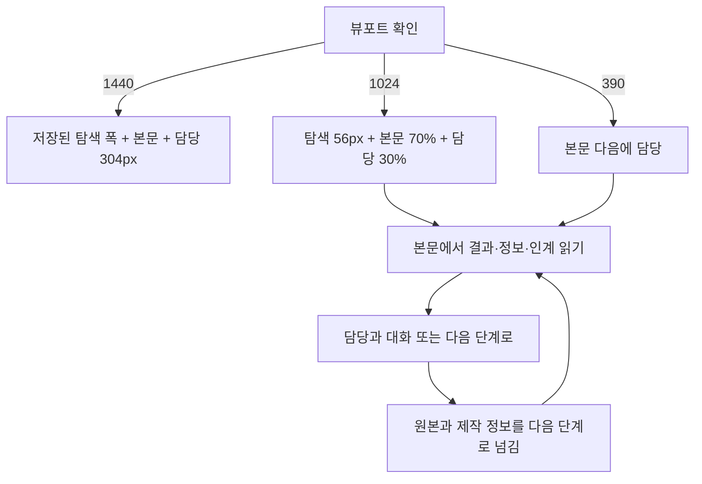

### Happy path

1. 1024로 들어오면 왼쪽 탐색이 56px 레일로 자동 축소된다.
2. 본문은 작업영역의 70%, 오른쪽 상시 담당은 30% 이하를 사용한다. 담당은 최소 240px을 지킨다.
3. 사용자는 `산후 회복, 다시 걷는 첫 주`, `읽고 쌓는 정보`, `다음으로 넘김`, 학습 고리를 어절 단위로 읽는다.
4. 정보 딱지는 잘리거나 말줄임되지 않고 필요한 만큼 두 줄 이상으로 늘어난다.
5. 왼쪽 탐색을 펼치면 224px 패널이 56px 레일 위에 임시로 겹친다. 본문과 담당 폭, 현재 단계, 대화는 움직이지 않는다.
6. 사용자는 담당과 대화하거나 `다음 단계로`를 눌러 결과와 기록을 넘긴다. 원본은 앞 단계에 남는다.

### Edge · empty · error · loading · overflow

- 1440: v46의 저장된 왼쪽 탐색 상태와 오른쪽 담당 304px을 유지한다.
- 1024 탐색 펼침: 바깥을 누르거나 접기 아이콘을 누르면 56px 레일로 돌아간다. 본문을 다시 계산하지 않아 읽던 줄이 흔들리지 않는다.
- 390: 오른쪽 담당을 숨기지 않고 본문 아래에 놓는다. 정보 딱지와 학습 고리 세 단계는 모두 보존한다.
- 내용 없음: 글 또는 영상 갈래를 고르는 두 행동을 제공한다. 담당도 무엇부터 고를지 묻는다.
- 불러오는 중: 세 열과 담당 자리를 고정한다. 로딩 뒤 같은 단계와 같은 대화 문맥으로 돌아간다.
- 오류: 완성 원본과 발행 증거를 보존하고 `성과 다시 받기 / 원본 보기`로 복구한다.
- 내용 많음: 상위 정보와 `나머지 12건은 접어 둠`을 보여 준다. 딱지 수를 무한히 늘리지 않고 현재 판단을 막지 않는다.
- 긴 제목: 한두 글자짜리 세로 열을 금지한다. 어절 단위 줄바꿈 뒤 카드 높이가 늘어난다.
- 저장소 차단: 화면 선택, 카드 여백, 탐색 상태 저장은 try/catch로 격리한다. 저장 실패가 화면 읽기와 다음 행동을 막지 않는다.

### Dead-end audit

| 진입 | 가능한 다음 행동 | dead-end |
|---|---|---|
| 1440 정상 | 담당 대화, 다음 단계, 탐색 접기 | 0 |
| 1024 정상 | 담당 대화, 다음 단계, 탐색 임시 펼침 | 0 |
| 390 정상 | 본문 판단 뒤 담당 대화, 다음 단계 | 0 |
| 내용 없음 | 글로 만들기, 영상으로 만들기 | 0 |
| 불러오는 중 | 자동 복구 후 현재 장면 유지 | 0 |
| 오류 | 성과 다시 받기, 원본 보기 | 0 |
| 내용 많음 | 상위 항목으로 판단, 접힌 수 확인 | 0 |

공식 근거: Android canonical layouts의 600dp 미만 아래 배치와 840dp 이상 70:30, Apple HIG Sidebars의 제한 폭 compact control을 채택했다. Figma UI3의 불안정한 hover-only 패널, Intercom의 고정 크기 overlay, Linear의 임시 Peek는 R101 상시 노출 또는 본문 가독성과 충돌해 기각했다. Notion side peek의 왼쪽 문맥 보존은 본문 폭이 흔들리지 않는 임시 탐색 겹침에 참고했다.

SOURCES: <https://developer.android.com/develop/ui/views/layout/canonical-layouts> · <https://developer.apple.com/design/human-interface-guidelines/sidebars> · <https://www.figma.com/blog/behind-our-redesign-ui3/> · <https://www.notion.com/help/views-filters-and-sorts> · <https://www.intercom.com/help/en/articles/6612597-messenger-faqs> · <https://linear.app/docs/peek>
MODEL: gpt-codex/gpt-5.6-sol · agent: product-designer
SKILLS_USED: 없음
SKILLS_SKIPPED: 현재 설치 목록에 제품 UI 화면 제작과 독립 디자인 리뷰에 맞는 스킬이 없음. design.md, ux-writing.md, doc-review.md 방법론 적용

## v46 최신 증분 · 접히는 사이드바와 상시 담당 (2026-08-23)

이 증분은 v45의 네 방 순환, 화면 선택, 자동 저장, 실제 미리보기, 복사, 카드 여백 비교를 보존한다. 새로 닫는 흐름은 전체 사이드바 접기와 복원, 어느 단계에서도 끊기지 않는 담당 대화, 헤더 진행 띠와 본문의 중복 제거다.

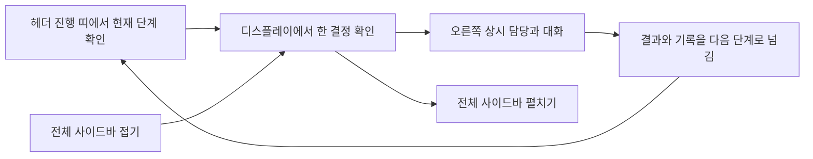

### Happy path

1. 사용자는 헤더 2층 진행 띠에서 현재 단계를 확인한다.
2. 디스플레이 본문은 단계 이름을 되풀이하지 않고 `받아온 묶음 / 다음 묶음`과 현재 결과만 보여 준다.
3. 담당은 1024·1440에서 오른쪽 304px 열에 계속 보인다. 사용자가 고르거나 직접 입력하면 같은 디스플레이가 바뀐다.
4. 본문 폭이 더 필요하면 사이드바 머리의 아이콘 하나를 누른다. 사이드바는 224px에서 56px 아이콘 레일로 접히고 작업 상태는 유지된다.
5. 사용자가 `다음 단계로`를 누르면 결과와 기록이 한 묶음으로 넘어간다. 원본은 앞 단계에 남는다.

### Edge · empty · error · loading

- 390: 담당은 숨지 않고 디스플레이 아래에 이어진다. 모바일 햄버거 서랍은 기존대로 동작하고 데스크톱 전체 접기 아이콘은 중복 노출하지 않는다.
- 새로고침: 사이드바 접기 선택은 `localStorage`에서 복원된다. 화면 선택과 카드 여백 선택도 v45 저장값을 유지한다.
- 내용 없음: 글 또는 영상 갈래를 고르면 첫 후보를 준비한다. 채널 연결을 선행 조건으로 강요하지 않는다.
- 불러오는 중: 디스플레이의 자리를 먼저 고정하고 담당 열을 유지한다. 로딩이 끝나도 현재 단계와 대화 문맥을 잃지 않는다.
- 오류: 완성 원본과 발행 증거를 보존한다. `성과 다시 받기 / 원본 보기` 두 복구 길을 같은 화면에 둔다.
- 내용 많음: 현재 판단에 필요한 묶음만 보이고 나머지 수를 표시한다. 담당 대화 내용은 패널 안에서만 스크롤한다.

### Dead-end audit

| 진입 | 가능한 다음 행동 | dead-end |
|---|---|---|
| 디스플레이 정상 | 카드 선택, 담당 대화, 다음 단계로 | 0 |
| 내용 없음 | 글로 만들기, 영상으로 만들기 | 0 |
| 오류 | 성과 다시 받기, 원본 보기 | 0 |
| 사이드바 접힘 | 아이콘 메뉴 이동, 사이드바 펼치기 | 0 |
| 390 상시 담당 | 고르는 칩, 직접 입력, 보내기 | 0 |

회수 필요: 390에서도 담당을 오른쪽 열에 고정해야 한다는 의미라면 디스플레이 카드와 44px 입력 행동을 동시에 보존할 수 없다. v46은 담당의 상시 가시성은 지키고 위치만 본문 아래로 바꾸는 반응형 계약을 쓴다.

## v45 최신 증분 · 전달물과 화면 선택 저장 (2026-08-23)

이 증분은 v44의 네 방 순환과 전체 기존 경로를 보존한다. 새로 닫는 흐름은 방 사이에 무엇이 넘어가는지 상시 확인하는 경로, 카드 여백 두 안을 비교하는 경로, 회장이 화면을 고르고 저장한 뒤 실제 미리보기와 명령창용 문장을 받는 경로다.

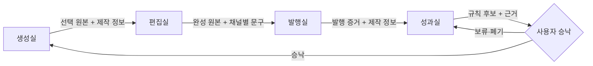

### Happy path: 화면을 골라 다음 명령으로 넘기기

1. 회장은 v45 디스플레이에서 방·상태·뷰포트·테마를 고른다.
2. 오른쪽 위 `화면 고르기`를 열고 `현재 화면 담기`를 누른다.
3. 다른 화면이 필요하면 디스플레이를 바꾼 뒤 다시 담는다. 같은 화면은 중복 추가되지 않는다.
4. 카드 여백 A/B를 같은 화면에서 비교한다. 이 선택은 화면 후보와 별도로 저장된다.
5. 필요하면 자유 메모에 지켜야 할 점을 쓴다.
6. `저장하고 미리보기`를 누른다.
7. 선택한 해시를 그대로 연 실제 화면 미리보기가 패널 안에 생긴다.
8. 선택 화면·메모·요청 형식이 합쳐진 명령창용 문장이 만들어지고 클립보드에 복사된다.
9. 회장은 명령창에 붙여넣는다. 선택과 메모는 새로고침 뒤에도 남는다.

### Empty·loading·error·overflow

- 선택 없음: 저장을 누르면 현재 화면을 자동으로 한 개 담고 계속한다.
- 미리보기 불러오는 중: 선택 화면 이름과 프레임 자리를 먼저 남긴다. 패널 구조는 이동하지 않는다.
- 미리보기 오류: 선택 칩과 생성된 문장은 보존한다. 해당 프레임만 다시 열 수 있다.
- 클립보드 차단: 생성 문장을 선택 상태로 두고 수동 복사가 가능하게 한다.
- 저장소 차단: 현재 세션의 선택·미리보기·문장은 유지한다. 새로고침 복원만 미검증으로 남긴다.
- 내용 많음: 선택 칩은 줄바꿈하고 미리보기 목록은 패널 내부에서만 스크롤한다. 가운데 디스플레이는 스크롤하지 않는다.
- 390: 선택 패널은 한 열이며 실제 미리보기는 세로로 쌓인다. 디스플레이 위에 겹쳐 읽기를 막지 않는다.

### Edge paths

| 조건 | 경로 | 종착점 |
|---|---|---|
| 같은 화면을 두 번 담음 | 중복 감지 → 기존 칩 유지 | 선택 1개 |
| 화면을 잘못 담음 | 칩의 제거 버튼 → 다른 화면 담기 | 선택 교체 |
| 선택 없이 저장 | 현재 화면 자동 담기 → 저장 | 미리보기 1개 |
| 긴 자유 메모 | 입력칸 내부 스크롤 → 저장 | 전체 문장은 보존 |
| 클립보드 권한 거부 | 문장 입력칸 선택 → 수동 복사 | 명령 전달 가능 |
| 새로고침 | 저장된 선택·메모 복원 | 검토 계속 |
| 전부 다시 고름 | 초기화 → 현재 화면 담기 | 새 선택 시작 |

### Dead-end 검사

| 막힐 수 있는 자리 | 빠져나가는 길 | 판정 |
|---|---|---|
| 선택 0개 | 현재 화면 자동 담기 | 통과 |
| 잘못된 선택 | 칩별 제거 | 통과 |
| 미리보기 실패 | 해시 보존 + 해당 화면 다시 열기 | 통과 |
| 클립보드 실패 | 문장 입력칸 수동 복사 | 통과 |
| 저장값 폐기 필요 | 초기화 | 통과 |

dead-end: **0개**.

SOURCES: `docs/prototype/openclaw-auto-4room-v44.html` · `docs/prototype/openclaw-auto-4room-v45.html` · `DESIGN.md` v23 · <https://blog.google/innovation-and-ai/models-and-research/google-labs/stitch-updates/> · <https://help.figma.com/hc/en-us/articles/360040318013-Play-your-prototypes> · <https://www.w3.org/WAI/ARIA/apg/patterns/button/> · <https://developer.mozilla.org/en-US/docs/Web/API/Clipboard/writeText> · <https://developer.mozilla.org/en-US/docs/Web/API/Window/localStorage>

MODEL: gpt-codex/gpt-5.6-sol · agent: product-designer

## v44 최신 증분 · 한 편의 네 방 순환 (2026-08-22)

이 증분은 v43의 디스플레이와 아래 네 방 전체 흐름을 보존한다. 새로 더하는 것은 사용자가 한 콘텐츠의 현재 위치, 각 방에서 읽고 쌓는 정보, 다음 방에 넘기는 묶음, 성과가 다음 생성으로 돌아오는 고리를 한 장에서 이해하는 경로다.

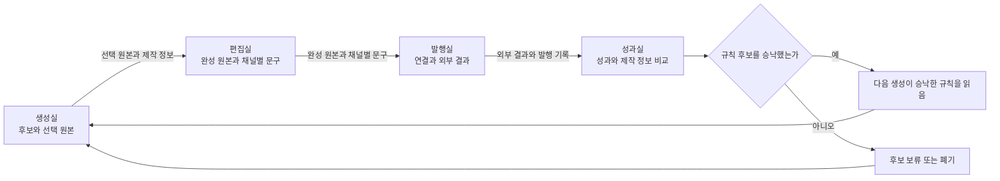

### Happy path: 한 편이 도는 모습

1. 사용자는 채널을 연결하지 않은 채 생성실에서 글 또는 영상 갈래와 이번 요청을 고른다.
2. 생성실은 안전과 권리, 작업 공간 사실, 제작법, 이미 승낙한 규칙, 이번 요청을 읽는다.
3. 후보 세 개와 선택 원본 하나, 선택 관찰, 제작 정보를 쌓아 편집실에 한 묶음으로 넘긴다.
4. 편집실은 선택 원본과 편집 요청, 글·영상 갈래, 채널별 규격을 읽는다.
5. 완성 원본, 채널별 문구, 수정 관찰, 편집 기록을 쌓아 발행실에 넘긴다.
6. 발행실은 완성 원본과 채널별 문구, 발행 취향, 계정 연결 상태를 읽는다. 연결되지 않은 채널은 이 시점에 연결한다.
7. 발행 시각, 외부 결과 주소, 발행 기록, 실패와 재시도 기록을 쌓아 성과실에 넘긴다.
8. 성과실은 외부 결과와 성과 수치, 제작 정보, 선택·수정 관찰, 비슷한 공개 흐름을 함께 읽는다.
9. 비교 근거와 배운 규칙 후보를 쌓는다. 근거가 부족하면 부족하다고 표시한다.
10. 규칙 후보는 자동 적용하지 않는다. 사용자가 승낙한 규칙만 다음 생성이 읽는다.
11. 다음 생성은 승낙한 규칙과 새 요청을 함께 읽고 새 후보를 만든다. 한 편의 고리가 닫힌다.

### 방별 정보 인계

| 출발 | 넘기는 묶음 | 도착 뒤 읽는 자리 | 원본 처리 |
|---|---|---|---|
| 생성실 | 선택 원본 + 제작 정보 | 편집실의 원본·편집 기준 | 생성 원본 보존 |
| 편집실 | 완성 원본 + 채널별 문구 | 발행실의 미리보기·연결·발행 | 편집 전 원본과 완성 원본 모두 보존 |
| 발행실 | 외부 결과 + 발행 기록 | 성과실의 측정·비교 | 외부 결과 주소와 발행 시각 보존 |
| 성과실 | 규칙 후보 + 근거 | 학습 정보의 규칙 승낙 | 승낙 전에는 다음 생성에 적용하지 않음 |
| 학습 정보 | 승낙한 규칙 | 다음 생성의 읽는 정보 | 승낙 이력과 되돌리기 보존 |

### Empty·loading·error·overflow

- 내용 없음: 첫 작업물의 글·영상 갈래를 고르면 생성실로 들어간다. 채널 연결을 앞세우지 않는다.
- 불러오는 중: 현재 방과 지금 읽는 정보를 남겨 사용자가 무엇을 기다리는지 안다. 카드 자리와 흐름 레일은 움직이지 않는다.
- 오류: 앞 방 원본과 이미 쌓인 기록의 보존을 먼저 알린다. 같은 정보만 다시 불러오며 외부 발행은 재실행하지 않는다.
- 내용 많음: 상위 기록과 전체 건수를 표시하고 나머지는 접는다. 흐름 레일과 다음 행동은 한 화면에 남는다.
- 390: 결과 그림과 긴 인계 설명은 접지만 생성·편집·발행·성과, 지금 읽음, 이번에 쌓임, 규칙 후보는 모두 보인다.

### Edge paths

| 조건 | 경로 | 종착점 |
|---|---|---|
| 생성 전에 연결 채널 0개 | 글·영상 갈래 선택 → 생성 → 편집 | 발행실에서 필요한 채널만 연결 |
| 편집 중 채널을 바꿈 | 채널 규격 다시 읽기 → 해당 채널 문구만 다시 작성 | 완성 원본은 보존 |
| 발행 계정 연결 실패 | 연결 상태 확인 → 다시 연결 또는 해당 채널 제외 | 다른 채널 발행은 보존 |
| 외부 결과 확인 지연 | 발행 기록 보존 → 성과실에서 지연 표시 → 같은 결과 재확인 | 중복 발행 없음 |
| 성과 표본 부족 | 근거 부족 규칙 후보 → 보류 | 다음 생성에 미적용 |
| 규칙 후보 거절 | 후보 폐기 또는 보류 → 새 요청으로 생성 | 기존 승낙 규칙만 유지 |
| 승낙한 규칙을 되돌림 | 학습 정보에서 되돌리기 → 다음 생성부터 제외 | 과거 결과와 이력 보존 |

### Dead-end 검사

| 막힐 수 있는 자리 | 빠져나가는 길 | 판정 |
|---|---|---|
| 첫 작업물 없음 | 글 또는 영상 선택 | 통과 |
| 생성 후보에 원하는 것이 없음 | 담당 호출 → 다른 후보 또는 직접 요청 | 통과 |
| 편집 채널 미정 | 갈래 기준 추천 → 세부 채널 선택 | 통과 |
| 계정 미연결 | 발행실에서 연결 또는 해당 채널 제외 | 통과 |
| 발행 확인 지연 | 외부 결과 재확인. 재발행하지 않음 | 통과 |
| 성과 없음 | 관찰 기간과 미수집 표시 → 다음 확인 시점 | 통과 |
| 규칙 후보 근거 부족 | 보류 또는 폐기 | 통과 |
| 규칙 후보 미승낙 | 다음 생성에 적용하지 않고 기존 규칙으로 계속 | 통과 |

dead-end: **0개**.

### 심리 근거

- Zeigarnik 효과: 현재 방을 명확히 표시해 중단한 작업의 다음 단계를 기억하게 한다.
- Hick의 법칙: 네 방 전체는 레일로 보이되 현재 방 상세만 연다.
- Nielsen 상태 가시성: 각 방에서 읽은 정보와 새로 쌓인 정보를 분리한다.
- 손실회피 완화: 모든 인계와 오류에 원본 보존을 먼저 알린다.
- 점진 노출: 390에서는 긴 설명만 접고 고리의 핵심 세 단계는 숨기지 않는다.

회수 필요: v44 흐름 자체에서 새 plan gap은 발견하지 않았다. 사업계획 v1.2 §1.5와 §3.4, 확정 요구 R01~R99가 같은 흐름을 가리킨다. 기존 문서에 남은 브랜드 층과 과거 채널 선연결 전제의 하류 정합화는 기존 회수 항목으로 유지한다.

**v44 셀프심문.** 이 흐름이 틀렸다면 가장 그럴듯한 이유는 네 방과 학습 고리를 한 장에 넣어 사용자가 콘텐츠보다 시스템을 먼저 보게 되는 것이다. 서비스명과 층 코드를 제거하고 `지금 읽음 / 이번에 쌓임 / 다음으로 넘김`만 남겼다.

**v44 레드팀.** 까다로운 고객은 성과가 좋았다는 이유만으로 다음 글이 자동으로 바뀔까 불안해한다. 규칙 후보와 승낙 뒤 다음 생성 사이를 분리하고 `자동 적용 없음`을 명시했다.

SOURCES: `docs/사업계획-osmu-v1.0.md` v1.2 §1.5·§3.4 · `docs/requests/회장-확정-요구사항-대장.md` R01~R99 · `docs/prototype/openclaw-auto-4room-v43.html` · `DESIGN.md` v22 · `wiki/architecture/two-service-boundary.md` · <https://stitch.withgoogle.com/> · <https://developers.googleblog.com/en/stitch-a-new-way-to-design-uis/> · <https://blog.google/innovation-and-ai/models-and-research/google-labs/stitch-gemini-3/>

MODEL: gpt-codex/gpt-5.6-sol · agent: product-designer

SKILLS_USED: 없음

SKILLS_SKIPPED: 설치 목록에 제품 UI 흐름 제작·디자인 리뷰 스킬이 없음. `design.md` · `ux-writing.md` · `doc-review.md` 방법론으로 대체

## v43 최신 증분 · 디스플레이와 담당 호출 (2026-08-22)

이 증분이 아래의 네 방 전체 흐름을 대체하지 않는다. 디스플레이 셸과 처음 진입의 최신 확정만 위에 덧씌운다.

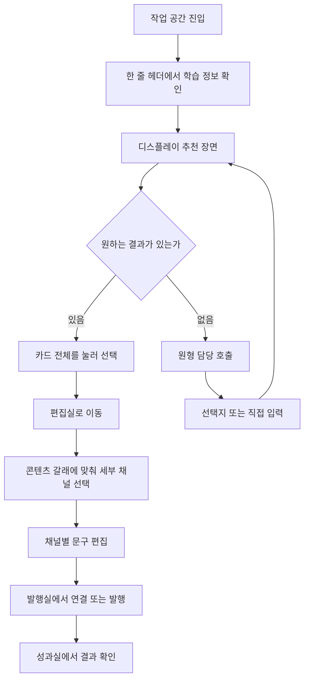

### Happy path

1. 작업 공간에 들어오면 헤더 한 줄에서 작업 공간 이름과 맥락, 학습 정보, 크레딧을 확인한다.
2. 디스플레이는 추천 결과 세 개만 보여 준다. 브랜드나 설명 맥락은 본문에 반복하지 않는다.
3. 카드 전체를 눌러 하나를 고른다. 선택 상태는 테두리와 `선택됨`으로 바로 바뀐다.
4. 필요할 때만 오른쪽 구석 원형 담당 호출 단추를 눌러 대화를 펼친다.
5. 편집실에서 글·이미지 또는 영상 갈래에 맞춰 세부 채널을 고르고 채널 문구를 편집한다.
6. 채널 연결은 생성 전에 강제하지 않는다. 발행할 때 연결하거나 이미 연결된 채널로 발행한다.

### Empty·loading·error·overflow

- 내용 없음: 작업 공간 선택 또는 주제 말하기로 닫는다.
- 불러오는 중: 카드 자리 세 개를 먼저 잡고 무엇을 읽는지만 알린다.
- 오류: 고른 것과 대화가 보존됐음을 먼저 말하고 다시 불러오기와 담당 우회를 모두 준다.
- 내용 많음: 전체 수와 상위 세 개만 보이고 나머지는 다음 장으로 넘긴다.
- 390: 후보 세 개 탭과 선택 카드 한 장으로 바꾼다. 세 장을 세로로 쌓지 않는다.

### 확정 제거와 범위

- `내 에이전시`, 되짚어 보기, 말이 가리킨 곳 목록은 확정 지시로 제거한다.
- 별도 브랜드 칸은 없다. 브랜드와 취향이 다르면 작업 공간을 추가하거나 복제한다.
- 학습 정보의 범위는 개인과 작업 공간이며 스킬도 층계 안의 층이다.

### Dead-end 검사

| 지점 | 빠져나가는 길 | 판정 |
|---|---|---|
| 추천에 원하는 것이 없음 | 원형 담당 호출 → 다른 추천 | 통과 |
| 담당 접힘 | 같은 구석 원형 단추 → 펼침 | 통과 |
| 생성 전 채널 미연결 | 편집 계속 → 발행 시 연결 | 통과 |
| 추천 불러오기 실패 | 다시 불러오기 또는 주제 직접 입력 | 통과 |
| 모바일 카드 비교 | 후보 탭 전환 → 카드 선택 | 통과 |

회수 필요: PRD 운영 v2.0과 일부 위키에는 브랜드 층 및 스킬 별도 면 전제가 남아 있다. 최신 확정 요구 R85·R86에 맞춘 하류 문서 재개정이 필요하다.

**한 줄 결론: 네 방과 그 사이 이음새, 작업물 상태 12개, 분기 3갈래를 PRD 조항에 걸어 도식화했다. 그리는 과정에서 PRD가 답하지 않는 자리 17개를 찾았고, 추측으로 메우지 않고 질문으로 남겼다.**

**PRD 빈틈: 17개** (§7. 이 중 6개는 흐름을 못 그리게 막는 급이라 화면 확정 전에 답이 필요하다.)

이 문서는 화면 시안이 아니다. 무엇이 어디로 흐르는지만 정한다. 화면은 이 문서가 승인된 뒤에 그린다.

---

## 0. 이 문서가 서 있는 두 층

회장 확정 요구는 두 번에 걸쳐 쌓였고 서로를 대체하지 않는다.

| 층 | 무엇을 정했나 | 정본 |
|---|---|---|
| 아래층 (08-16) | 제작 자체의 순서. 한 화면에 하나씩 고르고, 플랫폼을 고르고, 초안 세 안을 받고, 하나를 골라 판단하고, 플랫폼별 미리보기로 편집하고, 발행한다 | 2026-08-16 회장 원문 |
| 위층 (08-17) | 그 순서를 담는 공간. 생성실·편집실·발행실·성과실 네 방으로 나누고 왼쪽 사이드바에는 방만 둔다 | 2026-08-17 회장 원문 + 회신 5건 |

즉 **방은 공간이고 단계는 그 방 안의 진행**이다. 이 2층 관계를 흐리면 같은 작업이 두 이름으로 보인다(v38 실측 지적, 개선제안 §1-1). 아래 모든 도식은 이 2층을 전제한다.

PRD는 아직 이 2층을 모른다. PRD §3.7은 8단계 선형 흐름 하나만 정의한다. 그 대응은 §1.5에 표로 걸어 두었고, 어긋나는 자리는 §7의 빈틈으로 올렸다.

---

## 1. 네 방의 구성

### 1.1 전체 그림

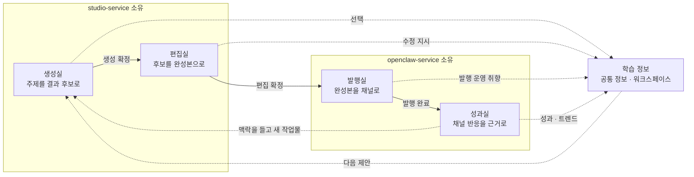

점선은 작업물이 아니라 **신호**가 흐르는 길이다. 실선만 작업물이 이동한다. 성과실에서 생성실로 가는 화살표가 점선인 이유는 §2.4에서 다룬다.

### 1.2 방마다 무엇을 받고 무엇을 내는가

| 방 | 입력 | 방 안에서 하는 일 | 출력 | PRD 근거 |
|---|---|---|---|---|
| 생성실 | 업종·목적·출력 언어, 학습 정보, 자료 근거함의 자료 버전, 채널 선택 | 한 화면에 하나씩 골라 제작 브리프를 조립하고, 저해상도 후보 3개를 받아 하나를 고른다 | 선택된 후보 1개의 고해상도 완성본 + 창작 텍스트 초안 | §3.7 1~6단계, §3.8 생성 모드, FR-OS81-005·007·008·011, FR-OS82-035·036 |
| 편집실 | 생성실이 낸 완성본과 그 편집 지시서 | 창작하지 않는다. 자막 위치, 컷 길이, 속도, 이미지·음성 교체, 순서 변경 | 새 revision 1개. 소재 재생성 0 | §3.8 우리 산출물 편집, FR-OS81-025, 경계 wiki 편집 비용 |
| 발행실 | 편집 확정된 revision, 채널 규격 카탈로그, 계정 준비 상태 | 채널별 미리보기, 캡션·첫 댓글 확인, AI 표시 확인, 발행 시각 결정 | 발행 결과 증거 또는 이름 붙은 실패 상태 | §3.6 발행 행, FR-OS81-016·017·028, FR-OS82-039 |
| 성과실 | 채널이 돌려준 지표, 공개 트렌드 | 개별·종합 성과 확인, 자동 댓글·자동 좋아요·저조 글 정리, 둘러보기 | 학습 신호 + 새 작업물의 씨앗 | §3.7 7~8단계, FR-OS81-018·019·020 |

**주의 하나.** 캡션·제목·해시태그·첫 댓글은 발행실에서 만들지 않는다. PRD §3.6과 FR-OS82-044가 창작 텍스트 생성을 studio 소유로 못 박았다. 발행실이 하는 일은 그것을 **보고 승인하거나 재요청**하는 것이다. 발행실에서 글자를 직접 고치게 하면 그 순간 경계가 깨진다. 이 자리는 §7 빈틈 6번과 직결된다.

### 1.3 발행실 하위 세 곳

회장 08-17 원문이 지정한 depth 그대로다.

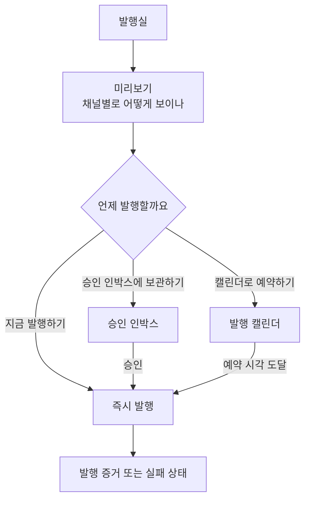

세 문구는 회장이 지정했다(R17). 바꾸지 않는다.

승인 인박스는 별도 단계가 아니라 발행실 안의 **보관함**이다. Planable은 승인을 독립 단계로 세우지만 그건 여러 사람이 결재하는 구조여서다. 우리 사용자는 혼자이므로 승인은 "나중에 내가 다시 볼 것"의 이름이고, 단계로 승격하면 방이 다섯 개가 된다.

### 1.4 성과실의 두 얼굴

성과실은 성적표이면서 동시에 다음 작업의 출발점이다.

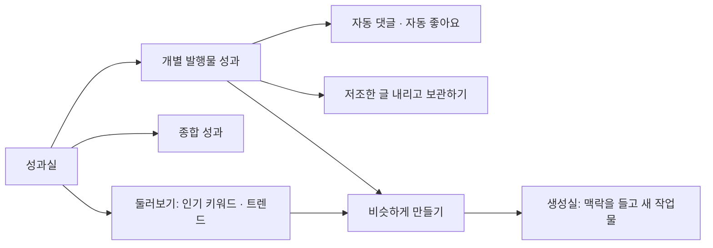

R06의 세 갈래 중 둘(OSMU 종합 성과, 플랫폼 탭)이 여기 걸린다. 셋째 갈래인 "각 플랫폼에 직접 들어가서 보기"는 제품 밖이므로 우리 화면에서는 채널 연구실의 원문 링크로만 존재한다.

### 1.5 PRD 8단계와 네 방의 대응

PRD §3.7이 정의한 8단계가 네 방 어디에 앉는지 명시한다. 이 표가 없으면 PRD와 화면이 서로 다른 지도가 된다.

| PRD §3.7 단계 | 앉는 방 | 비고 |
|---|---|---|
| 1 업계·목적 선택 | 생성실 | 첫 가입 분기에서만 전량 노출. 재방문은 요약 후 건너뛰기(R02) |
| 2 업계에서 잘 되는 채널·영상 보기 | 생성실 | 재방문에서는 접힘 |
| 3 스타일 예시 비교 | 생성실 | |
| 4 비용·시간 확인 | 생성실 | 후보 견적. 승격 비용은 5단계 뒤 |
| 5 고르거나 추천받기 | 생성실 | 여기가 강한 학습 신호 지점 |
| 6 실행 | 생성실에서 편집실로 넘어가는 경계 | 고해상도 승격이 여기서 일어난다 |
| 7 성과·트렌드 기반 다음 추천 | 성과실 | |
| 8 클릭과 답변으로 계속 | 성과실에서 생성실로 | 두 번째 회차에서 재입력 0 |

**PRD에 대응이 없는 것 하나: 편집실.** PRD §3.8이 편집 모드를 정의하지만 8단계 안에는 자리가 없다. 8단계는 6번 실행 다음이 곧장 7번 성과다. 편집실은 회장 08-17 확정으로 독립 공간이 됐으므로 PRD §3.7 표에 단계가 하나 더 있어야 한다(빈틈 1번).

---

## 2. 단계 사이 이음새

방 안은 잘 돈다. 사람이 막히는 곳은 언제나 방과 방 사이다.

### 2.1 앞으로 넘어가는 조건

| 이음새 | 넘어가는 조건 | 넘어갈 때 새로 생기는 것 | 막혔을 때 |
|---|---|---|---|
| 생성실 → 편집실 | 후보 3개 중 정확히 1개 선택 + 고해상도 승격 비용 확인 | 고해상도 완성본 1개, 편집 지시서 1벌, 크레딧 차감 기록 1건 | 후보가 3개 미만이면 부족 사유와 재시도 비용을 보여주고 몰래 채우지 않는다(§3.8.1) |
| 편집실 → 발행실 | 사용자가 이 revision을 확정 | 발행 후보 revision 핀 1개 | 편집 요청이 소재 재생성을 요구하면 그 컷 비용을 먼저 고지 |
| 발행실 → 성과실 | 발행 증거를 받음 | 발행 증거 1건(외부 식별자 또는 원문 주소), 성과 수집 예약 | 증거를 못 받으면 발행됨으로 표시하지 않는다(FR-OS81-017). 불확실 상태로 남고 재발행하지 않는다 |

**세 이음새의 공통 규칙 하나.** 넘어가는 버튼은 어느 방에서든 같은 자리에 둔다. 반복 사용자의 손이 외우게 하기 위해서다(Jakob의 법칙, design.md §10 Laws of UX). 문구는 행선지를 말한다: "편집실로 보내기", "발행실로 보내기", "성과실에서 반응 보기".

### 2.2 되돌아가는 조건 (R13)

회장 회신 원문: "덮어쓰면 안되지. 앞의 공간에서 작업할 목록에 추가가 되는거지."

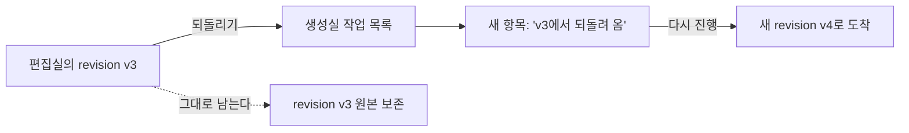

되돌릴 때 남는 것과 새로 생기는 것을 분리해 적는다.

| 되돌리는 방향 | 그대로 남는 것 | 새로 생기는 것 | 사라지는 것 |
|---|---|---|---|
| 편집실 → 생성실 | 편집실의 그 revision, 이미 쓴 크레딧 기록 | 생성실 목록에 항목 1개. 원래 브리프와 선택 이력을 그대로 들고 온다 | 없음 |
| 발행실 → 편집실 | 발행실의 발행 준비 상태(예약이 걸려 있으면 예약 해제 후) | 편집실 목록에 항목 1개 | 예약이 걸려 있었다면 그 예약 |
| 발행실 → 생성실 | 위와 같음 | 생성실 목록에 항목 1개 | 위와 같음 |
| 성과실 → 어디로도 | 발행물 전체 | 되돌리기 자체가 없다 | 해당 없음 |

성과실에서 되돌아갈 수 없는 이유는 이미 외부 플랫폼에 나갔기 때문이다. 회장 08-17 원문이 그렇게 정했고 PRD도 발행 증거를 되돌리지 않는다.

### 2.3 되돌리기가 발행 예약과 만나는 자리

예약된 작업물을 되돌리면 예약은 어떻게 되는가. 조용히 취소하면 사용자는 발행될 줄 알고 기다린다. 그래서 되돌리기 확인에서 결과를 먼저 말한다: "이 작업물은 내일 오후 6시 30분 발행 예약이 걸려 있습니다. 되돌리면 예약이 해제됩니다." PRD에 이 규칙은 없다(빈틈 8번).

### 2.4 성과실에서 생성실로 (맥락을 들고 가기)

되돌리기가 아니라 **새 작업물 만들기**다. 그래서 §1.1 도식에서 점선이다.

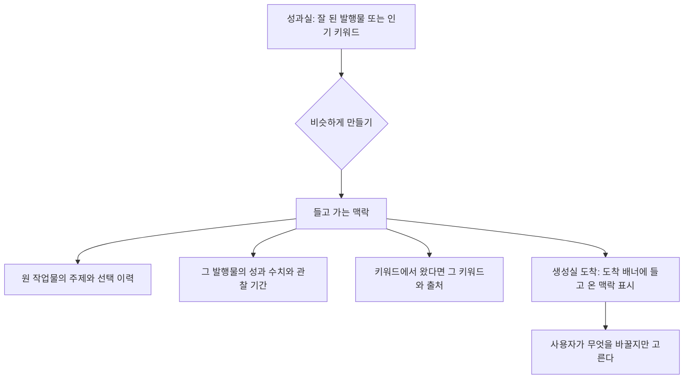

도착 배너는 되돌리기 도착 배너와 **같은 문법**을 쓴다. 사용자 입장에서는 둘 다 "어디선가 뭔가를 들고 왔다"이므로 다르게 생기면 배울 것이 늘어난다.

들고 온 맥락이 학습 정보에 자동 반영되지는 않는다. 반영은 §4의 규칙을 따른다.

---

## 3. 작업물 상태 기계

하나의 작업물이 가질 수 있는 상태와 전이다. R16(각 단계에 보관하고 언제든 꺼내 이어서 작업)의 실체가 이것이다.

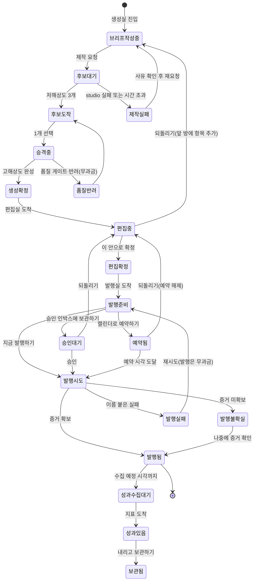

### 3.1 상태마다 어느 방에 보관되고 어떻게 꺼내는가

| 상태 | 보관되는 방 | 목록에서 보이는 이름 | 꺼내는 행동 |
|---|---|---|---|
| 브리프작성중 | 생성실 | 만들던 것 | 이어서 고르기 |
| 후보대기 | 생성실 | 만드는 중 | 기다리기. 완료 알림 |
| 후보도착 | 생성실 | 고를 것 | 후보 비교 열기 |
| 제작실패 · 품질반려 | 생성실 | 확인 필요 | 사유 보고 다시 요청 |
| 생성확정 · 편집중 | 편집실 | 다듬을 것 | 편집 이어서 |
| 편집확정 · 발행준비 | 발행실 | 내보낼 것 | 미리보기 열기 |
| 승인대기 | 발행실 하위 승인 인박스 | 승인 기다리는 것 | 승인하거나 되돌리기 |
| 예약됨 | 발행실 하위 발행 캘린더 | 예약된 것 | 시각 바꾸기, 되돌리기 |
| 발행실패 · 발행불확실 | 발행실 | 막힌 것 | 사유 보고 재시도 |
| 발행됨 · 성과수집대기 · 성과있음 | 성과실 | 나간 것 | 성과 열기 |
| 보관됨 | 성과실 하위 보관함 | 내린 것 | 보기만 |

**상단 작업물 목록(R09)의 정의가 여기서 나온다.** 사이드바에는 방만 있고(R08), 상단에는 작업물이 있다. 상단 목록의 각 항목은 위 표의 "보이는 이름"을 달고 있고, 누르면 그 상태가 사는 방으로 간다. 헤더의 방마다 붙는 숫자는 **그 방에서 내 손을 기다리는 작업물 수**로 정의한다. 0이면 숫자를 숨긴다.

### 3.2 이 상태 기계에서 크레딧이 움직이는 곳

돈이 움직이는 자리만 따로 본다. 사용자 불신의 대부분이 여기서 생긴다(PRD §5 페르소나 "가장 큰 불신: 예상 밖 비용").

| 전이 | 크레딧 | 근거 |
|---|---|---|
| 브리프작성중 → 후보대기 | 후보 3개 원가만 차감 | §3.8.1 |
| 승격중 → 생성확정 | 고해상도 1개 원가 차감 | §3.8.1 |
| 승격중 → 품질반려 | 무과금. 반려 사유는 원장에 남음 | FR-OS82-037 |
| 편집중 (자막·크기·속도·순서) | 무과금. 재렌더만 | 경계 wiki 편집 비용 |
| 편집중 (문구 재생성·소재 교체) | 해당 컷 단위 과금 | 같은 곳 |
| 미선택 후보 추가 승격 | 개별 사전 확인 후 차감 | FR-OS82-036 |
| 발행시도 → 발행실패 → 재시도 | 무과금 | 경계 wiki 과금 |

---

## 4. 분기

R05가 지정한 세 갈래다. 갈래마다 같은 방을 쓰되 방 안에서 보이는 것이 다르다.

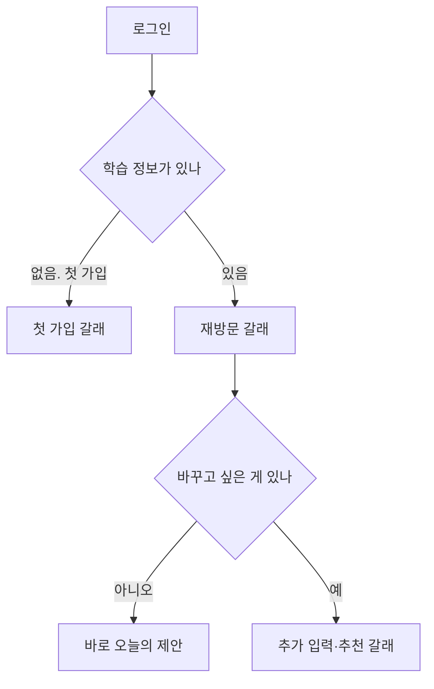

### 4.1 첫 가입 (학습 정보 0)

이 갈래의 유일한 목표는 **백지를 안 보여주는 것**이다(§3.7 설계 원칙, R10).

| 순서 | 무엇이 보이나 | 어디가 다른가 |
|---|---|---|
| 1 | 담당자가 먼저 말을 건다. 무엇을 하는 곳인지, 무엇을 물을 것인지 | 재방문에는 없다 |
| 2 | 업종 고르기. 한 화면에 이것만 | 재방문에는 접혀 있다 |
| 3 | 목적 고르기, 출력 언어 고르기 | 같음 |
| 4 | 그 업종에서 잘 되는 채널·사례 보기. 각 사례에 원문 주소·관찰일·지표 기간 | 재방문에는 접혀 있다 |
| 5 | 스타일 예시 비교. 추천 1개를 펼치고 대안은 접어 둔다 | 재방문은 지난 선택을 먼저 보여준다 |
| 6 | 비용·시간 확인 | 같음 |
| 7 | 후보 3개 중 고르기 | 같음 |

첫 가입 갈래에서 채널 연결을 언제 요구하는지는 PRD가 정하지 않았다(빈틈 12번). 발행실에 도착해서야 요구하면 만든 것을 못 내보내는 순간이 오고, 가입 직후 요구하면 아직 만들 것도 없는데 계정을 연결하라는 셈이 된다.

**심리 근거.** 이 갈래 전체가 Fogg 행동모델의 능력 축을 올리는 설계다. 동기는 이미 있다(제품을 알리고 싶어서 가입했다). 막는 것은 능력이므로 한 화면에 결정 하나로 쪼갠다(R01). 담당자의 첫 말은 유발 장치다.

### 4.2 재방문 (학습 정보 있음)

- 도착 화면은 빈 입력창이 아니라 **오늘의 제안 3장**이다.
- 지난번 답변을 다시 묻지 않는다. 요약 한 줄로 보여주고 "이대로 갈까요"만 묻는다(§3.7 8단계, 두 번째 회차 재입력 0).
- 바꾸고 싶은 카드만 다시 연다.
- 직접 쓰기 경로는 항상 있다. 제안을 강제하지 않는다(FR-OS81-008).

### 4.3 추가 입력·추천

R04가 정한 추천 유입 세 가지가 여기로 들어온다.

| 유입 | 어디서 뜨나 | 무엇을 묻나 |
|---|---|---|
| 가끔 던지는 질문 | 어느 방이든 담당자 대화 레일 | 취향을 좁히는 짧은 질문 하나 |
| 성과 기반 | 성과실 | 잘 된 발행물을 보여주고 비슷하게 만들지 |
| 트렌드 기반 | 성과실 둘러보기 | 이 키워드로 만들면 무엇이 나오는지 함께 보여주고 만들지 |

셋 다 같은 형태로 끝난다: 이런 류의 콘텐츠를 만들까요. 그리고 셋 다 거절 경로가 동등하게 있다. 거절도 신호다.

---

## 5. 학습 신호가 언제 어디서 쌓이나

R02·R03·R11·R12가 여기 모인다.

### 5.1 층위 (R12)

회장 회신: 공통 정보가 상위, 워크스페이스가 그 안.

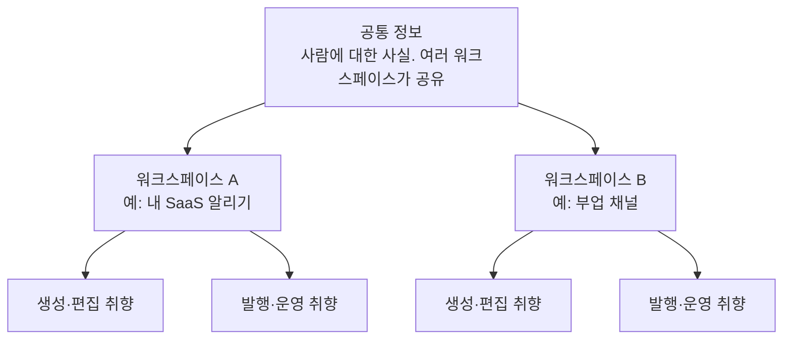

- 공통 정보에 들어가는 것: 사람 자체의 사실과 금지선. 실명, 말투의 기본, 절대 쓰지 않을 표현.
- 워크스페이스에 들어가는 것: 타깃, 컨셉, 업종, 그 워크스페이스에서만 통하는 스타일.
- 각 워크스페이스 안에서 **생성·편집용**과 **발행·운영용**을 나눈다(회장 08-17 원문, R11).
- 출력 언어별로 또 갈린다(FR-OS82-031). 한국어에서 먹힌 훅을 일본어로 자동 이식하지 않는다.

충돌하면 어느 쪽이 이기는지는 PRD에 없다(빈틈 4번).

### 5.2 신호가 생기는 자리

PRD는 강한 신호와 약한 신호를 구분한다(§3.8: 후보 선택은 강한 신호, 수정 지시는 약한 신호). 그것을 흐름 위에 얹는다.

```mermaid
flowchart LR
  A1["생성실: 후보 3개 중 선택"] -->|강한 신호| L["학습 정보"]
  A2["생성실: 제안 거절"] -->|약한 신호| L
  B1["편집실: 수정 지시"] -->|약한 신호| L
  C1["발행실: 발행 시각 직접 지정"] -->|약한 신호| L
  C2["발행실: 캡션 재요청"] -->|약한 신호| L
  D1["성과실: 실제 지표"] -->|강한 신호| L
  D2["성과실: 자동 댓글 말투 수정"] -->|약한 신호| L
  E["사용자가 학습 정보 화면에서 직접 수정"] -->|확정 반영| L
  F["위키·노션 반입"] -->|자료. 신호 아님| L
```

### 5.3 승인 전에는 반영하지 않는다

이 제품의 신뢰는 여기서 갈린다.

| 규칙 | 근거 |
|---|---|
| 후보를 골랐다고 그 순간 취향이 바뀌지 않는다. "이 취향을 기억해둘까요"에 동의해야 반영된다 | 회장 08-16 원문, R03 넷째 경로 |
| 동의하지 않아도 이번 결과물은 그대로 나온다. 학습 동의가 진행을 막지 않는다 | design.md §3 의도된 마찰. 마찰은 신뢰가 필요한 곳에만 |
| 다음 추천이 지난번과 달라졌으면 무엇이 왜 달라졌는지 보여주고 사용자가 승인한다 | FR-OS81-020 조용한 취향 변경 0 |
| 학습 정보는 언제든 열어 보고 고치고 지울 수 있다. 지우면 다음 제작부터 반영되지 않는다고 미리 말한다 | R02, R15 |
| 반입 자료끼리 값이 충돌하면 자동으로 고르지 않는다. 사람이 하나를 정할 때까지 제작을 멈춘다 | §3.5 |

**PRD와 회장 요구가 어긋나는 자리가 하나 있다.** PRD §3.8은 후보 선택을 강한 신호로 기록한다고 쓰고, 회장은 동의를 받으라고 했다. 동의를 거절했을 때 그 선택을 신호로 아예 안 쓰는지, 기록은 하되 프로파일 갱신만 미루는지가 미정의다(빈틈 5번).

---

## 6. 두 서비스 경계가 흐름 어디에 걸리나

### 6.1 구간 소유

```mermaid
flowchart LR
  subgraph ST["studio-service: 미디어 바이트와 창작물"]
    S1["후보 3개 생성"]
    S2["고해상도 승격"]
    S3["편집 지시서 수정 후 재렌더"]
    S4["캡션 · 제목 · 해시태그 · 첫 댓글 생성"]
    S5["취향 프로파일 계산"]
  end
  subgraph OC["openclaw-service: 계정 · 예약 · 발행 · 성과"]
    O1["모든 화면"]
    O2["채널 규격 카탈로그"]
    O3["계정 연결과 준비 상태"]
    O4["예약 · 승인 · 발행"]
    O5["발행 증거와 성과 수집"]
  end
  O1 -->|제작 요청| S1
  S2 -->|완성 파일 참조| O1
  O1 -->|편집 지시| S3
  O2 -->|채널 제약| S4
  O5 -->|성과 · 트렌드 신호| S5
  S5 -->|취향 상태 조회 응답| O1
```

경계 판정은 세 질문으로 한다(경계 wiki). 소셜 계정 자격증명이 필요한가, 창작 정보를 읽거나 쓰는가, 미디어 바이트를 만지는가. 뒤 둘 중 하나라도 걸리면 studio다.

### 6.2 접점 5개가 흐름의 어디에 있나

PRD §3.4가 정한 다섯 접점을 흐름 좌표로 박는다.

| 접점 | 방향 | 흐름상 위치 | PRD 근거 |
|---|---|---|---|
| 소재·참고자료 반입 | openclaw → studio | 생성실 진입 전 또는 학습 정보 화면. 위키·노션·강의자료·기존 이미지 | §3.5, FR-OS81-009 |
| 제작 요청 | openclaw → studio | 생성실에서 브리프 확정하는 순간, 그리고 편집실의 재렌더 요청 | FR-OS81-011 |
| 선택 기록 | openclaw → studio | 후보 3개 중 1개를 고른 순간 | §3.4 |
| 취향 상태 조회 | studio → openclaw 응답 | 생성실 첫 화면(오늘의 제안이 왜 이것인지), 학습 정보 화면 | FR-OS81-020 |
| 신호 넣기 | openclaw → studio | 성과실이 지표를 받은 뒤, 트렌드 수집 뒤 | FR-OS81-019 |

### 6.3 경계가 사용자에게 보이는 자리

내부 경계지만 화면에 새는 곳이 세 군데 있다. 미리 정해 두지 않으면 개발 단계에서 각자 다르게 처리한다.

1. **studio가 응답하지 않을 때.** 후보대기 상태가 길어지면 "만드는 중"이 언제까지인지, 어디서 막혔는지 말해야 한다. 준비 실패를 이름 붙은 상태로 보여주고 입력을 보존한다(FR-OS81-004).
2. **채널 규격에 안 맞는 완성본.** openclaw는 자기가 고치지 않는다. studio에 새 완성본을 요청하고 그 전까지 발행을 막는다(FR-OS81-015). 사용자에게는 "이 채널 규격에 맞는 파일을 다시 만들고 있습니다"로 보인다.
3. **캡션을 고치고 싶을 때.** 발행실에서 직접 타이핑하면 경계 위반이다. 재요청으로 처리해야 하는데, 그러면 한 글자 고치는 데 왕복이 생긴다. 이 자리가 빈틈 6번이다.

---

## 7. PRD 빈틈 (이 문서의 핵심 산출)

흐름을 그리다 PRD가 답하지 않는 자리 17개다. 추측으로 메우지 않았다. 각 항목은 질문 형태로 남기고, 답이 없으면 화면을 확정할 수 없는 것은 **막힘**으로 표시했다.

| # | 무엇이 비었나 | 질문 | 급 |
|---|---|---|---|
| 1 | PRD §3.7 8단계에 편집실 자리가 없다. 6번 실행 다음이 곧장 7번 성과다 | 편집을 8단계 안의 정식 단계로 승격할 것인가, 아니면 6번 실행의 하위 반복으로 볼 것인가 | 막힘 |
| 2 | 4실 구조 자체가 PRD 어디에도 없다. PRD는 선형 8단계만 안다 | PRD를 4실 구조로 개정할 것인가(plan 재개정), 아니면 4실을 화면 배치로만 두고 PRD는 8단계를 유지할 것인가 | 막힘 |
| 3 | R13 되돌리기가 PRD에 없다. 되돌린 항목의 크레딧 취급도 없다 | 되돌려서 다시 만들면 이미 쓴 크레딧은 어떻게 되나. 재승격은 새 과금인가 | 막힘 |
| 4 | R12 공통 정보와 워크스페이스가 충돌할 때 우선순위 | 워크스페이스 값이 공통 값을 덮는가, 공통이 절대 우선인가, 아니면 충돌 시 제작을 멈추고 사람에게 묻는가(§3.5 자료 충돌 규칙과 같게 갈 것인가) | 막힘 |
| 5 | 학습 동의를 거절했을 때 그 선택을 어떻게 취급하나 | 신호로 아예 안 쓰나, 기록은 하되 프로파일 갱신만 안 하나 | 막힘 |
| 6 | 발행실에서 캡션을 고치는 경로 | 창작 텍스트는 studio 소유인데, 오타 한 글자 수정도 studio 왕복인가. 사용자 직접 편집을 허용한다면 그 텍스트의 버전 소유는 누구인가 | 막힘 |
| 7 | 챗봇(담당자 대화 레일)이 PRD에 없다. 기능 요구 번호가 하나도 없다 | 대화 레일을 정식 기능 요구로 올릴 것인가. 올린다면 대화로 한 선택과 화면 클릭으로 한 선택은 같은 신호인가 | 큼 |
| 8 | 예약된 작업물을 되돌릴 때 예약 처리 | 예약을 자동 해제하나, 되돌리기를 막나, 사용자에게 물어보나 | 큼 |
| 9 | 성과실의 자동 상호작용(자동 댓글·자동 좋아요·저조 글 삭제)이 PRD FR에 없다 | 자동 댓글은 창작 텍스트인가(그러면 studio 소유). 자동 발행 기본 OFF 원칙(FR-OS82-038)이 자동 댓글에도 적용되나 | 큼 |
| 10 | 여러 작업물을 동시에 진행할 때의 상한과 크레딧 예약 | 동시 진행 개수 상한이 있나. 후보대기 상태의 작업물이 여럿이면 크레딧을 미리 잡아 두나 | 큼 |
| 11 | 플랫폼 연구실(채널별 탭)과 발행실의 관계 | 발행실 미리보기에서 채널 설정으로 건너가는 경로를 열 것인가. 채널 연구실의 대기열과 발행실의 작업물은 같은 것을 두 곳에서 보는 것인가 | 큼 |
| 12 | 첫 가입 갈래에서 채널 연결을 언제 요구하나 | 가입 직후인가, 첫 발행 직전인가. 연결 없이 만든 완성본은 어디에 쌓이나 | 큼 |
| 13 | 출력 언어를 어느 방에서 정하나 | 생성실 첫 화면인가 발행실인가. 한 작업물이 여러 언어로 갈라질 수 있나(그러면 상태 기계가 갈라진다) | 보통 |
| 14 | Assets 재활용 경로 | 이미 만든 이미지·영상을 다시 쓰는 것은 새 작업물인가 기존 작업물의 새 revision인가. 재활용은 무과금인가 | 보통 |
| 15 | 보관됨 상태의 수명 | 내려서 보관한 글, 되돌려 두고 안 건드린 항목, 후보만 받고 안 고른 브리프를 언제까지 보관하나 | 보통 |
| 16 | 발행 실패 후 되돌아가는 방 | 발행실에 남나, 편집실로 내려가나. 실패 사유가 규격 문제면 studio 재요청이 자동인가 | 보통 |
| 17 | 모바일에서 어디까지 되나 | 제작 전 과정을 모바일에서 하는가, 아니면 승인과 발행만인가(§8과 직결) | 보통 |

미결로 이미 PRD가 인지한 것 셋(채널 연결 실패와 토큰 만료 화면 처리, 제작 성공 뒤 발행 실패의 환불, 다채널 캡션 작성 단위)은 PRD §16.2~16.4에 선택지가 정리돼 있으므로 위 17개에 중복해 세지 않았다. 다만 셋 다 이 흐름의 이음새에 직접 걸린다.

---

## 8. 뷰포트 세 층

기준은 픽셀이 아니라 **손에 쥔 것**이다. 모바일, 태블릿, 웹 세 층으로 말한다. 각 층에서 흐름이 갈리는 지점만 적는다.

| 층 | 무엇이 달라지나 | 왜 |
|---|---|---|
| 모바일 | 후보 3개를 나란히 못 놓는다. 한 장씩 넘겨 보고 마지막에 비교표로 확인하는 두 단계가 된다 | 세 장을 동시에 봐야 고를 수 있는데 화면 폭이 그것을 못 준다 |
| 모바일 | 편집실에서 미리보기와 편집 지시가 한 화면에 안 들어간다. 미리보기를 보다가 지시를 내리는 왕복 구조가 된다 | 편집은 결과를 보면서 하는 일이라 이 왕복이 곧 흐름 갈림이다 |
| 모바일 | 담당자 대화 레일은 옆이 아니라 아래에서 올라온다 | 옆 공간이 없다 |
| 모바일 | 발행실 채널별 미리보기는 채널을 하나씩 넘긴다 | 여러 채널을 동시에 못 본다 |
| 태블릿 | 후보 2개까지 나란히. 셋째는 스크롤 | 폭이 반쯤 있다 |
| 태블릿 | 방 목록(사이드바)은 접힘이 기본. 열면 본문 위에 겹친다 | 본문 폭을 뺏으면 편집이 안 된다 |
| 태블릿 | 대화 레일은 겹쳐 뜬다. 상시 노출 아님 | 같은 이유 |
| 웹 | 방 목록 + 본문 + 대화 레일이 동시에 선다. 후보 3개도 한 줄에 | 유일하게 셋이 다 들어간다 |
| 웹 | 성과실 종합 화면은 여기서만 2열 이상 | 지표 비교는 폭이 있어야 성립 |

**갈리는 지점 요약.** 폭이 결정하는 것은 장식이 아니라 **비교와 동시 참조**다. 후보 비교, 미리보기 곁의 편집, 채널 여럿 나란히 보기. 이 셋이 모바일에서 단계로 쪼개진다.

각 층의 실제 픽셀 경계값은 화면 시안 단계에서 정한다. 이 문서에서 픽셀을 못 박으면 그 숫자가 근거 없이 하류로 굳는다.

---

## 9. 이 흐름이 아직 답을 못 준 것 (막힘 아닌 관찰)

- v38 프로토타입에는 옛 흐름 화면군과 새 방 화면군이 두 문법으로 공존한다. 이 문서는 방 문법 하나로 썼으므로, 화면 단계에서 옛 화면군을 방 안 진행 상태로 흡수해야 정합이 선다(개선제안 §1-1과 같은 결론).
- 실구현 사이드바(Sidebar.tsx)는 방 개념이 없고 채널 목록과 도구 목록으로만 돼 있다. 4실을 얹으면 사이드바 상단에 방 넷이 새로 생기고 기존 채널 목록은 그 아래 연구실 묶음으로 내려간다. 기존 채널 탭 통일 계약(채널 capability 정본)은 그대로 살아 있다.
- 실구현 첫 화면 이름이 "성과"라서 성과실과 이름이 겹친다. 흐름상 첫 화면은 방이 아니라 현황판이므로 다른 이름이 필요하다.

---

## 레드팀 자문 (이 문서가 틀렸다면)

가장 그럴듯한 반박은 이것이다. **"네 방으로 나누면 한 작업물을 끝내는 데 방을 세 번 옮겨야 한다. 혼자 하루 세 건 만드는 사람에게 이건 마찰 아닌가."**

반은 맞다. 그래서 이 문서는 방을 화면 전환이 아니라 **상태의 이름**으로 정의했다(§3). 사용자가 능동적으로 방을 옮기는 것이 아니라, 확정하면 작업물이 다음 방에 가 있고 상단 목록에서 그것이 보인다. 옮기는 비용은 클릭 한 번이고, 대신 얻는 것은 "지금 무엇을 기다리고 있나"가 항상 보이는 것이다. 하루 세 건이면 세 건이 서로 다른 방에 흩어져 동시에 진행되므로, 오히려 방이 없을 때 무엇이 어디까지 갔는지 알 수 없다.

두 번째 반박: **"빈틈 17개는 PRD 흠이 아니라 이 문서가 PRD를 안 읽은 것 아닌가."** 17개를 다시 훑어 PRD에 답이 있는 것을 걸러냈다. 셋(연결 실패 화면, 발행 실패 환불, 캡션 작성 단위)은 PRD가 이미 미결로 세워 둔 것이라 빼서 따로 적었다. 남은 17개는 조항 검색으로 대응 문장을 못 찾은 것들이다.

---

## 판단 필요

1. **빈틈 1·2번을 먼저 정해야 나머지가 정해진다.** 4실 구조를 PRD에 정식 반영할 것인지, 화면 배치로만 둘 것인지. 세션 추천은 **PRD 개정**이다. 편집실은 회장이 독립 공간으로 확정했는데 PRD가 모르면 기술설계가 8단계를 보고 편집을 하위 반복으로 만들 것이고, 그러면 되돌리기(R13)가 걸 자리가 없어진다.
2. 막힘 6건(1·2·3·4·5·6번)은 화면 시안 착수 전에 답이 필요하다. 나머지 11개는 시안과 병행해도 된다.

---

SKILLS_USED: 없음
SKILLS_SKIPPED: design-html · design-shotgun · design-review · diagram. 앞의 셋은 화면 산출물 스킬인데 이번 위임은 프로토타입 HTML 제작을 명시적으로 금지했고 산출물이 흐름 문서다. diagram은 excalidraw 파일 산출용인데 위임이 mermaid 도식을 지정했으므로 문서 내 mermaid로 대체했다.
RUBRIC_SCORE: 해당 없음 (콘텐츠·카피 산출물 아님. 흐름 정의 문서)
SOURCES/MODEL: claude-fable-5 | docs/prd-openclaw-service-v8.2.1-gpt-codex.md(§3.3~3.10·§4·§5·§6.3·§7·§8 전량·§16.2~16.4) · docs/requests/회장-확정-요구사항-대장.md(R01~R23) · docs/requests/2026-08-17-회장-4실-구조-구상.md · docs/requests/2026-08-16-회장-유저플로우-전면개정.md · wiki/architecture/two-service-boundary.md · docs/design-docs/channel-capability-and-readiness-contract-v1-opus.md · docs/design-docs/v38-개선제안-fable.md · docs/prototype/openclaw-auto-4room-v38.html(화면 레지스트리 실측) · dashboard/src/components/layout/Sidebar.tsx · dashboard/src/components/channel/ · DESIGN.md v18 · ~/.claude/standards/design.md | 웹: planable.io/blog/content-workflow, planable.io/blog/social-media-approval-process (콘텐츠 워크플로 3단 승인 구조, Buffer는 승인 워크플로 없음)
PRESENTATION_CHECK: 태그 잔재 없음 · em dash 0 · 코드명 없음 · mermaid 6개 문법 확인 · 마크다운 구조 확인

---

## v42 부록 · 디스플레이 한 화면 흐름 (2026-08-22)

> 기반: `docs/학습정보-층계-계약-v2.1.md` · 확정 요구 R75~R78 · `docs/prototype/openclaw-auto-4room-v41.html` · `DESIGN.md` v20

### Happy path

1. 사용자는 헤더에서 작업 공간과 생성·편집·발행·성과·학습 정보를 한 번에 확인한다.
2. 디스플레이에서 추천·예시·편집 중·자세한 설명 중 한 장면을 고른다.
3. 1024·1440은 후보 3장을 같은 행에서 비교한다. 390은 후보 탭 3개 중 하나를 고르고 한 장을 읽는다.
4. 담당 대화에서 후보를 고르면 같은 카드가 테두리와 `선택됨` 상태로 바뀐다.
5. `담당에게 이걸로 말하기`로 다음 질문에 이어진다. 직접 입력도 같은 대화 하단에 남는다.

### Edge와 내용 많음

- 후보가 11개면 전체 수와 상위 3개만 한 장에 표시한다. 나머지는 다음 장으로 넘긴다.
- 긴 제목은 2줄, 근거는 3줄을 넘기지 않는다. 전문은 자세한 설명 장면에서 연다.
- 브랜드가 여러 개면 브랜드 줄에서 바꾼다. 개인 값은 그대로고 브랜드 사실·말투·금지 표현만 바뀐다.
- 제작법은 별도 면에서 빈 필드의 기본값만 채운다. 일곱 칸의 명시값을 덮지 않는다.

### Empty

- 원인: 발행 성과와 브랜드 사실이 모두 없음.
- 화면: `아직 보여 드릴 것이 없습니다`.
- 출구 1: 흐름만 보고 세 가지 만들기.
- 출구 2: 담당에게 주제 말하기.

### Loading

- 후보 3장의 골격을 먼저 그려 레이아웃 이동을 막는다.
- `성과 기록과 최신 흐름을 읽고 있습니다`를 상태로 알린다.
- 담당 대화는 계속 사용할 수 있다.

### Error

- 원인과 `추천을 못 불러왔습니다`를 같은 장면에서 밝힌다.
- 초안과 대화가 보존되었다고 먼저 알린다.
- 출구 1: 다시 불러오기.
- 출구 2: 담당에게 주제 직접 말하기.

### Dead-end 감사

모든 상태에 이전 장면 탭, 담당 대화, 다시 불러오기 또는 직접 말하기 중 하나 이상이 남는다. 막다른 길은 0개다.

### 변경 예외와 유지

- 헤더의 근거 없는 조직 표기와 챗봇의 되짚기·가리킴 목록만 확정 지시로 제거한다.
- v41의 화면·방·채널 15종·상태·미리보기·대화 직접 입력은 유지한다.
- 99개 v41 화면별 위치는 v42 기기 밖 대응표에서 1대1로 확인한다.

SOURCES: `docs/학습정보-층계-계약-v2.1.md` · 확정 요구 R75~R78 · https://help.figma.com/hc/en-us/articles/360040318013-Play-your-prototypes · https://support.anthropic.com/en/articles/9487310-what-are-artifacts-and-how-do-i-use-them

MODEL: gpt-codex/gpt-5.6-sol / product-designer

SKILLS_USED: 없음

SKILLS_SKIPPED: 현재 세션에 매칭되는 설치 디자인 제작 스킬이 없어 품질헌법과 실렌더 검수로 대체
